# 与世界其他地区相比，冠状病毒在你们国家的传播速度有多快？—第二部分

> 原文：<https://towardsdatascience.com/how-fast-is-the-corona-virus-spreading-in-your-country-compared-to-the-rest-of-the-world-7f8585e77095?source=collection_archive---------61----------------------->

## Tableau 分步指南

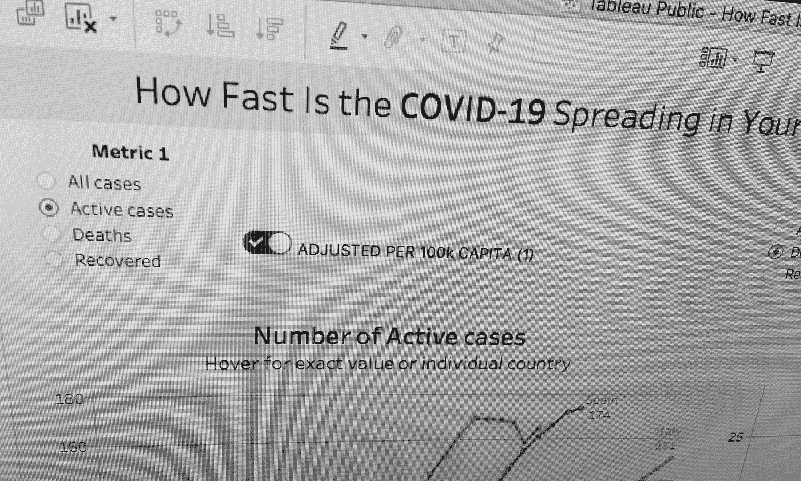

在我之前的[文章](/how-fast-is-the-corona-virus-spreading-in-your-country-compared-to-the-rest-of-the-world-3d22bc79c284)中，我描述了如何用 [Tableau (Public)](https://public.tableau.com/en-us/s/) 构建一个简单的[仪表盘](https://tabsoft.co/33Y9YIL)，显示每个国家从第 100 个注册病例开始的病例增长速度。

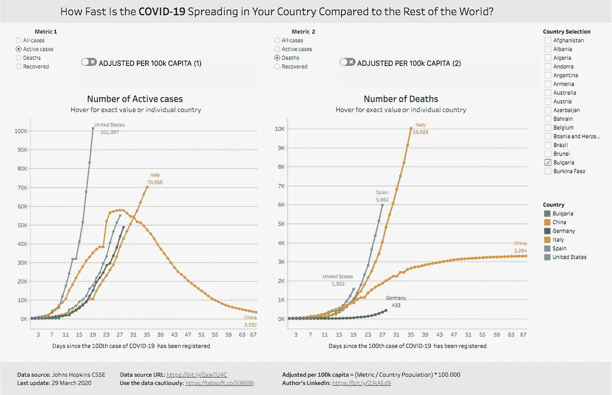

基里尔·尤纳科夫的画面是冠状病毒新冠肺炎:[**https://tabsoft.co/33Y9YIL**](https://tabsoft.co/33Y9YIL)

但是有一个问题——每个国家都不一样。它有不同的人口，大城市有不同的人口密度，不同的卫生系统，等等。因此，我们还可以使用 Tableau 构建一个函数，它将允许我们在考虑各个国家的人口的同时对这些国家进行比较。换句话说，[计算每 10 万人的比率](https://www.robertniles.com/stats/percap.shtml)。当然，这并不能提供一个完全准确的画面，但也许足以看出一个趋势。此外，通过本教程，我们旨在学习如何使用 Tableau 和**而不是**如何根据医疗和健康数据得出结论。

*   **复杂程度:**中等
*   **完成时间:** ~15 分钟。
*   **所需软件:** Tableau 桌面([免费公版](https://public.tableau.com/en-us/s/))

**重要提示:**在我们进入分步指南之前，请先熟悉这些 [10 注意事项，然后再用 Tableau 制作另一个关于新冠肺炎的图表](https://www.tableau.com/about/blog/2020/3/ten-considerations-you-create-another-chart-about-covid-19)。

在下面的逻辑图中，您可以看到度量、参数和计算字段的逻辑，我们将为我们的控制面板创建这些逻辑。我们必须创建单独的 2 个参数，并使用它们的值作为输入，以在我们的仪表板中显示特定度量的值。如您所见，参数 1 和参数 2 之间的关系是[多对多](https://en.wikipedia.org/wiki/Many-to-many_(data_model))，与计算字段的关系是一对二。换句话说，两个参数的每个值的组合产生一个测量。

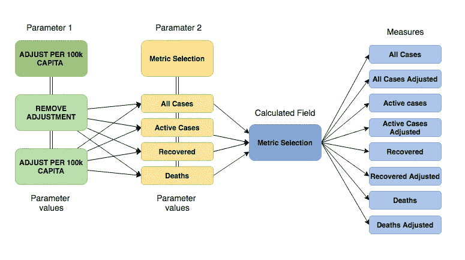

下面是使用 Tableau SQL 语法时的逻辑:

```
// this is just for explaining the chart above 
CASE
WHEN[Parameter 1].[Parameter Value] **AND** 
[Parameter **2**].[Parameter Value]THEN [Calculated Field].[Measure]
END
```

# 第一步。创建具有调整值的度量

我们将从右到左开始—通过创建我们需要的度量。我们已经从我们的数据源([约翰·霍普斯金 GitHub 库](https://github.com/CSSEGISandData/COVID-19))获得了**所有病例**、**痊愈**和**死亡**的措施。活动案例的度量是一个计算，这在我的前一篇文章的第[步中有所涉及。4.6.离开的是:](/how-fast-is-the-corona-virus-spreading-in-your-country-compared-to-the-rest-of-the-world-3d22bc79c284)

*   所有案例均已调整
*   已调整的活动案例
*   恢复调整
*   死亡人数调整后

# 步骤 1.1 获取每个国家的人口

为了计算这些调整后的指标，我们需要每个国家的人口。[这里的](https://en.wikipedia.org/wiki/List_of_countries_by_population_(United_Nations))是由维基百科提供的世界上所有国家的人口列表。你既可以抓取网页，也可以将表格复制/粘贴到 Excel/Google 电子表格文件中，并使用函数将文本连接成 Tableau 计算，如下所示。

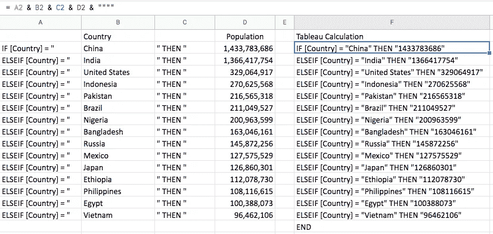

来自 Google 电子表格的示例

然后复制/粘贴 Tableau 计算(F 列)，并在 Tableau 中为总体创建计算字段:

```
**// Population**IF [Country] = "India" THEN "1366417754"
ELSEIF [Country] = "United States" THEN "329064917"
ELSEIF [Country] = "Indonesia" THEN "270625568"
ELSEIF [Country] = "Pakistan" THEN "216565318"
ELSEIF [Country] = "Brazil" THEN "211049527"
ELSEIF [Country] = "Nigeria" THEN "200963599"
ELSEIF [Country] = "Bangladesh" THEN "163046161"
ELSEIF [Country] = "Italy" THEN "60550075"
ELSEIF [Country] = "Russia" THEN "145872256"
ELSEIF [Country] = "Mexico" THEN "127575529"
ELSEIF [Country] = "Japan" THEN "126860301"
ELSEIF [Country] = "Ethiopia" THEN "112078730"
ELSEIF [Country] = "Philippines" THEN "108116615"
ELSEIF [Country] = "Egypt" THEN "100388073"
ELSEIF [Country] = "Vietnam" THEN "96462106"
END// ... this is just a sample of all countries
```

确保将人口的新字段转换为一个**度量值**，并切换到一个**数字(整数)**作为数据类型。

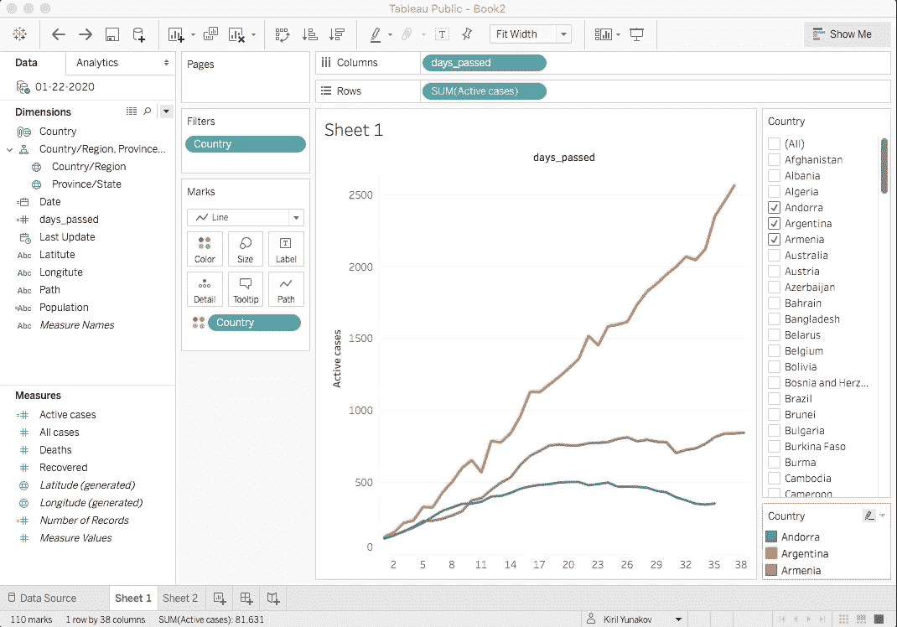

# 步骤 1.2 创建校正值的计算字段

为了创建这些度量，我们需要使用以下公式，例如:

```
**// All cases adjusted:**IF [Country] =”Italy” THEN (**[All cases]**/[Population])*100000
ELSEIF [Country] ="Spain" THEN (**[All cases]**/[Population])*100000
ELSEIF [Country] = "India" THEN (**[All cases]**/[Population])*100000
ELSEIF [Country] = "United States" THEN (**[All Cases]**/[Population])*100000
ELSEIF [Country] = "Pakistan" THEN (**[All cases]**/[Population])*100000
ELSEIF [Country] = "Brazil" THEN (**[All cases]**/[Population])*100000
ELSEIF [Country] = "Nigeria" THEN (**[All cases]**/[Population])*100000
END// ... this is just a sample of all countries
```

为了添加其他国家，只需将这段计算扩展到您想要的所有其他国家。您可以使用步骤 1.1 中的相同方法。并将所有国家连接成一段代码。完成后，对于您希望拥有的国家，您也可以完成为其他度量创建计算字段的相同过程:

```
**// Active cases adjusted:**IF [Country] =”Italy” THEN (**[Active cases]**/[Population])*100000
ELSEIF [Country] ="Spain" THEN (**[Active cases]**/[Population])*100000
ELSEIF [Country] = "India" THEN (**[Active cases]**/[Population])*100000
ELSEIF [Country] = "United States" THEN (**[Active cases]**/[Population])*100000
ELSEIF [Country] = "Pakistan" THEN (**[Active cases]**/[Population])*100000
ELSEIF [Country] = "Brazil" THEN (**[Active cases]**/[Population])*100000
ELSEIF [Country] = "Nigeria" THEN (**[Active cases]**/[Population])*100000
END// ... this is just a sample of all countries
```

还有…

```
**// Recovered adjusted:**IF [Country] =”Italy” THEN (**[Recovered]**/[Population])*100000
ELSEIF [Country] ="Spain" THEN (**[Recovered]**/[Population])*100000
ELSEIF [Country] = "India" THEN (**[Recovered]**/[Population])*100000
ELSEIF [Country] = "United States" THEN (**[Recovered]**/[Population])*100000
ELSEIF [Country] = "Pakistan" THEN (**[Recovered]**/[Population])*100000
ELSEIF [Country] = "Brazil" THEN (**[Recovered]**/[Population])*100000
ELSEIF [Country] = "Nigeria" THEN (**[Recovered]**/[Population])*100000
END// ... this is just a sample of all countries
```

…还有

```
**// Deaths adjusted:**IF [Country] =”Italy” THEN (**[Deaths]**/[Population])*100000
ELSEIF [Country] ="Spain" THEN (**[Deaths]**/[Population])*100000
ELSEIF [Country] = "India" THEN (**[Deaths]**/[Population])*100000
ELSEIF [Country] = "United States" THEN (**[Deaths]**/[Population])*100000
ELSEIF [Country] = "Pakistan" THEN (**[Deaths]**/[Population])*100000
ELSEIF [Country] = "Brazil" THEN (**[Deaths]**/[Population])*100000
ELSEIF [Country] = "Nigeria" THEN (**[Deaths]**/[Population])*100000
END// ... this is just a sample of all countries
```

如果您完成了上述步骤，您应该有以下**措施**:

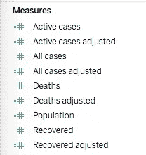

这意味着我们已经准备好了逻辑图的正确部分:

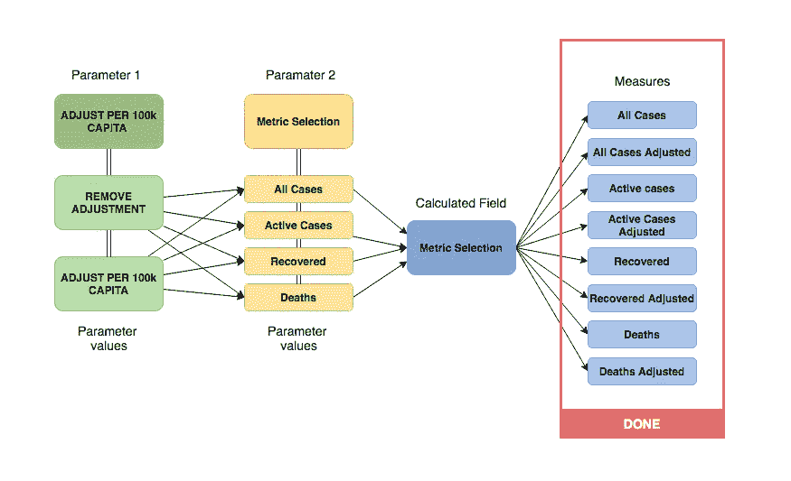

# 第二步。创建参数 1

要创建第一个参数，进入左侧窗格的空白区域，右键单击并选择**创建参数**。

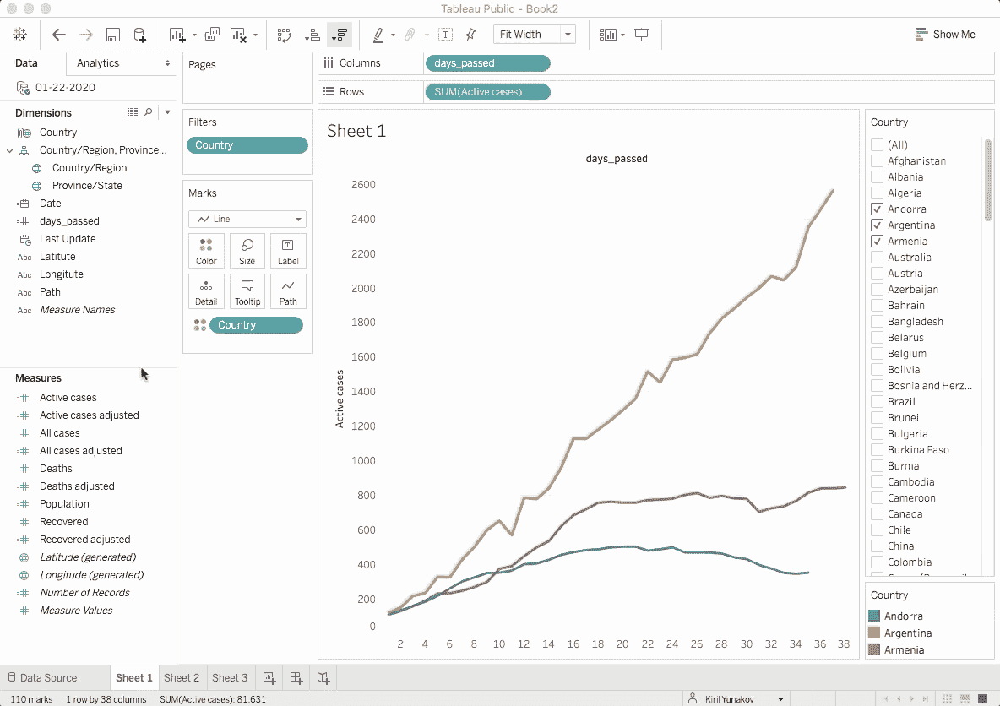

将数据类型更改为字符串，从可用值选项中选择列表，然后输入值:

```
**Parameter name:** ADJUST PER 100k CAPITA**Parameter Value 1:** ADJUST PER 100k CAPITA
**Display Value 1 as:** ADJUSTED PER 100k CAPITA**Parameter Value 2:** REMOVE ADJUSTMENT
**Display Value 2 as:** REMOVE ADJUSTMENT
```

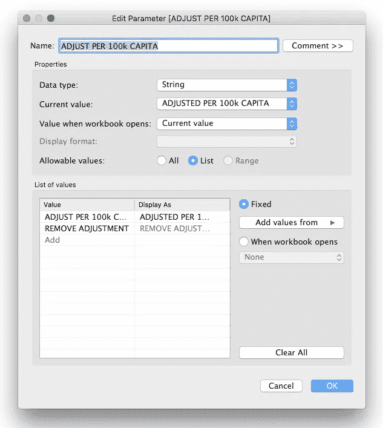

# 第三步。创建参数 2

同样，创建一个新参数，将数据类型更改为 string，从列表中选择可用值，并使用以下值:

```
**Parameter name:** Metric Selection**Parameter Value 1:** All cases
**Parameter Value 2:** Active cases
**Parameter Value 3:** Deaths
**Parameter Value 4:** Recovered
```

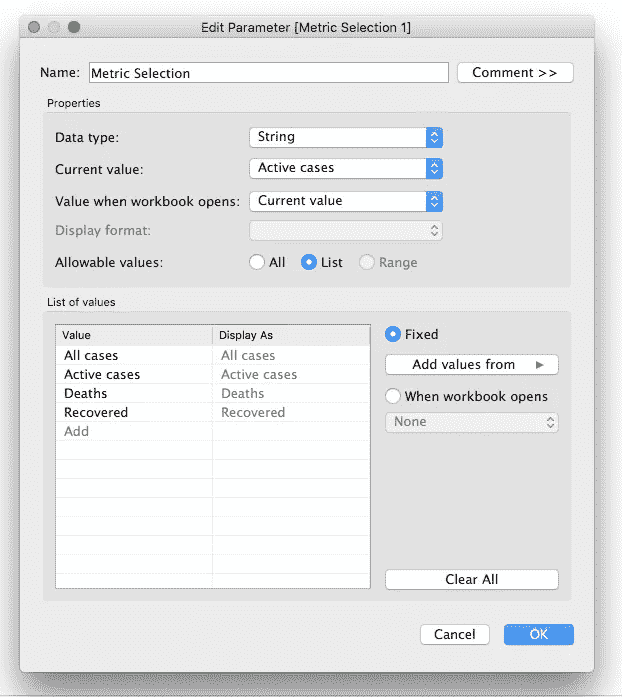

如果操作正确，您应该有两个独立的参数。这意味着我们现在还要创建一个东西—计算字段。

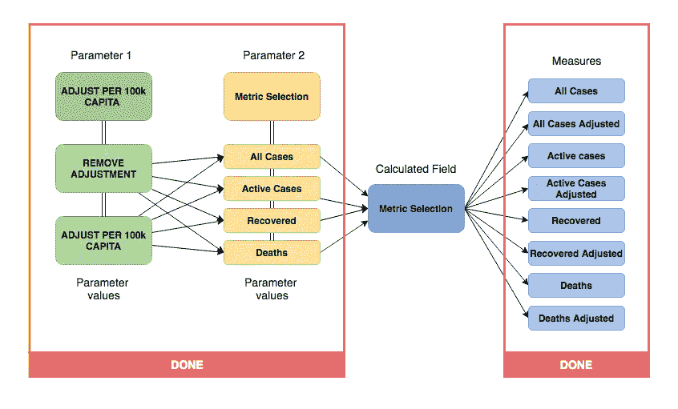

# 第四步。创建计算字段

下一步是创建函数，该函数将根据参数 1 和参数 2 的值显示特定的度量。

```
// Shows adjusted or non-adjusted **Measures**IF [ADJUST PER 100k CAPITA] = "REMOVE ADJUSTMENT" and [Parameters].[Metric Selection] = "All cases" then [All cases]ELSEIF [ADJUST PER 100k CAPITA] = "ADJUST PER 100k CAPITA" and [Parameters].[Metric Selection] = "All cases" then [All cases adjusted]ELSEIF  [ADJUST PER 100k CAPITA] = "REMOVE ADJUSTMENT" and [Parameters].[Metric Selection] = "Deaths" then [Deaths]ELSEIF [ADJUST PER 100k CAPITA] = "ADJUST PER 100k CAPITA" and [Parameters].[Metric Selection] = "Deaths" then [Deaths adjusted]ELSEIF  [ADJUST PER 100k CAPITA] = "REMOVE ADJUSTMENT" and [Parameters].[Metric Selection] = "Recovered" then [Recovered]ELSEIF [ADJUST PER 100k CAPITA] = "ADJUST PER 100k CAPITA" and [Parameters].[Metric Selection] = "Recovered" then [Recovered adjusted]ELSEIF  [ADJUST PER 100k CAPITA] = "REMOVE ADJUSTMENT" and [Parameters].[Metric Selection] = "Active cases" then [Active cases]ELSEIF [ADJUST PER 100k CAPITA] = "ADJUST PER 100k CAPITA" and [Parameters].[Metric Selection] = "Active cases" then [Active cases adjusted]END
```

# 第四步。完成可视化

现在，我们已经准备好将组件添加到可视化中。右键单击两个参数并选择“显示参数控制”。这将向您显示两张卡片，您可以在其中选择想要查看的指标，以及哪个版本—调整或未调整的数字。

然后将度量“Metric Selection”拖放到行架上。

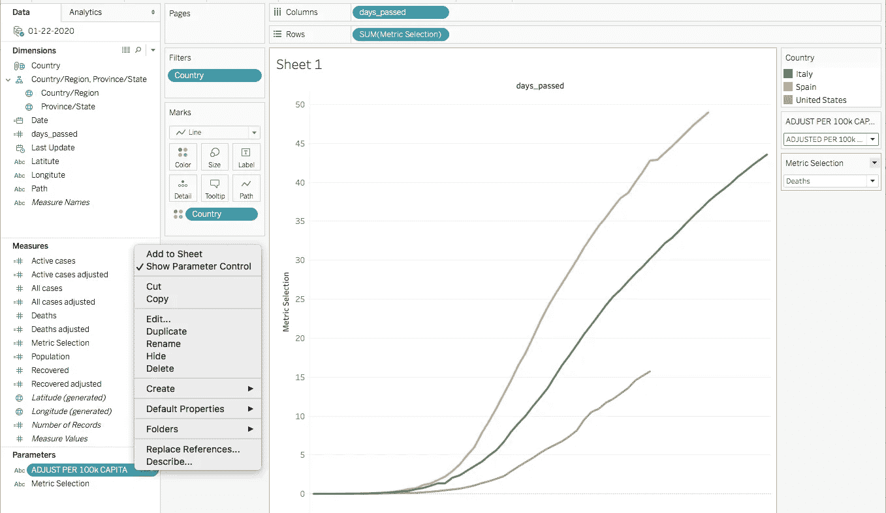

干得好。在我的仪表板最终版本中，我使用了一个扩展，你可以在这里免费下载。该扩展称为单个复选框参数。

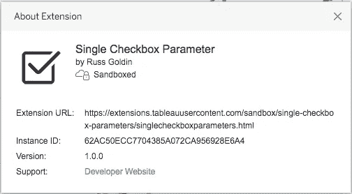

下载完成后，只需将其添加到您的仪表盘中，并选择**参数 1:每 100k 人均调整**。仅此而已。

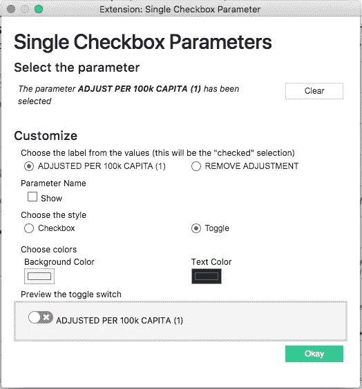

最终的仪表盘可以在这里看到:[**https://tabsoft.co/33Y9YIL**](https://tabsoft.co/33Y9YIL)

> *如果你觉得这篇文章有用，你不同意其中的一些观点，有问题或建议，请不要犹豫，在下面给我留言。非常感谢您的反馈！*
> 
> ***领英:*** [*基里尔·尤纳科夫*](https://www.linkedin.com/in/kyunakov/)

从世卫组织获得关于新冠肺炎冠状病毒的最新信息:[世卫组织](https://www.who.int/emergencies/diseases/novel-coronavirus-2019)