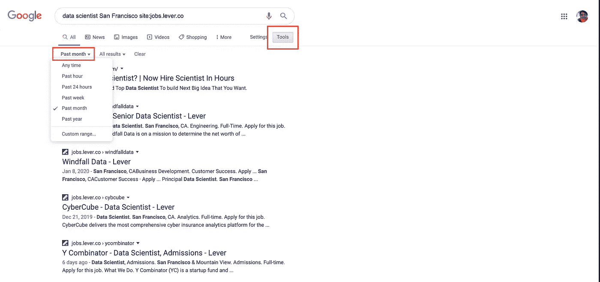
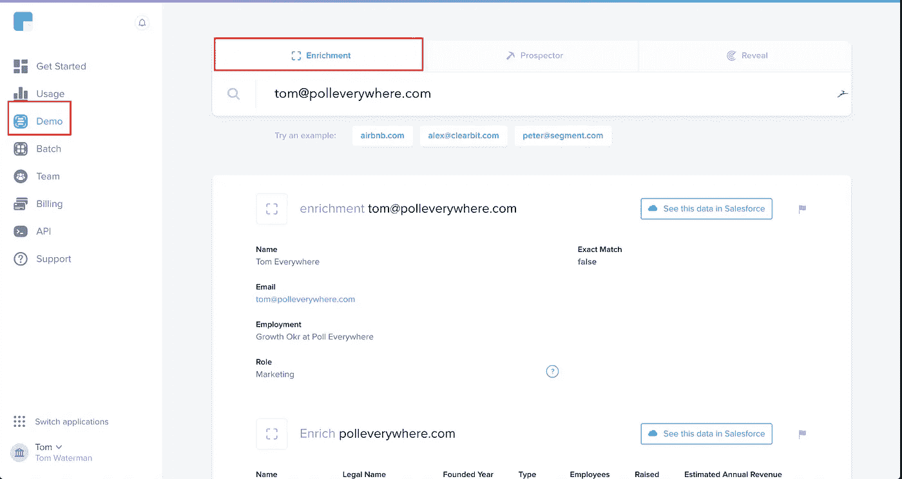

# 如何在科技初创公司找到一份数据科学的工作

> 原文：<https://towardsdatascience.com/how-find-a-job-at-a-tech-start-up-bde5ae7f1b9c?source=collection_archive---------26----------------------->


## 帮助你获得更多面试机会的三步系统

在一家科技初创公司获得数据科学职位的面试可能具有挑战性:由于初创公司相对较小，它们的招聘信息更难找到，它们的流程也没有更成熟的公司那么正式。

所以你需要依靠你自己的“系统”来获得面试机会。

为此，我想分享一个对我个人来说非常有效的系统。

使用这个系统，我能够争取到对我真正感兴趣的旧金山初创公司的多次数据科学面试。最棒的是,*比把我的简历扔进网上求职栏的黑洞有效多了。*

首先，你需要做的第一件事是建立一个高质量的潜在职位空缺列表。

## 第一步:建立一个潜在职位空缺的列表

我发现最有效的方法是使用谷歌搜索特定的网站，使用如下查询。

```
site:jobs.lever.co data scientist San Francisco
```

请注意使用`site:jobs.lever.co`如何将谷歌的搜索结果过滤到该网站上的页面，而这些页面恰好是 Lever 上的所有招聘信息。

> 注意:Lever 是一个候选人跟踪系统，在科幻科技公司中很受欢迎。Lever 与 Monster 等网站非常不同，因为它不是一个列表网站。
> 
> 我使用网站`boards.greenhouse.io`也取得了不错的效果。如果你知道其他网站可以这样工作，请在评论中告诉我，我会在这里添加它。

你也可以使用谷歌的搜索工具只显示上个月的新列表，这有助于确保帖子不会“过时”



将职位发布的搜索结果过滤为仅“最近”的结果

每个结果都会带你去一个职位描述，它们会包括公司的标志和公司网站的链接。

通过使用这种方法并调整你使用的标题，你应该可以在一个小时左右的时间里找到 10-20 个有趣的创业公司。

杠杆上的帖子允许你直接申请，但我不会推荐它。相反，你应该找到初创公司招聘人员的电子邮件地址，直接联系他们。

## 第二步:直接给初创公司的招聘人员发电子邮件

我的经验是，直接给招聘人员发电子邮件比提交招聘启事要有效得多。

一旦你知道了公司的域名，就很容易找到招聘人员的电子邮件。

首先，使用 LinkedIn 查找该公司的员工名单。搜索有“招聘人员”或类似头衔的人。

他们的电子邮件几乎总是如下。

```
firstname@domain.com
```

所以，如果公司的网站是`polleverywhere.com`，招聘人员的名字是汤姆·沃特曼，你可以试试`tom@polleverywhere.com`。(如果你申请的是更大的公司，这种方法不太可能奏效)。

要验证电子邮件地址，您可以使用 http://clearbit.com 的。他们的免费产品允许你“丰富”一个电子邮件地址，它还可以检查你使用的电子邮件地址是否正确。(注:我与 Clearbit 没有任何关系)。



使用 Clearbit 的免费产品检查招聘人员的电子邮件地址

但是如果公司没有招聘人员，你该怎么办？这在初创企业中并不少见。

下一个最好的人选是你申请的团队的经理，甚至是创始人。你可能会对直接给创始人发邮件感到紧张，但我保证他们不会觉得这很粗鲁。

既然你已经收到了招聘人员的电子邮件，你猜对了——你必须给他们发电子邮件。

## 第三步:明确要求招聘人员打电话

你可能不知道如何给招聘人员发电子邮件要求打电话。

以我的经验来看，最好的方法是保持邮件极其简短，附上你的简历，并包括一个**明确的**电话请求。

不要用一整面墙的文字来解释你为什么要申请，你的职业历史，或者其他任何东西。不要称呼招聘人员为“先生”只要说明你发邮件的原因和你要求他们采取的行动。

这里有一个对我很有效的模板。

*你好[招聘人员名字]，*

*我正在联系我在[公司网站]上找到的数据科学职位。*

你有空打个电话讨论一下这个角色是否合适吗？

*我希望更多地了解团队当前的项目，以及我的技能和经验是否能与之相匹配。*

*关于我:*

*   *目前是脸书的一名数据科学家*
*   *曾是一家约 50 人的 SaaS 公司的唯一产品分析师*
*   以前是一家咨询公司的分析师，主要从事分析项目
*   我还附上了一份更详细的我的项目经历和相关技能的简历

感谢您的宝贵时间！

汤姆

## 第 3.5 步:如果没有得到回应，继续跟进

你的邮件被忽视是很糟糕的，但这是会发生的。有时候招聘人员忽略你是因为这个职位已经有人了，或者他们认为你不是一个好的候选人，或者他们只是在度假。

别往心里去——我肯定你也没有回复邮件。不管是什么原因，发送一封跟进邮件肯定会提高你的回复率。我总是会发一封后续邮件，即使重温我最初被忽视的事实会伤害我的自尊心。

这个系统对我来说非常有效。我可以在大约两个小时内找到大约 20 份创业招聘信息，并给他们的招聘人员发电子邮件。你的回复率会有所不同，但我通常会看到超过 50%的回复，即 10 个面试请求。

如果你真的尝试了这个系统，我很想知道你会得到什么样的结果——请在评论中告诉我！我不能总是回复，但我会阅读我收到的每一条评论。