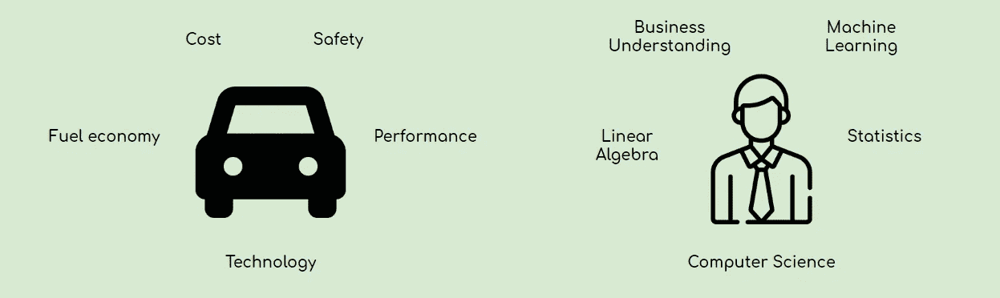
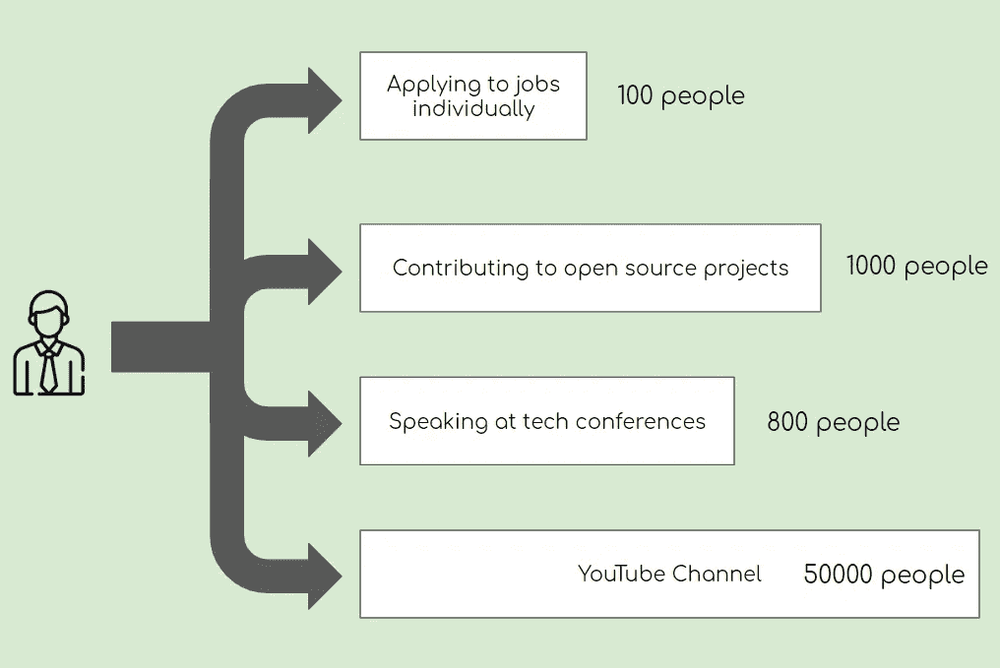

# 找一份数据科学的工作就像买一辆新车

> 原文：<https://towardsdatascience.com/how-finding-a-data-science-job-is-like-buying-a-new-car-50b5f79a66a4?source=collection_archive---------38----------------------->

## 为什么有些人比其他人更有可能找到工作的框架

马特·拉默斯在 [Unsplash](https://unsplash.com/s/photos/sports-car?utm_source=unsplash&utm_medium=referral&utm_content=creditCopyText) 上拍摄的照片

*首先，我想说这不仅仅适用于数据科学工作。它与* ***所有的*** *工作相关——我只是提到数据科学工作，因为我的大部分观众都渴望获得数据科学职位。因此，在本文中，“数据科学工作”与“工作”同义。*

[***如果没时间看完整本，TLDR 在底部！***](#5c72)

> 那么，找一份数据科学的工作和买一辆新车有什么区别呢？

嗯，让我们想象一下，你现在正计划买一辆新车。你可能会有一些你希望你的新车达到的标准。例如，你可能想要一定程度的燃油效率，如果你有一个大家庭，你可能需要五个以上的座位，或者你可能只是想要一辆红色的车。最终，你需要你的车来满足你的需求。这就引出了我的第一点…

# 1.你是一个产品，就像一辆汽车。

就像产品一样，人们被雇佣是为了解决问题，满足业务需求。同样，你也有一个你希望你未来的汽车达到的标准列表，面试官也有一个他们希望他们未来的员工达到的预定标准列表。

同时，还有不同类型的汽车，像 SUV 和小型货车，满足不同消费者的各种需求。类似地，数据科学是一个包含许多领域的宽泛术语:分析、可视化、ML 工程和建模是数据科学家可能拥有的专业化的几个例子。

因此，想想你想成为哪种类型的数据科学家，并想想成为那种类型的数据科学所需的技能？你发展了这些技能吗？如果你还没有，那么你需要提高自己的技能，然后才能考虑找一份数据科学家的工作。**发展您的技能，成为满足需求(业务问题)的有价值的产品(数据科学家)。**

*提示:要知道你是否已经获得了成为数据科学家的必要技能，看看你想要的数据科学工作的要求。你满足了所有的需求吗？对自己诚实，在自己欠缺的地方努力。*

让我们回到汽车的例子。一旦你决定了对未来汽车的要求，你就必须找到一辆符合你需求的汽车。你现在想到了哪些汽车公司？你现在可能会想到一些汽车公司，但是为什么你会特别想到这些公司呢？这是因为这些公司在营销自己方面做得很好，这就引出了我的第二点…

# 2.你必须推销自己，让人们了解你。

更具体地说，营销有两个部分你应该牢记在心；意识和可及性。

## 意识

推销自己的第一步是建立知名度。在市场营销中，知名度描述的是消费者对产品名称的认可程度。汽车公司通过播放电视广告和参加车展来建立知名度。

从工作的角度来看，你可以通过获得更多的意识来增加你的机会。现在，你可能正在一个接一个地申请工作。你还能通过什么方式曝光？你可以做一些事情，比如参加编程竞赛，参加社交活动，甚至在 LinkedIn 上发布成就。

更清楚地描述一下，如果一个人只申请了工作，但没有通过其他渠道建立曝光率，他/她只能接触到他/她申请的工作数量。在这种情况下，应该是 100 人。然而，通过其他渠道建立意识，你的意识会显著增加。在这个例子中，他的意识会增加超过 50000%。

总的来说，树立意识有多种作用:

*   它能建立信誉并表现出兴趣。像参加活动和完成项目这样的事情，展示了你的承诺，也表明了你对你想要得到的任何角色都有热情。
*   **它增加了获得机会的可能性和机会的数量。**如果你是一个好的“产品”,那么人们会注意到你，并向你伸出援手。

## 易接近

一旦你确立了自己是一个有价值的“产品”，并建立了曝光渠道，你就要确保自己是可以接触到的**。**

**例如，一家汽车公司花费了数百万美元进行营销，但在纽约只有一家汽车经销商，这将是一家知名度高、可访问性低的公司。**

**可访问性是一个简单的步骤。让人们向你伸出援手变得简单。创建 LinkedIn 个人资料。创建 YCombinator 配置文件。公开你的电子邮件或创建一个个人网站，人们可以直接联系你。**

**结合知名度和可访问性，如果你有 YouTube 频道，包括你的联系信息。如果你要参加社交活动，带上名片。你明白我想说什么。**

# **TLDR**

1.  **你就像一件产品，除非你把自己的技能发展到足够有价值，否则你不会被注意到。做法拉利，不要做福特。**
2.  ****推销自己**——不要等别人来找你。你必须自己创造机会。**
3.  ****关注知名度**(获得曝光)**和可及性**(让人们更容易接触到你)**

# **感谢阅读！**

**如果你喜欢我的工作，想支持我…**

1.  **支持我的最好方式是在**媒体**T10【这里上关注我。**
2.  **在 **Twitter** 这里[成为第一批关注我的人之一](https://twitter.com/terence_shin)。我会在这里发布很多更新和有趣的东西！**
3.  **另外，成为第一批订阅我的新 **YouTube 频道** [这里](https://www.youtube.com/channel/UCmy1ox7bo7zsLlDo8pOEEhA?view_as=subscriber)的人之一吧！*还没有视频，但快到了！***
4.  **在 **LinkedIn** 上关注我[这里](https://www.linkedin.com/in/terenceshin/)。**
5.  **在我的**邮箱列表** [这里](https://forms.gle/UGdTom9G6aFGHzPD9)报名。**
6.  **看看我的网站，[**terenceshin.com**](https://terenceshin.com/)。**