# 浮点数是如何工作的

> 原文：<https://towardsdatascience.com/how-floating-point-numbers-work-1429907b6d1d?source=collection_archive---------16----------------------->


尼克·希利尔在 [Unsplash](https://unsplash.com?utm_source=medium&utm_medium=referral) 上的照片

## 深度学习和数码摄影的应用

一个讨厌的事实是，计算机以二进制近似值工作，而人类倾向于以精确值思考。这就是为什么，在你的高中物理课上，当你在你的解中计算中间数值时，你可能经历了“舍入误差”,以及为什么，如果你打开一个 python 终端并计算 0.1 * 3，你将得到一个奇怪的结果。

```
>>> 0.1 + 0.1 + 0.1
0.30000000000000004
```

这使得浮点数成为一个[泄漏抽象](https://www.joelonsoftware.com/2002/11/11/the-law-of-leaky-abstractions/)的例子。通常，python 和数值计算库(如 numpy 或 PyTorch)会在幕后处理这些。但是理解细节可以帮助你避免意外的错误，并加快许多机器学习计算的速度。例如，谷歌的张量处理单元(TPU)使用了一种[改进的](https://cloud.google.com/blog/products/ai-machine-learning/bfloat16-the-secret-to-high-performance-on-cloud-tpus)浮点格式，在试图保持良好结果的同时，大幅提高了计算效率。

在本文中，我们将深入探讨浮点数的具体细节，涵盖边缘情况(数值下溢和上溢)，并以应用程序结束:TPU 的 bfloat16 格式和 HDR 成像。假设的主要背景是你了解如何在二进制中计数，以及二进制分数如何工作。

# 表示整数

我们简单回顾一下二进制数到 5:0，1，10，11，100，101。明白了吗？这对于一个**无符号整数**来说很棒；一个从不消极的人。例如，如果我们有一个 8 位无符号整数，我们可以表示 00000000 和 1111111 之间的数字。在十进制中，那是在 0 和 2⁸-1=255.之间例如，大多数标准图像格式是 8 位颜色，这就是为什么“RGB”值从 0 到 255。

还要注意，我们通常用十六进制(以 16 为基数)表示法来缩写:0x00 到 0xFF。0x 前缀表示“这是一个十六进制数”。十六进制数字是 0，1，2，3，4，5，6，7，8，9，A，B，C，D，E，F；所以 F 本质上是四位“1111”的缩写(0xF 和 1111 在十进制中都是 15)。同样，8 位是一个字节，所以我们的数字是少得可怜的 1 字节。但在本文中我们不会过多关注十六进制。

## 有符号整数

现在，你会注意到，对于无符号 int，我们不能表示像-2 这样的简单数字。解决这个问题的一个方法是让第一位代表符号。说“0”表示负，“1”表示正。想想 4 位数字，0111 应该是-7，而 1111 应该是+7。然而，这有一些奇怪的特征。例如，0000 是“-0”，而 1000 是“+0”。这并不好:比较两个数字是否相等会变得棘手；另外，我们正在浪费空间。

对此的标准解决方案是使用[二进制补码](https://en.wikipedia.org/wiki/Two%27s_complement)，这是大多数实现用于有符号整数的方式。(还有一个很少用的[补语](https://en.wikipedia.org/wiki/Ones%27_complement))。然而，这不是我们将需要的浮点数，所以我们不会深入研究它。

让我们考虑一个有符号的 8 位整数的有偏表示。这是有偏差的，因为它有点偏离。我们不用 00000000 来表示 0，而是用 0111111 来表示 0。这通常表示基数为 10 的 127。但是我们的表述有 127 的偏差。这意味着 00000000 代表–127，而 1111111 代表 128。

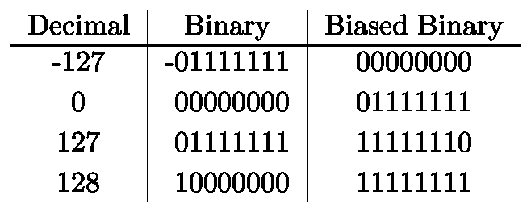

# 双精度浮点数

因为最近生产的个人计算机使用 64 位处理器，所以默认的浮点实现是 64 位是很常见的。这被称为“双精度”,因为它是以前标准的 32 位精度的两倍(在过去十年的某个时候，普通计算机切换到 64 位处理器)。

## 科学符号

对于上下文，浮点数的基本思想是使用科学记数法的二进制等价物。你的高中科学老师满怀希望地训练你如何做到这一点(以及一大堆可怕的有效数字——sigfigs)。例如，8191.31 的科学表示是:

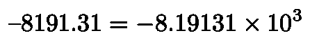

杂项十进制数的科学记数法

您应该注意到三个关键因素。首先，一个符号(数字是+还是-？).第二，我们总是把数字写成一位数(1 到 9 之间，含 1 和 9)，后面是小数点，后面是若干位数。相比之下，下面的**不在科学符号中**，尽管它们是真正的数学事实。

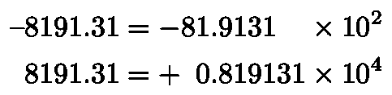

不使用科学符号的表示法

考虑到这一点，让我们想想当我们进入二进制时会发生什么变化。首先，我们不使用 10 作为指数的基数(也称为基数)，而是使用 2。其次，我们想用二进制分数代替十进制分数。

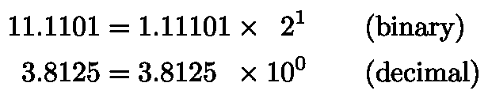

二进制与十进制科学记数法

请注意，我选择用十进制形式写基数(2 或 10)和它们的指数(分别是 1 或 0)，而左边的数字和有效数字分别是二进制或十进制。

二进制数 1101 以 10 为基数是 13。13/16 是 0.8125。这是一个二进制分数。如果你还没有玩过这些，你应该说服自己以下几点:

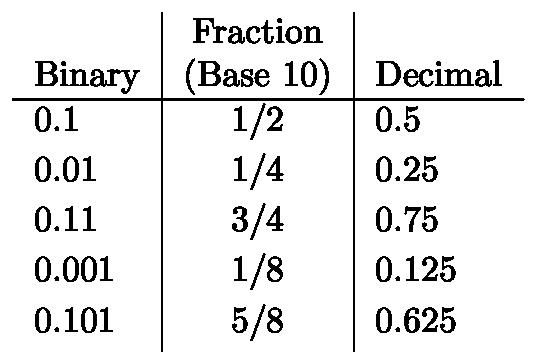

一些简单的二元分数

这是事实 0.3 是 3/10，0.55 是 55/100 的二进制版本(当然可以进一步简化)。

太好了。我们现在准备深入研究浮点数的细节。

## IEEE 754 标准

下面是通常实施的“ [IEEE 754](https://en.wikipedia.org/wiki/Double-precision_floating-point_format#IEEE_754_double-precision_binary_floating-point_format:_binary64) ”标准的示意图。第一位是符号。0 是正的，1 是负的(与我们上面天真的建议相反)。指数有 11 位，分数有 52 或 53 位(取决于您如何计数)，也称为“尾数”或“有效数”。这个标志就像我们上面看到的旗子一样工作，所以我们将深入研究后两个标志。

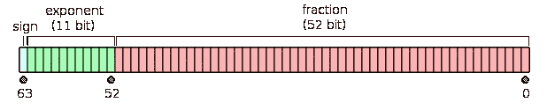

IEEE 754 双精度浮点数([维基](https://en.wikipedia.org/wiki/File:IEEE_754_Double_Floating_Point_Format.svg)

## 指数

与我们之前看到的一样，指数是一个 11 位有偏(有符号)整数，但有一些注意事项。偏差为 2 ⁰–1=1023，因此 11 位 01111111111 代表 0。

这通常意味着最大可能的指数由 11 位 11111111111 表示(表示 2–1–1023 = 1024)，最小可能的指数由 11 位 0000000000 表示(表示–1023)。

然而，正如我们将要讨论的:

*   由 111111111111 表示的指数是为无穷大和 NaNs 保留的。
*   000000000000 指数是为表示 0 和其他我们将会用到的东西而保留的。

这意味着在正常情况下，指数可以在–1022 和 1023 之间(2046 个可能值)。

## 有效数字

52 位有效数字表示二进制小数。如果你回顾上面的科学记数法部分，你会发现每当我们用“二进制科学记数法”写一个二进制数时，前导数字总是 1。(在 10 进制中，它可以在 1 和 9 之间，但 2-9 不是二进制数字)。因为我们知道前导数字总是 1(还有一些需要讨论的注意事项)，所以我们不需要把它存储在计算机上(这是一种浪费)。这就是为什么我说有效位是 53 位，“取决于你如何计数。”

换句话说，存储在计算机上的 52 位代表小数点后的 52 位(或者我们应该称之为“二进制点”)。始终假定前导 1。

## 正常数字

我一直在提一些警告，并且我打算尽可能地拖延。“正常数”是一个不使用任何这些警告的非零数，我们可以给出一些例子。

回想一下这三个组件:

*   1 位用于符号
*   11 位表示指数，指数(十进制)在–1022 和+1023 之间。在二进制编码中，它被表示为有偏差的整数。
*   52 位有效位。

我们如何表示十进制数 1？

嗯，符号是正的，所以符号位是 0。(把 1 想象成“负”的标志)。指数是 0。记住有偏表示意味着我们加上 1023，我们得到二进制表示 01111111111。最后，所有的分数位都是 0。简单:

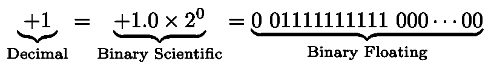

1 的浮点表示形式

我已经写了二进制浮点表示法，用空格将三部分分开。通常，“二进制科学”表示法中的基数和指数实际上是以 10 为基数的。

更难的例子呢，比如 3？3 是 2 的 1.5 倍(十进制)，所以把它变成二进制分数，我们得到 1.1。考虑到偏差，指数 2 表示为 10000000000。

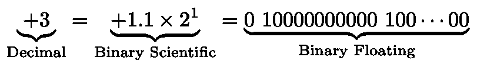

我们能得到的最大(正常)数是多少？我们应该把指数做成 111111111110(不能全是 1，那是保留的)，十进制就是 1023。

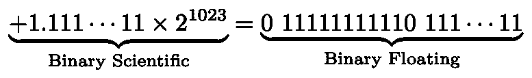

最大浮点值

我们可以这样计算:

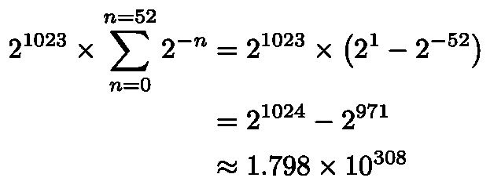

但是我们也可以利用 Python 自带的任意精度整数运算，免费写出所有 10 进制的 309 位数字:

```
>>> 2 ** 1024 - 2 ** 971179769313486231570814527423731704356798070567525844996598917476803157260780028538760589558632766878171540458953514382464234321326889464182768467546703537516986049910576551282076245490090389328944075868508455133942304583236903222948165808559332123348274797826204144723168738177180919299881250404026184124858368
```

最小可能的浮动正好是这个的负数。但是最小的正(正常)浮动是多少呢？我们已经说过最小的正指数是–1022。使有效数字全为 0，这意味着最小的正标准浮点数为:

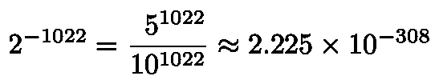

同样，任意精度整数运算意味着我们可以利用中间分数轻松获得精确的十进制值。

```
>>> numerator = 5 ** 1022
>>> print('0', str(numerator).rjust(1022, '0'), sep='.')0.00000000000000000000000000000000000000000000000000000000000000000000000000000000000000000000000000000000000000000000000000000000000000000000000000000000000000000000000000000000000000000000000000000000000000000000000000000000000000000000000000000000000000000000000000000000000000000000000000000000000000000002225073858507201383090232717332404064219215980462331830553327416887204434813918195854283159012511020564067339731035811005152434161553460108856012385377718821130777993532002330479610147442583636071921565046942503734208375250806650616658158948720491179968591639648500635908770118304874799780887753749949451580451605050915399856582470818645113537935804992115981085766051992433352114352390148795699609591288891602992641511063466313393663477586513029371762047325631781485664350872122828637642044846811407613911477062801689853244110024161447421618567166150540154285084716752901903161322778896729707373123334086988983175067838846926092773977972858659654941091369095406136467568702398678315290680984617210924625396728515625
```

以防你好奇。顺便说一下，您可以在 python +硬件设置上使用以下命令检查所有这些:

```
>>> import sys
>>> sys.float_infosys.float_info(max=1.7976931348623157e+308, max_exp=1024, max_10_exp=308, min=2.2250738585072014e-308, min_exp=-1021, min_10_exp=-307, dig=15, mant_dig=53, epsilon=2.220446049250313e-16, radix=2, rounds=1)
```

基本上其他编程语言都有类似的特性。

## 不定式和名词

好吧，事情变得奇怪了。如果所有指数位都是 1，则表示的数字要么是无穷大，要么不是数字(NaN):

*   如果分数位都是 0，则数字是无限的。符号位控制它是–∞还是+∞。
*   如果分数位不全为 0，则“数字”不是数字(NaN)。根据第一位，它可以是安静 NaN 或信令 NaN。一个安静的 NaN 传播(再加一个数，就得到 NaN)。粗略地说，发信号的 NaN 应该“抛出一个错误”。通常不使用剩余的位。

我最初对此感到惊讶的是，这是在常用芯片上的硬件实现。这意味着，例如，你可以在 GPU 上使用它。你为什么要这么做？好吧，考虑这样一个方便的事实，即–∞的幂是 0。

```
>>> from math import exp
>>> minus_infinity = float('-inf')
>>> exp(minus_infinity)0.0
```

在介绍用于 NLP 任务的[转换器架构](https://arxiv.org/abs/1706.03762)的论文中(伯特、GPT-2 和他们最近的同类使用的)，训练是自回归的，这意味着在注意力模块的 [softmax](https://en.wikipedia.org/wiki/Softmax_function) 层中，某些输出被要求为 0。但是，如果您查看 softmax 的公式，并回忆起您的高中数学老师告诉您“没有任何数字的指数等于 0”，您会发现让 softmax 返回 0 是很棘手的。当然，除非你把(负)无穷大变成一个数！

重要的是，这是一种硬件实现。如果这是一个巧妙的 Python(或 PyTorch，或 Numpy)变通方法，将数字表示为一个对象，有时可能包含一个浮点数，这将大大降低数值计算的速度。

此外，计算机硬件无止境的复杂性总是令人印象深刻。

## 零

但是等等，还有呢！我们甚至还没有描述如何表示 0。使用我们的指数和分数位，我们只能得到一个很小的正数，实际上不是 0。当然，解决方案是，如果指数位都是 0，分数也是 0，那么数字就是 0。换句话说，如果指数位是 00000000000，并且分数位也全是零。注意，这意味着 0 是“有符号的”——既有+0 也有–0。在 Python 中，它们的存储方式不同，但它们是彼此相等的。

```
>>> zero = 0.0
>>> print(zero, -zero)0.0 -0.0>>> zero == -zeroTrue
```

不过，在一些边缘情况下，事情会变得很奇怪。当试图用 [atan2](https://en.wikipedia.org/wiki/Atan2) 计算一个角度时，你会发现它们实际上是以不同的方式表示的:

```
>>> from math import atan2
>>> zero = 0.0
>>> print(atan2(zero,  zero), 
>>>       atan2(zero, -zero))0.0 3.141592653589793
```

## 低于正常值的数字

最后一种情况是所有指数位都为 0，但分数位不为 0。如果我们有一个不使用一些可能的位序列的表示，我们就是在浪费空间。那么为什么不用它来表示更小的数字呢？这些数被称为次正规(或非正规)数。

基本上，规则是指数仍然被认为有其最小值(–1022)，而不是我们的“二进制科学”符号总是从 1 开始(如在 1.001 中)，而是我们假设它从 0 开始。所以我们可以得到 0.001 乘以 2 的–1022 次方。这让我们可以用小于 52 的指数来表示数字(小到-1074)。因此:

```
>>> 2 ** -1074
5e-324>>> 2 ** -1075
0.0>>> 2 ** -1075 == 0
True
```

次正规数的好处是，当你减去两个不同的正规浮点数时，你一定会得到一个非零的结果。代价是精度损失(前导 0 中没有存储精度——还记得 sigfigs 是如何工作的吗？).这叫做*逐渐下溢*。随着浮点数变得越来越小，它们逐渐失去精度。

如果没有低于正常值的数字，你将不得不*冲到零*，立刻失去你所有的精度，并大大增加你意外地被 0 除的机会。然而，低于正常值的数字会显著降低计算速度。

# 应用程序

好吧，我们一直在讨论浮点数。除了一些从未真正出现的关于 0.1 * 3 的怪异边缘情况，谁会在乎呢？

## 张量处理单元

除了我们详细探讨的 64 位浮点之外，还有常见的 32 位浮点(单精度)和 16 位浮点(半精度)。PyTorch 和其他数值计算库默认倾向于坚持 32 位浮点。一半的大小意味着计算可以更快地完成(处理一半的位)。

但是较低的精度是有代价的。对于标准的半精度浮点型(5 个指数位，10 个有效位)，大于 1 的最小数字约为 1.001。不能代表整数 2049(必须选 2050 或者 2048；中间也没有小数)。65535 是最大的可能数字(或者接近，取决于精确的实现细节)。

相反，谷歌的张量处理单元使用一种经过修改的 16 位格式进行乘法，作为他们对深度学习任务进行优化的一部分。具有 7 位有效位的 8 位指数与 32 位浮点数的指数位数一样多。事实证明，在深度学习应用中，这比有效位更重要。此外，乘法时，指数可以相加(容易)，而有效位必须相乘(困难)。使有效数位变小会使相乘的硅浮动大约比[小 8 倍](https://cloud.google.com/blog/products/ai-machine-learning/bfloat16-the-secret-to-high-performance-on-cloud-tpus)。

此外，TPU 浮点格式刷新为零，而不是使用低于正常值的数字来提高速度。

## 高动态范围(HDR)图像

如果你阅读谷歌[关于他们定制的 16 位浮点格式的博客文章](https://cloud.google.com/blog/products/ai-machine-learning/bfloat16-the-secret-to-high-performance-on-cloud-tpus)，你会看到他们谈论“动态范围”事实上，类似的事情也发生在 HDR 图像上(比如你可以用手机捕捉到的图像)。

标准图像使用 8 位 RGB 编码。这 8 位表示 0 到 255 之间的无符号整数。这样做的问题是，当它更暗时，相对精度(连续值之间的跳跃百分比)要差得多。例如，在(十进制)像素值 10 和 11 之间，有 10%的跳跃！但对于亮值，250 和 251 之间的相对差异仅为 0.4%。

现在，人眼对暗色调的亮度变化比对亮色调的亮度变化更敏感。这意味着固定精度的表示与我们想要的相反。因此，拍摄 JPEG 或类似图像的标准数码相机或手机相机通过使用[伽马编码](https://en.wikipedia.org/wiki/Gamma_correction)在较暗的色调中相对更精确地记录来调整其灵敏度。

这样做的缺点是，即使你增加了比特(比如一个 16 比特的 RBG 图像)，你也不一定能在图像中明亮的部分获得同样的精度。

因此，HDR 图像使用浮点数来表示像素！这允许较高的“动态”范围(指数可高可低)，同时在所有亮度范围内保持相对精度。非常适合保存高对比度场景的数据。例如，在[辐射 HDR](https://en.wikipedia.org/wiki/RGBE_image_format) 格式中，指数由每个像素中的三种颜色(通道)共享。

# 结论

关于浮点数，这可能比你想知道的还要多。幸运的话，你不会遇到太多无法用简单的 [log-sum-exp](https://en.wikipedia.org/wiki/LogSumExp) 或任意精度整数解决的数字下溢或上溢。但是如果你这样做了，你会有充分的准备！希望你也能很好地思考你的机器学习模型需要多精确。

# 笔记

[1]注意:本文假设了一个相对标准的设置。根据您的硬件和软件实现，您的结果可能会有所不同(尽管不常见)。

[2]我的意思是，你 Python 解释器被允许抛出一个错误，崩溃，然后停止做事。你的 CPU 不能完全做到这一点:它必须保持活力。