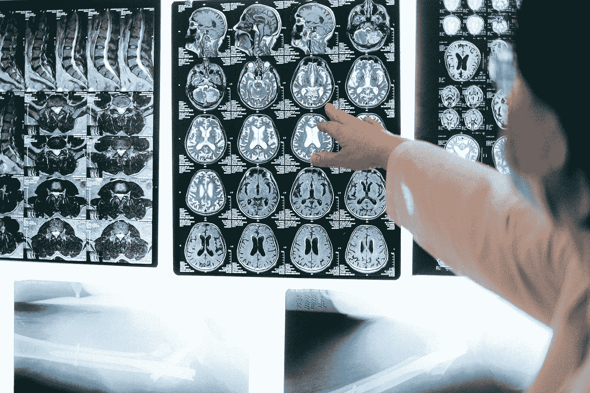
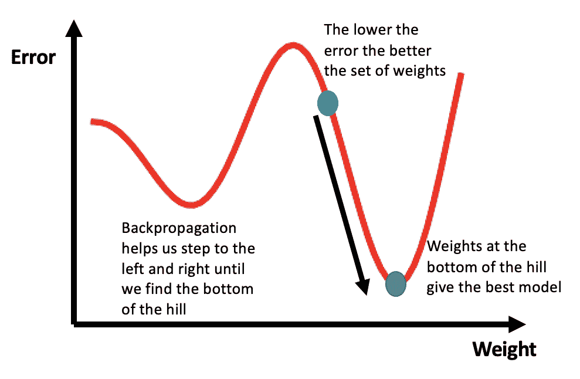
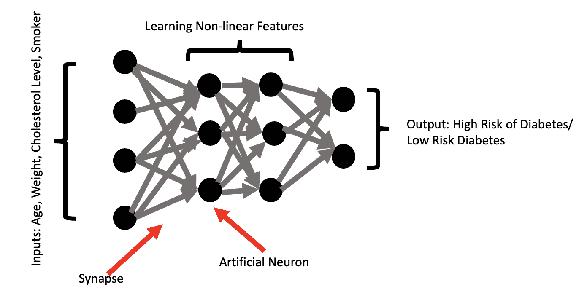
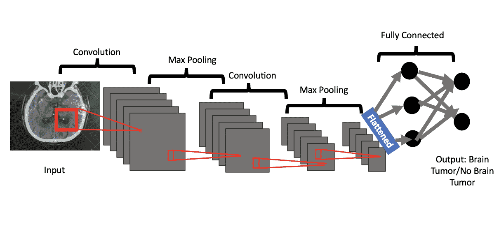
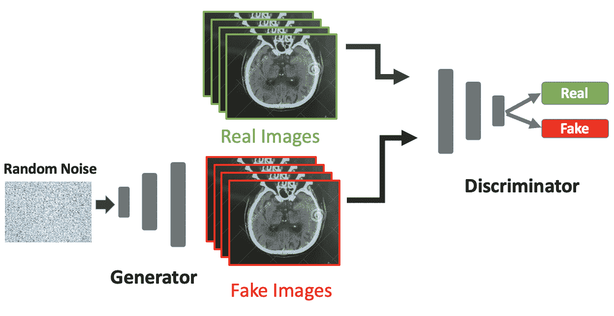

# GANs 如何改进医疗保健分析

> 原文：<https://towardsdatascience.com/how-gans-can-improve-healthcare-analytics-7d2379eff19e?source=collection_archive---------36----------------------->

## 生成性对抗网络为医疗保健组织提供了在患者治疗和隐私保护方面的应用

安娜·施瓦茨在[像素](https://www.pexels.com/photo/people-woman-technology-doctor-4226264/)上拍摄的照片

在过去的十年中，电子健康记录(EHR)系统在医院中的采用已经变得普遍。这一转变得益于 2009 年的《经济和临床健康卫生信息技术(HITECH)法案》[，该法案拨款 3000 万美元用于激励医院和医生采用 EHR 系统](https://pubmed.ncbi.nlm.nih.gov/25581157/)。大医疗保健数据中的这种数字爆炸有助于现代机器学习工具，这些工具可用于各种任务，如[疾病检测](https://www.annualreviews.org/doi/abs/10.1146/annurev.bioeng.8.061505.095802)、[患者旅程跟踪](https://arxiv.org/pdf/2006.10516.pdf)、[概念表示](https://arxiv.org/pdf/1706.03446.pdf)、[患者去识别](https://arxiv.org/pdf/1706.03446.pdf)和[数据扩充](https://openreview.net/pdf?id=rkBBChjiG)。在过去，一类被称为卷积神经网络(CNN)的深度学习模型已经被成功地部署到各种疾病检测任务，包括与间质性肺病和结肠镜检查帧相关的分类任务以及息肉和肺栓塞的检测。

这些努力是成功的，因为这些任务的基础数据通常包含每个检测类别的足够的正面和负面例子。在上述每个疾病/紊乱的例子中，许多人测试呈阳性，也有许多人测试呈阴性。拥有大量正面和负面的例子有助于机器模型更有效地学习。对于阳性与阴性结果不平衡的疾病检测问题，像 CNN 这样的监督学习方法很难执行。例如，受监督的机器学习模型可能会与像埃博拉这样的罕见疾病斗争，因为很少有患者会检测出阳性，从而导致一个更大的阴性群体。

在这些情况下，生成敌对网络(GANs)是有用的，因为它们可以学习产生未被充分代表的数据的虚假例子，从而更好地训练模型。除了改进疾病检测，GANs 还可用于数据去识别，防止患者个人信息暴露。[1996 年健康保险便携性和责任法案(HIPAA)隐私规则](https://www.hhs.gov/hipaa/for-professionals/privacy/special-topics/de-identification/index.html)要求保护患者信息，这意味着医疗保健提供商需要认真对待它。在医疗保健分析领域，数据去识别是一个具有挑战性的问题，因为传统方法不够强大，不足以承受重新识别。也就是说，大多数当前的去识别方法都可以被逆转，从而危及医疗保健患者个人记录的隐私。研究和实践中的 GAN 模型为当今医疗保健面临的许多棘手问题提出了有希望的解决方案。

**什么是生成性敌对网络？**

在我们进入 GANs 的医疗保健应用之前，让我们先讨论一下它们的一些基本操作。GANs 背后最重要的底层概念是深度神经网络(即卷积神经网络)和反向传播。鉴于它们的相关性，我们应该简要回顾一下这些术语。

人工神经网络是由人脑粗略启发的数学模型。它们由一组单元(人工神经元)和单元之间的连接(突触)组成，每个单元的权重都随着反向传播过程中学习的改善而变化。要理解反向传播，请考虑下图。与神经网络预测相关联的误差值相对于分配给“学习”特征的权重值来绘制。训练神经网络的目标是找到给出最小误差的权重，这对应于找到图中的山的底部。你可以把学习过程想象成在丘陵地带行走，直到找到最低点。

反向传播图解。作者创作的插图。

典型的神经网络是这些互连和加权单元的集合，这允许模型捕捉输入和输出之间的高维和非线性关系。这种结构是它们运转良好的部分原因。在图像分析的背景下，由神经网络生成的低级特征可以是边缘(即:人脸的边缘/轮廓)，高级特征可以是人类可识别的概念，例如字母、数字或人脸。

下图显示了一个基于患者特征(如年龄、体重、胆固醇水平和吸烟状况)预测糖尿病风险的简单示例。神经网络对这些输入进行转换，并设计重要的预测特征，这些预测特征是输入的非线性组合。然后，该网络使用学习到的特征来预测患者患糖尿病的风险。

在这种情况下，高层次特征的一个例子可能是捕捉一个超重的老年人的复合效应，他是一个高胆固醇的重度吸烟者。该患者患糖尿病的风险可能明显高于年轻、超重、高胆固醇的重度吸烟者。但是一个肥胖的高胆固醇的不吸烟的老年人怎么办？肥胖的不吸烟者比超重的重度吸烟者风险更大还是更小？人类很难准确预测这两个病人的结果。幸运的是，神经网络擅长捕捉这些特征之间的复杂相互作用以及它们如何影响结果的概率。

**神经网络图像**

神经网络图解。作者创作的插图。

卷积神经网络是这些更简单的网络的扩展，但它们也包括卷积层和池层。在高层次上，这些层擅长学习图像中最重要的部分，因为它们与整体图像的内容相关。正如我前面提到的，这些高级特征可能是人类能够识别的。卷积层提取高级概念(即:人脸、字母、物体、数字)，max pooling 层将那些特征减少到学习所需的最本质的特征。

下图显示了对患者 CT 扫描中是否存在脑瘤进行分类的示例。卷积神经网络使用卷积层从图像中学习与健康大脑和肿瘤大脑最接近的高级特征。相关特征可以包括健康脑组织的片段、肿瘤的片段、整个肿瘤、肿瘤的边缘以及不一定能被人类解释但对机器学习有用的附加特征。max pooling 图层通过移除不会改善学习的冗余图像片段来减少这些提取的特征。该过程有助于模型从图像像素中优先考虑由高级特征表示的最重要或最常见的图像碎片。

**cov net 的图像**

卷积神经网络图解。作者创作的插图。[脑部 CT 图像](https://www.dreamstime.com/ct-scan-brain-computed-tomography-case-traffic-accident-image161174298)

现在我们有了基础，让我们讨论甘斯。GANs 是一组深度神经网络模型，由 [Ian Goodfellow 在 2014 年](https://arxiv.org/pdf/1406.2661.pdf)开发，用于产生合成数据。合成数据是与特定情况相关的任何数据，不是通过真实世界的测量直接获得的。

GAN 的目标是训练鉴别器能够区分真实和虚假数据，同时训练生成器产生可以可靠地欺骗鉴别器的数据的合成实例。鉴别器是用于区分真实图像和合成图像的普通卷积神经网络，生成器是被训练来产生看起来真实的假图像的修改的卷积神经网络。GANs 一起训练鉴别器和发生器，以迭代地提高鉴别器识别假图像的能力和发生器产生真实图像的能力。

在下图中，一个生成器根据随机噪声像素数据进行训练，然后生成假的大脑 CT 图像。发生器产生的假图像随后与真图像一起被送入鉴别器。鉴别器是一个普通的 CNN，它被训练来区分真实和虚假的图像。生成器的训练旨在产生越来越逼真的假图像，以欺骗鉴别者。随着训练的继续，生成器在制造假货方面变得更好，鉴别器在区分真实和虚假图像方面变得更好，直到生成器产生与真实图像非常相似的图像。一旦训练完成，GAN 应该能够生成可用于扩充现有数据或创建全新数据集的逼真图像。数据扩充适用于示例中存在不平衡的情况(例如，与埃博拉等罕见疾病相对应的数据)。此外，创建新的合成数据集对于保护患者隐私以及提供购买昂贵的临床注释医疗数据的替代方案是有用的。

**甘形象**

一个生成性对抗网络的图解。作者创作的插图。[脑部 CT 图像](https://www.dreamstime.com/ct-scan-brain-computed-tomography-case-traffic-accident-image161174298)。[噪声图像](https://www.pexels.com/photo/man-in-brown-dress-shirt-sitting-beside-woman-in-white-long-sleeve-shirt-4842648/)。

**医学成像领域的 GANs**

GANs 在医疗保健领域最普遍的应用是医学成像。两个重要的医学成像任务是脑肿瘤的数据分割和医学图像合成。

*脑肿瘤分割*

GANs 的一个有趣的应用是脑瘤分割，这相当于将脑 CT 图像分割成图像对象，如肿瘤边缘、健康组织和整个肿瘤部位。虽然对医生来说，检测大多数类型的脑肿瘤，如低级和高级别神经胶质瘤，通常是直截了当的，但通过视觉评估来定义肿瘤边界仍然是一个挑战。在最近的一项研究中，Eklund 等人。艾尔。开发了一种叫做 [Vox2Vox](https://arxiv.org/pdf/2003.13653.pdf) 的方法，试图进行脑瘤分割。在他们的研究中，研究人员在[脑肿瘤分割(BraTS)挑战 2020](http://www.braintumorsegmentation.org/) 数据集上训练了一组 3D GAN 模型，并能够生成高质量的脑肿瘤片段。具体来说，他们的集成模型能够检测整个肿瘤、肿瘤核心和活动期肿瘤，每个类别的 dice 系数>为 87%，这优于[过去使用 CNN](https://reader.elsevier.com/reader/sd/pii/S187705091632587X?token=BFA3B42FD9859D7A3DCB5DB6B5E468339CC1330921D2678A25E779644A33C4070CE4229E4432675E199C2735004B1985)的研究。这些方法提供了用于生成高质量脑瘤片段的手段，这些脑瘤片段可以在分析、治疗和手术期间对医生有所帮助。

*医学图像合成*

GANs 的另一个有趣的应用是在医学图像合成中。由于获得临床注释的高成本，医学成像数据很少可用于大规模分析。考虑到这一阻碍因素，许多研究项目致力于开发可靠的医学图像合成方法。在 2017 年的一篇论文中，Campilho 等人。艾尔。[开发了生成合成视网膜图像的方法](https://arxiv.org/pdf/1701.08974v1.pdf)。通过在来自 DRIVE 数据库的视网膜图像上训练 GAN，这些研究人员能够证明生成真实不存在的高质量视网膜图像的可行性。这些假图像可用于在视网膜图像数量有限的情况下增加数据，并可进一步用于训练未来的人工智能模型。在未来，这些方法可以用来为训练模型产生数据，以检测没有足够真实数据来训练准确模型的疾病。此外，这种类型的合成成像数据可用于进一步保护患者隐私。

**生成合成离散医疗数据**

虽然 GANs 最常见的用途是用于医学图像合成和图像分割，但是 GANs 也可以帮助生成合成的多标签离散数据。这是 GANs 的一个有用的医疗保健应用，因为它可以为患者隐私提供强大的保护。通常，为了保护患者隐私，EHR 记录去标识的方法包括稍微修改个人可识别属性，例如出生数据。一种常见的去标识方法是[一般化](https://www.ncbi.nlm.nih.gov/pmc/articles/PMC3374547/)，在这种方法中，出生数据等属性只能一般化为月份和年份。

不幸的是，在这种方法中，被修改的记录和产生它们的原始记录之间仍然存在一对一的映射。这使得他们容易受到攻击，不良行为者可以重新识别患者信息。另一种方法是开发合成的患者数据。2017 年，孙等人。艾尔。开发了医疗 GANs (medGAN)，[以生成合成的多标签离散患者记录](http://proceedings.mlr.press/v68/choi17a/choi17a.pdf)。使用这种方法，他们能够准确地产生合成的二进制数，并对代表 EHRs 中事件的变量进行计数(即:某种疾病的诊断或某种药物的治疗)。鉴于访问 EHR 数据的难度，medGAN 为医疗保健研究做出了重大贡献，因为它提供了一种生成高质量合成患者数据的方法。作者还提供了一个隐私的实证评估，并证明了 medGAN 在个人身份识别中造成的风险有限，这进一步验证了他们的方法。

**结论**

鉴于 GANs 已在图像分割、图像合成和离散患者数据合成领域展现出前景，它们有可能彻底改变医疗保健分析。医学中的图像分割方法可以扩展到医学图像中的外来物体识别、其他类型的肿瘤生长的检测以及器官结构的精确识别。对于后者，使用 GANs 的图像分割可用于在磁共振成像中给出脑、肝、胸、腹和肝的精确结构细节。此外，GANs 在医学图像合成领域显示出巨大的潜力。在许多情况下，医学成像分析受到缺乏数据和/或真实数据的高成本的限制。GANs 可以通过使研究人员和医生能够使用高质量、逼真的合成图像来解决这些问题。这可以显著改善疾病诊断、预后和分析。最后，GANs 在患者数据隐私领域显示出巨大的潜力，因为它提供了一种更可靠的方法来隐式地将真实的患者数据映射到合成数据。这种隐式映射改善了患者的数据隐私，因为它不是典型的一对一映射，因此难以显式恢复。医学图像分割、图像合成和数据匿名化方面的改进都是提高医疗保健信息学效率和可靠性的垫脚石。