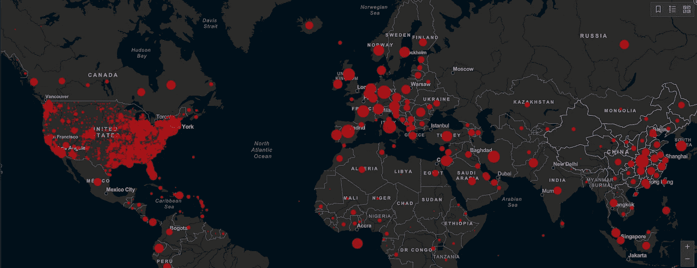
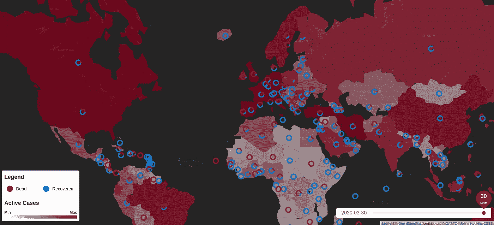
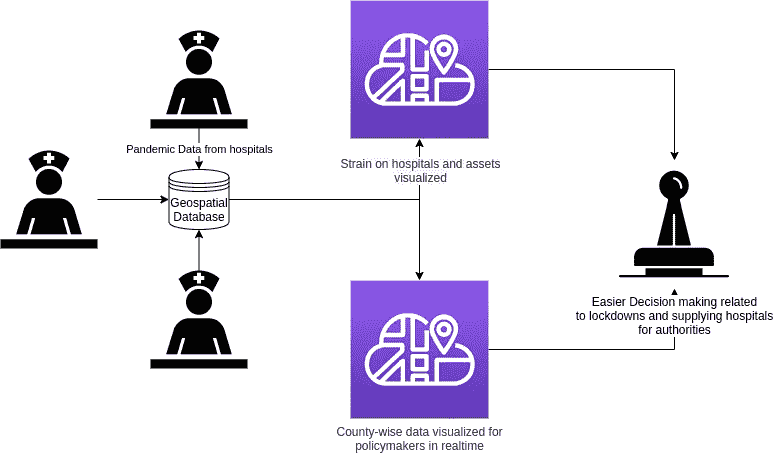
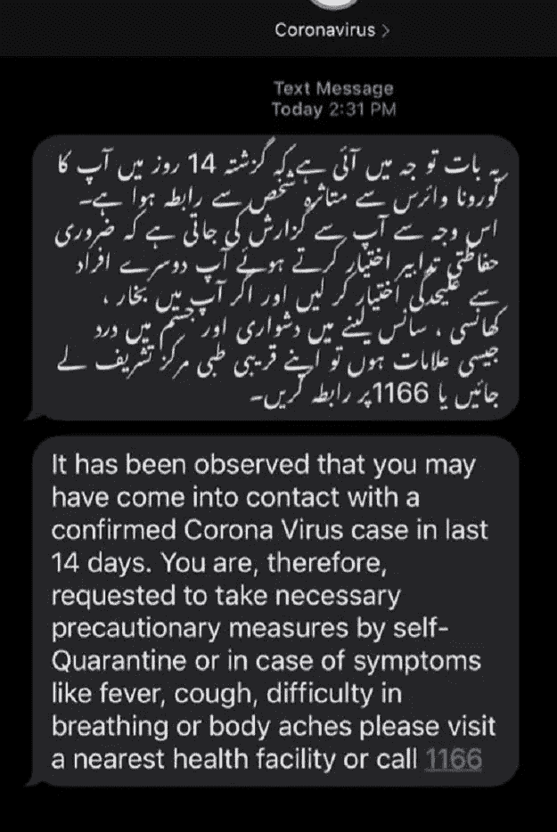
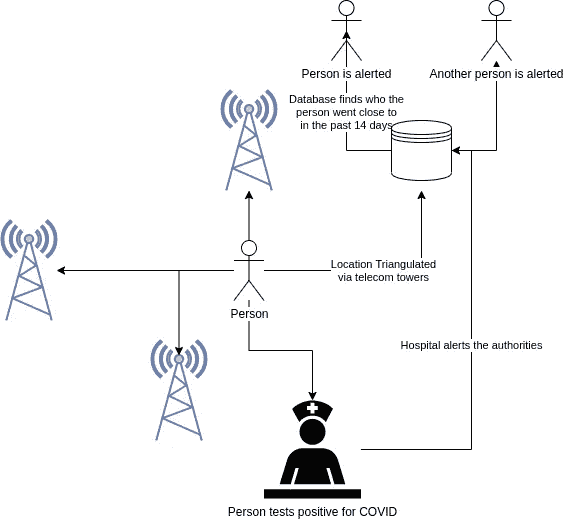
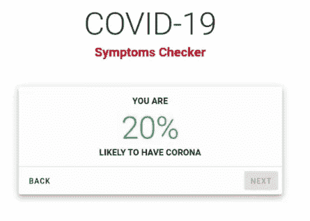
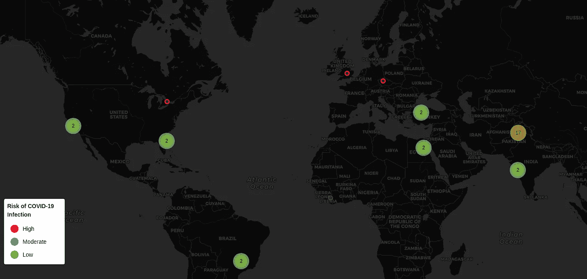
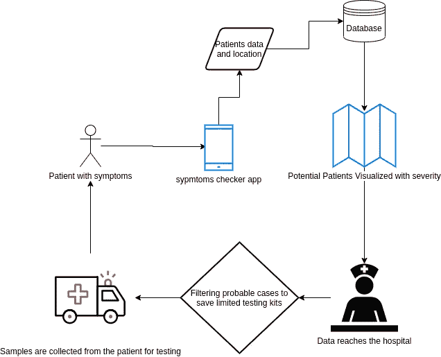

# 地理空间数据如何帮助抗击流行病

> 原文：<https://towardsdatascience.com/how-geospatial-data-can-help-fight-pandemics-112e5baec59c?source=collection_archive---------37----------------------->

约翰·霍普斯金大学绘制的冠状病毒地图

新型冠状病毒或新冠肺炎正在肆虐，这不是我们必须面对的第一种或最后一种传染病。在最近的过去，我们也看到了新传染病的大规模爆发，如 MERS、SARS、寨卡病毒、埃博拉病毒、H1N1 猪流感、禽流感和许多其他疾病。我们目前还有不同的流行病，如脊髓灰质炎、艾滋病、登革热等。在世界的不同地方。

我们相信可能会有更多有害的疾病向我们袭来。我们希望这不会发生，但当我们这样说时，我们有四个理由:

1)超级细菌的进化

2)气候变化

3)人口过剩

4)生物恐怖主义

现在让我们简单解释一下。

# 超级细菌

随着抗生素的发明，人类找到了杀死以前杀死数百万人的有害细菌的终极武器。但是细菌，像所有生物一样，会进化。它们现在正在进化成超级细菌，这是同样的细菌，但对抗生素有抗药性。

如果你想深入了解超级细菌的细节，请观看这段 6 分钟的视频。它很好地解释了这一现象:

# 气候变化

气候变化也是人类面临的另一个巨大威胁。人们认为这只会导致极端天气事件，但不幸的是，事实并非如此。它也会带来致命的疾病。

病毒可以休眠数万年，当有生存条件时又会复活。世界各地的冰川中埋藏着过多的古代病毒。对于这些古老的病毒，我们没有药物和疫苗，更糟糕的是，我们的免疫系统也没有进化到可以对抗它们。

一个这样的例子出现在俄罗斯北极地区，一种古老的病毒从融化的永久冻土中复活，杀死了数千只驯鹿和一些人。你可以在 BBC 地球的这个故事中读到更多关于这个事件的细节。

 [## 冰里藏着疾病，它们正在苏醒

### 纵观历史，人类一直与细菌和病毒共存。从黑死病到天花，我们…

www.bbc.com](http://www.bbc.com/earth/story/20170504-there-are-diseases-hidden-in-ice-and-they-are-waking-up) 

问题不仅仅在于极地冰川。西藏山脉，通常被称为世界第三极，也有正在融化的巨大冰川，这些冰川也有大量休眠的古代病毒。

锡亚琴冰川是世界上第二长的非极地冰川，为印度河提供水源。脸书的照片

世界上最大的四条河流，即印度河、恒河、黄河和长江都从这些西藏冰川流出。一些相对较小的河流，如雅鲁藏布江和湄公河，也发源于相同的冰川。这些河流流入中国、印度、巴基斯坦、尼泊尔、孟加拉国和阿富汗。这些国家大约拥有地球人口的一半。因此，这些冰川中的任何病毒都可能很快感染人类和/或威胁我们的牲畜。

# 人口过剩

随着人类人口达到历史最高水平并仍呈上升趋势，我们需要更多的资源和空间。由于这个原因，我们的物种正在越来越深地侵占野生动物的栖息地。这些动物中有许多生活在病毒中，这些病毒对我们人类来说可能是致命的，但对他们来说是无害的。

这段 2015 年的视频警告人们不要打扰野生蝙蝠。它讲述了野生蝙蝠是如何给人类带来潜在的致命疾病的。

# 生物恐怖主义

现在有一种新的、低成本的、非常致命的武器:生物恐怖主义。

现在，通过修改基因和其他各种技术，可以在实验室合成病毒和细菌。这是非常具有杀伤力的，因为这是一个极低成本和有效的。此外，追踪细菌/病毒的来源非常困难，因此任何人都可以这样做而不用担心遭到反击。

它可以被军队、军队中的流氓分子甚至恐怖组织所利用。所以在我们看来，这是人类对人类非常大的威胁。

# 地理空间数据有什么帮助？

迄今为止，情况看起来非常糟糕，但事实并非如此。现在来说说解决办法。这里我们有三个地理空间数据可以提供帮助的例子。

**识别风险区域**

当涉及到冠状病毒等传染病时，地理空间数据非常有用，因为它有助于识别模式。我们最近建立了一个工具“[电晕地图](https://thecoronamap.com/)”，它显示了电晕在国家层面上传播的历史和地理空间数据。

2020 年 3 月 30 日的统计数据在 thecoronamap.com[上查看](https://thecoronamap.com/)

这个工具现在有国家一级的数据。但是，如果数据可用，这可以用来深入到最小的地理边界，如县或街道。在这个层面上，它变得非常强大。

当局可以看到哪些是热点，哪些是真正受到攻击的地区，这种地理空间可视化提供了决策支持，如哪些地区需要封锁，哪里需要更多的测试中心等等。这些信息使当局能够将邪恶扼杀在萌芽状态，并将任何流行病遏制在萌芽状态。

可以为医院、临时医院、隔离中心等资产的压力创建类似的地理空间可视化。压力可能是医务人员、呼吸机、氧气瓶和个人防护用品等的缺乏。这种可视化也可以帮助当局有效地管理他们的资源。

我们已经创建了这样一个空间决策支持系统将如何工作的简单流程图。

空间决策支持系统如何帮助当局进行决策的流程图

这种系统不仅可用于流行病/大流行病，还可同样用于监测其他疾病，并有助于发现模式和热点。例如，一个县腹泻病例的增加可能意味着供水管道被污染等等。

该系统的另一个非常重要的要求是其数据必须在国际上共享。这些国家需要在欧洲联盟、阿拉伯联盟、非洲联盟、南亚区域合作联盟和联合国等区域和/或国际组织制定的框架内相互共享数据。

**追踪和跟踪患者**

这种方法已经在巴基斯坦和韩国等一些国家使用。这些国家正在从电信服务提供商那里获取其公民的位置和移动历史数据。现在，当一名患者的新冠肺炎病毒检测呈阳性时，他过去 14 天的旅行记录会被检查，在此期间与他见过面的人会得到提醒。

巴基斯坦用户收到的警报短信的屏幕截图

在这个流程图中，我解释了这样一个系统应该如何工作。

各国如何追踪冠状病毒感染患者的流程图

同样的数据也被用来追踪病毒的踪迹，并发现更多处于危险中的人。事实证明，地理空间数据的这种用途在这些国家非常有用。

**在线考试**

另一个非常重要的工具是在线症状检查器，它也在一些地方被使用。如果添加位置数据，这也会变得更加有用。我们还创建了一个症状检查器，你也可以用它来检查你自己的症状[这里](https://thecoronamap.com/symptoms)。

[新冠肺炎症状检查器](https://thecoronamap.com/symptoms)

一旦我们有了症状的信息，病人的位置和他有电晕的可能性就被标绘在地图上。这张地图真的可以帮助当局了解更多病例的来源。您可以在此查看上述测试[的症状。](https://thecoronamap.com/symptoms-map)

[电晕症状图](https://thecoronamap.com/symptoms-map)

这些信息也可用于筛选重症病例，并可派遣团队在患者自我隔离时从他们身上收集检测样本。这不仅减轻了对医疗基础设施的压力，还消除了患者在通勤期间进一步传播病毒的风险。

在下面的流程图中，我们解释了这个用例，以帮助您更好地理解。

在线症状检查器如何减轻医疗基础设施的压力

这篇文章是与哈佛医学院的教师 Jacques Kpodonu 博士合著的。

> 我是拉米兹·萨米。我爬山、举重、构建 WebGIS 解决方案。请随时在 [Linkedin](https://www.linkedin.com/in/ramizsami/) 上与我联系。