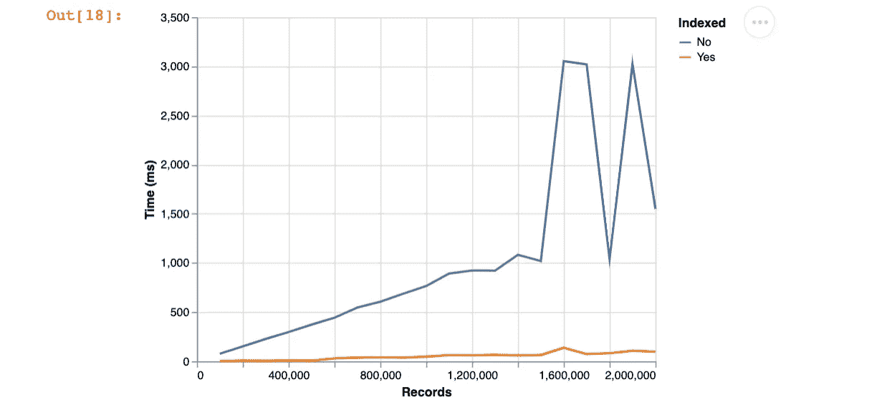
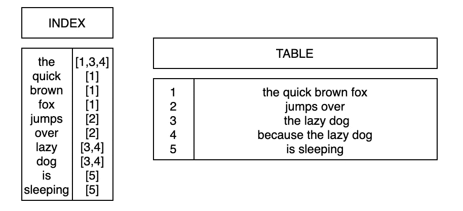
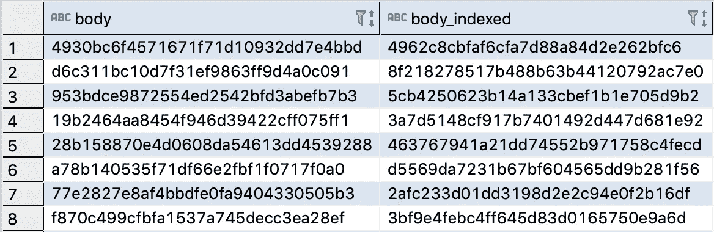

# GIN 索引如何让 Postgres 查询速度提高 15 倍

> 原文：<https://towardsdatascience.com/how-gin-indices-can-make-your-postgres-queries-15x-faster-af7a195a3fc5?source=collection_archive---------8----------------------->

## 通过查询示例，您可以在笔记本电脑上运行



添加索引将查询时间从几分钟缩短到了几毫秒，这是我职业生涯中从未有过的。作为数据科学家，我们花费大量时间来查询和分析数据，因此我们应该知道如何高效地完成这项工作。

Postgres 有 6 种索引类型。今天我们将讲述杜松子酒指数。

我们将为数据库植入越来越多的数据，并比较使用和不使用 GIN 索引的查询时间。如果您使用 SQL 编辑器(我使用的是 DBeaver)进行操作，您会受益更多。

# 什么是指数？

一种数据结构，以较慢的插入速度和更多的磁盘空间为代价，提高了从数据库中检索数据的效率。

# 什么是杜松子酒指数？

GIN 代表广义倒排索引。通常，倒排索引将单词映射到它在表中的位置。

下面是我对倒排索引的一个抽象。

如果我们想在没有索引的情况下在表中查找包含单词`lazy`的句子，我们需要迭代表中的每个句子来查找匹配。

但是通过增加一个索引，我们提前知道哪些句子包含了`lazy`这个词，可以直接加载那些。这使得事情快了很多！



这种类型的索引适用于查询复合数据类型，这意味着它们存储不止一个值。例如 hStores、Arrays、Ranges 和 JSONs。

# 杜松子酒指数快了多少？

让我们找出答案。

首先创建一个表并用数据填充它。

```
**# create table**
CREATE TABLE articles (
  body text,
  body_indexed text
);**# add an index**
CREATE INDEX articles_search_idx ON articles USING gin (body_indexed gin_trgm_ops);**# populate table with data**
INSERT INTO articles
SELECT
  md5(random()::text),
  md5(random()::text)
from (
  SELECT * FROM generate_series(1,100000) AS id
) AS x;
```

太棒了，我们现在有一个名为`articles`的表，有 100k 条记录和 2 列随机字符串。

如果你对指数感兴趣。我们没有直接索引字符串，而是使用 Postgres 的`gin_trgm_ops`从每个字符串创建`trigrams`(想想`sklearn`中的`ngrams`),并对其进行索引。

在我的 SQL 编辑器中，该表如下所示。



我将在添加每 100k 条新记录后跟踪查询时间。

我会运行这些查询。

```
**SELECT** **count**(*) **FROM** articles **where** body **ilike** '%abc%';
**SELECT** **count**(*) **FROM** articles **where** body_indexed **ilike**'%abc%';
```

*相同或相似的查询运行多次会在运行时间上有所不同。这是由于机器上变化的系统负载和变化的查询计划。为了我们的目的，忽略波动，看看时差的一般趋势。*


哇！这对于仅有的 200 万张唱片来说是一个巨大的差异。想象一下，我们正在查询一个数十亿的数据库。

# 结论

大多数时候我们只需要添加一个 B 树索引。但有时像杜松子酒这样的另一个指数更合适。当您最终遇到 B 树无法解决的问题时，知道其他索引类型是有用的。

你有没有遇到过任何很酷的索引用例，或者以有趣的方式应用它们？