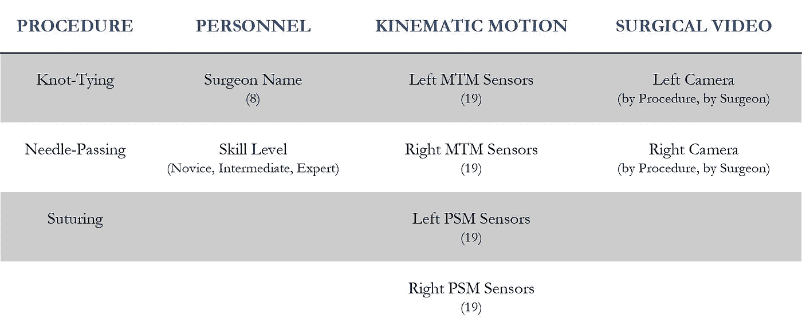
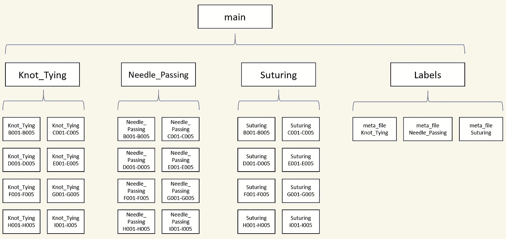
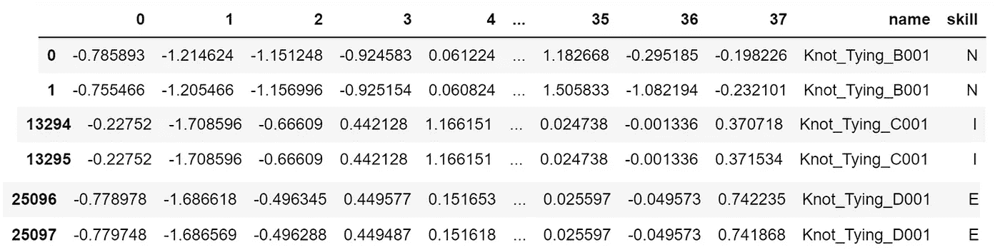
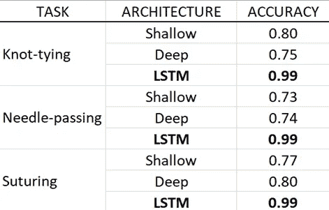

# 你的机器人外科医生有多好？递归网络的预测技巧

> 原文：<https://towardsdatascience.com/how-good-is-your-robot-surgeon-predicting-skill-with-recurrent-networks-ef992617aaf4?source=collection_archive---------58----------------------->

## Keras 时间序列分类(LSTM)


照片 171474770 罗马塞特—[Dreamstime.com](http://Dreamstime.com)

# 问题是

培养有能力的外科医生是所有外科住院医师计划的目标。在手术室评估技能时，评估通常依赖于对住院医师的技术表现进行评分的外科专家。这种手术评估可以做得更好，*原因很明显:*

> **传统的评估速度慢，主观性强，并且受到外科专家数量的限制。**

未来的手术室将会不同。配备了机器人辅助手术系统，培训师和学员可以访问 ***数字化程序数据*的宝库——为新一代分析奠定基础，以支持有效、客观和适时的手术反馈。**

在这篇文章中，我们展示了深度学习在快速准确的外科技能评估中的应用。

# 数据

JIGSAWS 数据集源于约翰霍普金斯大学和机器人系统设计和制造的先驱直觉外科公司的合作。迄今为止，这是唯一公开的微创机器人手术数据集。

我们使用 ***运动学运动传感器*** (总共 76 个)作为我们的输入变量，每个传感器都是从具有不同手术经验的八名外科医生那里收集的一系列运动数据。**每位外科医生执行三项手术任务——*打结*、*穿针*、*缝合——***，每项任务重复 5 次。

我们使用 ***技能等级*** 作为我们的目标变量。技能水平反映为基于受训者实践小时数的自我报告标签。一名*专家*是报告超过 100 小时的人，一名*中级*是 10-100 小时之间的人，一名*新手*是总手术机器人操作时间低于 10 小时的人。



图 JIGSAWS 数据集的汇总表。

# 准备

我们的实验试图仅使用运动数据来解决分类问题。该过程包括将运动数据处理成多变量时间序列，该时间序列用于输出*专家(E)* 、*中级(I)* 或*新手(N)* 标签，这取决于数据中展示的技能水平。

## 数据加载(熊猫的文本文件)

JIGSAWS 提供了一个广泛的文件目录——其中很多我们在本教程中并不需要(例如，视频数据、实验数据)。为了简化我们的导航，让我们创建一个单独的目录，只复制包含运动学运动和技能水平的文本文件(meta_files):



图 2:便于导航的新文件夹架构

> 对于从多个文件夹中读入多个文本文件的 Python 代码，参见[笔记本](https://github.com/teamlu/roboticsurgery/blob/master/Predicting%20Robotic%20Surgical%20Quality%20-%20TDS.ipynb)。

此时，我们希望将包含在 meta_files 中的标签合并到它们各自的外科医生。例如，我们需要识别外科医生“打结 B”为 *N* ，打结 C 为 *I* ，打结 D 为 *E* 。我们应用一个自定义函数`merge_labels()` 来简化这个过程:



图 3:合并传感器数据和技能等级标签

## 数据扩充

每个时间序列的典型长度在 1 到 5 分钟之间。每个手术有 8 个外科医生和每个外科医生 5 次试验，JIGSAWS 数据集只包含 40 个用于训练每个手术任务模型的独立样本。为了克服训练限制，我们遵循王等人在本文[中使用的两步数据扩充程序:](https://arxiv.org/abs/1806.05796)

1.  **行分割运动数据** 对于运动数据中的每个行样本，我们将 MTM 和 PSM 通道分成两个实例，并将它们转换为不同的样本。例如，每两行样本将有 38 个传感器，而不是每行样本 76 个传感器。这个“分裂和加倍”步骤是允许的，因为 MTM 和 PSM 传感器由于机器人控制臂的位置差异而不相关。原始传感器数据的每个通道都经过 z 归一化处理，以最小化每个传感器缩放范围的差异。
2.  **提取子序列
    它的工作原理是从传感器数据中捕获固定长度(窗口大小)的观察值，并在序列中逐步移动该窗口(步长)以提取子序列。通过将`step_size`设置为`window_size`参数的一半，我们创建了具有 50%重叠区域的时间窗口(尽管[仍未确定](https://pubmed.ncbi.nlm.nih.gov/31752158/)重叠窗口是否优于非重叠技术)。以下是 Python 代码:**

在原始数据集上的这种数据扩充程序使得模型能够分别被供给 8754、6052 和 4134 个作物用于缝合、穿针和打结。总而言之，训练我们的递归神经网络的输入数量更合理！

> 关于数据增强的更多内容，王等。艾尔的[手稿](https://arxiv.org/abs/1806.05796)启发了我们的策略。

## Keras 的数据格式

在我们准备将注意力转向模型构建之前，我们需要以适合 Keras 的格式准备数据。如果你愿意，你可以在[笔记本](https://github.com/teamlu/roboticsurgery/blob/master/Predicting%20Robotic%20Surgical%20Quality%20-%20TDS.ipynb)中进一步挖掘，但为了简洁起见，以下是主要观点:

*   **重塑裁剪后的数据:**Keras 中的递归层只接受三维数组，因此我们必须将我们的 2D 熊猫*数据帧*重塑为 3D *数组*。为了有效地处理每个手术任务，我们使用自定义函数`shape_inputs()`。
*   **分离输入/输出:**在裁剪和整形后，分离你的动作数据和技能等级值*很重要。如果您试图过早地执行分离，您的 X 输入和 Y 标签将会错位。*
*   **格式输入变量:** X 输入必须手动转换成张量，因为我们使用的是一个由*列表*组成的数组，而不是一个由 *Numpy 数组组成的数组。* Keras 不支持数组列表。
*   **格式化输出变量:**对于 Y 标签，我们需要将输出变量——一个基于字符串的向量`array([’N’, ’N’, ’N’, …, ‘E’, ‘E’, ‘E’], dtype=’<U1')`—转换成一个整数编码的 2D 独热数组。如果做得不正确，Keras 会因为使用了特定的损失函数而抛出一个错误(下一节将详细介绍)。我们应用来自[笔记本](https://github.com/teamlu/roboticsurgery/blob/master/Predicting%20Robotic%20Surgical%20Quality%20-%20TDS.ipynb)的自定义函数`encode()`进行整数编码。然后，我们应用张量流函数`to_categorical()`，进行一键编码。

```
**## How our output variable should be formatted for Keras**
# array([[0., 0., 1.],
       [0., 0., 1.],
       [0., 0., 1.],
       ...,
       [0., 0., 1.],
       [0., 0., 1.],
       [0., 0., 1.]], dtype=float32)
```

# 建模

> 关于递归神经网络(RNN)如何工作的更多信息，安德鲁·卡帕西关于 RNN 计算和长期短期记忆(LSTM)的文章是一个很好的阅读材料。

我们使用 Keras 序列模型类型来构建递归神经网络，这允许逐层构建。我们选择 3 种不同的架构来为每个手术任务训练单独的模型，制作 9 个 rnn 进行比较。虽然有比下图更复杂的构造 RNN 的方法，但单层 LSTM 设置效果很好。以下是每种体系结构使用的层:

*   ***简单 RNN:*** 1 简单 RNN 层。1 个全连接密集层，具有 3 个输出类和 sigmoid 激活。
*   ***深 RNN:*** 2 简单 RNN 层和返回序列。1 个全连接密集层，具有 3 个输出类和 sigmoid 激活。
*   ***单层 LSTM:*** 1 层 LSTM。1 个全连接密集层，具有 3 个输出类和 sigmoid 激活。

LSTM RNN 胜过浅水和深水 RNN。这很直观，因为 LSTM 使用了一个更强大的更新方程，它能更好地从长序列的输入中获取信息。



图 4:按手术任务、模型类型分类的准确性

使用[特征融合技术](https://arxiv.org/abs/1712.08604)，相关工作的最高准确率达到 99%。LSTM 似乎在没有过度拟合的情况下表现得和那些方法一样好(学习曲线在[笔记本](https://github.com/teamlu/roboticsurgery/blob/master/Predicting%20Robotic%20Surgical%20Quality%20-%20TDS.ipynb)中显示)。**现在，在写这篇文章的时候，我了解到对于分类问题，**的 *F1 分数*通常比*准确度*更好，尤其是当与假阳性相关的成本大于假阴性的成本时(反之亦然)。我们的结果仅使用精度度量给出，因此在重复实验中比较 F1 是值得的。

# 结论

> 在这篇文章中，我们展示了一种用递归网络对运动时间序列数据建模的方法。我们发现强有力的支持，LSTM 可以是一个有效的工具进行手术技能评估。

## 对整合的必要关注

随着手术室的注意力转向机器人辅助手术系统，对来自这些平台的数据进行操作的需求将成为焦点。技能预测代表了卫生工作者培训的一个令人兴奋的新方向，但就其本身而言，如果不对医院工作人员进行大量投资，以加深他们对(1) *机器学习可以做什么*和(2) *一旦做出预测，应该采取什么行动*的知识，则不会产生影响。了解技能水平后，我们如何帮助外科医生达到或超过基准分数？对于患者来说，我们如何确保在新的数字能力下坚持最高的安全和质量标准？

下一个外科手术时代将需要卓越的数据科学和发展，但*也需要*变革管理和实施。

> 与这篇文章相关的源代码/笔记本可以在[https://github.com/teamlu/roboticsurgery](https://github.com/teamlu/roboticsurgery)找到。