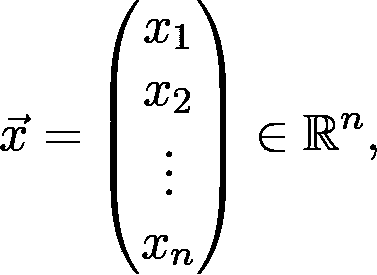
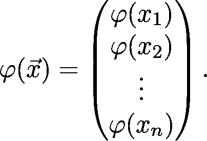
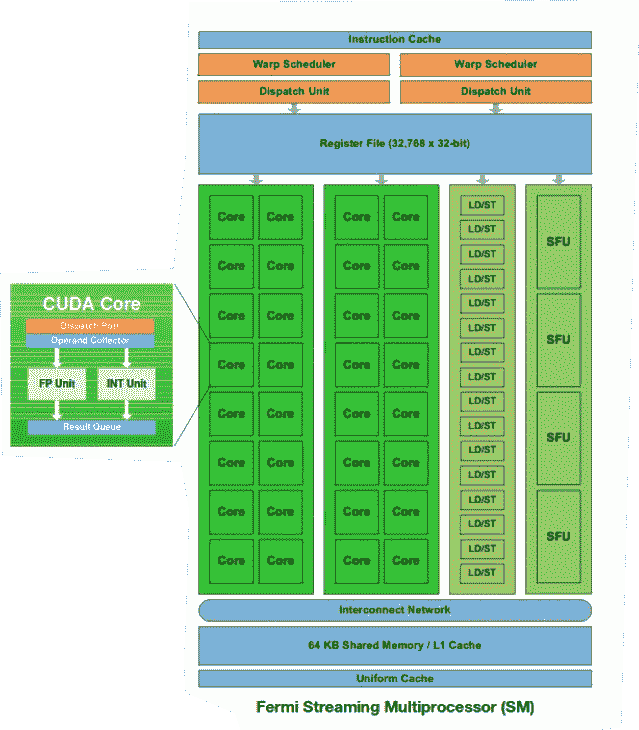
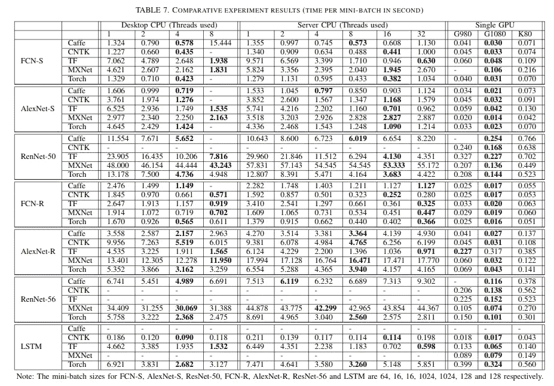

# GPU 如何加速深度学习

> 原文：<https://towardsdatascience.com/how-gpus-accelerate-deep-learning-3d9dec44667a?source=collection_archive---------15----------------------->

在 [Unsplash](https://unsplash.com?utm_source=medium&utm_medium=referral) 上由[娜娜杜瓦](https://unsplash.com/@nanadua11?utm_source=medium&utm_medium=referral)拍摄的照片

## 神经网络令人尴尬的并行性

神经网络和深度学习并不是最近才出现的方法。事实上，他们已经很老了。感知机是第一个神经网络，由弗兰克·罗森布拉特于 1958 年创建。甚至无处不在的深度学习架构的构建模块的发明也大多发生在 20 世纪末。例如，Yann LeCun 等人在 1989 年的里程碑式论文[中将卷积网络引入应用于手写邮政编码识别](http://yann.lecun.com/exdb/publis/pdf/lecun-89e.pdf)中。

为什么深度学习革命要等几十年？

一个主要原因是计算成本。即使是最小的架构也可能有数十层和数百万个参数，因此在期间重复计算梯度的计算成本非常高。在足够大的数据集上，训练通常需要几天甚至几周的时间。现在，你可以在几个小时之内在你的笔记本上训练出一个最先进的模型。

有三大进步将深度学习从一种研究工具带到了我们生活的几乎所有领域。这些是*反向传播*、*随机梯度下降*和 *GPU 计算*。在这篇文章中，我们将深入后者，并看到神经网络实际上是令人尴尬的并行算法，可以用来将计算成本提高几个数量级。

# 一大堆线性代数

深度神经网络乍一看似乎很复杂。然而，如果我们放大它们，我们可以看到它的组件在大多数情况下都非常简单。正如总是才华横溢的 xkcd 所说，网络(主要)是一堆线性代数。

来源: [xkcd](https://xkcd.com/1838/)

在训练过程中，最常用的函数是矩阵乘法和加法等基本的线性代数运算。情况很简单:如果你调用一个函数无数次，从函数调用中减去一点点时间可能会增加很多。

使用 GPU-s 不仅提供了一个小的改进，他们增压整个过程。为了了解这是如何做到的，让我们以激活为例。

假设φ是一个激活函数比如 ReLU 或者 Sigmoid。应用于前一层的输出

结果是

(这同样适用于图像等多维输入。)

这需要循环遍历向量并计算每个元素的值。有两种方法可以加快计算速度。首先，我们可以更快地计算每个*【φ(xᵢ】*。其次，我们可以在*并行中同时计算出 *φ(x* ₁ *)、φ(x* ₂ *)、…、φ(x* ₙ *)* 的值。*事实上，这是*令人尴尬的并行*，这意味着计算可以并行化，而无需任何显著的额外工作。

这些年来，更快地做事变得困难多了。过去，处理器的时钟速度几乎每年都要翻一番，但最近趋于平稳。现代处理器设计已经达到了这样一个程度，在单元中装入更多的晶体管会产生量子力学障碍。

然而，并行计算这些值并不需要更快的处理器，只需要更多的处理器。正如我们将要看到的，这就是 GPU 的工作方式。

# GPU 计算的原理

图形处理单元，简称 GPU，是为了创建和处理图像而开发的。由于每个像素的值都可以独立于其他像素进行计算，因此拥有许多较弱的处理器比一个非常强的处理器依次进行计算要好。

这与我们对深度学习模型的情况相同。大多数操作可以很容易地分解成可以独立完成的部分。

英伟达费米架构。对此已经有了很多改进，但它很好地说明了这一点。来源: [NVIDIA Fermi 架构白皮书](https://www.nvidia.com/content/PDF/fermi_white_papers/NVIDIA_Fermi_Compute_Architecture_Whitepaper.pdf)

打个比方，让我们考虑一家餐馆，它必须大规模生产炸薯条。要做到这一点，工人们必须将土豆削皮、切片并油炸。雇人削土豆的成本比购买更多的厨房机器人来完成这项任务要高得多。即使机器人速度较慢，你也可以从预算中购买更多，所以总体来说这个过程会更快。

## 并行模式

当谈到并行编程时，人们可以将计算架构分为四个不同的类别。这是迈克尔·j·弗林在 1966 年提出的，一直沿用至今。

1.  **S**single**I**建造，**S**single**D**ATA(SISD)
2.  单个 **I** 构造， **M** 多个 **D** ata (SIMD)
3.  多条指令，单个数据(MISD)
4.  M 多个 **I 个**指令， **M 个**多个 **D 个** ata (MIMD)

多核处理器是 MIMD，而 GPU 是 SIMD。深度学习是一个 SIMD 非常适合解决的问题。当您计算激活时，需要执行完全相同的操作，每个调用使用不同的数据。

## 延迟与吞吐量

为了更详细地描述 GPU 优于 CPU 的地方，我们需要了解一下*延迟*和*吞吐量*。延迟是完成单个任务所需的时间，而吞吐量是单位时间内完成的任务数。

简而言之，GPU 可以提供更好的吞吐量，但代价是延迟。对于令人尴尬的并行任务，如矩阵计算，这可以提供一个数量级的性能改善。但是，它不太适合复杂的任务，比如运行操作系统。

另一方面，CPU 针对延迟进行了优化，而不是吞吐量。它们能做的远不止浮点计算。

## 通用 GPU 编程

实际上，通用 GPU 编程在很长一段时间内都是不可用的。GPU 只能处理图形，如果你想利用它们的处理能力，你需要学习图形编程语言，比如 OpenGL。这不太实际，而且进入门槛很高。

这种情况一直持续到 2007 年，当时 NVIDIA 推出了 CUDA 框架，这是 C 的一个扩展，为 GPU 计算提供了一个 API。这极大地缩短了用户的学习曲线。快进几年:现代深度学习框架在我们没有明确知道的情况下使用 GPU。

# 用于深度学习的 GPU 计算

所以，我们已经讨论了 GPU 计算如何用于深度学习，但是我们还没有看到效果。下表显示了 2017 年制定的基准。虽然它是三年前制造的，但它仍然证明了速度的数量级提高。

各种深度学习框架的 CPU vs GPU 基准测试。(基准是从 2017 年开始的，所以它考虑了从那个时候开始的技术状态。然而，观点仍然成立:GPU 在深度学习方面优于 CPU。)来源:[基准测试最先进的深度学习软件工具](https://arxiv.org/abs/1608.07249)

## 现代深度学习框架如何使用 GPU

直接用 CUDA 编程，自己写内核，并不是最容易的事情。值得庆幸的是，TensorFlow 和 PyTorch 等现代深度学习框架并不要求你这么做。在幕后，计算密集型部分是使用 NVIDIA 的深度学习库 [cuDNN](https://docs.nvidia.com/deeplearning/sdk/index.html) 在 CUDA 中编写的。这些都是从 Python 调用的，根本不需要直接使用。Python 在这方面真的很强:可以很容易的和 C 结合，既强大又好用。

这类似于 NumPy 在幕后的工作方式:它非常快，因为它的函数是直接用 c 编写的。

 [## NumPy 真的比 Python 快吗？

### 是的，但前提是你知道如何使用它。

towardsdatascience.com](/is-numpy-really-faster-than-python-aaa9f8afb5d7) 

## 需要搭建深度学习钻机吗？

如果你想自己训练深度学习模型，你有几个选择。首先，您可以为自己构建一台 GPU 机器，然而，这可能是一项重大投资。幸运的是，你不需要这样做:亚马逊和谷歌等云提供商提供远程 GPU 实例来工作。如果你想免费访问资源，请查看[谷歌实验室](https://colab.research.google.com/notebooks/intro.ipynb)，它提供免费访问 GPU 实例。

# 结论

深度学习在计算上非常密集。几十年来，训练神经网络受到硬件的限制。即使相对较小的模型也需要训练数天，而在巨大的数据集上训练大型架构是不可能的。

但是随着通用计算 GPU 编程的出现，深度学习爆发了。GPU 擅长并行编程，由于这些算法可以非常高效地并行化，因此可以将训练和推理的速度加快几个数量级。

这为快速增长开辟了道路。现在，即使相对便宜的商用计算机也能训练出最先进的模型。结合 TensorFlow 和 PyTorch 等令人惊叹的开源工具，人们每天都在构建令人敬畏的东西。这真是出外勤的大好时机。

[***如果你喜欢把机器学习概念拆开，理解是什么让它们运转，我们有很多共同点。看看我的博客，我经常在那里发表这样的技术文章！***](https://www.tivadardanka.com/blog)