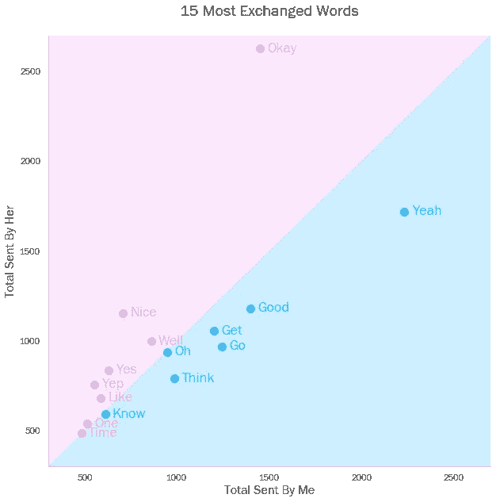
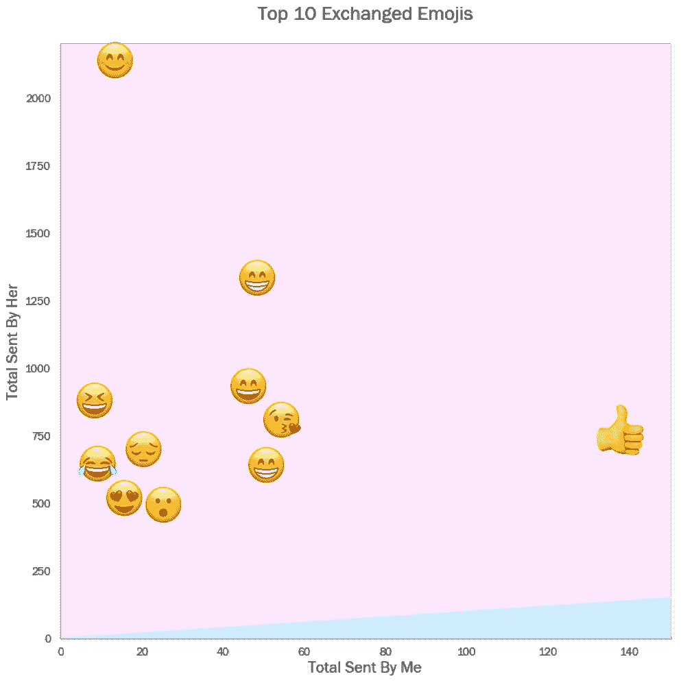
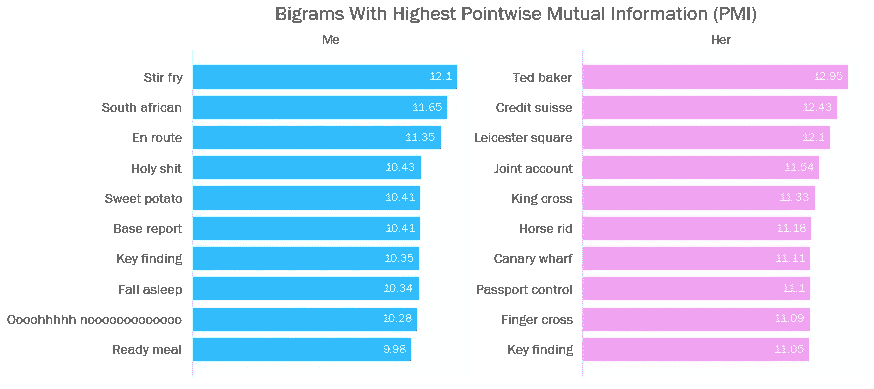
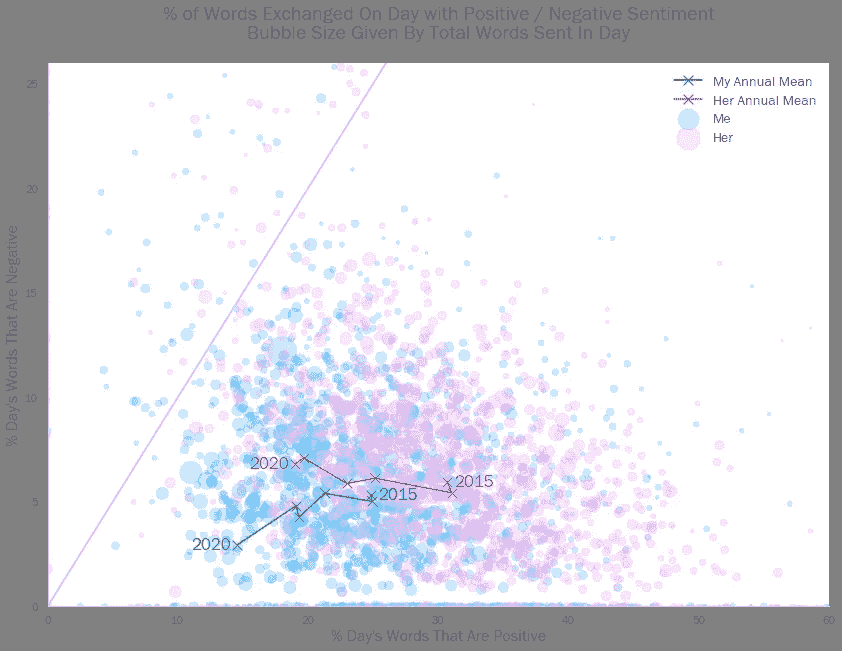
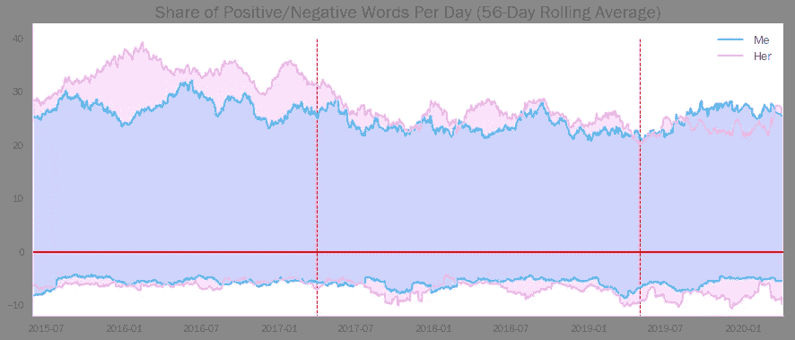
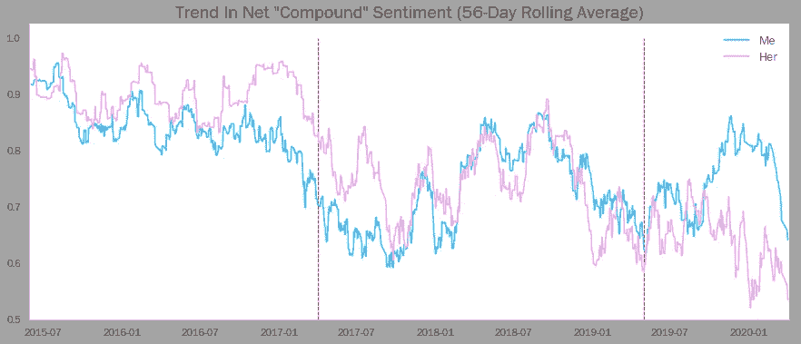

# 女朋友有多幸福？

> 原文：<https://towardsdatascience.com/how-happy-is-my-girlfriend-be895381d7c2?source=collection_archive---------35----------------------->

## 让我们用自然语言处理来找出答案…


图片—作者。很抱歉噩梦般的燃料。

在我之前的博客中，我调查了我和我的伴侣之间的消息量在过去五年中是如何变化的。我们能够得出一些有趣的数字分析(我们通常在一天中的什么时候交换信息，这是如何受到生活在一起的影响的，等等。)

[](/what-5-years-of-a-relationships-messages-look-like-45921155e3f2) [## 一段感情 5 年后的信息是什么样的

### 或者，用 Python 处理时间序列数据(和表情符号)的一些很酷的方法

towardsdatascience.com](/what-5-years-of-a-relationships-messages-look-like-45921155e3f2) 

给定一个文本数据的宝库，或“[语料库](https://www.lexico.com/en/definition/corpus)，我们可以做的不仅仅是简单地查看信息的数量——现代数据科学方法允许我们分析它们的*质量*。这些技术的复杂程度各不相同；我们可以探索哪些词在语料库中最常见，但我们也可以开始理解一个句子的潜在情感。

然而，在我们做这些之前，有一些基础工作要做——文本数据和其他数据一样需要清理和准备。令人高兴的是，Python 库 NLTK(自然语言工具包)内置了许多关键函数和方法。

1.  **删除停用词和标点:**停用词是“填充符”，否则会使文本分析变得混乱(例如，“I”、“and”、“had”等)。)NLTK 附带了多种语言的预定义停用词列表。我们还想去掉标点符号，因为默认情况下，Python 不知道“Hello！”和“你好？”—如果我们试图记录独特的单词，这是没有用的(出于类似的原因，我们希望将所有单词都用小写字母表示)。
2.  **对语料库进行标记化:**这是获取一个字符串，并将其转换为单个单词列表的过程。使用 NLTK 这样做可以让我们访问一组内置的方法，例如，词频计数。
3.  **对记号进行词条归类:**这是一个更加语言学上微妙的过程，但最终涉及到将每个单词转换成它们各自的“[词条](https://en.wikipedia.org/wiki/Lemma_(morphology))”。通俗地说，这一般就是把复数名词变成单数形式(“mice”变成“mouse”)，动词变成不定式(“running”、“ran”变成“run”)。这将有助于消除噪音，使我们更容易提取“情绪”。注意——NLTK 的 lemmatizer 本质上是一个大的预填充数据库，它考虑了英语的许多边缘情况。

所有这些组合成的代码如下所示:

```
**from** nltk **import** word_tokenize
**from** nltk.corpus **import** stopwords
**from** nltk.stem.wordnet **import** WordNetLemmatizer
**import** string***#Get all the stop words in the English language***
stopwords_list = stopwords.words('english')***#Add punctuation to this list***
stopwords_list += list(string.punctuation)***#Create tokens from the corpus and strip out stop words***
tokens = word_tokenize(corpus)
tokens_stopped = [w.lower() for w in tokens if w not in stopwords_list]***#Create and use a lemmatizer object***
lemmatizer = WordNetLemmatizer()
tokens_lem = lemmatizer(tokens_stopped)
```

注意——我做了两次这个记号化/符号化过程，一次是针对我的消息，一次是针对我伙伴的消息。

# 计数单词

首先(也是最明显的)要做的事情是查看我们的消息语料库中最常见的单词。我们可以通过 NLTK 轻松做到这一点:

```
**from** nltk **import** FreqDist***#Count the frequency of unique words***
FreqDist(tokens_lem).most_common()***#This returns a list of tuples
#The first element of each tuple is the word
#The second is the frequency******#Thus, we can get a list of the most common words:*** common_words = [i[0] for i in FreqDist(tokens_lem).most_common(20)]
```



事实上，这并没有揭示什么特别有趣的事情(除了我是一个“耶”型的男生，而她是一个“好”型的女生)。在我之前的博客中，我注意到我的伴侣比我更热衷于使用表情符号。理论上，我们可以使用表情符号开始分析我们信息的情感内容。然而，这一系列的调查因为这样一个事实而有些泡汤了，那就是我显然更少地使用表情符号来表达我的感情，而是简单地表示“是”。



粉色区域的表情符号是我的伴侣用得比我多的表情符号。蓝色区域没有表情符号。

当分析语料库中事物的频率时，思考短语可能更有见地。让我们来看看哪个相邻的单词*配对*(或者用术语来说就是“[双字母](https://en.wikipedia.org/wiki/Bigram)”)对我们每个人来说最常见。同样，这可以使用内置的 NLTK 方法来解决:

```
**import** nltk
**from** nltk.collocations **import** ****#Create an object to find bigrams in a given corpus***
bigram_finder = BigramCollocationFinder.from_words(tokens_lem)***#Create an object to measure bigrams*** bigram_measures = nltk.collocations.BigramAssocMeasures()***#Combine these to find the frequency of each bigram***
bi_scored = bigram_finder.score_ngrams(bigram_measures.raw_freq)***#Again, this produces a list of tuples
#where the first element is the bigram and
#the second is the share of all bigrams it represents***
```


“jóJT”在我搭档的母语匈牙利语中是“晚安”的意思

这开始揭示更多的东西。“哦上帝”比“哦”传达了更多的含义。然而，许多这些二元模型仍然是通用的——我们显然有常用短语(在两种语言中，不少！)是我们睡觉前自动翻到的，我女朋友的前两个单词中有四分之三是由“Okay”这个词组成的。

这让我们想到了[逐点互信息](https://en.wikipedia.org/wiki/Pointwise_mutual_information) (PMI)的概念。这是一种观察语料库中两个词的相互依赖性的方法。例如，像“Okay”和“Good”这样的词可能会有较低的 PMI 分数，它们可能会作为二元模型出现几次，但这两个词会与其他词一起在二元模型中出现多次。然而，像“波多黎各”和“波多黎各”这样的词会有很高的分数，因为它们很少彼此独立出现。

我们可以使用 NLTK 计算 PMI 分数:

```
***#Create a bigram finder object that filters out
#bigrams that appear fewer than 15 times***
bigram_finder.apply_freq_filter(15)***#Create PMI scores using the existing
#bigram measures object***
pmi_score = bi_finder_c.score_ngrams(bigram_measures.pmi)
```

一般来说，了解哪些单词具有很强的相互依赖性可以让数据科学家更好地理解单词的潜在含义(语言学家团队通过使用由数千个维基百科页面组成的语料库来实现这一点)。然而，在我们的例子中，它允许我们挑选出一些更有趣的“常用”短语。



似乎我的信息主要是关于购买晚餐(“炒菜”、“红薯”、“即食餐”)和工作(“南非”、“基地报告”、“关键发现”、“神圣的狗屎？”).她的更多是去一些地方(“莱斯特广场”、“国王十字车站”、“金丝雀码头”、“护照检查”)，告诉我把钱放进我们的联合账户。

# 情感分析

当然，虽然这让我们对我们的信息内容有了一些了解，但它不会自动给我们一种情绪的感觉。显然，我谈了很多关于南非人的事情，但这并没有告诉我们我对这个问题中的南非人的想法或感受。

为了进行这种“情绪”分析，我们可以使用一个非常聪明的叫做 VADER 的软件包。根据 [GitHub 页面](https://github.com/cjhutto/vaderSentiment):

> VADER (Valence Aware 字典和情感推理器)是一个基于词典和规则的情感分析工具，专门针对社交媒体中表达的情感，对其他领域的文本也很有效。

听起来很符合我们的需求。VADER 可以通过标准的 pip 安装下载，之后，它可以用来从我们的文本数据中推断情感。VADER 的实现非常简单。要分析给定字符串的情感，我们只需执行以下操作:

```
**from** vaderSentiment.vaderSentiment **import** SentimentIntensityAnalyzer**#Instantiate a sentiment analysis object**
analyzer = SentimentIntensityAnalyzer()**#Pass a sentence, e.g. my_string, through it**
sentiment = analyzer.polarity_scores(my_string)
```

这将为给定的字符串返回一个包含四种内容的字典:

*   **【pos】**:有正面情绪的词占多少比例
*   **【负面】**:有负面情绪的词占多少比例
*   **【neu】**:有中性情绪的词占多少比例
*   **‘compound’**:字符串中每个单词的价分值的加权组合，在-1(非常负)和 1(非常正)之间标准化。本质上，它是对一个给定句子的情绪的一个单一的测量。

VADER 的非凡之处在于它能够根据上下文来推断单词的意思。例如:

```
**IN:** "The book was good."
**OUT:** *{'pos': 0.492, 'neu': 0.508, 'neg': 0.0, 'compound': 0.4404,}***IN:** "The plot was good, but the characters are uncompelling and the dialog is not great."
**OUT:** *{'pos': 0.094, 'neu': 0.579, 'neg': 0.327, 'compound': -0.7042,}*
```

它知道，当“伟大”放在“不”这个词之后，它的意思就变得非常不同了。它还可以解释标点符号(例如，许多感叹号)、表情符号和俚语的使用。

为了便于我们的分析，我根据发件人将邮件分开，然后按天分组。换句话说，对于给定的一天，我已经将我的所有消息连接到一个单独的段落中，并将我的伙伴的所有消息连接到一个单独的段落中。然后，这些段落通过 SentimentIntensityAnalyzer 对象进行传递。

让我们首先关注一天中有积极或消极情绪的单词的份额。在下面的散点图中，每个点代表我或我的伴侣一天发送的信息，它的位置由当天积极的和消极的信息所占的份额决定。注意——这没有考虑到中性词，这就是为什么这些点不是沿着一条线排列的。



线上的点代表负面词汇比正面词汇多的日子。图表左下角的点代表使用非常中性语言的日子。

我们注意到粉红色的集群(我的伴侣的信息)更靠右，表明她的语言更积极。然而，我们可以看到，同一个集群的平均水平也略高，这表明她的语言同时更消极。相反，我的语言倾向于情感中立，集中在散点图的左下方。令人鼓舞的是，我们可以看到许多点聚集在 x 轴上——没有负面词汇被分享的日子。

我们还可以看到，随着时间的推移，我们的语言变得不那么“积极”。这可能是因为我们面对面说得更多，这意味着信息更具功能性(“你能在回家的路上买红薯吗？”)从而在情感上更加中立。

如果我们将相同的数据绘制成一个时间序列，这是显而易见的，其中红色轴线上方的高度代表给定一天中积极词汇的份额，下方的负高度代表消极词汇的份额。



不出所料，搬到一起后，我们的语言变得不那么明显积极(相反，话是面对面说的)。五年来，我们语言的负面性一直保持相对一致，尽管值得注意的是，我的语言比她的语言更积极的唯一时期是在我辞职之后……相关性，而不是因果关系，肯定吗？

当然，VADER 软件包提供的最先进的指标是“复合”指标，它将总体情绪评级归结为一个完整的字符串。我们可以把它绘制成一个时间序列。



正如我用这些数据绘制的以前的时间序列一样，我们看到了很多波动，即使使用滚动平均也是如此。然而，有一些非常具体的个人事件/时间段，我和我的伴侣可以用来解释我们在这里看到的一些更明显的起伏——例如，她在 2017 年第三季度和 2019 年第四季度的下降，以及我在 2019 年第三季度获得一只小猫后对生活的看法的改善……

这一切都表明了对文本数据的分析是多么强大，我们的个性和情感有多少可以从我们每天产生的大量数字文本数据中推断出来。

> *感谢一路阅读到博客结尾！我很乐意听到任何关于上述分析的评论，或者这篇文章涉及的任何概念。欢迎在下方留言，或者通过* [*LinkedIn*](https://www.linkedin.com/in/callum-ballard/) *联系我。*