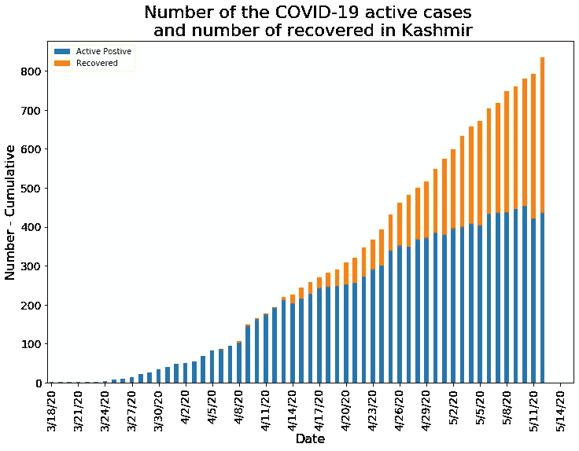
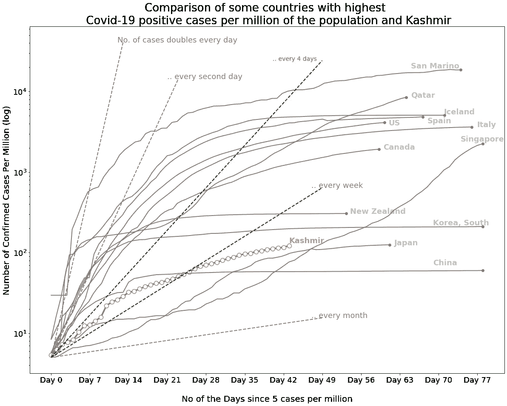
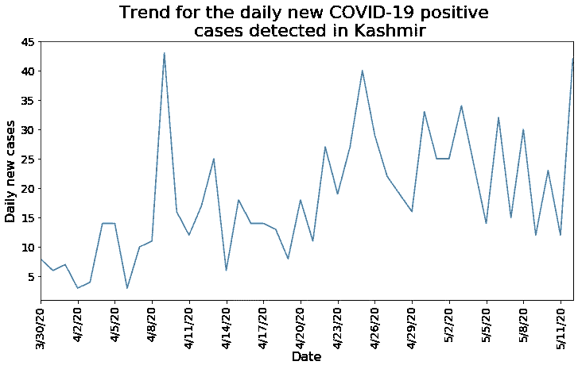
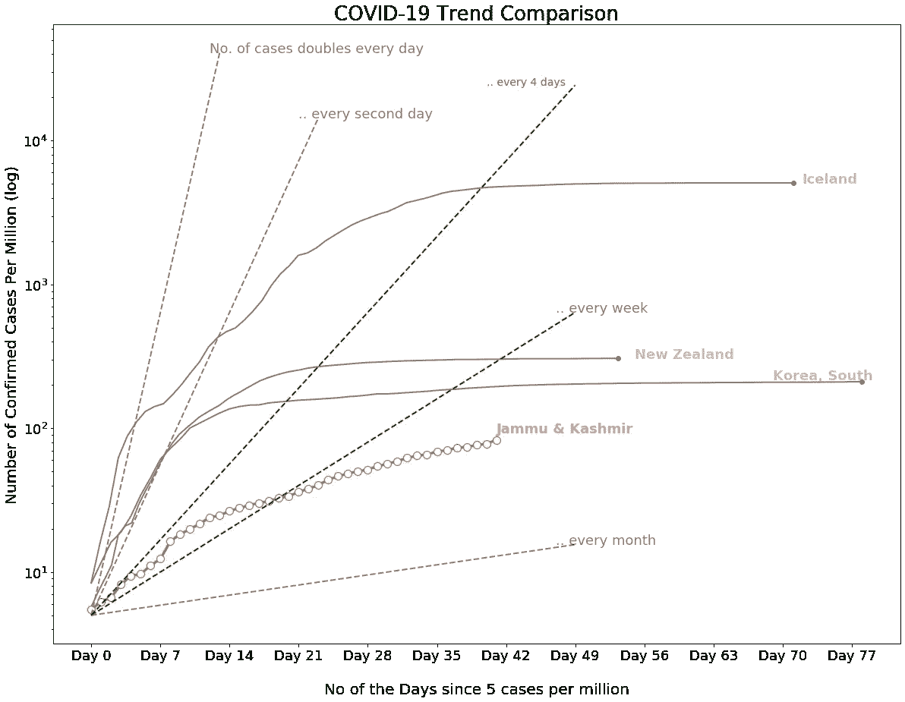
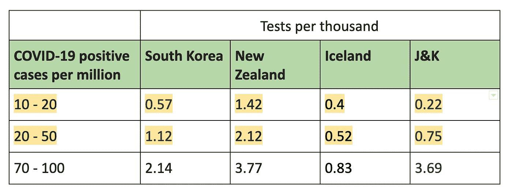
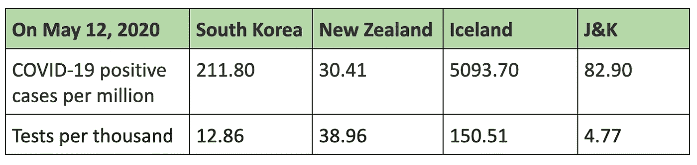
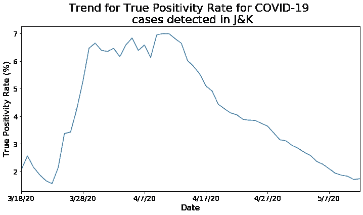

# 克什米尔对新型冠状病毒有什么反应？数据科学视角。

> 原文：<https://towardsdatascience.com/how-has-kashmir-reacted-to-the-novel-coronavirus-e1b165f30c5a?source=collection_archive---------47----------------------->

图片来源: [kashmirthroughmylens](https://www.instagram.com/kashmirthroughmylens/) 通过 [Instagram](https://www.instagram.com/p/B5xgPL6oh6F/)

## 一份分析迄今为止克什米尔山谷新冠肺炎疫情趋势的简短报告。

*新冠肺炎的爆发已经对全球普通民众和医护人员构成威胁。由于对新型冠状病毒的了解仍然有限，因此必须了解每个地区的疫情趋势，开拓和拓宽研究空间。这项研究试图通过分析克什米尔的新冠肺炎疫情数据来补充这一探索，并更好地了解克什米尔在全球的地位。*

**数据集详情:**

*   全球新冠肺炎数据:约翰霍普金斯大学医学院。
*   查谟和克什米尔的新冠肺炎数据:查谟和克什米尔政府信息和公共关系部通过其 twitter [@diprjk](https://twitter.com/diprjk) 提供的官方数据。
*   世界人口数据:世界银行
*   全球测试数据:我们的数据世界

**数据集限制和警告:**

我们评估数据准确性和可靠性的能力有限，这给新冠肺炎数据分析和建模带来了不可量化的不确定性。与所有监测数据一样，由于报告偏差和查明偏差，存在局限性。此外，缺乏机会和诊断质量也可能影响数据。因此，对不同地区进行一对一的数据分析可能不是苹果与苹果之间的比较。

尽管如此，在可靠数据有限的情况下对不同区域进行探索性数据分析，仍有助于正确看待形势，也有助于回答一些关键问题。

# 克什米尔的新冠肺炎案例

克什米尔和世界其他地方一样，受到新冠肺炎疫情的影响，处于封锁状态。2020 年 3 月 18 日，克什米尔报告了首例新冠肺炎阳性病例。2020 年 3 月 19 日，克什米尔许多地区实行了封锁。

根据政府的最新信息。截至 2020 年 5 月 12 日，克什米尔山谷有 844 例确诊病例，400 例痊愈，9 例死亡。

*数据来源:查谟&克什米尔政府信息和公共关系部，使用* [*covidkashmir.org 的 API*](https://covidkashmir.org/api/bulletin) *下载。截至 2020 年 5 月 12 日的最新数据*

# 拉平曲线

每天病例数量的急剧增加证明了这一流行病的迅速蔓延。通过减缓传播来减少疫情传播的努力，导致病例数上升速度减缓，进入平台期，最终导致每日报告的病例数下降。

如果太多人同时寻求医疗保健，卫生系统的能力可能会不堪重负。因此，[重要的是要认识到，我们每个人都有责任让曲线变平](https://www.who.int/docs/default-source/searo/thailand/2020-03-19-tha-sitrep-26-covid19.pdf?sfvrsn=6f433d5e_2)。

美国、义大利、西班牙等许多国家都经历过世界上最严重的新冠肺炎疫情。

韩国是一个突出的例子。作为中国以外世界上最大的初始疫情发生国之一，中国成功地控制了疫情的传播，导致每日报告的病例数下降。

将意大利与韩国进行比较，可以看出差异有多么巨大。2020 年 3 月 1 日，意大利只有 1694 例，而韩国有 3736 例。三周后，也就是 3 月 22 日，意大利的病例数激增至 59138 例，而韩国的病例数仅翻了一番，达到 8961 例(来源:[约翰霍普金斯大学新冠肺炎医学数据库](https://github.com/CSSEGISandData/COVID-19))。

韩国成功的关键是早期和积极使用大规模检测以及用于接触者追踪和病例隔离以及接触者隔离的新型数字技术。

鉴于全球各地的这些经验，探索克什米尔在新冠肺炎疫情中的地位是值得的。

下图比较了克什米尔和新冠肺炎阳性病例领先的一些国家。由于每个地区在疫情中面临不同的分布，下图仅帮助我们从更广泛的角度看待情况，并不提供关于一个地区比其他地区风险更高的任何信息。

*数据来源:全球新冠肺炎数据—* [约翰霍普金斯大学新冠肺炎医学数据仓库](https://github.com/CSSEGISandData/COVID-19) *，克什米尔新冠肺炎数据—查谟政府信息与公共关系部&克什米尔(使用* [*covidkashmir.org 的 API*](https://covidkashmir.org/api/bulletin) *下载)；截至 2020 年 5 月 12 日的最新数据*

关于地块的技术细节:

1.  x 轴:每个国家每百万人口中出现 5 例阳性病例后的天数。
2.  y 轴(对数刻度):每百万人口中新冠肺炎阳性病例数。

此图表使用每日新新冠肺炎病例来显示不同地区的疫情趋势。对于每个地区，数据点从每百万人中新冠肺炎阳性病例总数超过 5 的那一天开始，一直到可用的最新数据。例如，对于克什米尔，数据从 2020 年 3 月 30 日(首次记录的每百万新冠肺炎阳性病例数> 5 的日期)开始，到 2020 年 5 月 12 日(本文撰写之日)结束。

关键要点:

1.  每百万人中的阳性病例仍在上升。最初的趋势不像许多其他地区那样陡峭(或者也可能是没有进行足够的测试，或者测试没有击中正确的目标人群——在后面的部分中有更多这方面的内容)。
2.  即使最初每百万阳性病例数没有急剧的趋势，但这一数字已经增加了近 1.4 倍(从 2020 年 5 月 2 日的每百万 87.97 例增加到 2020 年 5 月 12 日的每百万 122.52 例)。并且自 2020 年 4 月 24 日以来翻了近一番(2020 年 4 月 24 日每百万 57.63 例，至 2020 年 5 月 12 日每百万 122.52 例)。
3.  当每天发现的新病例数量开始持续下降时，克什米尔的曲线将变得“平坦”。目前，每天发现的新病例数在 15-45 之间浮动。

*数据来源:查谟&克什米尔政府信息和公共关系部，使用* [*covidkashmir.org 的 API*](https://covidkashmir.org/api/bulletin) *下载。截至 2020 年 5 月 12 日的最新数据*

然而，任何地区的病例数增加并不一定意味着风险增加。更有可能的是，这意味着测试更容易获得，或者报告更完整。相反，关键是降低感染率(Ro ),导致平台期，并最终减少每日报告的病例数。

# 测试

*注:没有克什米尔山谷单独的测试数据。因此，在本节中，报告的数字是查谟&克什米尔的总和，除非另有说明。*

> 在 2020 年 3 月 16 日举行的关于新冠肺炎的媒体吹风会上，世卫组织总干事在[开幕致辞](https://www.who.int/dg/speeches/detail/who-director-general-s-opening-remarks-at-the-media-briefing-on-covid-19---16-march-2020)中说，随着社交距离的迅速升级，检测、隔离和接触者追踪是新冠肺炎应对的支柱。

不检测和不知道谁被感染会让感染不被发现地传播，以后会给卫生保健系统带来灾难。

***不同地区的可用测试数据是否具有可比性？***

如前所述，数据的不一致性和不可靠性可能无法让我们准确了解疫情传播或检测情况。本节的分析只是为了更好地理解查谟和克什米尔以及世界其他地区的检测数字。这种分析也可以让我们了解 J&K 是否在测试中采取了适当的措施，以及是否有立即增加测试的需要。

以韩国、新西兰和冰岛为例，这些地区已经成功地使曲线变平，这项分析试图将人们的注意力吸引到一个有趣的相关性上——就目前检测到的阳性病例和检测数量而言，强生公司与这些地区相比如何？

*数据来源:全球新冠肺炎数据—* [约翰霍普金斯大学新冠肺炎医学数据仓库](https://github.com/CSSEGISandData/COVID-19) *，克什米尔新冠肺炎数据—查谟政府信息与公共关系部&克什米尔(使用* [*covidkashmir.org 的 API*](https://covidkashmir.org/api/bulletin) *下载)；截至 2020 年 5 月 12 日的最新数据*

从这个图表中

*   看起来每天在 J&K 的新新冠肺炎病例仍在上升。
*   任何一天每百万人的新冠肺炎病例总数都低于其他地区，这是好事。但是这仅仅是迄今为止测试和报道的案例。
*   南韩和纽西兰能够在疫情相对较早地展平曲线。截至 2020 年 5 月 12 日，J&K 的每百万新冠肺炎病例数为 82.90 例，趋势是否会朝着更平坦的轨迹发展，或者病例数是否会保持上升趋势，还有待观察。

上面的图没有揭示的重要一点是正在进行的测试的数量。尤其是那些处于疾病爆发早期的患者(因为传播是指数级的，一旦失去了大规模检测和隔离的初始窗口，疾病爆发的数量就会迅速增加)。

让我们看看南韩、纽西兰和冰岛在疫情早期进行了多少次检测(每百万人检测到的新冠肺炎阳性病例大约不到 50)。

*数据来源:全球新冠肺炎数据—* [约翰霍普金斯大学新冠肺炎医学数据仓库](https://github.com/CSSEGISandData/COVID-19) *，克什米尔新冠肺炎数据—查谟政府信息与公共关系部&克什米尔(使用* [*covidkashmir.org 的 API*](https://covidkashmir.org/api/bulletin) *下载)，世界人口数据—* [*世界银行*](https://data.worldbank.org/indicator/SP.POP.TOTL) *，全球检测数据—* [*我们的世界在数据截至 2020 年 5 月 12 日的最新数据*](https://ourworldindata.org/coronavirus-testing)

对于每百万不到 50 例阳性新冠肺炎病例，韩国和新西兰的检测结果分别是强生的 2 倍和 4 倍。因此，可能是 J&K 错过了增加检测的早期窗口，导致未检测和未报告的病例数量增加。然而，该地区最近做了值得称赞的工作，将检测能力提高到每天近 3000 次。

但是在一个地区进行更多的检测不一定会降低风险或降低感染率。更重要的是，测试准确击中正确的人群(那些实际患有疾病的人群)的精确度。

例如，韩国的测试基于监控应用和先进技术。因此，即使人均检测次数相当或更少，韩国也能更准确地识别患病人群。

新西兰和冰岛继续每天将检测能力提高数倍，这有助于遏制新型冠状病毒在这些地区的传播。

*数据来源:全球新冠肺炎数据—* [约翰霍普金斯大学新冠肺炎医学数据仓库](https://github.com/CSSEGISandData/COVID-19) *，克什米尔新冠肺炎数据—查谟政府信息与公共关系部&克什米尔(使用* [*covidkashmir.org 的 API*](https://covidkashmir.org/api/bulletin) *下载)，世界人口数据—* [*世界银行*](https://data.worldbank.org/indicator/SP.POP.TOTL) *，全球检测数据—* [*我们的世界在数据截至 2020 年 5 月 12 日的最新数据*](https://ourworldindata.org/coronavirus-testing)

虽然千分之几的检测是控制特定地区病毒传播的一个重要指标，但仍不足以了解全貌。

# 真实阳性率

根据政府的最新数据。J & K 共采集样本 53726 份，其中 J & K 阴性 52792 份，阳性 934 份。

> 真阳性率=总阳性/总检测数* 100 = 1.74%。

换句话说，截至 2020 年 5 月 12 日，在 J&K 接受新型冠状病毒测试的 57 人中有近 1 人被发现患有这种病毒。

*数据来源:查谟&克什米尔政府信息和公共关系部，使用* [*covidkashmir.org 的 API*](https://covidkashmir.org/api/bulletin) *下载。截至 2020 年 5 月 12 日的最新数据*

随着在 J&K 的测试增加，真实阳性率(TPR)一直在下降。2020 年 5 月 12 日 1.74%的真实阳性率相当低，表明:

-低水平的新冠肺炎疫情

-测试了错误的人

-测试质量不佳(或取样技术)

然而，真实的阳性率并不等同于任何地区新冠肺炎阳性病例的比例。实际病例数通过一个叫做*患病率*的指标来追踪。

# 流行的重要性

[CDC 将患病率(有时称为患病率)定义为在特定时间点或特定时间段内，人群中患有特定疾病或属性的人数比例。](https://www.cdc.gov/csels/dsepd/ss1978/lesson3/section2.html)

由于各种因素，如有限的检测、无症状病例、缺乏认识或甚至因社会耻辱而拒绝寻求医疗帮助，都可能导致未记录和未发现的病例。这些遗漏和未记录的病例造成了患病率和真阳性之间的差异。

未记录但具有传染性的病例比例是一个关键的流行病学特征，它调节了突发呼吸道病毒的疫情潜能[2–5]。[这些未记录在案的感染取决于其传染性和数量，与其他情况相比，可能会使更多的人暴露于该病毒](https://www.medrxiv.org/content/10.1101/2020.02.14.20023127v1)。

像其他传染病一样，新冠肺炎的真实流行率仍然未知。哥伦比亚大学的公共卫生科学家研究了旅行数据和 Wuhan⁶.新型冠状病毒潜伏期和感染率的最新信息他们开发了一个数学模型来模拟该市早期的疫情爆发，并估计[在 2020 年 1 月 23 日旅行限制之前，所有感染中有 86%是无记录的，这些无记录的感染是 79%有记录病例的传染源。](https://www.medrxiv.org/content/10.1101/2020.02.14.20023127v1)这些关键发现可能会在具有不同控制、监测和报告实践的其他国家发生变化。然而，它们为增加大规模检测和准确报告提供了强有力的证据，以便能够确定新冠肺炎阳性病例的实际数量。

已知的挑战，如缺乏基础设施、缺乏对疾病的准备、经济因素或政治担忧，可能会导致扩大广泛检测的滞后。之前，对于其他传染病，如丙型肝炎[的数学模型](https://www.ncbi.nlm.nih.gov/pmc/articles/PMC5725986/)也进行了研究，以近似估计 disease⁷.的全面流行新冠肺炎也在研究类似的科学进展。

虽然截至 2020 年 5 月 12 日，J&K 报告的病例为 934 例，但像其他地方一样，同一时间范围内的真实流行率仍然未知。理想情况下，如果有一种方法可以估计疾病的流行程度，测试能力可以提高到这一水平(换句话说，如果病毒传播的趋势呈指数增长，那么理想情况下测试也应该呈指数增长，以检测所有受感染的病例)。如果通过使用接触追踪和其他手段对正确的目标人群进行检测，那么这种增加的检测可以导致最大流行病例的检测。这也许是韩国能够控制病毒的原因。

由于检测无法跟上病毒的传播，许多阳性病例仍未被发现，并继续成为活跃的携带者。越来越多的人从这些未被发现的活跃病例中被感染，结果，流行人群本身不断增加。

截至 2020 年 5 月 12 日，J&K 已经对每千名人口进行了 4.77 次测试，真实阳性率为 1.74%。如果接受检测的人群很好地代表了流行情况，并且如果这些假设和趋势在未来的检测中继续成立，那么该地区将能够迅速遏制病毒的传播。但是如果被检测的人群中缺少活跃的携带者，那么每天的新增病例将会持续上升。

总的来说，在给定时间内，大量的指标，如总检出病例数、每百万总检出病例数、总检测数、每百万总检测数或检测阳性率，不一定表明该地区处于高/低风险状态，也不一定表明对病毒的反应良好/不良。更确切地说，在给定时间，在给定区域，针对相应于相同时间的流行的测试池是对病毒良好反应的更好指标。

# 结论

新冠肺炎的爆发对全球普通民众和医护人员构成威胁。然而，关于这种新型病毒的知识仍然有限，但目前世界范围内的科学有了很大的进步。

截至 2020 年 5 月 12 日，J&K 每百万人口中有 82.90 例新冠肺炎阳性病例，而克什米尔山谷每百万人口中有 122.52 例新冠肺炎阳性病例。

检测能力每天都在增加，而真正的阳性率却在持续下降。但报告的新阳性病例总数尚未出现下降趋势，这对于使曲线变平很重要。

对于截至 2020 年 5 月 12 日报告和测试的人口，看起来克什米尔在遏制新型冠状病毒的传播方面做得不错。但每一天都是一场新的战斗，曲线随时可能飙升。因此，增加的测试、即将到来的持续社交距离的努力以及封锁将决定未来几周的形势，以将范式转变为可持续的曲线平坦化，新/活跃案例的数量将合理下降。

## **致谢**

我要向美国疾病预防控制中心病毒性肝炎司全球卫生副主任 Francisco Averhoff 博士表示最深切的感谢，感谢他审阅并提供专业知识和见解，极大地改进了手稿。

我要感谢疾病预防控制中心病毒性肝炎实验室分部主任 Saleem Kamili 博士和[克什米尔美国卫生保健医学教育学会&研究](https://www.kashmer.org/) (KASHMER)对这个项目的支持以及帮助建立与疾病预防控制中心专家的联系。

我还要感谢位于斯利那加 Soura 的 Sheri 克什米尔医学科学研究所(SKIMS)内科和肺部医学系主任 Parvaiz Koul 教授提供了有关克什米尔新冠肺炎疫情的专业知识。

感谢约翰·霍普金斯大学医学院提供了新冠肺炎的数据。感谢 covidkashmir.org 提供 API 从政府下载新冠肺炎的数据。J & K 的官方推特账号@ [diprjk](https://twitter.com/diprjk) 。

## **参考文献**

1.新冠肺炎国家应急中心，流行病学和病例管理小组，韩国疾病控制和预防中心新冠肺炎在韩国的接触传播:追踪接触者的新调查技术。公共卫生研究展望。 2020 年；11: 60–63

2.陈，袁 S，Kok KH，等。与 2019 年新型冠状病毒相关的家族性肺炎聚集性表明人与人之间的传播:一项家庭聚集性研究。柳叶刀。2020;s 0140–6736(20)30154–9。

3.2020 年 1 月 22 日中国武汉地区新型冠状病毒感染流行病学特征的实时初步评估。欧洲监视。2020;25(3):pii=2000044。

4.Munster VJ，Koopmans M，van Doremalen N，等.中国出现一种新型冠状病毒——影响评估的关键问题。英国医学博士。2020;DOI:10.1056/NEJMp2000929。

5.2019 年新型冠状病毒在武汉检疫隔离前输入中国的风险。MedRxiv。2020;19299.

6.李瑞云、森沛、、宋沂蒙、、万阳、杰弗里·沙曼·梅德西弗 2020 . 02 . 14 . 143533533304https://doi.org/10.1101/2020.02.14.20023127

7.阿马库，m .，布拉提尼，M. N .，柴布，e .，库蒂尼奥，f .，格林哈尔，d .，洛佩斯，L. F .，和马萨德，E. (2017)。从报告不足的年龄相关强制通知数据库中估计传染病的发病率。*理论生物学&医学建模*， *14* (1)，23。[https://doi.org/10.1186/s12976-017-0069-2](https://doi.org/10.1186/s12976-017-0069-2)

***扎伊拉·穆斯塔山*** *是美国纽约的一名数据科学家。她于 2017 年获得了宾夕法尼亚大学的计算机科学硕士学位。她是一名研究员和科学家，对人工智能、数据科学和数学感兴趣，尤其是在应用于社会公益时。你可以在这里* *找到更多关于她的技术贡献* [*。她喜欢旅行和探索新的地方。她认为旅行打开了不可想象的新的大门，通过接触不同的文化、风景和令人振奋的人，扩展了一个人的视野。*](https://scholar.google.com/citations?user=6z2FJZkAAAAJ&hl=en)