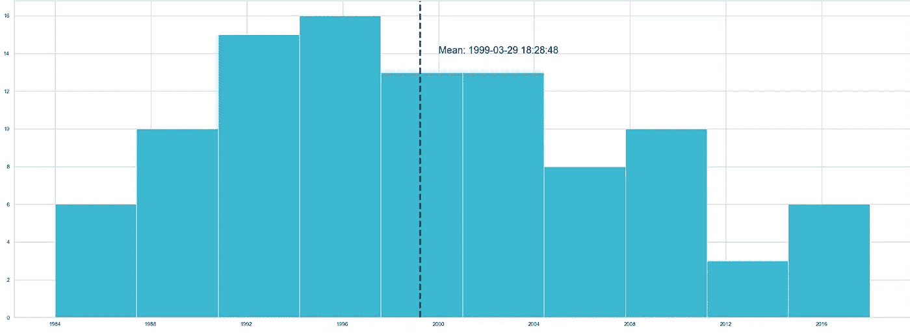
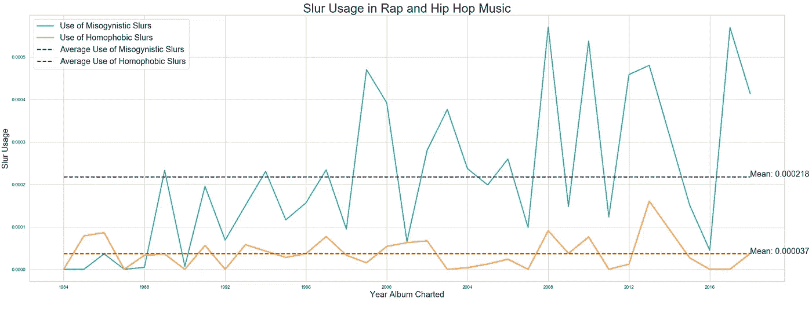

# 说唱和嘻哈音乐中的恐同症和厌女症

> 原文：<https://towardsdatascience.com/how-has-the-usage-of-homophobic-and-misogynistic-slurs-in-rap-and-hip-hop-music-changed-over-time-cb30cb9a8436?source=collection_archive---------32----------------------->

## 随着时间的推移对连音符号用法的抒情分析

安库什·巴拉德瓦伊

在 [Unsplash](https://unsplash.com?utm_source=medium&utm_medium=referral) 上由 [Namroud Gorguis](https://unsplash.com/@namroud?utm_source=medium&utm_medium=referral) 拍摄的照片

**简介**

随着说唱和嘻哈音乐的出现，争议似乎也随之而来，因为这种音乐类型因其音乐中描绘了恐同和厌女的主题而被反复指出(1，2)。在这种类型的音乐中使用亵渎的语言非常普遍，不幸的是，许多说唱和嘻哈音乐的亵渎内容包括贬低的引用，有时甚至描绘对女性的暴力(2)。此外，就像著名说唱歌手、东海岸嘻哈团体“吴唐帮”成员马索·曼恩说的那样，即使是最优秀的 MCs 也会避免被误解为同性恋，因为“你不能一边干别人，一边说自己是黑帮”。不用说，在说唱和嘻哈音乐中融入仇视同性恋和厌恶女性的主题令人担忧，特别是考虑到这种类型是年轻人最喜欢听的类型之一，引起了人们对这些主题对易受影响的思想的影响的担忧。然而，并不是所有的说唱歌手都仇视同性恋和厌恶女性。同样，并不是这一类型的每首歌或每张专辑都有恐同和厌女的主题。通过这个项目，将研究说唱和嘻哈专辑中同性恋恐惧和厌恶女性主题的表达随时间的变化。为此，将分析 1984 年至 2018 年期间 100 张说唱和嘻哈专辑中恐同和厌女诋毁的使用情况。因此，提出的问题如下:

> 随着时间的推移，说唱和嘻哈音乐中仇视同性恋和厌恶女性的辱骂是如何变化的？

**流程**

完成这个项目的代码是用 Python 3 放在一个 Jupyter 笔记本中的。

为了完成这个项目，需要大量的网络搜集。首先，需要一份要学习的专辑列表。这个[链接](http://davesmusicdatabase.blogspot.com/2011/07/the-top-50-rap-albums-of-all-time.html)上的列表包括了 100 张顶级说唱专辑，是从其他 25 张列表中汇总而来的，这意味着这个列表上的歌曲很好地概括了这张专辑在发行当年的风格标准。在将专辑列表抓取到熊猫数据框后，我开始担心随着时间的推移，这些专辑可能不会像我希望的那样分布均匀。主要是，我担心会过分强调旧专辑。为了消除我的焦虑，我发现，尽管分布确实稍微偏右，但大多数专辑在数据框架中的平均年份之前制作图表，我不应该太担心专辑在我的数据集中制作图表的年份的不平等表示:

我的数据集中相册的分布

下一步是收集每张专辑的曲目列表和专辑中每首曲目的歌词:genius.com 被用来获取每张专辑的曲目列表，以及每张专辑中每首歌的歌词。不幸的是，在这一步，我面临着一个看似不可能完成的任务，即收集大约 1863 个网址来搜集每首歌的歌词。幸运的是，通过注意到用于访问 genius.com 的 URL 具有可预测的模式，我有效地编译了数据帧中大多数歌曲的歌词，尽管不幸的是，由于我在尝试完全自动化歌词的 web 抓取器时出现的错误，我丢失了数据帧中大约 7.24%的原始歌曲。现在每首歌的歌词都在数据帧中，我可以继续进行文本分析。

我的文本分析方法的第一步是定义一个要搜索的恐同和厌女辱骂的列表。同性恋憎恶者名单被定义为包括*娘娘腔、三色堇、鸡奸者、南希、仙女、同性恋、本特、同性恋、骑师、*和*唐克*。这份厌恶女人的诽谤清单被定义为包括*妓女、荡妇、荡妇、阴户、娘娘腔、同性恋、婊子、妓女、假正经、*和*女同性恋。*接下来，为了确定专辑中包含了多少厌恶女性和厌恶同性恋的污点，我首先找到了每张专辑中每个列表中每个污点的 TF-IDF 分数。TF-IDF 代表*词频-逆文档频率，*并且是用于确定单词相对于整个语料库(在这种情况下，数据集中的所有相册)对文档(在这种情况下，相册)有多重要的度量。然后，对于每张专辑，对同性恋恐惧症和厌女症的评分将简单地是各自列表中每个污点的平均 TF-IDF 分数。通过这样做，我试图捕捉到相对于数据框架内所有其他专辑中相同词汇的使用，厌恶女性和厌恶同性恋的词汇对特定专辑有多重要。有了这些信息，终于到了阐述我的结果的时候了。

**结果**

说唱和嘻哈音乐中的连音符号用法

上面的图表展示了我的数据集中所有说唱和嘻哈专辑在特定年份的恐同症和厌女症的平均得分。虽然很难确定随着时间的推移，仇视同性恋的辱骂是否有所改变，但很明显，随着时间的推移，厌恶女性的辱骂越来越多。请注意，直到 20 世纪 90 年代末，专辑才开始使用比数据集中所有专辑发布的厌恶女性诋毁的平均数量更多的厌恶女性诋毁。特别是从这一点上看，似乎在每年发布的嘻哈和说唱音乐中，与使用恐同的污点相比，使用厌恶女人的污点有更多的变化。在计算了标准偏差之后，发现这是正确的，因为使用厌恶女性的辱骂的标准偏差比使用厌恶同性恋的辱骂的标准偏差高近五倍。

此外，我的分析发现，数据集中最害怕同性恋的艺术家如下:史努比·狗狗(或者，正如他在 *Doggystyle，*他在数据集中唯一的专辑《史努比·狗狗》发行时所知的那样)，梅西·埃丽奥特和阿姆。我的分析还发现，数据集中最厌恶女性的艺术家如下:李尔·韦恩、D12 和波斯特马龙。同样，我的分析发现，最厌恶同性恋的三张专辑如下:*史努比·多格的《狗狗风格》*，坎耶·韦斯特的 *808's 和《心碎》*，Run-D.M.C 的 *Raising Hell* ，最后，最厌恶女性的专辑如下:*李尔·韦恩的《Tha Carter III》*，德瑞医生的 *2001* ，阿姆的 *The Marshall Mathers LP* 。

**结论**

作为这个项目的结果，我相信我已经产生了以下关键见解:

1.说唱和嘻哈音乐中对女性歧视的使用越来越多。

2.rap 和 hip hop 专辑中厌恶女性的污点每年的使用标准偏差大于 rap 和 hip hop 专辑中厌恶同性恋的污点每年的使用标准偏差。

3.根据我使用的数据和分析，史努比·道格、梅西·埃丽奥特和阿姆是使用最多同性恋辱骂的艺术家。

4.根据我使用的数据和分析，李尔·韦恩、D12 和波斯特马龙是使用最歧视女性的诋毁的艺术家。

5.根据我使用的数据和分析，Snoop Dogg 的 *Doggystyle* ，Kanye West 的 *808's 和 Heartbreak* ，Run-D.M.C .的 *Raising Hell* 是使用最多同性恋憎恶的专辑。

6.根据我使用的数据和分析，李尔·韦恩的《Tha Carter III》、德瑞医生的《2001》和阿姆的《马歇尔·马瑟斯唱片》是使用最歧视女性的诽谤的专辑。

这个项目使用的完整代码可以在这里查看[。](https://github.com/ankushbharadwaj/homophobia-misogyny-in-rap-lyrics)

**参考文献**

[1] J. Weiner，[无同性恋的兴起和嘻哈同性恋恐惧症的改变](https://slate.com/culture/2009/08/the-rise-of-no-homo-and-the-changing-face-of-hip-hop-homophobia.html) (2009)，Slate.com

[2] C. E. Kubrin，R. Weitzer，[说唱音乐中的厌女症](https://journals.sagepub.com/doi/pdf/10.1177/1097184X08327696) (2009)，男人和男性气质