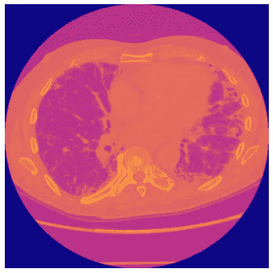
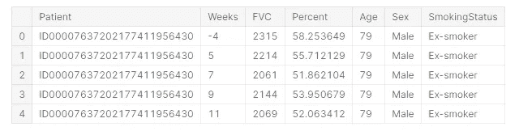
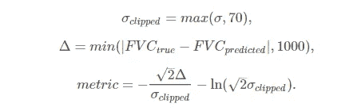
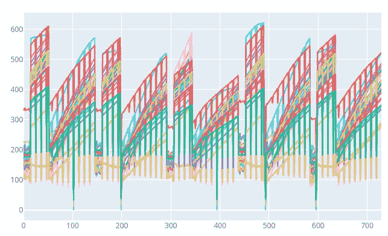
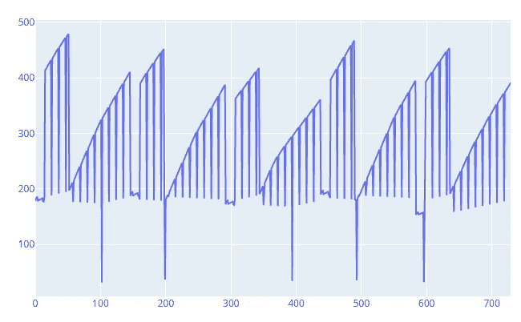

# 我如何在卡格尔 OSIC 肺纤维化进展竞赛中获得第一名

> 原文：<https://towardsdatascience.com/how-i-achieved-the-1st-place-in-kaggle-osic-pulmonary-fibrosis-progression-competition-e410962c4edc?source=collection_archive---------30----------------------->

## 结果证明这是相当随机的


[https://unsplash.com/photos/6BVinN0Y7Xk](https://unsplash.com/photos/6BVinN0Y7Xk)

# 介绍

在 [OSIC 肺纤维化进展](https://www.kaggle.com/c/osic-pulmonary-fibrosis-progression)比赛期间，参赛者被要求根据他们肺部的 ct 扫描和一些额外的表格数据字段来预测患者肺功能下降的严重程度。挑战在于使用机器学习技术，以影像、元数据和基线 FVC 作为输入进行预测。这项任务并不简单。由于可用的数据量相当低，使用传统的计算机视觉方法来建模 CT 扫描和患者 FVC 值之间的相关性并不容易。此外，公共排行榜分数仅基于 15%的测试数据，与验证完全不相关，这使得很难选择最佳模型进行最终提交。

总的来说，在这里解释比赛的所有微妙之处真的很难，所以我建议访问上面的比赛链接，如果你真的感兴趣，可以自己阅读一下！

# 模型的输入和输出

如上所述，输入数据由 dicom 格式的胸部 ct 扫描组成，这形成了 3d 胸部 CT 扫描加上一些附加的元数据字段，这些字段一般描述了每个患者。这是一个 CT 扫描的切片例子。



[https://www . ka ggle . com/andradaolteanu/lung-fibrosis-competition-EDA-DICOM-prep](https://www.kaggle.com/andradaolteanu/pulmonary-fibrosis-competition-eda-dicom-prep)

这是患者附加元数据字段的示例。



[https://www . ka ggle . com/andradaolteanu/lung-fibrosis-competition-EDA-DICOM-prep](https://www.kaggle.com/andradaolteanu/pulmonary-fibrosis-competition-eda-dicom-prep)

对于每个患者，都有一个初始 CT 扫描，对应于患者元数据中的第一周和其他周，描述了患者 FVC 在此期间的变化。

对于每个患者的测试集，只给出了第一周的数据，以及最初的 CT 扫描。这项任务不仅要预测接下来几周的“FVC”值，还要显示每次预测的“置信度”得分。

# 评估指标

谈到这个指标，对数似然分数被用来给所有的提交打分。



[https://www . ka ggle . com/c/osic-肺纤维化-进展/概述/评估](https://www.kaggle.com/c/osic-pulmonary-fibrosis-progression/overview/evaluation)

这是我的 python 实现。

```
def loglikelihood(real, pred, sigmas):
    sigmasClipped = np.maximum(sigmas, 70)
    delta = np.abs(real - pred)
    deltaClipped = np.minimum(delta, 1000)
    metric = - np.sqrt(2) * deltaClipped / sigmasClipped - np.log(np.sqrt(2) * sigmasClipped)
    return np.mean(metric)
```

# 验证技术

说到验证，我试图让它尽可能接近组织者使用的评分方法。最初，他们只对最后 3 个预测评分(每个患者最后 3 周)，所以我开发了一个类似的验证框架。对于测试集，我只包括不在训练集中的患者，并且只使用最后 3 周进行评分。不过，这个验证方案与排行榜没有很好的关联。

```
kf = KFold(n_splits = 5, shuffle = True, random_state = 4444)foldMetrics = []
for trIdsIdx, valIdsIdx in kf.split(trainData['PatientID'].unique()):
    trIds, valIds = trainData['PatientID'].unique()[trIdsIdx], trainData['PatientID'].unique()[valIdsIdx]
    tr = trainData[trainData['PatientID'].apply(lambda x: x in trIds)]
    val = trainData[trainData['PatientID'].apply(lambda x: x in valIds)].reset_index(drop=True)

    valIdx = []
    for idx in val.groupby('PatientID')['target_week'].apply(lambda x: np.array(x.index[np.in1d(np.array(x), np.array(sorted(x)[-3:]))])):
        valIdx.extend(idx)

    val = val.iloc[valIdx]

    #######################
    ### FIT MODEL HERE
    #######################

    foldMetrics.append(loglikelihood(val['target_FVC'].values, val_pred, sigmas))
print(np.mean(foldMetrics))
```

# 最佳模特

我最好的模型原来是两个模型的混合，[实际上是在比赛结束前由其他 kagglers](https://www.kaggle.com/khoongweihao/efficientnets-quantile-regression-inference) 引入的:EfficientNet B5 和分位数回归密集神经网络。EfficientNet 使用 CT 扫描切片和表格数据，而分位数回归则依赖于表格数据。由于这两个模型最初的构建有点不同，混合它们是一个很好的主意，因为它们的预测具有多样性。

以下是我如何在私人排行榜上获得第一名的具体步骤。

*   从头开始训练这两个模型。对于 Effnet b5，我选择了 30 个时期，对于分位数回归，我选择了 600 个时期进行训练
*   我做了一些特征过滤，通过移除预先计算的“百分比”特征，这使得预测更糟(可能因为这个特征是预先计算的)
*   在模型混合方面，我只是给了分位数回归模型更高的分数，因为从我的角度来看它更可靠。

在训练时间方面，Effnet b5 在单个 Nvidia Titan RTX GPU 卡上进行了大约 5 分钟的微调。分位数回归在推断过程中直接在 Kaggle 机器上训练，训练时间不超过 30 秒。一般来说，所有的推理过程在 Kaggle 机器上只需要 3 分钟。

此外，我想给一个小提示，关于我如何倾向于选择提交和验证预测的正确性，总的来说，这对我帮助很大。当我训练好新模型并收到提交文件时，我总是绘制预测值的分布图，以及预测本身的分布图。下面是预测图的样子:



这些是我的模型子集的测试集“置信度”的图，有时通过查看这些图，您可以识别奇怪的模型行为并找到一个 bug。总的来说，我总是非常仔细地分析预测，并在提交任何东西之前建立许多图表。

# 什么没起作用

我尝试了很多方法，但在 LB 和 CV 上几乎都不太管用。这里有几件事:

*   使用公共笔记本中的方法计算肺容量，并将其作为两个模型的特征进行传递
*   测试了其他模型、XGBoost、表格数据的对数回归。多亏了我的简历，很快就发现树在这里不起作用，所以从比赛开始我就没有对树做过任何事情。
*   因为我测试的是简单的模型，所以我第二次提交的是一个非常简单的逻辑回归模型，顺便说一下，它落在了青铜区
*   CT 扫描的增强效果很差，也许我应该花更多的时间来测试它们
*   图像的直方图特征也不起作用。
*   如果你已经分析了模型输出，你可能已经注意到那些尖峰信号(包括信心和 FVC ),移除它们是完全有意义的，但是它们对我的验证不起作用，所以我让它保持原样。尽管如此，我仍然对它在私有测试集上不工作的原因感到困惑。



信心激增

# 最后的话

这是我在 Kaggle 上的第一枚金牌，我真的很高兴。我要感谢所有 Kaggle 社区将这么多笔记本公之于众并活跃在论坛上！没有这个，我不会在这次比赛和之前的所有比赛中学到那么多。

下面，我将附上我的最终提交笔记本的链接，以及 Kaggle writeup 和 Github repo。

## [第一名笔记本](https://www.kaggle.com/artkulak/inference-45-55-600-epochs-tuned-effnet-b5-30-ep)

## [青铜区非常简单的解决方案](https://www.kaggle.com/artkulak/simple-logreg)

## [Kaggle 报道](https://www.kaggle.com/c/osic-pulmonary-fibrosis-progression/discussion/189346)

## [Github 库](https://github.com/artkulak/osic-pulmonary-fibrosis-progression)