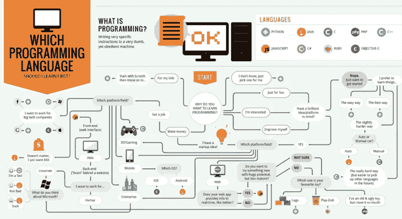
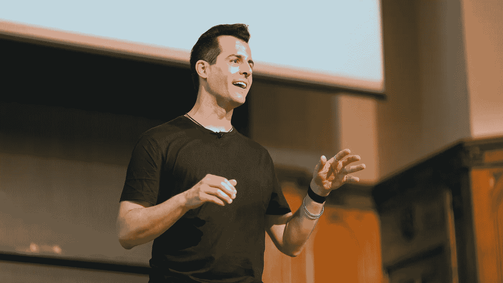
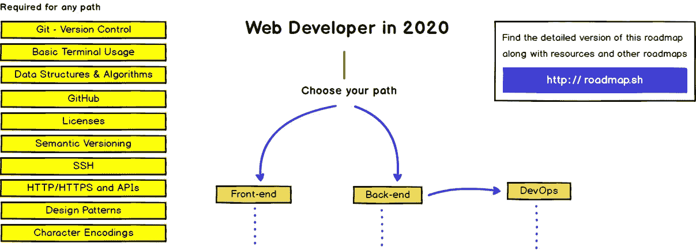
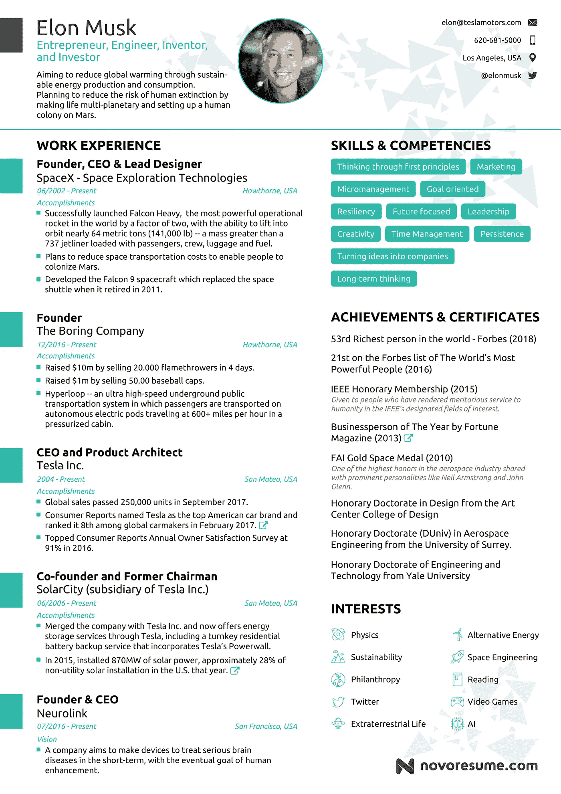

# 我是如何在没有学位和训练营的情况下，在疫情成为一名软件开发人员的

> 原文：<https://towardsdatascience.com/how-i-became-a-software-developer-during-the-pandemic-without-a-degree-or-a-bootcamp-ef7a4184efde?source=collection_archive---------0----------------------->

## 作为一名自学成才的学生，我在一年内找到了我梦想中的工作，以下是我从这次经历中学到的东西

[对 Unsplash](https://unsplash.com/photos/G1N9kDHqBrQ) 的信贷。

在 2018 年，我很沮丧，没有动力，我认为自己是个失败者，我认为我太笨了，无法完成我的学位或学习任何东西，我没有生活的方向，只想一切都结束。
两年后，一年在国外工作，另一年致力于学习，我对自己有了完全不同的看法，周一我开始了令人兴奋的新开发工作。

经过三年的学习，我鼓起了很大的勇气(也说服了我的父母)离开了我的大学，在里斯本接受了一份不认识任何人也不懂任何语言的工作，但这是一次帮助我找到自我的美妙经历。离开里斯本重新开始学习需要更多的勇气和决心，但我做到了，因为我知道我的梦想是成为一名程序员。

我没有心理学方面的专业知识，如果你在一个黑暗的地方，我的最佳建议是寻求专业帮助，但我知道迷失的感觉，我想通过写这篇文章来帮助任何与我有相同梦想的人，就如何在软件开发中实现职业生涯提供可行的建议。

## 编码很棒

我花了几年时间试图了解我成年后想做什么，但却失败得很惨。我花了一个学期在医学院学习，这时我意识到我根本不在乎成为一名医生，我参加了三年的工程课程，但我不喜欢我的专业科目，最后，我决定我不想继续下去。

我非常幸运地在我还在学习的时候收到了一份工作邀请，我立即决定抓住机会去争取，当时我从未真正全职工作过，所以我想挑战我对无法在专业环境中成功的恐惧。

幸运的是，我最终绝对热爱我的工作，感谢我认识的所有人，实际上是我的一位同事向我介绍了编码，并让我对它产生了兴趣。
从那以后，我再也没有回头，我开始涉足编程，我很快意识到我想把它作为我的职业，我非常享受挑战和它提供的智力刺激，我认为每个人都应该尝试一下，看看他们对它是否有同样的感觉。

## 每个人都可以编码…

…是一个古老的[苹果活动的口号](https://www.apple.com/newsroom/2019/11/apple-expands-everyone-can-code-to-bring-more-coding-resources-to-teachers-and-students/)，虽然我完全同意任何人都可以学习编程的基础，但我问自己，每个人都可以在软件开发领域获得职业生涯吗？
肯定不是，尽管这个职业越来越受欢迎，而且不断有更多的工作岗位产生，但这个领域仍然有限，许多人没有在电脑前长时间孤独(有时令人沮丧)的资质，简而言之[不是每个人都应该编码](https://www.youtube.com/watch?v=EFwa5Owp0-k&ab_channel=PolyMatter)。

不是每个人都会平等地享受编码，但我相信值得一试，[图片鸣谢](https://unsplash.com/photos/4A1pj4_vClA)

如果你认为这是一个快速致富的机会，那就去其他地方。如果你不真正喜欢写软件，你永远也不会找到工作，投入这么长时间却看不到任何切实的结果，也没有外部义务，这需要很多动力和奉献精神，不是每个人都可以复制的。

## 编码很难

不要相信那些所谓的专家或大师，他们承诺给你一个学习编程的简单程序，然后很容易找到六位数的薪水，这完全是一个谎言，如果有人向你讲述这个故事，你应该假设他们并没有把你的最佳利益放在心上。

学习如何编码是一个非常漫长和困难的过程，它需要你吸收一种完全不同的思维方式，花费无数的时间试图理解困难的主题或调试不能正常工作的应用程序。

我喜欢虫子！只要他们远离我的代码。[学分](https://www.pexels.com/it-it/foto/natura-estate-giardino-animale-3452388/)

人们经常忘记当他们只是初学者时，编码是多么困难，当你投入足够的时间时，编码会变得容易，但是不要因为你花了很长时间理解递归就错误地认为你不适合，每个人都必须按照自己的速度学习。

## 没有资历有可能找到工作吗？

答案当然是肯定的，如果你在网上浏览的话，你会发现很多人在四十多岁时改变职业生涯，或者放弃教育去自学并获得他们一直希望的工作的故事，后者基本上就是发生在我身上的事情，但这是追求这一职业的最佳方式吗？

让我们先说，如果我仍然是 19 岁，我毫无疑问会进入大学学习计算机科学，特别是在我的国家意大利，那里的教育是便宜的，进入这个行业最简单的方法无疑是通过获得学位和几个实习机会。

更不用说如果你毕业了，你的父母会很高兴的

我决定尝试更难的自学路线的原因是，我已经有了专业经验，并完成了我的工程学位的很大一部分，这些因素让我在员工眼中更可信，并为我的研究奠定了坚实的数学基础。

我没有训练营的经验，但我的印象是，他们通常只提供一两种语言和一些框架的浅薄知识，但在你对计算机科学和编程的整体理解上留下了巨大的漏洞。
不是说他们都是这样，加入一个对你来说可能是一个很好的选择，但是不要以为你会知道你需要的一切就离开。

## 如何从零开始

从数量惊人的资源开始，选择走哪条路和选择哪种语言可能会非常困难，如果我做了错误的选择怎么办？

秘密是没有正确或错误的选择，真正的成功之道是通过承诺某事并完成它，不要每隔几天就尝试一门新的课程或教程，因为你认为你可能会比你目前正在做的事情更喜欢它，或者有人向你保证它是最好的。

也就是说，当被问及从哪种语言开始时，我经常说 Python，因为我相信它对初学者最友好，并且足够大，可以让你探索许多不同的专业，从 web 开发到机器学习，但是如果你仍然不确定，我建议阅读[这篇伟大的文章](https://www.freecodecamp.org/news/what-programming-language-should-i-learn-first-19a33b0a467d/)来帮助你下定决心。

你应该选择什么？[形象信用](http://carlcheo.com/startcoding)

最好的入门网站是那些允许你边学习边编程的网站，阅读编程而不实际操作可能会让你成为一名程序员，就像阅读烹饪书而不烹饪可能会让你成为一名厨师一样，这里有一些我最喜欢的:
-[FreeCodeCamp](https://www.freecodecamp.org/)；
- [代码库](https://www.codecademy.com/)；
- [可汗书院](https://www.khanacademy.org/)；
- [SoloLearn](https://www.sololearn.com/) 。

## 基于项目的学习

开始并不困难，你学习许多新概念，并开始使用你选择的语言，当你想在没有帮助的情况下做一些你以前没有做过的事情时，问题就出现了，精通和独立需要的不仅仅是知道编程语言的基本逻辑和语法。

要进入更复杂和有趣的话题，有几个奇妙的选择，你知道你可以参加世界上最好的机构完全免费的大学课程数千？
有像 [Class Central](https://www.classcentral.com/) 这样的网站，你可以用它来找到你最感兴趣的课程，或者你可以直接探索其他平台，比如:
-[Udemy](https://www.udemy.com/)；
-[Coursera](https://www.coursera.org/)；
-[Edx](https://www.edx.org/)；
- [MIT 开放课件](https://ocw.mit.edu/index.htm)；
- [复数视线](http://pluralsight.com/)；
- [脑残学院](https://hyperskill.org/)；
-[uda city](https://www.udacity.com/)；
- [奥丁项目](https://www.theodinproject.com/)；
——[OSSU](https://github.com/ossu/computer-science)。

但是，开始一门课程并被动地观看并不能保证你会学到很多东西，避免“教程地狱”并真正变得有能力的最好方法是将你所学的一切很好地用于基于你目前正在学习的材料的项目。

## 哈佛大学计算机科学导论

不得不在所有这些不同的内容中进行选择，这种感觉并不罕见，否则就不可能了，发展有许多分支，每个人都会根据自己的兴趣选择哪一个，但难道没有一些重要的材料是每个自学者都应该浏览的吗？

每当有人过了绝对初学者阶段问我，“我现在去哪里？”，我的答案永远是哈佛大学的[CS50**T4**](https://www.edx.org/course/cs50s-introduction-to-computer-science)。

大卫·J·马兰教授对我来说是编程界的摇滚明星

有许多文章详细介绍和回顾了该计划，因此我在此不再赘述，但我对本课程评价最高的原因有几个，以下是四个:

*   令人敬畏的老师，大卫，布莱恩，道格，和所有其他工作人员都是我曾经有机会学习的最有能力和耐心的老师，除了课程之外还有大量的额外材料。
*   在大多数社交媒体平台上，巨大的同学社区，Reddit，脸书，Discord 等等，总是在我被一个任务困住或者对任何话题感到困惑的时候帮助我。
*   它教授经常被独立学生忽略的编程基础知识，当你最终找到工作时，你可能不需要实现二分搜索法或使用指针，但能够完全理解基础知识会让你更深入地理解每个主题。
*   你不需要在这个介绍性课程上停下来，有不同的与 cs50 相关的专业课程可以让你探索网络、移动、游戏开发和人工智能，这样你就可以在你所学的基础上继续发展。

为了完成课程并获得证书，你必须完成八个评分的问题集，并在结束时创建一个你选择的个人项目，展示你在学习期间学到的东西。

## 应该选择什么项目？

我们又回到了项目上，原因很好，除了对学习你正在学习的科目至关重要之外，它们还是你向潜在员工介绍自己的最佳方式，尤其是如果你没有正式的经验或教育背景的话。

关于具体做什么，好吧，天空是无限的。我最喜欢编程的一点是，只要你有足够的能力(并且你的谷歌技能能够胜任这项任务)，它可以让你做任何你的想象力推动你去做的事情，这个 [Github 库](https://github.com/danistefanovic/build-your-own-x)包含了一些非常有趣的想法。

说到 Github，如果你还没有的话，你绝对应该开一个账户，用它来展示你最喜欢的作品，使用一个格式良好的自述文件，我的是我的[定制编程语言](https://github.com/Federico-abss/Lispy)，还有这个[预测预期寿命的人工智能模型](https://medium.com/jovianml/how-long-can-you-expect-to-live-computers-can-answer-eaa9667451ff?source=friends_link&sk=2521e047fd4297079b6e507c43461fd6)。

## 选择你的专业

有抱负的程序员有很多不同的选择，这使得很难选择，你对 Web 开发感兴趣吗？你一直渴望编写游戏程序？或者你想探索像云开发或人工智能这样的新兴趋势吗？

访问[该网站](https://roadmap.sh/)获取探索不同编程职业的精彩路线图

人们普遍认为前端开发的门槛最低，初学者经常被鼓励学习它，以便能够尽快找到工作，尽管这是一个合理的建议。我有点不喜欢 HTML，尤其是 CSS，知道我不会对它有热情，我努力学习后端，尽管在纸上谈兵更具挑战性，但我能够找到工作。我的观点是，追随你的激情比选择容易的路线更重要。

但在真正将你的想法设定在一个具体的目标之前，我鼓励你尽可能多地尝试，当我意识到训练模型实际上很无聊，有时令人沮丧，我更愿意从事数据基础设施或编写算法时，我确信人工智能将是我的激情所在。

## 我准备好工作了吗？

关于这个问题，我收到的一些很好的建议是，你永远不会为你的第一份工作做好准备，因为你可能还没有准备好。大多数公司，至少是好的公司，雇佣初级员工时都清楚地知道，在他们有能力带来利润之前，他们会亏损几个月，他们是在投资你，致力于你的进步！

因此，不要等到你觉得自己达到了完美的程度，而是去问一个该领域的朋友，甚至是你在社交媒体上不认识但愿意帮助你的人，你的投资组合和知识是否达到了通过技术面试的水平。

> “完美是进步的敌人”
> 温斯顿·丘吉尔

老实说，无论如何，在你得到答案之前，这个就业市场将会是几个星期或几个月，你还不如早点开始寻找和申请，但不要太冒险，当机会最终到来时，你会因为完全没有准备而破釜沉舟。

## 复习你的课程

有很多关于如何构建和填写简历的建议，但有一些对我特别有帮助:

*   利用你以前的经验，不管你是转行还是在服务行业工作，把它放在你的简历里，在面试的时候提到它，即使不是技术性的。以前的职业证明了其他重要的技能，比如能够处理客户或与同事互动。
*   专注于你想要获得的角色，如果你想成为一名 Java 后端开发人员，确保尽可能地拥有所有相关的技能、框架和证书，你可以提及其他一切，但确保它们不会分散你想要发送的图片的注意力。
*   一页！人力资源办公室每天会收到数百份简历，如果你的简历有四五页，那么很可能会被忽略，让你的信息直接而清晰，这样最有可能被注意到。
*   除非你申请的是设计职位，否则不要过分使用图形和简单的模板，有很多免费的模板，只要选择像下面这样漂亮清晰的或者简单明了的[这个模板](https://resumecompanion.com/resume-examples/software-engineer-resume-sample/)来自 [Novoresume](https://novoresume.com/) 。

一个来自 [Novoresume](https://novoresume.com/career-blog/elon-musk-one-page-resume) 的实验想象着埃隆·马斯克的简历会是什么样子

## 如何找到理想的工作

找到一个你感兴趣的职位并不困难，每天都有数百个职位发布，大型科技公司也总是在招聘，对于你的申请，你可以使用像 [Monster](https://www.monster.com/) 、 [Linkedin](https://www.linkedin.com/) 、[实际上](https://indeed.com/)这样的网站，或者公司网站本身，如果你有一个特定的想法。

问题是要比所有其他候选人留下更好的印象，你将不得不与来自世界各地的数百人竞争，其中一些人更有经验或受过更好的教育，才能真正进入面试阶段，届时你将能够展示你的激情和准备。

解决办法是建立关系网，积极使用你的社交媒体，如 Reddit、Twitter 和 Linkedin，参加招聘会和会议(实体或虚拟的)，尝试与你渴望进入的行业的人会面，并向他们寻求建议，如果你保持礼貌的互动，即使是 Linkedin 上的冷淡信息也能产生奇迹。

事实上，我找到了我现在的公司，因为创始人在一个寻找创业公司就业机会的网站上看到了我的简介，并且非常喜欢它，发信息让我发送简历，我们之间的个人互动真的帮助我通过了第一轮筛选。

所以，在网上建立你的形象，尽可能多地建立联系，记住，只有一个人给你机会，让你最终打入这个行业！

## 准备面试

技术面试是出了名的困难，有一整个市场的[书籍](https://www.amazon.com/Cracking-Coding-Interview-Programming-Questions/dp/0984782850)、[课程](https://www.algoexpert.io/product)和[网站](https://www.hackerrank.com/dashboard)专门为他们准备问题，通常知道一门编程语言的来龙去脉和几个框架不足以成功。

算法、数据结构和 Leetcode 风格的问题已经成为许多公司的标准，尤其是如果你梦想成为脸书或谷歌的工程师，你必须确保你对这些主题的知识非常精通，要开始，我建议参加一个扎实的算法课程，然后每天练习 Leetcode。

大型科技公司因其极具挑战性的白板面试而声名狼藉

别忘了你的面试官也是人！能够交流你的推理比立即得出正确的解决方案更重要，在行为面试中要讨人喜欢和自信，并做好你的研究，公司需要致力于与他们合作的人。

## 如何应对拒绝

让我们面对现实吧，我们每个人都注定会以这样或那样的方式失败，就像在获得工作前的最后一次面试中，与我互动的人力资源女士认为我似乎不够积极，或者完全，例如当我因为准备不足而彻底搞砸了 C#职位的技术面试。

我仍然会想起那些事件，但没关系，因为它们真的帮助我理解了重要的课程，你如何展示自己和你的人际交往技能与你的技术技能一样重要。)，并激励我认真准备。

同样的事情也会发生在你身上，不要让那些重要的课程白白浪费，继续努力，总有一天你会找到合适的机会，所有的努力都会证明是值得的。

## 有时候你需要运气

> “每当我收到一叠简历时，我都会把其中的一半扔进垃圾桶。我当然不希望我的团队里有不走运的人。”

虽然这只是我在 Reddit 上发现的一个[笑话，但事实是，通常世界上所有的建议和准备都不足以让你到达你想要的地方，实现目标需要一点运气。](https://www.reddit.com/r/Jokes/comments/67e0hl/whenever_i_get_a_stack_of_resumes_i_throw_half_of/)

当你的申请被忽略或者面试失败时，记住这通常不是你的错，被认为没有准备好接受一个机会并不意味着你不够好，而是你必须继续寻找合适的地方和合适的人，他们将能够看到你的潜力。

## 包扎

这个梦想并不容易，你可能要花几个月甚至几年的时间才能准备好，会有怀疑的时刻和看似不可逾越的挑战，但最终，你会很高兴回头看。

所以今天就开始编码吧，祝你旅途好运！

 [## 解决 500+ Leetcode 问题后学到的五件事

### 为什么研磨 Leetcode 没那么糟糕

towardsdatascience.com](/five-things-i-have-learned-after-solving-500-leetcode-questions-b794c152f7a1) 

感谢你到目前为止的阅读，如果你想了解更多我的观点，请查看我的其他文章，如果你喜欢这篇文章，请留下掌声，并随时在 [Linkedin](https://www.linkedin.com/in/fmabss/) 上与我联系。