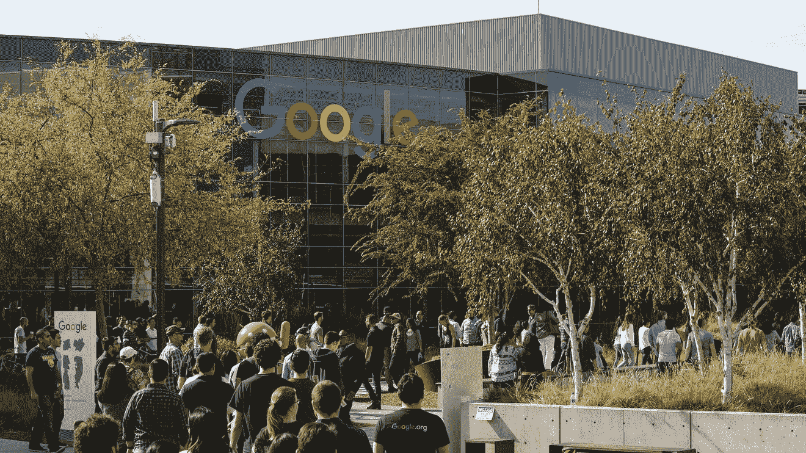
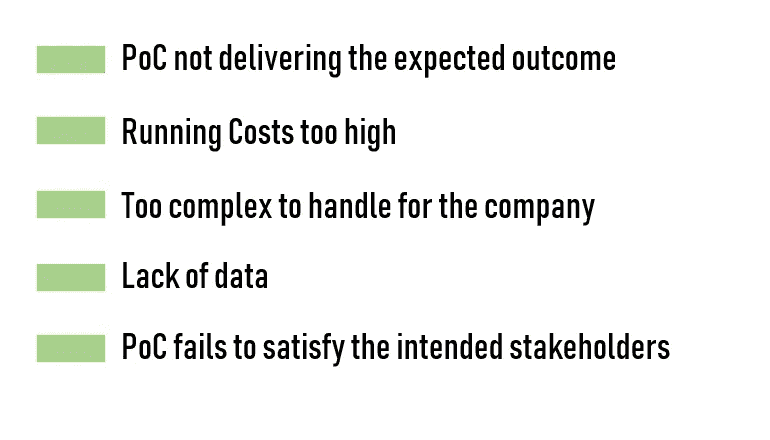

# 我是如何成为人工智能顾问的:面试问答

> 原文：<https://towardsdatascience.com/how-i-became-an-ai-consultant-interview-questions-answers-689ba03a2620?source=collection_archive---------4----------------------->

## 在 Medium 上发布了几个自由职业项目和文章后，我被邀请申请几个 AI 咨询工作。

[来源](https://proxy1.baaz.com/?url=http%3A%2F%2Fs.marketwatch.com%2Fpublic%2Fresources%2FMWimages%2FMW-HH878_Google_ZG_20190418102608.jpg&key=xjRgG3adzQt4oBKCuA-hLg)

在过去的几周里，我在埃森哲、Wavestone、谷歌和 IBM 面试了一个人工智能顾问职位，我非常喜欢它。因此，我决定写一些关于这次积极经历的东西。我将讨论我是如何准备的，提出在这个过程中我被问到的问题，并在最后分享一些帮助你被录用的技巧。

# 准备

我一直想为人工智能驱动的公司工作，然而，我意识到我更喜欢战略方面，而不是编码。事实上，我很感激必须了解客户的战略，公司面临的挑战和机遇，客户的数据和分析能力。理想情况下，通过将这些与对最先进的人工智能的理解相结合，顾问可以确定公司最重要的人工智能计划。尽管如此，每个人工智能顾问必须了解人工智能项目的所有步骤。因为我也有一份全职工作，所以我总共花了 2-3 个月来准备。在这个过程结束时，我收到了三份聘书。

> 因此，我需要为四个不同的领域做准备:编码、机器学习、系统设计和策略。

**在进入问题之前，我建议所有对成为人工智能顾问感兴趣的人理解下面提到的元素，因为你将在这些元素上受到挑战:**

*   使用分析算法和人工智能解决复杂业务挑战的能力
*   能够使用统计建模、机器学习和优化来设计、构建和部署预测性和规范性模型
*   能够使用结构化决策来完成项目。
*   能够管理整个 ML 项目，从业务问题识别、数据审计到生产中的模型维护。

除了技术方面，我被告知，人工智能顾问需要具备的真正技能是，当客户要求一件事但意味着另一件事时，能够读懂字里行间的意思，并从数据的角度进行战略思考……(如何建立稳固的数据网络效果，如何借助机器学习建立进入壁垒，等等。)

# 面试—第一部分(机器学习)

我的面试分为三个部分:机器学习、AI 策略和通用知识。以下是我必须回答的问题清单。

**1。回归和分类 ML 技术有什么区别？
回答:**回归和分类机器学习技术都属于**监督机器学习算法**。在监督机器学习算法中，我们必须使用带标签的数据集来训练模型，在训练期间，我们必须提供正确的标签，并且算法试图从输入到输出学习模式。如果我们的标签是离散值，那么这将是一个分类问题，例如 A，B 等。但是，如果我们的标签是连续值，那么这将是一个回归问题，例如 1.23，1.333 等。

**2。什么是辍学？**
**回答**:辍学是一种防止神经网络过度拟合的简单方法。它是神经网络中某些单元的缺失。这类似于自然繁殖过程，自然通过组合不同的基因(丢弃其他基因)而不是加强它们的共同适应来产生后代。

**3。什么是隐马尔可夫模型？**
**回答:** **隐马尔可夫模型** (HMMs) **是**一类概率图形**模型**，它允许我们**从一组观察变量中**预测一系列未知(**隐**)变量。一个简单的 **HMM** 的例子是根据某人穿的衣服类型(观察到的)预测天气(**隐藏**变量)。

**4。什么是模型精度和模型性能？**
**答案:**模型精度是模型性能的子集。模型性能对作为算法输入的数据集进行操作，并且模型精度基于模型性能的算法。

模型性能衡量模型正确预测示例的能力。准确性是分类模型的一种性能度量，它将正确分类的示例的数量与所有示例相关联。

**5。算法过拟合和欠拟合是什么意思？**
**答案:**过拟合和欠拟合是导致表现不佳的原因。
过拟合对训练数据表现良好，对其他数据泛化能力较差。
欠拟合在训练数据上表现不佳，但在其他数据上表现良好。与“好”模型相比，过拟合和欠拟合模型在新数据上都表现不佳。一个欠拟合的模型很可能不会表现出“对其他数据的良好推广”。

**6。对于物体识别问题，您更喜欢以下哪种数据扩充技术？**
**答案:**裁剪、改变光度、水平翻转、重缩放、缩放；深度学习模型实际上需要如此多的数据来训练模型。它非常需要数据。为了利用不同角度的物体来训练模型，我通常使用数据增强技术。

**7。机器学习有哪些不同的类型？**

**8。深度神经网络中的超参数是什么？
回答**:超参数是定义网络结构的变量。例如，学习率等变量定义了网络的训练方式。它们用于定义网络中必须存在的隐藏层数。
超参数的例子:
学习率，最大树深度，隐藏层数，…

**9。数据过度拟合是如何发生的，如何修复？
回答**:当统计模型或机器学习算法捕捉到数据的噪声时，就会发生过拟合。这导致算法在结果中显示出低偏差但高方差。

**10。如何防止过度拟合(说出并解释不同的技术)？
回答**:首先你要考虑型号选择(选择不太复杂的型号)。

其次，重要的是要知道交叉验证并不能防止过度拟合。然而，它可能能够检测过度拟合。它可以分割训练数据，以便生成多个小型训练测试分割。然后，这些分割可用于调整您的模型。向机器学习模型提供更多数据有助于更好地分析和分类。然而，这并不总是有效的。

很多时候，数据集包含分析不需要的无关要素或预测变量。这些特征只会增加模型的复杂性，从而导致数据过度拟合的可能性。因此，必须去除这种冗余变量。

机器学习模型是迭代训练的，这允许我们检查模型的每次迭代执行得有多好。但是经过一定次数的迭代后，模型的性能开始饱和。进一步的训练会导致过度适应，因此你必须知道在哪里停止训练。这可以通过提前停止来实现。

**正则化:**正则化可以用 n 种方法来实现，方法取决于我们实现的学习者的类型。例如，在决策树上执行修剪，在神经网络上使用丢弃技术，并且还可以应用参数调整来解决过拟合问题。

**集成模型:**集成学习是一种用于创建多个机器学习模型的技术，然后将这些模型组合起来以产生更准确的结果。这是防止过度拟合的最好方法之一。一个例子是随机森林，它使用决策树的集合来进行更准确的预测，以避免过度拟合。集成模型可以用于通过组合几个弱学习器来避免欠拟合。由于集合增加了最终模型的复杂性，因此容易过度拟合，您需要小心避免这种情况。

**11。激活功能的作用是什么？
答:**用于将非线性引入神经网络，帮助其学习更复杂的函数。没有它，神经网络将只能学习线性函数，该函数是其输入数据的线性组合。激活功能是人工神经元中基于输入传递输出的功能。

# 面试—第二部分(人工智能策略)

**1。在考虑实施人工智能解决方案之前，公司应该做些什么？** 组织需要涵盖当前业务和技术状态以及未来目标的数据策略。三个要素是关键:

*   *战略数据采集*
*   *统一数据仓库*
*   *确定数据值的过程*

**2。从战略的角度来看，一个公司应该如何开始他们的第一个 AI 项目？
答:根据** [**吴恩达**](https://landing.ai/ai-transformation-playbook/) **，**前几个 AI 项目成功的关键不是成为最有价值的 AI 项目。它们应该足够有意义，以便最初的成功将有助于公司熟悉人工智能，并说服公司的 C 级高管投资于进一步的人工智能项目；它们不应该小到别人会认为是微不足道的。

**3。你会如何描述“人工智能的良性循环”以及什么公司使用这种策略？** **答案:**产品→用户→数据→产品。最好的产品拥有最多的用户，而最多的用户通常意味着获得最多的数据，有了现代 ML，产品变得更好。优步&亚马逊(Alexa)已经实施了这一策略。

**4。为什么大部分 AI PoCs 达不到生产阶段？
答案:**

[来源](https://medium.com/predict/moving-ai-from-poc-stage-to-production-fc4b0908d0c4)

**5。你将如何帮助一家公司确定他们是否应该制造或购买一个人工智能解决方案？
回答:**这个决定主要取决于数据成熟度、对数据集的独家访问、内部数据科学家的存在、拥有人工智能模型的战略需求、预算和项目类型。在某些情况下，依赖外部服务提供商是不可行的(隐私问题)。如果一家公司不仅可以独家访问有价值的数据，而且他们的商业模式也依赖于这些数据，那么建立一个内部人工智能模型很可能是最佳策略。

**6。如果一家公司想要实施人工智能，你的第一步工作是什么？
回答:**明智的做法是，花时间一起确定一个与公司整体目标相关的人工智能用例。此外，在没有彻底评估数据的情况下，很难承诺一个工作模型。因此，如果没有最初的数据分析，很难估计人工智能项目的具体业务影响。

**7。你会如何对 C 级高管和员工进行人工智能教育？
回答:**不仅要建立 AI 解决方案，还要在公司创造真正的数据/AI 文化，这一点至关重要。人工智能战略团队应该由产品经理、数据科学家、业务开发人员和最终用户组成。除了实践经验之外，还可以通过现场课程和在线课程的结合来完成员工教育。

8.人工智能战略的五个核心组成部分是什么？
**答案:**AI 战略的核心组成部分是数据、基础设施、算法、技能和组织

**9。您将如何帮助一家小公司改进其数据战略？
回答:首先，发现公司的数据成熟度水平是关键。**通常，公司已经拥有解决业务问题所需的数据，但决策者根本不知道如何利用这些数据做出关键决策。公司可以通过具体说明他们需要解决的业务问题和机会来鼓励更全面地看待数据。此外，现有的 IT 体系结构可能会阻止孤立信息的集成，并且管理非结构化数据通常超出了传统 IT 能力的范围。

**10。如果一家公司缺少项目数据，你会向他们推荐什么？
回答:**很明显，要看项目性质。在探索技术解决方案之前，预先建立一个数据收集机制或者依赖开源数据可能是值得的。ML 有很多可用的数据，有些公司已经准备好免费赠送了。为了获得相关数据，与其他组织建立伙伴关系可能是有益的。

一般来说，机器学习算法越简单，它从小数据集学习的效果就越好。从 ML 的角度来看，**小的**数据需要具有低复杂性(或高偏差)的模型，以避免模型过度适应数据。我注意到朴素贝叶斯算法是最简单的分类器之一，因此可以从相对较小的数据集中很好地学习。

你也可以依靠其他线性模型和决策树。事实上，它们在小数据集上的表现也相对较好。基本上，简单模型能够比更复杂的模型(神经网络)更好地从小数据集学习，因为它们本质上试图学习更少。

对于非常**小的数据集**，贝叶斯方法通常是同类中最好的，尽管结果可能对你之前的选择很敏感**。**我认为朴素贝叶斯分类器和岭回归是最好的预测模型。

**当你没有足够的目标训练数据，源域和目标域有些相似但不完全相同时，就要考虑迁移学习技术。**

数据扩充意味着增加数据点的数量。就传统的行/列格式数据而言，这意味着增加行或对象的数量。最后，合成少数过采样技术(SMOTE)和改进的 SMOTE 是产生合成数据的两种技术。简而言之，SMOTE 获取少数类数据点，并创建位于由直线连接的任意两个最近数据点之间的新数据点。

# 面试——第三部分(常识)

此时，我只被问了三个问题:
**1。你能描述一下你最新的 AI 项目吗？
回答(取决于你过去的项目):**我不得不开发一个可以根据消费者上传的图片识别假货的解决方案。作为团队的一部分，我们使用迁移学习创建了一个基于定制深度学习 CNN 模型的解决方案。在项目期间，我们最大的问题是公司缺乏数据和可扩展性。我们依靠数据扩充技术和合成数据解决了这个问题。

**2。你能说出与人工智能相关的新商业模式吗？
回答:**一些的例子可以包括智慧城市&数据货币化、预测性维护和工业 4.0、联邦学习和医疗保健数据等。【 ***如果你认识其他人，请在评论里提及*** 】

**3。什么样的重大进化会影响人工智能的发展？
回答:**日益增长的人工智能民主化和低代码/无代码人工智能工具的发展可能会扰乱人工智能项目的管理方式。

# 外卖食品

*   人工智能顾问不仅仅是数据科学家。他们必须协助设计从需求到部署的整体系统，管理项目(项目管理技能)，并帮助提供能力建设方面的专业知识，以便 DevOps 团队的内部资源可以支持人工智能基础设施和代码。
*   我建议确保你理解基本概念，如偏差-方差权衡、过度拟合、梯度下降、L1/L2 正则化、贝叶斯定理等。
*   从商业的角度理解一个人工智能项目(KPI，长期目标，可扩展性等。)
*   你将面临挑战，挑战你以一种简单而精确的方式组织你的想法和呈现复杂概念的能力