# 我如何用 R 建立分类模型

> 原文：<https://towardsdatascience.com/how-i-build-a-classification-model-with-r-800acc975555?source=collection_archive---------30----------------------->

## 虹膜数据集的探索与分析

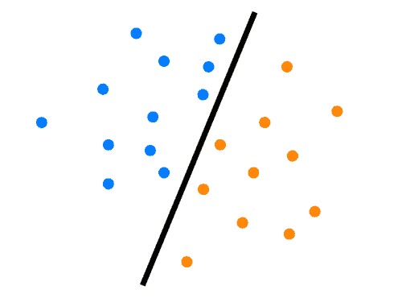

分类是机器学习的一个非常重要的领域，因为它允许您基于某些特征创建类别。它现在被用在很多领域，比如市场营销，我们可以根据访问者的购买欲望对他们进行分类。我们刚刚在[之前的一篇文章](https://medium.com/@martin.decombarieu/how-i-increased-the-conversion-rate-of-an-e-comerce-shop-4d0fa2bfc33b)中讨论过。

在这一个我们将采取一套花卉和他们的特点。我们将分析这些花的不同特征，并尝试看看它们是否相关。这将有助于我们创建一个分类模型，每次我们给出一种花的特征，我们就可以知道它是哪个物种。

对于这个分析，我们将使用一个[数据集](https://www.kaggle.com/uciml/iris)，它来自一个非常著名的数据集银行 Kaggle。这个索引了 150 种花，人们把它们与一个物种和一些特征联系起来。

# 特色展示

让我们看看通过使用 summary 函数可以在这个数据集中找到什么。

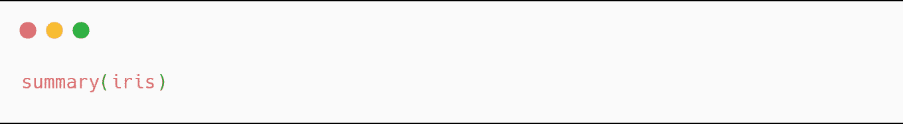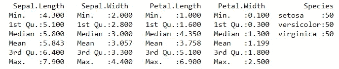

我们可以看到这里有三个不同的物种:Setosa，Versicolor 和 Virginica，每个物种有 50 个记录。我们还可以看到，与其他特征相比，花瓣长度特征具有非常高的范围。如果我们深入研究，我们可以说第一个四分位数和中位数之间的巨大差异可能是由一个具有非常小花瓣的物种造成的。够投机！让我们一起深入这个数据集。

# 发现歧视性特征

研究每个物种的**的哪个(些)特征以及在多大程度上区别对待**将会很有趣。为了做到这一点，我们将从分析每个物种与其他物种的关系开始，以确定其中一个特征是否不在平均值中。如果是这样，我们将更精确地分析这个特征。

## 濑户沙

我们将从分析 Setosa 的特征之一是否远离平均值开始。

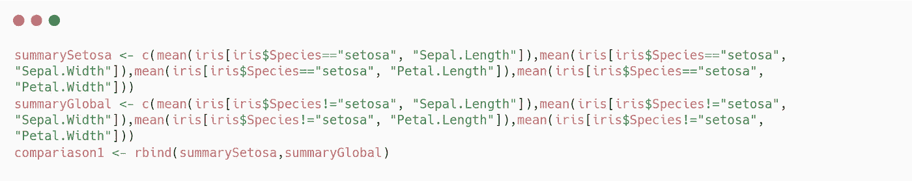

我们首先在一个变量和另一个变量中保存与刚毛藻属物种相关的特征的平均值，以及所有不是刚毛藻属的花。然后，我们可以绘制它。

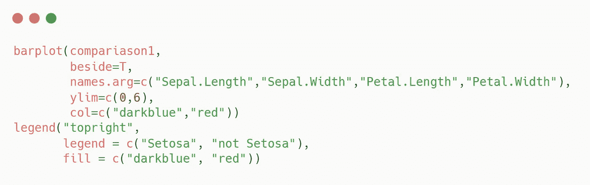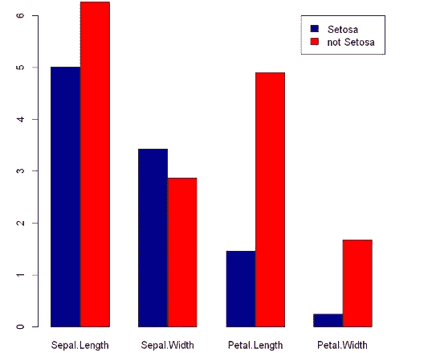

我们可以立即看到花瓣长度特征似乎歧视 Setosa。现在我们只分析这个特性。

让我们比较一下 Setosa 和所有花的花瓣长度分布。

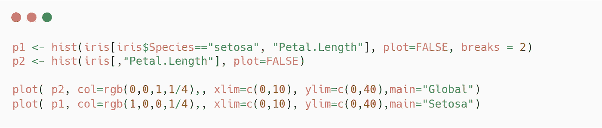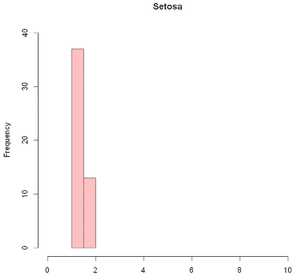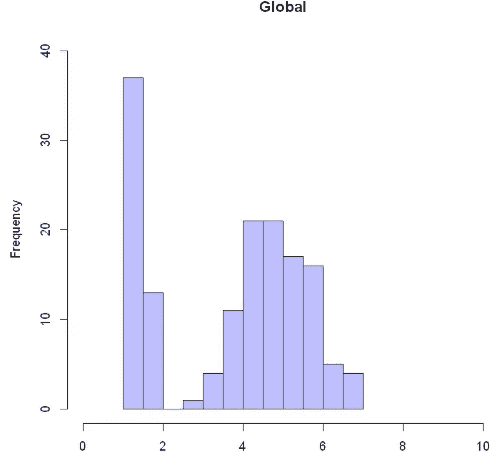

Setosa 的五分之一长度分布(红色)与全球五分之一长度分布(蓝色)

简直明目张胆！刚毛藻的花瓣比一般的花瓣要小得多。甚至似乎这种独特的特征歧视了我们这个物种。我们可以用 r 快速检查这些信息。

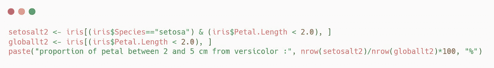

事实上，花瓣小于两厘米的花 100%都是刚毛花。

## 杂色的

让我们对云芝做同样的事情:

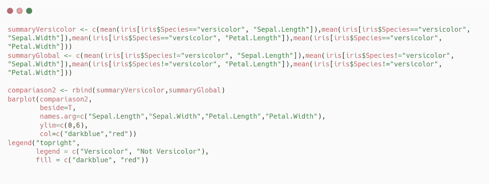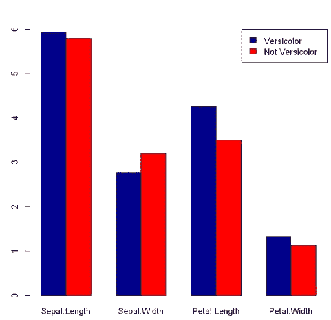

在这种情况下，我们可以看到，没有一个品种的平均特征偏离平均值太多。所以我们不会马上详细介绍这个物种。

## 弗吉尼亚

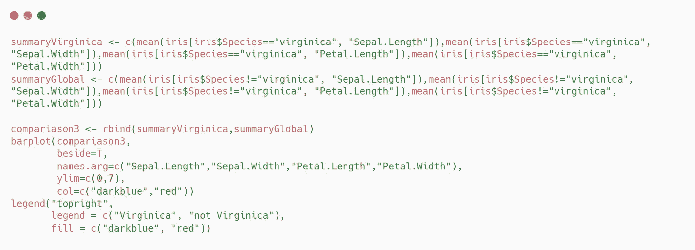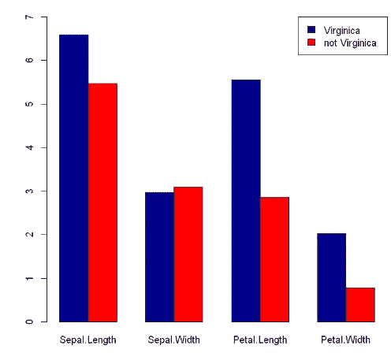

嗯，看起来海滨锦鸡儿花的花瓣数高于平均值，让我们分析一下海滨锦鸡儿花的花瓣长度在所有花中的分布。

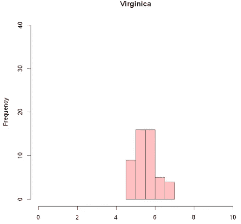

弗吉尼亚的五分之一长度分布(红色)与全球五分之一长度分布(蓝色)

正如我们所看到的，似乎具有大花瓣的数据集的虹膜主要是海滨鸢尾。我们可以通过观察花瓣大于 5 厘米的花的比例来验证这一点

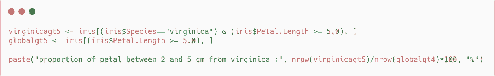

95.6%是海滨鸟，这个比例很大，让我们可以区分这个物种。

## 让我们回到云芝

正如我们所见，花瓣小于 2 厘米的花 100%是刚毛花，花瓣大于 5 厘米的花 95.6%是海滨花。所以顺理成章的是云芝介于两者之间。让我们来看看这个:

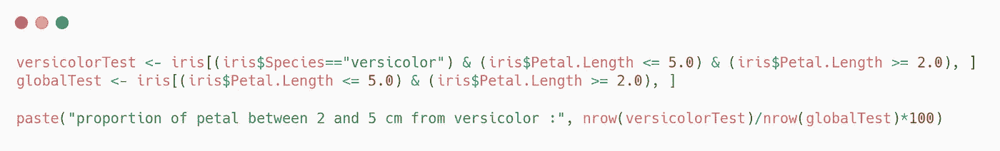

85%花瓣长度在 2 到 5 厘米之间的花是杂色花。

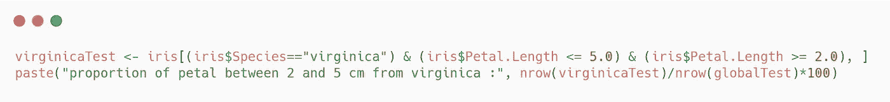

我们可以很快看到，缺少的 15%是在弗吉尼亚号上。

所以我们可以看到花瓣的大小是一个特征，似乎可以很好地区分所有的鸢尾物种。所以在我们建立模型的时候使用它是非常重要的。

# 特征之间的相关性

在这一部分，我们将试图找到相关性或去相关性。首先，我们将观察在同一物种中，某些特征是否会影响其他特征。然后我们将比较所有花的一些特征。

## 同一物种内的相关性

corrplot 函数允许我们拥有一个相关表。我们可以将这个函数应用到我们的数据集，方法是分离出同一物种的花朵。

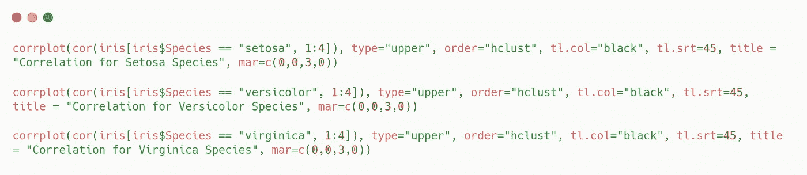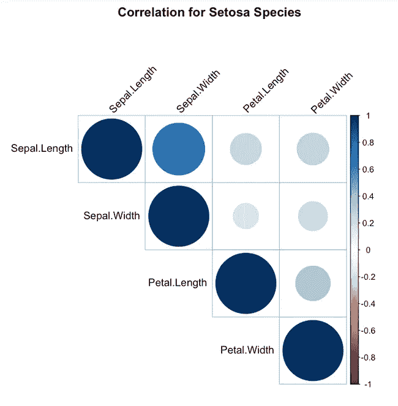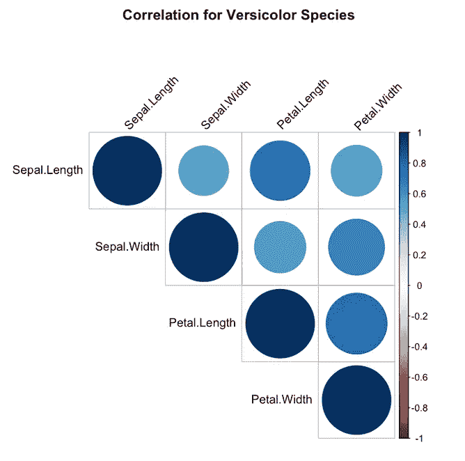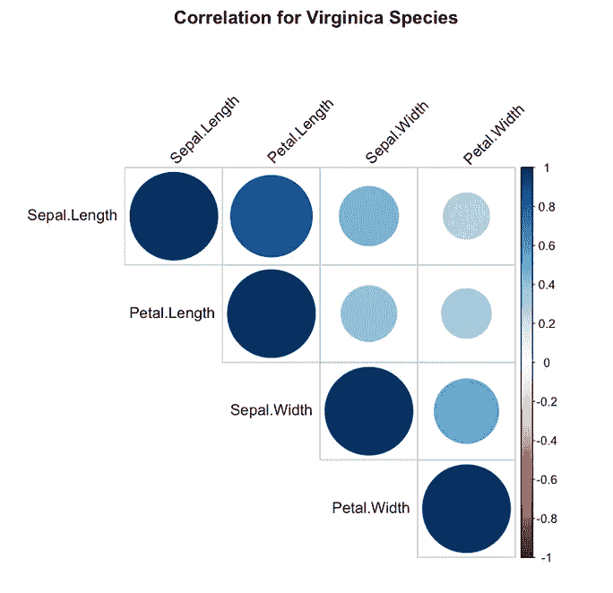

这些相关表允许我们做更多的分析:

*   首先，很明显，萼片大小的演变与萼片宽度的演变成正比(海滨锦鸡儿和刚毛锦鸡儿)。
*   我们还可以注意到更令人惊讶的事情:例如，在海滨锦鸡儿中，萼片的大小与花瓣的大小相关。

## 不同功能的比较

通过比较我们在这些花上的不同特征，并按物种对它们进行分类，我们将能够看到除了之前看到的花瓣大小之外，是否还有其他特征允许我们区分物种。

我们将根据萼片的宽度来显示其大小。我们将对花瓣做同样的处理，最后我们将根据萼片的大小显示花瓣的大小。

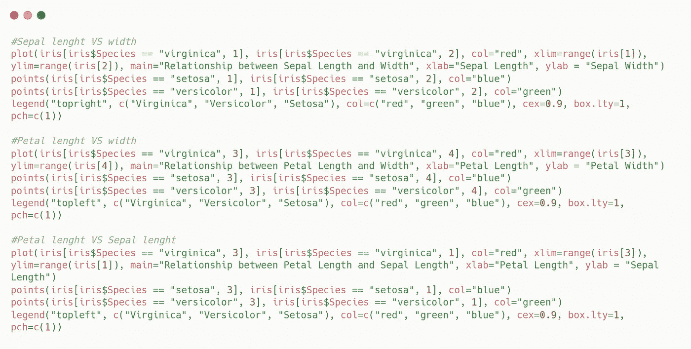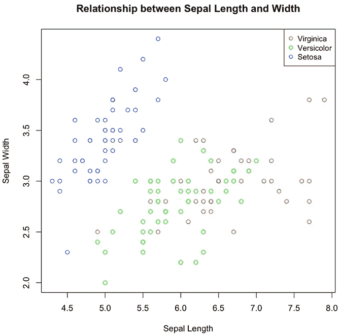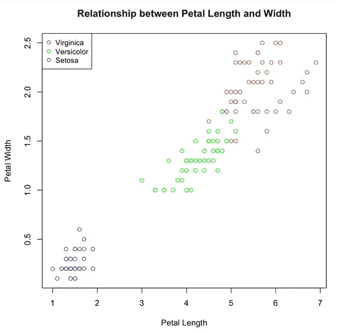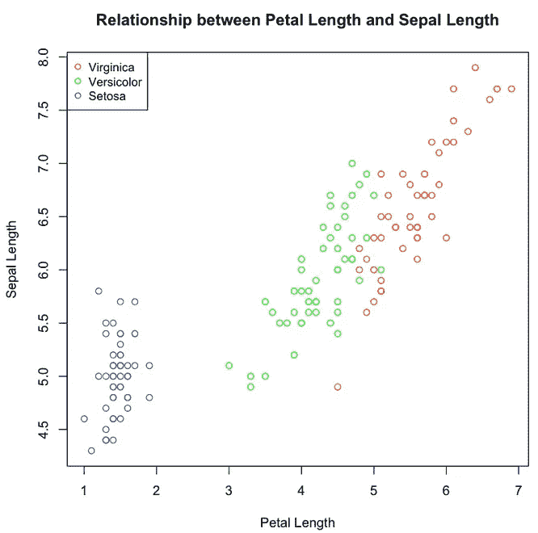

我们可以看到，第一张图不允许我们对物种进行分类，另一方面，另外两张图显示了物种之间相当清晰的分界线。刚毛藻的花瓣和萼片明显比其他种类的小。海滨种有最长最厚的花瓣和萼片。杂色种介于两者之间，与海滨种有些混合。在对不同的特征及其相互关系进行了长时间的分析之后，我们将能够建立一个模型，根据这些花的特征来猜测它们的种类。

# 构建分类模型

如果分析做得好，模型的创建和训练应该不会花太多时间。为此，我们将使用 Python，首先加载数据，区分标签和要素。然后，我们将构建两组数据，一组用于训练我们的模型，另一组用于测试它。最后，我们将训练我们的模型，并用测试数据集进行测试。

## 加载数据

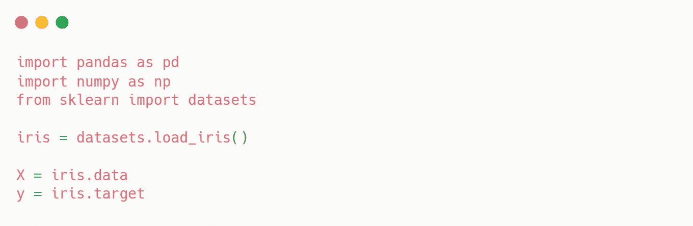

数据现已加载！
我们在一边有 X，它包含我们之前看到的特征，在另一边有 y，它包含花的物种名称，这是我们想要让我们的算法猜测的。

## 拆分数据

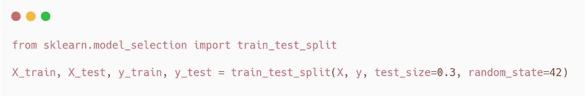

分割数据将允许我们在从未见过的数据上测试我们的模型。

## 缩放数据

缩放数据通常会产生更好的结果。我们用 sklearn 来做。

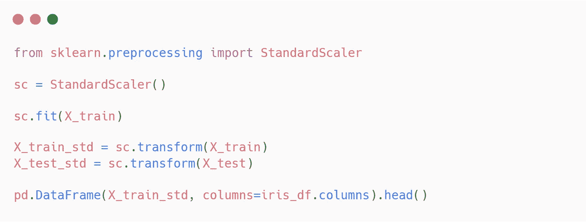

## 训练和测试我们的模型

因为班级被很好的分开，KNN 模式可能是一个很好的选择

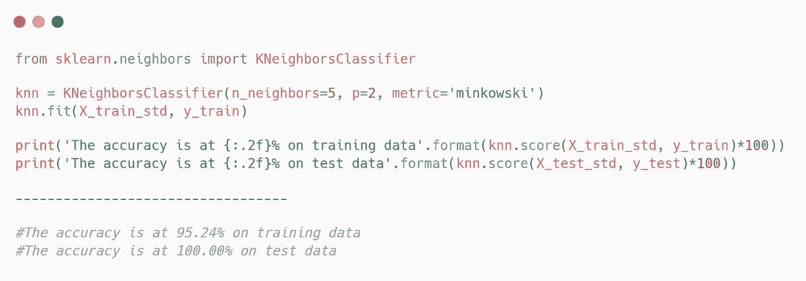

我们用这个模型得到了一些很好的结果！！

# 最后

我们可以通过一个简化的例子看到，为了获得一个好的分类模型，找到允许我们区分我们的类(这里是物种)的特征是很重要的。
只有四种不同的特征，我们能够在 95%的情况下预测花的种类。
因此，我们很容易想象像 [PlantNet](https://play.google.com/store/apps/details?id=org.plantnet&hl=fr) 这样的应用程序，通过它的智能手机，我们可以识别花卉的种类，使用更多的功能，并获得更多不同种类的精确数据。