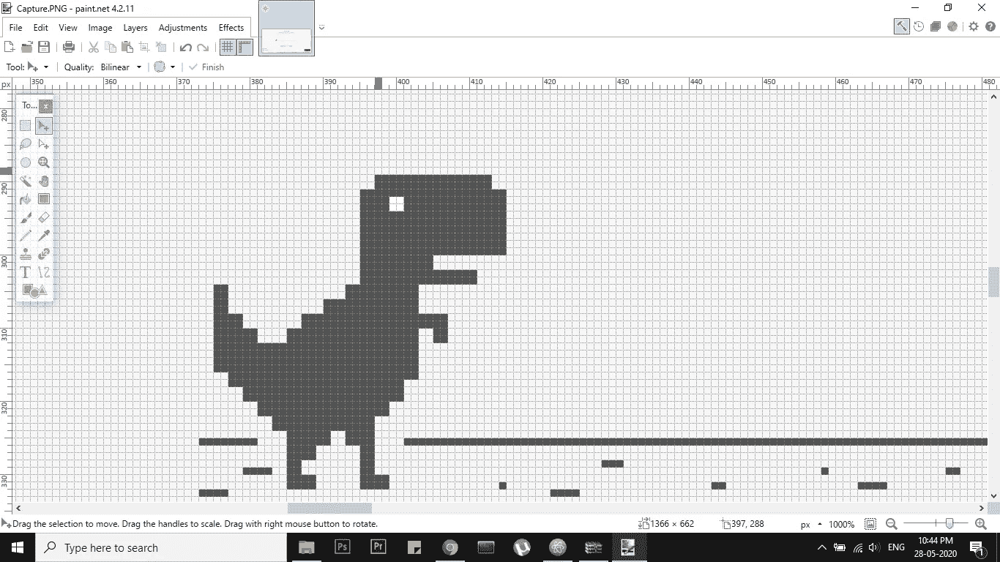
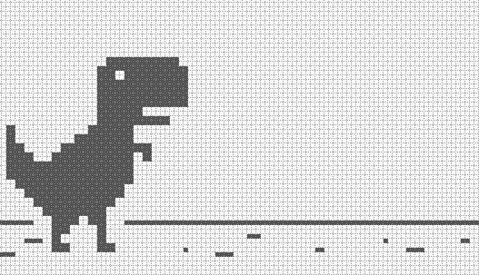

# 我是如何造出一个机器人来打败霸王龙的！

> 原文：<https://towardsdatascience.com/how-i-built-a-bot-to-beat-t-rex-run-3252a47cdcc6?source=collection_archive---------24----------------------->

这篇文章将解释从头开始构建你自己的机器人的一步一步的过程，它将无限期地玩谷歌的 T-Rex 游戏。


# **简介**

T-Rex run game 是一款我相信每个人都玩过的游戏，他们有一部手机或一台装有谷歌 Chrome 的笔记本电脑，但没有连接互联网。对于那些不知道的人，只要关掉手机或笔记本电脑的互联网连接，打开任何一个使用谷歌浏览器的网站，你就可以玩霸王龙快跑了！游戏的基本目标是跳跃或闪避障碍物，让你的恐龙活着。然而，作为人类，我们可能会感到无聊或分心，可能会失去游戏。为了最大限度地打败这个游戏，我们需要一个极度专注的人，一个不会被这个世界上的任何事情分心的人，一个像机器人一样的人！

在这里，我将教你如何构建一个简单的机器人，它将为你玩霸王龙奔跑的游戏，而你可以安静地坐着看它玩(虽然这违背了任何游戏的全部目的，但它只是为了好玩)。

# **先决条件**

我将使用图像处理库在 python 中构建这个机器人。首先，您需要在 PC 或笔记本电脑上安装 Python 3.6 或更高版本。这是你需要安装的库的列表—

1.  pyautogui——这是一个具有与 T-Rex 运行 gui 交互功能的库
2.  PIL——PIL 图书馆用于获取屏幕截图并对其进行图像处理
3.  时间——用于给出跳跃之间的不同延迟

这些库可以使用命令“pip install <libary name="">”进行安装。w3schools 上有大量关于使用 pip 和其他命令以及使用 python 的基础知识的文档。这是它的链接——[https://www.w3schools.com/python/python_pip.asp](https://www.w3schools.com/python/python_pip.asp)</libary>

然后，我们通过以下代码片段将我们的先决条件加载到我们的代码中—

```
import pyautogui
from time import sleep
from PIL import ImageGrab,ImageOps
```

# **逻辑**

现在，进入文章的主要部分。所以我们在建造机器人时遵循的基本逻辑是模仿人类玩游戏的方式。一个人看到了障碍，并试图为恐龙跳跃计时以避开障碍。对于我们的机器人，我们将做同样的事情。基本上，这里我们截取了霸王龙游戏屏幕的截图，并检查图像中树或鸟障碍物的位置，如果障碍物足够靠近恐龙(使用代码中定义的阈值定义)，我们会要求恐龙跳跃

我正在使用这个我随机找到的网站，这是同一个霸王龙游戏，但在互联网上——[http://www.trex-game.skipser.com/](http://www.trex-game.skipser.com/)。

第一步是获取游戏网页的屏幕截图，并定位恐龙的精确像素值。我们找到恐龙的顶角和底角像素值。这可以通过将图像导入 paint.net 并找到像素值来完成。另外，如果你注意到，恐龙的位置是不变的，只有障碍物在向它移动。因此，我们采用这种方法，根据恐龙相对于向前移动的障碍物的静态位置，在恐龙上创建一个动作。下图显示了我们如何使用标尺和网格视图获得恐龙图像的像素位置。通常一幅图像中所有像素值的总和是一个数，如果图像不变，总和总是保持不变。我们将牢记这一点，并在接下来的几段中解释为什么这很重要。



类似地，当一棵树、一只鸟和重放按钮出现时，我们截取游戏的屏幕截图，并记下其像素位置。这不是现在所要求的，但是在将来会很有帮助。

# **功能和编码**

在这个游戏中有 5 个不同的对象-恐龙，树 1，树 2，鸟和重播按钮，如果你崩溃了。你可以使用我为每个字符使用的像素位置值。为了简单起见，我使用了一个类定义来保存这些值。这是如何看起来—

```
class coordinates():
    replay=(353,388)
    tree1=(195,416) 
    tree2=(245,433) 
    bird=(155,379)
    dino=(170,391)
```

下一步是实际编写这段代码的逻辑。我们为不同的过程或目标创建不同的功能。

首先，我们创建一个函数，它将捕获游戏中的每一帧或截取每一帧的屏幕截图，以便对其进行处理。就像人类玩游戏时如何看待游戏一样，机器人也需要使用截图来看待游戏。这显示在下面的代码片段中。

```
def imagegrab():
    box=     (coordinates.dino[0]+20,coordinates.dino[1],coordinates.dino[0]+100,  coordinates.dino[1]+30) image = ImageGrab.grab(box)
    grayimage = ImageOps.grayscale(image)
    a = array(grayimage.getcolors())
    return a.sum()
```

在上面的函数 imagegrab()中，我们获得恐龙的坐标，并在它周围创建一个框。基本上，盒子是一个矩形，每个角有 4 个像素位置值，恐龙在盒子里面。盒子在恐龙的右边有一些开放的空间。然后，我们对盒子进行截屏，盒子的行为就像我们创建跳跃或闪避动作的逻辑一样。这里的基本逻辑是，如果一棵树或一只鸟进入盒子，恐龙被要求分别跳跃或躲避。

但是机器人实际上看不到屏幕截图或者盒子里面发生了什么。机器人只能看到和读取像素。因此，正如上一节所暗示的，我们计算盒子中所有像素的总和。由于恐龙和盒子的图像是恒定的，并且恐龙没有移动，所以盒子中的像素总和总是返回一个常数。但是，如果一棵树或一只鸟进入盒子，总和值实际上会根据像素值增加或减少，这时机器人会得到跳或蹲的提示。下图取代了屏幕截图或框的外观。



一旦我们有了恐龙和盒子的图像，我们就将盒子转换成灰度以增加我们的处理，因为颜色在这里不是一个重要的因素，因为我们只需要计算盒子中像素值的总和。

我们写的下一个函数是跳转函数，它基本上是当一棵树出现时要求机器人跳转。Puautogui 库用于模拟键盘控制，使机器人能够与游戏互动。

类似地，编写了一个 duck 函数。你可以在这里阅读更多关于 pyautogui 的信息——https://pyautogui.readthedocs.io/en/latest/keyboard.html

```
def jump():
    pyautogui.keyDown('space')
    sleep(0.05)
    pyautogui.keyUp('space')
    sleep(0.05)def duck():
    pyautogui.keyDown('down')
    sleep(0.05)
    pyautogui.keyUp('down')
    sleep(0.05)
```

我们写的下一个函数是重启游戏。如果偶然机器人失败(非常低的机会)，它应该自动重新启动，没有人类的帮助。我们使用重放按钮坐标并模拟在该位置的点击。下面是它的代码片段。

```
def restart():
    pyautogui.click(coordinates.replay)
```

一旦完成了所有的函数，我们就可以编写并运行我们的主函数了。下面的代码片段显示了 main 函数。

```
def main():     
     restart()
     while True:
         imagegrab()
         if(imagegrab()!=2646):
             jump() 
             sleep(0.001)If __name__=="__main__":
     main()
```

# **结果**

这就是机器人无限期运行的方式，也是我们击败霸王龙运行游戏的方式。这个逻辑也可以用在许多不同的游戏中，也就是使用像素值总和的逻辑。我们应该始终考虑到机器人只能看到像素，其他什么也看不到。对于未来的范围，我们实际上可以使用 OpenCV 和其他图像处理技术动态地计算和找到树和鸟的位置值(我计划在我的下一篇博客中介绍)。

感谢您的时间，希望它是有益的。