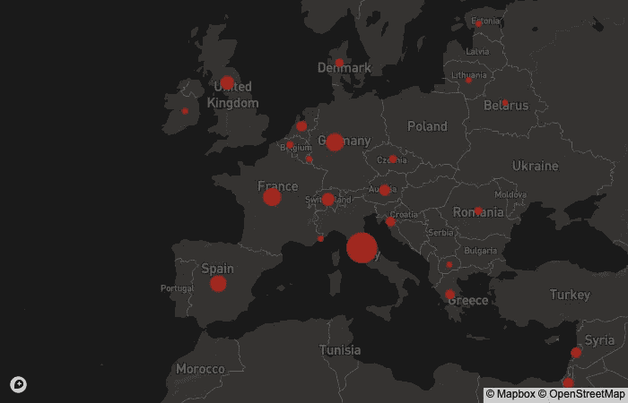
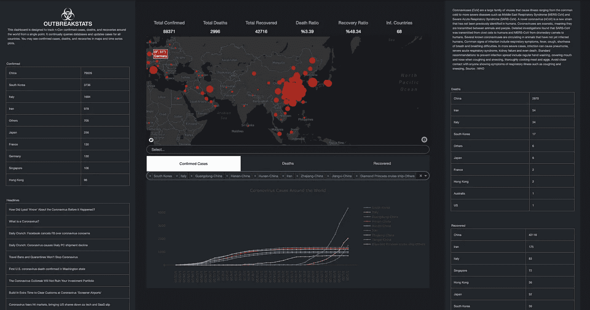

# 在陷入欧洲最严重的冠状病毒爆发后，我如何用 Dash 和 Plotly 建立一个仪表板

> 原文：<https://towardsdatascience.com/how-i-built-a-dashboard-with-dash-and-plotly-after-being-stuck-in-europes-worst-coronavirus-dc41aaeeca4b?source=collection_archive---------26----------------------->

如果你正在阅读这篇文章，我确信我们有着相似的兴趣，并且现在/将来会从事相似的行业。那么我们就通过 [*Linkedin*](https://linkedin.com/in/orhangaziyalcin/) *来连线吧！请不要犹豫发送联系请求！*[*Orhan g . yaln—Linkedin*](https://linkedin.com/in/orhangaziyalcin/)

此外，许多问题导致我们创建了一个用于冠状病毒更新的 Instagram 页面。您可以关注我们的每日更新: [OUTBREAKSTATS](https://www.instagram.com/outbreakstats)

***冠状病毒(新冠肺炎)的爆发已经以这样或那样的方式影响了每个人的生活。确诊人数在 10 万左右，死亡总人数超过 3000 人。出现确诊病例的国家数量接近 70 个。另一方面，比病毒更可怕的是。疫情爆发的成本已经达到数万亿美元，经济学家正在谈论全球经济衰退。这对 2020 年来说肯定不是一个好的开始。***

米兰多摩爆发前后(来源:Unsplash)

# 意大利北部爆发电晕

因此，从中国到美国，从挪威到澳大利亚，我们到处都能看到冠状病毒的影响。然而，从统计数据来看，如果你生活在某些国家，你面临的风险更大，不幸的是，我经历了更严重的风险，因为我生活的城市[博洛尼亚](https://en.wikipedia.org/wiki/Bologna)位于意大利北部，那里的疫情是欧洲最严重的。不幸的是，意大利的确诊病例总数已经超过 2000 例。

LN 转型的欧洲现状(来源: [OutbreakStats](http://https.//www.outbreakstats.com) )

作为一个不得不远离公众的人，我有一些空闲时间，相信我，我用大部分时间搜索冠状病毒爆发的最新进展。这种可怕的情况给了我在最坏的情况下做最好的事情的想法。

# 查找最新冠状病毒爆发数据的困难

搜索冠状病毒爆发统计数据是一项繁琐的工作，因为每次我都必须访问多个来源，以了解正在发生的事情。经过一番紧张的研究，我发现约翰·霍普金斯大学系统科学与工程中心发布的疫情数据每天更新。然而。csv 格式使得每次都难以获得有意义的见解。这就是为什么我们有数据可视化这个学科。

确认的冠状病毒病例表(可在 [CSSE](https://github.com/CSSEGISandData/COVID-19/tree/master/csse_covid_19_data) 获取)

## 用 Plotly 和 Dash 实现数据可视化

我在自我隔离期间所做的另一件事是在阴谋和破折号方面超越我的知识。

Plotly 是一个交互式 Python 数据可视化库。您可以使用 iPython 在几秒钟内生成漂亮的交互式图形。从 CSV 文件中提取见解是非常好的。有人可能会说，Plotly 是一个花哨的 [Matplotlib](https://matplotlib.org/) 。与纯 Javascript 数据可视化库相比，使用 Plotly 的一个缺点是无法与其他人共享它，因为它使用 Python，一种后端语言(*附:你可以通过这篇* [*文章*](https://blog.bitsrc.io/11-javascript-charts-and-data-visualization-libraries-for-2018-f01a283a5727) 了解更多关于 Javascript 数据可视化库的信息)。

当我在想我不可能是唯一一个看到这个缺点的人时，我发现了 Dash。这些库背后的公司 Plotly 对 Dash 解释如下:

> “Dash 平台使数据科学团队能够专注于数据和模型，同时制作和共享基于 Python 和 R 模型的企业级分析应用。通常需要一个后端开发团队、前端开发团队完成的工作，都可以通过 Dash 来完成。”[ [阴谋地](https://plot.ly/dash/)

我非常同意这种说法。多亏了 Dash，无论是后端还是前端，你都没有深入的知识。要构建和发布仪表板，Dash 和 Plotly 方面的知识就足够了。

## 对于这项任务，我的资历过高

另一方面，在过去的三个月里。我完成了三门 Udemy 课程:

*   [Python 和 Flask Bootcamp:使用 Flask 创建网站！何塞·波尔蒂利亚](https://www.udemy.com/share/101uGQCUQYcFlWR3w=/)
*   [React —完整指南(包括挂钩、React 路由器、Redux)](https://www.udemy.com/share/101WayCUQYcFlWR3w=/)Maximilian Schwarzüller 著
*   [何塞·波尔蒂利亚设计的带有 Plotly 和 Dash 的交互式 Python 仪表盘](https://www.udemy.com/share/1021eICUQYcFlWR3w=/)

有趣的是，Dash 构建在 Flask 之上作为后端，ReactJS 作为前端，并使用 Plotly 作为数据可视化工具。尽管我不需要了解 React 和 Flask，但当我试图弄清楚 Dash 背后的逻辑时，它还是派上了用场。因此，我想，作为一个被困在病毒爆发中并拥有新技术知识的人，为什么不利用我最近获得的技术知识来创建一个关于我这些天日常生活的仪表板呢？仪表板的想法对我来说是唯一的“在最坏的情况下做最好的事情”的想法。因此，我在以下来源的帮助下构建并发布了 [OutbreakStats](https://www.outbreakstats.com) 仪表板:

# 我用于仪表板的来源

## **数据库**

*   [CSSE 新冠肺炎数据集](https://github.com/CSSEGISandData/COVID-19/tree/master/csse_covid_19_data)(每日更新)

## 新闻更新

*   [新闻 API](https://newsapi.org/)

## 等值区域图

*   [地图框](https://www.mapbox.com/)(您可以使用 Plotly 和 Dash 内的地图框地图)

## 技术知识:

*   [何塞·波尔蒂利亚设计的带有 Plotly 和 Dash 的交互式 Python 仪表盘](https://www.udemy.com/share/1021eICUQYcFlWR3w=/)

## 计算机网络服务器

*   [Heroku](https://www.heroku.com) (免费升级 [Github 学生包](https://www.heroku.com/github-students))
*   [突进部署指南](https://dash.plot.ly/deployment)

## 主题

*   [破折号示例下的外汇网上交易主题](https://dash-gallery.plotly.host/Portal/)

## 集成驱动电子设备

*   *对于阴谋地洞察发现:* [Jupyter 笔记本](https://jupyter.org/)
*   *对于 Dash app:* [Visual Studio 代码](https://code.visualstudio.com/)

# 我对《阴谋与破折号》的思考

我之前和 Plotly 合作过，在 [Upwork](https://www.upwork.com) 和 [Fiverr](https://www.fiverr.com) 平台上做过一些自由职业者的工作。与 Matplotlib 和 [Seaborn](http://seaborn.pydata.org) 相比，我的客户喜欢这个结果，因为 Plotly 也提供了交互性。能够发表我在 Plotly library 完成的工作是我学习 Dash 的主要动机。

*到目前为止，我对 Dash 的体验如下:*

[Flask 是一个轻量级的 Python Web 框架](https://flask.palletsprojects.com/)

Dash 严重依赖 Flask，它几乎可以作为一个 Flask 应用程序。不可避免的会注意到 Dash 和 Flask 的相似之处。在 Dash app 中，构建仪表盘有两种组件类型:[核心组件](https://dash.plot.ly/dash-core-components)和 [HTML 组件](https://dash.plot.ly/dash-html-components)。

## 核心组件

> Dash 为交互式用户界面配备了增压组件。由 Dash 团队编写和维护的一组核心组件可在 dash-core-components 库中找到。[ [仪表板文档](https://dash.plot.ly/dash-core-components)

使用核心组件，您可以创建(i) Plotly graphs 和(ii)React 组件，如下拉菜单、滑块、输入。核心组件就像相对复杂的 React 组件，你可以在 [Semantic-UI-React](https://react.semantic-ui.com/) 或 [Material-UI](https://material-ui.com/) 中找到。不同之处在于，您使用 Python 将这些组件添加到您的仪表板中。不需要前端技能🥳.

## HTML 组件

> Dash 是一个 web 应用程序框架，围绕 HTML、CSS 和 JavaScript 提供纯 Python 抽象。仪表板文档

这些组件呈现基本的 HTML 标签，如

、

、。同样，不同之处在于您使用 Python 来添加这些组件。因此，你甚至不需要知道 HTML 就可以构建一个 Dash 应用。不需要标记语言技能🎉🍾。

## 其他观察

要添加自定义的 javascript、CSS、图片文件，你所要做的就是创建一个文件夹(*必须命名为* ***资产*** )并将所有文件存储在这个文件夹下。它们不需要任何导入或配置设置就可以工作，因为 Dash 已经这样配置了。

## 最后的想法

Dash 是一个 Flask 应用程序，专门为创建仪表板而定制。因此，你不必考虑每一个小细节，因为它们已经被 Dash 团队配置好了。只要您坚持使用文档来创建您的仪表板，开发过程就非常容易和快速。然而，如果你想定制应用程序并添加新功能，使其不仅仅是一个仪表板，可能会有缺点。

# 结论

我希望你喜欢这篇博文。在我以前的文章中，我通常分享我的源代码，因为它们更像是一个教程，而不是一篇博客文章。在本文中，我试图向您展示一种构建仪表板并为公众服务的方法。你可以在 [OutbreakStats](https://www.outbreakstats.com) 访问我为冠状病毒爆发数据创建的网站，这里有一个预览:

[OutbreakStats](https://www.outbreakstats.com) 仪表盘的预览

因此，生成仪表板代码取决于您的想象力。如果你仔细地遵循我在这篇文章的仪表板部分使用的资源，你甚至可以在一天内轻松地构建你自己的仪表板。

# 订阅邮件列表获取完整代码

如果你想在 Google Colab 上获得完整的代码，并获得我的最新内容，请订阅邮件列表:✉️

> [立即订阅](http://eepurl.com/hd6Xfv)

# 喜欢这篇文章

如果你喜欢这篇文章，可以考虑看看我的其他文章:

 [## 使用 MNIST 数据集在 10 分钟内完成图像分类

towardsdatascience.com](/image-classification-in-10-minutes-with-mnist-dataset-54c35b77a38d)  [## 利用生成性对抗网络在 10 分钟内生成图像

### 使用无监督深度学习生成手写数字与深度卷积甘斯使用张量流和…

towardsdatascience.com](/image-generation-in-10-minutes-with-generative-adversarial-networks-c2afc56bfa3b)