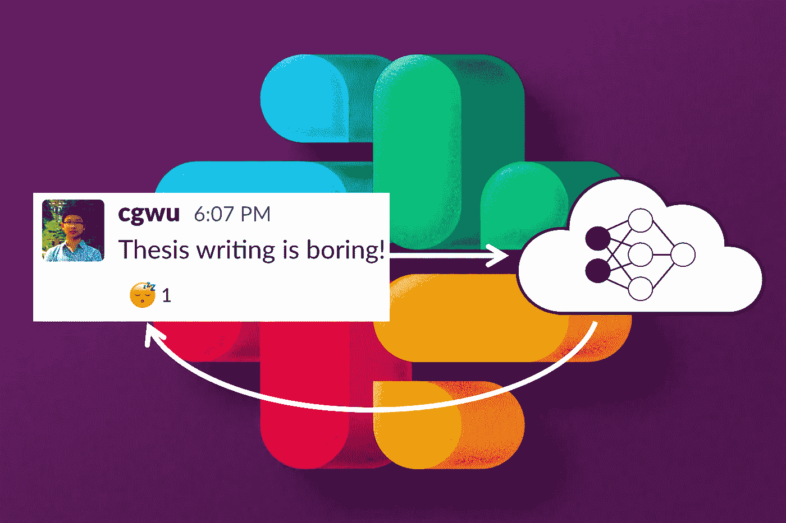
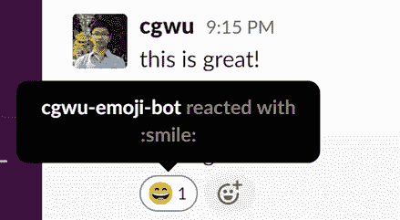
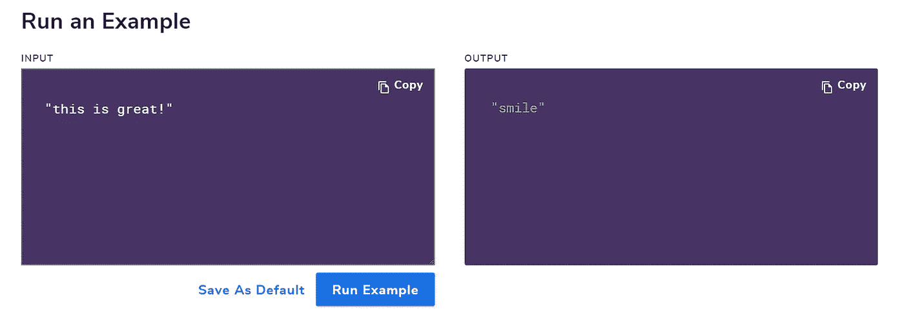

# 我如何建立一个深度学习的表情符号 Slackbot😄 😖 😉

> 原文：<https://towardsdatascience.com/how-i-built-a-deep-learning-powered-emoji-slackbot-5d3e59b76d0?source=collection_archive---------21----------------------->

## 还有为什么 AI 难的部分和 AI 没关系

[晨酿](https://unsplash.com/@morningbrew?utm_source=medium&utm_medium=referral)在 [Unsplash](https://unsplash.com?utm_source=medium&utm_medium=referral) 上拍摄，作者编辑

当我在加州大学伯克利分校完成我的计算机系统博士论文时，我经常想知道人工智能世界的生活是什么样的。我的人工智能朋友们不断吹嘘深度学习将如何彻底改变从医学到网上购物的一切——他们的论文一经发布就获得了 100 次引用(见鬼！).但我一直很好奇他们到底是怎么用 AI 解决现实问题的。

与此同时，我最近注意到，我把大部分时间都花在了回应无聊的对话上。受到最近一篇[博客帖子](https://zapier.com/blog/how-to-build-chat-bot/)(经历了许多论文写作冷漠)的启发，我决定构建并部署一个深度学习驱动的 Slackbot，用最合适的表情符号自动添加对 Slack 帖子的反应。😃 👍

在这篇文章中，我回顾了我构建这个由 [DeepMoji](https://github.com/bfelbo/DeepMoji) 驱动的 Slackbot 的经历。我最终使用两种不同的框架部署了 deep moji(AWS[sage maker](https://aws.amazon.com/sagemaker/)和 [Algorithmia](https://algorithmia.com/) )。在这里，我比较了我使用这两个系统的经验，强调了预测服务系统的一些优势、局限性和改进的机会。这篇文章非常高级，但是[这个库](https://github.com/cw75/torchMojiBot)有详细说明和代码的链接来复制我的 Slackbot。

就我个人而言，过去几年我一直致力于可扩展的云系统。我特别兴奋地投入到这项任务中，因为我们最近花了一些时间思考[可扩展预测基础设施](https://medium.com/@vsreekanti/real-time-prediction-serving-simplified-850d9cbaddd4)。也就是说，我肯定不是人工智能系统的专家，所以如果我错过了什么，请告诉我。

# 步骤 0:设置 Slackbot

设置一个 Slackbot 相当简单，但是需要在 Slack 网站上点击很多次。我在这里用一些屏幕截图记录了这个过程[，但在高层次上，我创建了一个机器人，将它链接到我的工作区，并授予它查看消息和添加表情符号反应的权限。](https://github.com/cw75/torchMojiBot/tree/master/slack)

下一步:选择一个机器学习模型，让我的 Slackbot 能够用表情符号对文本做出反应！

# 步骤 1:在我的笔记本电脑上运行一个模型

那么我应该调用什么人工智能魔法呢？我没有训练模型的数据，但幸运的是，我可以重新利用大量预先训练好的模型。我的人工智能同事告诉我，这是模型设计的一个新兴趋势:从一个现有的模型开始，根据你的任务对它进行微调。在我的例子中，DeepMoji 模型正是我所需要的，并且已经被训练和开源。

对于一点点上下文，DeepMoji 在 12 亿条带有表情符号的推文中进行了训练，以理解语言情绪以及它如何与表情符号相关联。我的用例非常简单:向模型发送一条松弛的消息，并用模型认为最能反映消息情绪的表情符号做出反应。

坏消息:DeepMoji 用的是 Python 2(恶心)。好消息:HugginFace 的优秀人员开发了 [torchMoji](https://github.com/huggingface/torchMoji) ，这是 DeepMoji 的 PyTorch 实现，支持 Python3。torchMoji 代码库有一个 bug，我必须修复它才能正确解析`PackedSequence` PyTorch 对象。工作版本可在我的叉子[这里](https://github.com/cw75/torchMoji)获得。这一部分只需要一台笔记本电脑，所以如果你有兴趣的话，你可以在家跟进。

随着 bug 的修复，获得**训练过的模型是很容易的**。首先，我将 torchMoji 作为一个包安装:

`pip3 install git+https://github.com/cw75/torchMoji`

我需要模型权重和词汇文件来初始化模型。词汇文件已经在 repo 中了([这里是](https://github.com/cw75/torchMoji/blob/master/model/vocabulary.json))。为了下载权重，我运行了:

`python3 scripts/download_weights.py`

既然已经下载了所有的先决条件，那么做一个预测只需要几行 Python 代码:

您可以测试它以确保一切正常:

相当酷！我甚至不需要得到一个图形处理器。

下一步:用我的 Slackbot 可以调用的 REST web 接口把它变成一个预测服务！

# 步骤 2:建立预测服务

在这种情况下，服务预测是系统的挑战；让这个机器人真正工作的操作引擎。重要的问题是预测服务应该放在哪里？

一个简单的解决方案是将我上面写的预测脚本包装在一个 [Flask](https://github.com/pallets/flask) 服务器中，并使用一个类似 [ngrok](https://ngrok.com/) 的工具在我的笔记本电脑或 EC2 实例上生成一个 REST 端点。问题是，我想将这个机器人部署到我实验室的 Slack 团队中，这样每个人都可以玩它，所以这个机器人需要始终在线并且可伸缩。

所以我需要一些真实的东西，作为一名系统黑客，我的一部分想要从头开始构建服务:将我的脚本打包成一个 [Docker](https://www.docker.com/) 映像，启动一个 [Kubernetes](https://kubernetes.io/) 集群，并通过 AWS [ELB](https://www.amazonaws.cn/en/elasticloadbalancing/) 公开 REST 端点。

另一方面，作为一名研究人员，我不想重新发明轮子，我知道像谷歌、亚马逊和微软这样的云提供商都提供预测服务。第一个想到的平台是 AWS SageMaker，这是 AWS 上的一项托管服务，涵盖了从模型开发到部署的整个机器学习生命周期。该团队在 SIGMOD'20 上发布了一篇关于 SageMaker 的[论文](https://ssc.io/pdf/modin711s.pdf)，我多年来一直在使用 AWS 服务进行研究，所以我认为这一定是合理的。我没有意识到我正步入深渊……

## 平台 1:亚马逊 SageMaker

我原以为在 SageMaker 上部署模型会很简单。我已经有了一个 Python 依赖列表和上面显示的预测脚本。我想做的只是将脚本、依赖项和模型上传到 SageMaker，创建一个 REST 端点，并将其连接到 Slackbot。

但是唉，没有办法上传一个模型到 SageMaker。相反，我必须构建一个 Docker 映像，其中安装了我所有的 Python 依赖项。我还必须编写一个 Flask 服务器来包装我的预测脚本，并响应 SageMaker 的健康检查和模型调用请求——你可以在这里看到文档，在这里看到 docker file，在这里看到我的 Flask 服务器。这并不复杂，但如果我不熟悉 Docker 和 Flask，这可能需要我一段时间才能弄明白。

> 我用 Docker 已经很多年了，但是我在 AI 的朋友对它不是很了解。你如何看待 Docker:建造容器是人工智能的最高水平吗？人们精通它吗？

我开始想知道 SageMaker 为我做了什么。如果我做了所有这些，为什么不运行我自己的 Kubernetes 集群呢？这甚至可能更简单，因为 Kubernetes 会自动为我进行健康检查！

SageMaker 与 DockerHub 不兼容，所以一旦我构建了 Docker 映像，我就必须将它推送到亚马逊自己的 Docker 注册表— AWS [ECR](https://aws.amazon.com/ecr/) (弹性容器注册表)。接下来，我创建了一个提取 Docker 图像的 SageMaker 模型和一个使用我的模型的 SageMaker“端点”。这需要选择节点类型(`ml.m4.large`)和集群大小。最后，我可以创建我的 REST 端点！

在等待我的服务开始 10 分钟后，我激动地看到状态从“正在创建”变为“正在服务”，并带有一个绿色的勾号。✅真棒！我将端点 URL 复制粘贴到我的 Slackbot 配置中，准备让实验室中的每个人眼花缭乱。然后……Slack 吐出了这个错误:

`**Your URL didn't respond with the value of the challenge parameter.**`

是时候排除 SageMaker 的故障了！我必须使用`boto3`(具有适当的权限)编写一个 Python 脚本，并调用`[InvokeEndpoint](https://docs.aws.amazon.com/sagemaker/latest/APIReference/API_runtime_InvokeEndpoint.html)`来测试端点。使用这个脚本调试半个小时，我发现端点本身实际上工作正常。真正的问题是 SageMaker 只能从 AWS 虚拟专用集群内的*访问，并且不应该接受来自外部互联网的请求，所以 Slack 无法访问它！*

根据这篇[博客文章](https://aws.amazon.com/blogs/machine-learning/call-an-amazon-sagemaker-model-endpoint-using-amazon-api-gateway-and-aws-lambda/)，解决方案是“简单地”使用 AWS’[API Gateway](https://aws.amazon.com/api-gateway/)服务接受来自 Slack 的流量，将请求路由到认证请求的 [AWS Lambda](https://aws.amazon.com/lambda/) 函数，然后使用 Lambda 将预测查询发送给 SageMaker。什么？！？这值得一个架构图:

作者图片

当我想做的只是让我的模型可以从网上访问时，这是一些疯狂的重定向！好的，那么…是时候写一个 Lambda 函数了。我总是对使用无服务器系统的机会感到兴奋——毕竟这是我大部分研究的重点——但是这个比我预期的要复杂一点。

实际上，这比我想象的要复杂得多。我必须响应 Slack 的“挑战请求”(第 24–29 行)，验证每个请求以抵御黑客(第 31–37 行)，并显式解析来自输入 HTTP 请求的文本字段(第 38–43 行)，所有这些都是在我实际调用 SageMaker 模型(第 47–52 行)之前。最后，在第 55 行，我使用了 Slack Python API 客户端来添加对输入消息的反应。

到目前为止，还有一些值得注意的事情我已经跳过了:

1.  我必须用`sagemaker:InvokeEndpoint`策略创建一个 IAM 角色(AWS 的安全和认证服务),并将其分配给 Lambda 函数，以便它可以查询我的 SageMaker 端点。
2.  当使用 Slack API 客户端时，我必须提供机器人的 OAuth 访问令牌(第 13 行)和签名秘密(第 15 行)，它们对于每个 Slackbot 都是唯一的。
3.  我必须显式地将第三方 Python 依赖项(Slack SDK)和 Lambda 函数脚本打包到一个 zip 文件中，并将其上传到 AWS Lambda。详情[此处](https://docs.aws.amazon.com/lambda/latest/dg/python-package.html)。

等等，那么…说真的，SageMaker 为我做了什么？我已经为我的模型构建了一个 Docker 容器，有效地编写了一个代理服务，手动验证了每个请求，还需要设置一个*单独的* REST 端点。也许用 EC2 和 Kubernetes 手工做这件事会更容易些？

最后一步是创建一个 API 网关，将订阅消息从 Slack 路由到我的 Lambda 函数。一路走来，我陷入了我想象中的一些常见陷阱。例如，我忘了检查`Use Lambda Proxy integration`框，所以 API Gateway 在将请求转发给 Lambda 时剥离了每个请求的 HTTP 头。这导致了认证失败，因为 Slack 将其令牌嵌入到了报头中。我在这里记录了所有(许多)步骤[，这样你就不会重复我的错误。](https://github.com/cw75/torchMojiBot/tree/master/api-gateway)

总之，这又花了一个小时来调试，但是 API Gateway 最终生成了一个真正的 REST 端点。我将端点粘贴到我的 Slackbot 的订阅中，它终于工作了！我向 Slack workspace 上的机器人发送了一条消息，得到了一个反应。😎

*截图来自* [*时差*](https://slack.com/) *工作区*

瞧啊。我花了 6 个小时才把所有的碎片拼在一起，但它终于工作了！每个请求需要几秒钟，这是…嗯，不是很互动。考虑到上面“架构图”中显示的流量，这并不奇怪。这些服务大多没有针对延迟进行优化。

总而言之，在 SageMaker 上部署 torchMoji 是一件痛苦的事情。更糟糕的是，在所有的努力之后，*每个请求都花了一秒多的时间！*更不用说成本了——除了保持模型服务器一直运行，我们现在还要为每次同步 Lambda 调用支付 AWS 费用。如果 RISELab Slack 上的所有 400+用户都开始玩这个机器人，它肯定不会便宜。

考虑到使用 SageMaker 不是在公园里散步，我对把更多的时间放在微软 Azure 和谷歌云的竞争服务上感到非常沮丧。但这可能是我的错误——如果你对这些产品有更好的体验，请在评论中告诉我。我很想了解更多！

相反，我决定研究一家我听说过的名为 Algorithmia 的初创公司——它专门从事模型部署和管理，所以希望它更容易使用…

## 平台 2:算法

在这些[文档](https://algorithmia.com/developers/algorithm-development/source-code-management)之后，我首先创建了一个与 Algorithmia 相关联的 Git 回购协议，并将我之前的[预测脚本](https://github.com/cw75/torchMojiBot/blob/master/algorithmia/emojize/src/emojize.py)的一个略微修改的版本放入回购协议中。该脚本与我在本地使用的脚本非常相似——不需要担心设置 web 服务器和处理健康检查。我只需要修改几行基本的 Python 代码就可以使用 Algorithmia 的 API 了。开了个好头！

repo 还需要一个包含 Python 依赖项列表的`requirements.txt`文件。这是 Python 项目的标准操作程序，所以我很高兴看到我不需要做任何疯狂的事情。

在提交这些文件之后，我所要做的就是发布我的模型，并用一个版本号标记它(例如，`0.0.1`)。就这样，torchMoji 模型运行在 Algorithmia 的平台上——比 SageMaker 简单多了！

Algorithmia 的仪表盘有一个简洁的测试功能，我可以输入测试句子并获得表情符号输出。这真的很有帮助:我不需要另一个脚本来调用模型，以确保一切都如我在 SageMaker 中所做的那样正常工作。

*截图来自*[*algorithm ia*](https://algorithmia.com/)*平台*

Algorithmia 还生成了多种语言的复制粘贴代码片段，我可以用它们来调用我的模型。Python 版本如下所示:

到目前为止，一切看起来都很好。但当谈到与 Slack 的集成时，Algorithmia 并不比 SageMaker 好。从这些[文档](https://algorithmia.com/developers/integrations/slack)中:

> 为了让您的 Slack 应用程序连接到 Algorithmia，您需要一个中间函数:和 API 端点，它可以接受来自 Slack 的 GET 请求，验证内容，然后发送到 Algorithmia 的一个 API。

我仍然需要之前的 Lambda glue 代码，这很难写。对我来说，好消息是我可以重用以前 Lambda 函数的大部分代码。我只需要将 SageMaker 端点调用替换为对 Algorithmia 的调用，因此——考虑到我第一次调试时已经花了几个小时——再做一次也没那么糟糕。😃完整的脚本可从[这里](https://github.com/cw75/torchMojiBot/blob/master/lambda/algorithmia/lambda_function.py)获得。

尽管如此，让我感到奇怪的是，Algorithmia 应该是一个 [*无服务器*模式的服务平台](https://algorithmia.com/serverless-ai-layer)。但是为了与我的 Slackbot 集成，我不得不使用*的另一个*无服务器平台(AWS Lambda)来路由流量和执行安全检查。端到端延迟保持在个位数秒，因为请求仍然必须经过三跳:从 Slack 到 API 网关，从 API 网关到 Lambda，以及从 Lambda 到 Algorithmia。

我不禁想知道:如果把它与 Slack 等其他服务联系起来仍然如此痛苦，那么把我的模型放进一个盒子里有什么意义——不管是 SageMaker 还是 Algorithmia。如果“连接”意味着我必须了解、配置和支付另外两个服务，那么如果我将预测代码放入我的 Lambda 函数并完全跳过特殊用途的服务，岂不是更容易？我很难相信这真的是最先进的技术！

# 复制懒人机器人

如果你想复制我的 Slackbot，所有代码和详细说明都在[这个](https://github.com/cw75/torchMojiBot)资源库里。我和 RISELab 的一些博士生分享了这个库，他们都能够在一个小时内复制和部署这个机器人！然而，他们似乎没有一次超级愉快的经历...他们是这样说的:

> 为什么部署模型需要将多个服务缝合在一起并学习它们的术语？如果模型可以像调用 python 脚本一样简单地在本地运行，那么将它部署到云中所增加的复杂性应该是最小的。

—杨宗衡，博士四年级学生，研究系统的机器学习。

> 按照指示安装这个简单的机器人是一次由专家带领在黑暗中盲目进行的练习；出错的方式之多，使得诊断配置错误对于新手来说基本上是不可行的。

—一名匿名的三年级博士生，从事机器学习系统的研究。

# 总结

我们都知道人工智能基础设施和像 MLOps 这样的领域现在非常热门。所有人都在谈论这个。但实际上，要满足在线预测服务的基本需求，还有很多工作要做。我在这里的目标是适度的——一个简单的模型，具有有限的可扩展性。走到那一步很烦人，表现也很糟糕。

尽管如此，我确信还有其他的预测服务系统。我们自己刚刚在我们实验室的无服务器平台上构建了一个[预测管道 DSL](https://medium.com/@vsreekanti/real-time-prediction-serving-simplified-850d9cbaddd4) 。如果你知道更适合这里的生产系统或技术——或者只是想谈谈你认为这里讨论的服务中缺少的潜在功能——我很乐意通过 [Twitter](https://twitter.com/cgwu0530) 或[电子邮件](mailto:cgwu@berkeley.edu)听到你的意见。

*感谢* [*维克拉姆·斯雷坎蒂*](https://www.vikrams.io/)*[*约瑟夫·冈萨雷斯*](https://people.eecs.berkeley.edu/~jegonzal/)*[*乔·赫勒斯坦*](https://dsf.berkeley.edu/jmh/) *对本文初稿的反馈。***