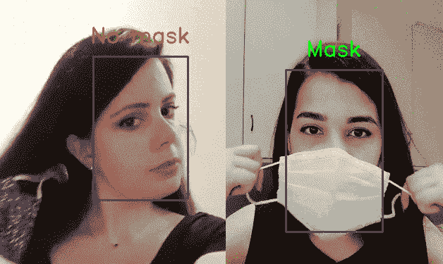
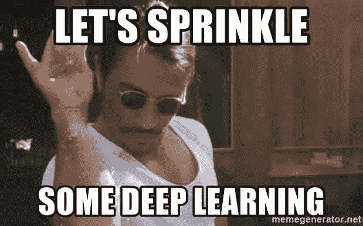
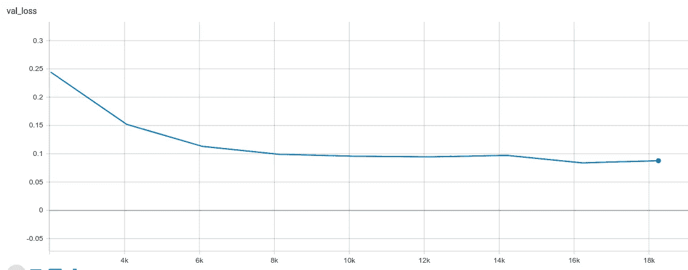
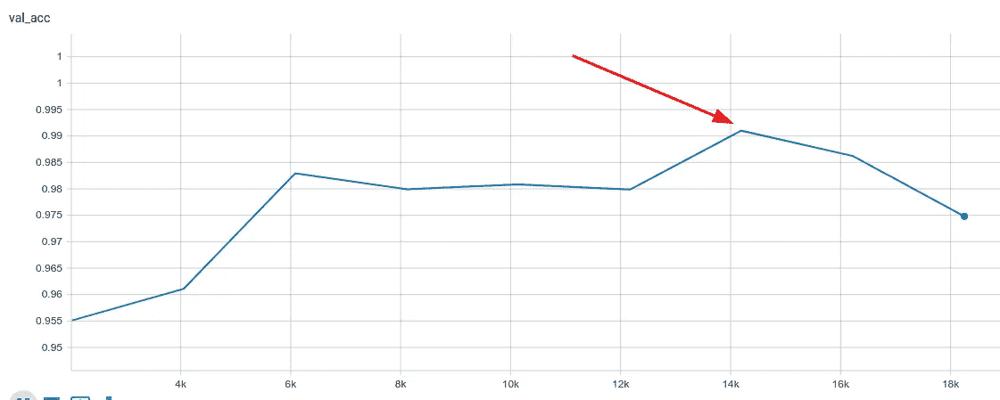
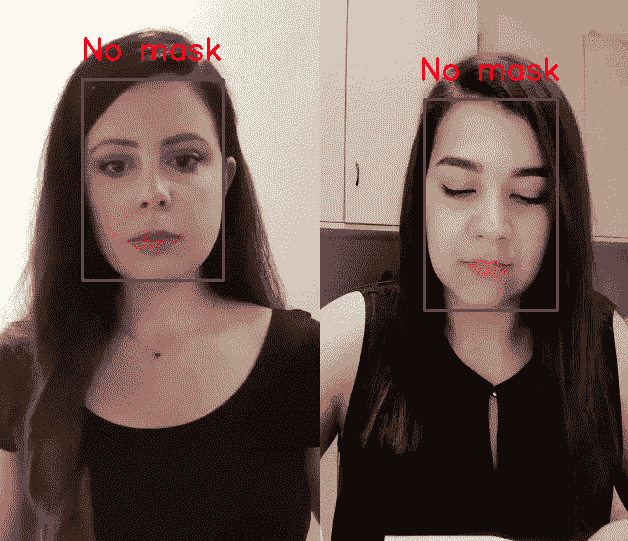

# 我如何使用 PyTorch Lightning 为新冠肺炎构建了一个面具检测器

> 原文：<https://towardsdatascience.com/how-i-built-a-face-mask-detector-for-covid-19-using-pytorch-lightning-67eb3752fd61?source=collection_archive---------6----------------------->



# 动机

在法国隔离结束的前几天，我在看新闻，无意中发现了一篇文章:[法国正在使用人工智能检查人们是否在公共交通工具上戴口罩](https://www.theverge.com/2020/5/7/21250357/france-masks-public-transport-mandatory-ai-surveillance-camera-software)。

> 创建该项目的法国初创公司 DatakaLab 表示，目标不是识别或惩罚不戴口罩的人，而是生成匿名统计数据，帮助当局预测未来新冠肺炎疫情的爆发

于是我决定试一试，自己搭建一个口罩检测仪，检测某人是否戴口罩。



[信号源](https://mc.ai/deep-dive-into-deep-learning%E2%80%8A-%E2%80%8Apart-1-demystifying-deep-learning-using-6-jars/)

# 1.资料组

为了训练深度学习模型来分类一个人是否戴着面具，我们需要找到一个好的数据集，其中包含两个类别的大量图像:

*   戴着面具
*   没有戴面具

[真实世界蒙面人脸数据集(RMFD)](https://github.com/X-zhangyang/Real-World-Masked-Face-Dataset) 提供了我们所需要的！该数据集是为面部识别目的而创建的。然而，我们将使用它来检测面具。

# 2.步伐

这篇文章的其余部分按以下方式组织:

**2.1。数据提取
2.2。构建数据集类
2.3。构建我们的面罩检测器模型
2.4。训练我们的模型
2.5。在真实数据上测试我们的模型。结果**

事不宜迟，让我们直接开始吧！

[来源](https://tenor.com/0EFO.gif)

# 2.1.数据析取

RMFD 提供了两个数据集:

1.  真实世界蒙面人脸识别数据集:包含 525 人的 5000 张蒙面人脸和 90000 张正常人脸。
2.  模拟掩蔽人脸识别数据集。

在这个实验中，我们将使用第一个数据集。下载并解压缩数据集后，其结构如下所示:

```
self-built-masked-face-recognition-dataset
├AFDB_masked_face_dataset
│ ├subject-id
│ │ ├image-id.jpg
│ │ └...
│ └...
└AFDB_face_dataset
  ├subject-id
  │ ├image-id.jpg
  │ └...
  └...
```

我们通过迭代图像来创建我们的熊猫`DataFrame`,如果脸部没有被遮罩，则给每张图像分配一个标签`0`,如果脸部被遮罩，则分配一个标签`1`。这个数据集的图像已经在人脸周围被裁剪了，所以我们不需要从每个图像中提取人脸。
以下代码说明了数据提取过程:

将图片存储在熊猫数据框中，并贴上相应的标签

# 2.2.构建数据集类

现在我们已经准备好了 pandas 数据框架，是时候构建 Dataset 类了，它将用于以 PyTorch 可解释的方式批量查询样本。我们的模型将接受 100x100 的图像作为输入，因此我们在查询它时转换每个样本图像，将它的大小调整为 100x100，然后将其转换为一个`Tensor`，这是 PyTorch 可以操作的基本数据类型:

数据集模块

# 2.3.建立我们的面罩检测器模型

现在是有趣的部分！

[来源](https://tenor.com/9oLA.gif)

我们将使用 [PyTorch Lightning](https://github.com/PyTorchLightning/pytorch-lightning) ，它是 PyTorch 的一个薄包装。PyTorch Lightning 在一个类中有效地构建了您的代码，该类包含了我们定义和训练模型所需的所有内容，并且您可以覆盖根据您的需求提供的任何方法，从而在避免意大利面条式代码的同时使其易于扩展。

PyTorch Lightning 公开了许多用于训练/验证循环的方法。但是，我们将根据需要使用其中一些。以下是我们将要覆盖的方法，并且将在内部按以下顺序调用:

**1。设置:**

*   __init__()
*   准备 _ 数据()
*   configure_optimizer()
*   train_dataloader()
*   val_dataloader()

**2。训练循环:**

*   训练 _ 步骤()
*   training_epoch_end()

**3。验证循环:**

*   验证 _ 步骤()
*   validation_epoch_end()

# 2.3.1.定义模型和正向传递

为了定义我们的模型，我们对 PyTorch Lightning 的`LightningModule`进行了子类化，并定义了我们的模型架构以及向前传递。我们还使用由`TorchMetrics`包提供的`Accuracy`类，它将负责为我们计算训练/验证的准确性。我们将保持简单，使用 4 个卷积层，然后是 2 个线性层。我们将使用`ReLU`作为激活函数，使用`MaxPool2d`作为池层。然后我们用`xavier_uniform`初始化这些层的权重，因为这将使网络训练更好:

CNN 模型定义

# 2.3.2.为模型准备数据

我们的数据集是不平衡的(5，000 个蒙面人脸对 90，000 个非蒙面人脸)。因此，当将数据集划分为训练/验证时，我们需要在训练/验证中保持与整个数据集相同的样本比例。我们通过使用`sklearn`的`train_test_split`函数来完成，我们将数据集的标签传递给它的`stratisfy`参数，它将为我们完成剩下的工作。我们将数据集的 70%用于训练，30%用于验证:

prepare_data()方法

在处理不平衡数据时，我们需要将这些信息传递给损失函数，以避免优化器的步长不成比例。为此，我们根据每个类在数据集中的可表示性为其分配一个权重。

我们给样本数量少的类分配更多的权重，这样，如果网络在预测这些类的标签时出错，它将受到更多的惩罚。而样本数量多的类，我们给它们分配一个较小的权重。这使得我们的网络训练与班级比例无关。为每个类别选择权重的一个好的经验法则是使用以下公式:

不平衡数据的类权重

这转化为以下代码:

具有适应的类权重的交叉熵

# 2.3.3.数据加载器

我们将定义用于培训和验证的数据加载器。我们使用一批尺寸为 32 的产品来训练我们的模型。我们每次都会打乱我们的训练批次样本，以便我们的模型可以通过以非重复的方式接收数据来更好地训练。为了减少加载批量样本的时间(这可能是训练循环中的瓶颈),我们将 workers 的数量设置为 4，这将执行多进程数据加载:

培训/验证数据加载器

# 2.3.4.配置优化程序

我们通过覆盖`configure_optimizers()`方法并返回所需的优化器来定义我们的优化器。出于本文的目的，我们将使用`Adam`，我们将学习率固定为`0.00001`:

configure _ optimizers()方法

# 2.3.5.训练步骤

在训练步骤中，我们接收一批样本，通过正向传递将它们传递给我们的模型，并计算该批样本的损失。我们还可以记录损失，PyTorch Lightning 会自动为我们创建 TensorBoard 的日志文件:

培训 _ 步骤()方法

# 2.3.6.训练时期结束

在`training_epoch_end()`中，我们计算训练精度并记录下来，以便稍后在 TensorBoard 中可视化。然后，我们重置训练精度变量，以便在下一个时期，精度不携带来自先前时期的值:

# 2.3.7.验证步骤

在每个训练时期结束时，对每批验证数据调用`validation_step()`,我们计算准确度和损失，并在字典中返回损失。返回值将用于下一部分:

validation_step()方法

# 2.3.8.验证时期结束

在`validation_epoch_end()`中，我们接收从`validation_step()`(来自前一部分)返回的所有数据。我们计算平均精度和损耗，并记录下来，以便稍后在 TensorBoard 中直观显示:

validation_epoch_end()方法

# 2.4.训练我们的模型

为了训练我们的模型，我们简单地初始化我们的`MaskDetector`对象，并将其传递给 PyTorch Lightning 提供的`Trainer`类的`fit()`方法。我们还定义了一个模型检查点回调和一个 TensorBoard logger，我们希望以最好的准确性和最低的损失保存模型。我们将为 10 个时期训练我们的模型:

培训模式

我们可以看到，验证损失在各个时期都在减少:



验证损失

我们的模型的验证精度在第 8 个纪元达到最高峰，达到 99%的精度。



验证准确性—保存最佳模型

在纪元 8(红色箭头所指的地方)之后，我们的模型开始过度拟合。因此，验证准确性开始下降。因此，我们将采用 epoch 8 的保存模型，并使用它在真实数据上进行测试！

# 2.5.在真实视频上测试我们的模型

[来源](https://tenor.com/view/the-moment-of-truth-baby-truth-facts-reveal-gif-8357516)

为了在真实数据上测试我们的模型，我们需要使用一个对人脸遮挡具有鲁棒性的人脸检测模型。幸运的是，OpenCV 有一个深度学习人脸检测模型，我们可以使用。这种深度学习模型是对 Haar-Cascade 模型的更准确的替代，它的检测框架是矩形而不是正方形。因此，面部框架可以适合整个面部，而不捕获背景的部分，这可能干扰我们的面部掩模模型预测。

关于如何使用 OpenCV 的深度学习人脸检测的一个很好的教程如下:

[](https://www.pyimagesearch.com/2018/02/26/face-detection-with-opencv-and-deep-learning/) [## 基于 OpenCV 和深度学习的人脸检测——PyImageSearch

### 今天，我将与您分享一个关于 OpenCV 库的鲜为人知的秘密:您可以快速、准确地执行…

www.pyimagesearch.com](https://www.pyimagesearch.com/2018/02/26/face-detection-with-opencv-and-deep-learning/) 

为了对视频进行推理，我们将使用上一节中保存的模型，并处理每一帧:

*   提取人脸
*   把它们传给我们的面罩探测器模型
*   在检测到的人脸周围绘制一个边界框，以及由我们的模型计算的预测。

以下是处理视频代码的摘录:

# 2.6.结果

我让几个朋友给自己拍照，戴上面具，然后摘下来。这些就是结果！看起来我们的模特即使带着定制的面具也很棒！我们模型的权重文件大小约为 8 Mb，在 CPU 上的推理几乎是实时的！！👌



演职员表:[伊莉莎](https://www.instagram.com/elisa_diagostino/)和[维罗妮卡](https://www.instagram.com/veronicamatar/)

完整的代码可以在 [GitHub](https://github.com/JadHADDAD92/covid-mask-detector) 上找到😃

***编者按:*** [*走向数据科学*](http://towardsdatascience.com/) *是一份以数据科学和机器学习研究为主的中型刊物。我们不是健康专家或流行病学家，本文的观点不应被解释为专业建议。想了解更多关于疫情冠状病毒的信息，可以点击* [*这里*](https://www.who.int/emergencies/diseases/novel-coronavirus-2019/situation-reports) *。*