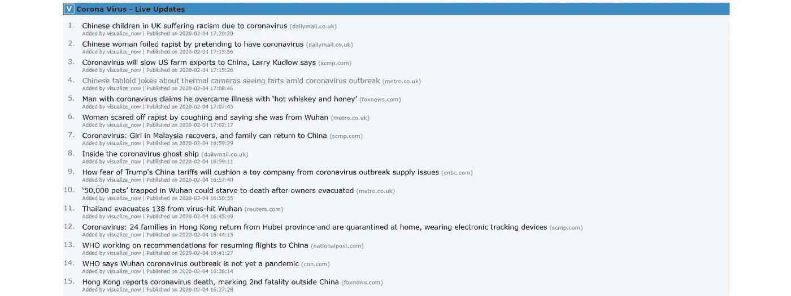
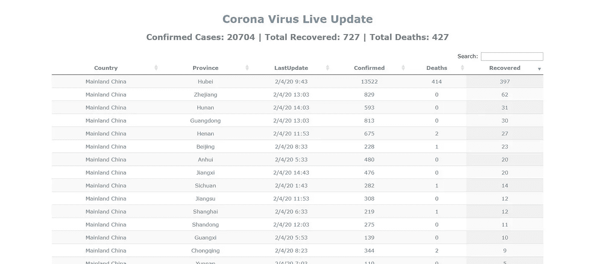

# 我如何在不到一天的时间里为冠状病毒创建了一个黑客新闻克隆

> 原文：<https://towardsdatascience.com/how-i-built-a-hacker-news-clone-for-coronavirus-in-less-than-a-day-f4a199f4d842?source=collection_archive---------27----------------------->

## 使用 Flask 作为后端和 Scrapy 抓取新闻


蒂姆·莫斯霍尔德在 Unsplash[上的照片](https://unsplash.com?utm_source=medium&utm_medium=referral)

如果您想观看直播网站，请访问[本页](https://visualizenow.org/corona-news)。有关实时统计数据，请访问[本页](https://visualizenow.org/corona-live)。我不打算一行一行地重复如何写代码，如果你想要的话，可以看看这个 [Github repo](https://github.com/sagunsh/corona-live) 。我还添加了过去 3-4 天收集的所有新闻。

我想了解关于传染性冠状病毒爆发的最新消息。浏览社交媒体是一种选择，但考虑到如今社交媒体上流传的假新闻和点击诱饵的数量，我更喜欢从可靠的新闻门户网站上获取新闻。问题是有很多。所以我想，也许是时候用我的编码技能来构建一些有用的东西了。


图片来自 Imageflip.com

# 新闻爬虫

爬行是我的日常工作之一，我以前创建过新闻爬虫。几乎每次我都用 Scrapy 进行抓取和爬行，因为它内置了很多东西。我不想重新发明轮子，更重要的是，我已经习惯了 Scrapy。

RSS 对于几乎所有的网站都是统一的，所以我决定用它来获取新闻。这样，我将只编写一个适用于所有网站的解析器。我需要做的就是在列表中添加更多的 URL，脚本会处理它。RSS 提要中的一个典型条目如下所示

```
<item>
    <title>
        <![CDATA[ China coronavirus outbreak: All the latest updates ]]>
    </title>
    <description>
        <![CDATA[Global death toll reaches 427 with two reported dead outside mainland China as infection rate passes 20,500 cases.]]>
    </description>
    <link>
        [https://www.aljazeera.com/news/2020/02/china-admits-shortcomings-coronavirus-death-toll-hits-425-200203234036932.html](https://www.aljazeera.com/news/2020/02/china-admits-shortcomings-coronavirus-death-toll-hits-425-200203234036932.html)
    </link>
    <guid isPermaLink="false">200203234036932</guid>
    <pubDate>Tue, 04 Feb 2020 16:41:35 GMT</pubDate>
</item>
```

下一步是收集数据。我想要标题、链接和发布日期，我需要一种方法来选择仅在我的页面上显示的与冠状病毒相关的新闻。一种简单的方法是匹配关键词。所以我做了一个关键字列表和一个函数，它将检查标题和描述是否有这些关键字之一，并将其插入数据库或忽略它。所有这些步骤都记录在`rss_scraper.py`文件中。

# 前端

所以我想的第一件事就是尽快完成。我不想浪费更多的时间来构建一个简单的 MVP。我承认我对设计和前端的东西很糟糕。所以我做了每个开发人员都会做的事情，即找到一个合适的模板。通常我会搜索**“免费引导新闻模板”**，但正如我所说，我不想浪费太多时间。我见过的最简单的用户界面是[黑客新闻](https://news.ycombinator.com/)。所以我从他们的网站上复制了所有的 HTML，CSS，删除了多余的东西，做了一些改变，比如颜色，页脚。

# 后端

选项对我来说是有限的，因为我只知道 Python 和初级 JavaScript/NodeJS。对我来说不是弗拉斯克就是姜戈。Django 很棒，但我想要一个单页应用程序，几乎没有 2-3 页，所以这将是一个大材小用。Flask 因其最小化方法而受欢迎，所以我选择了它。

使用的数据库是 MySQL。我创建了一个端点`/corona-news`,它查询数据库并将字典列表返回给模板，在模板中它们将被呈现为 HTML。和《黑客新闻》一样，我设定了每页 30 条的限制。点击[此链接](https://visualizenow.org/corona-news)访问页面。



实时新闻页面

# 奖金

我发现[这个网站](https://gisanddata.maps.arcgis.com/apps/opsdashboard/index.html#/bda7594740fd40299423467b48e9ecf6)正在更新报告的病例数、死亡数和康复病人数。他们也有一个链接到保存汇总数据的 google sheet。我使用 google sheet 定期下载文件，并以表格形式显示数据。有关现场计数和统计，请访问[本页](https://visualizenow.org/corona-live)。



实时统计页面

# 部署

我使用 Linode VPS 和 Ubuntu 进行部署。按照 DigitalOcean 的指南[在 Ubuntu 上使用 Nginx 和 uWSGI 部署 Flask 应用程序。](https://www.digitalocean.com/community/tutorials/how-to-serve-flask-applications-with-uswgi-and-nginx-on-ubuntu-18-04)

# 最后的想法

我希望这一页将有助于你们中的一些人获得关于冠状病毒的最新消息，这次疫情将尽快得到控制。