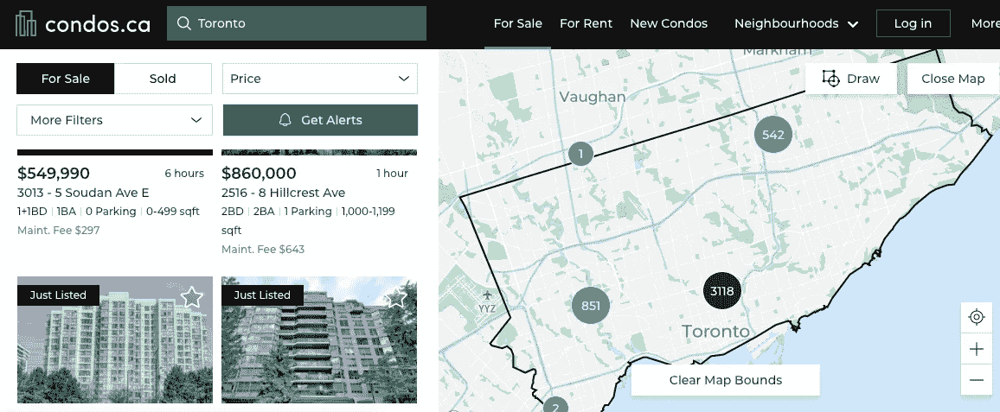
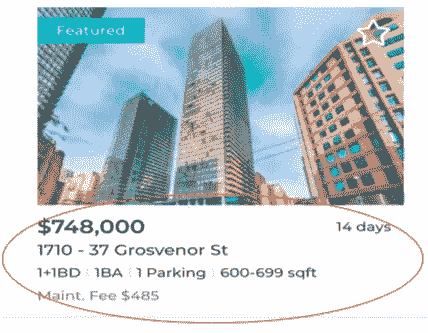
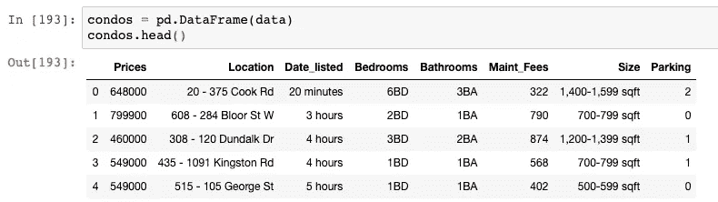
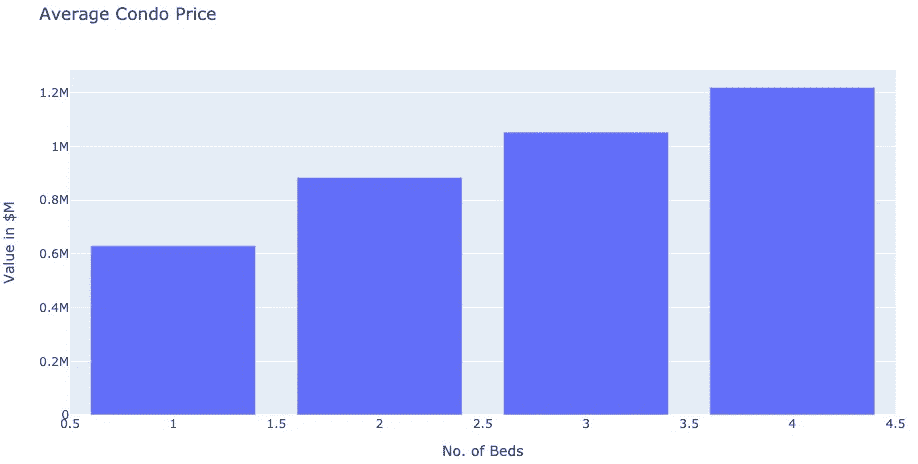
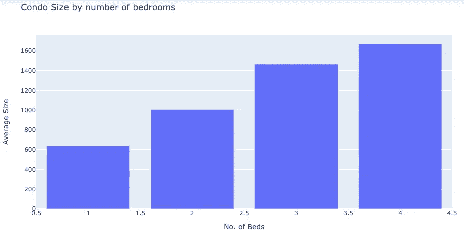
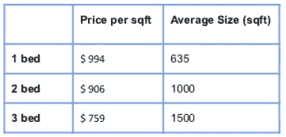
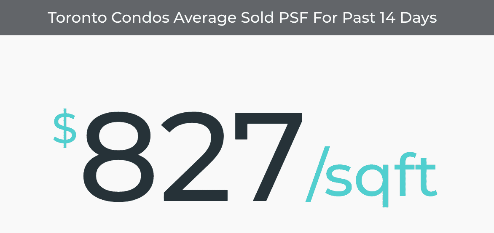
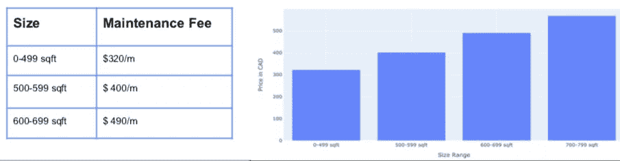
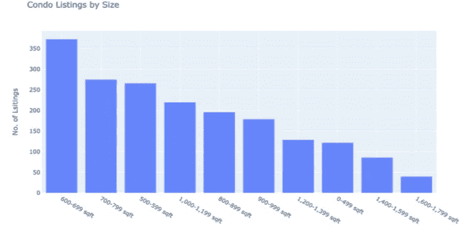

# 构建 web scraper 工具来分析多伦多的公寓价格

> 原文：<https://towardsdatascience.com/how-i-built-a-web-scraper-tool-to-analyze-condo-prices-in-toronto-56f829c55e93?source=collection_archive---------27----------------------->

## 尝试用数据驱动的方法来做人生中最重要的决定之一:买房

公寓一直令我着迷，在我居住的城市，它们可能是许多首次购房者脑海中的第一个(或现实的)选择。除非你一直生活在困境中，否则你会意识到多伦多的房价在过去的十年里上涨了许多倍，在过去的 5 年里更是如此。最近，公寓市场火了起来。所以，如果你和我一样，想买一套公寓，那你来对地方了。


桑德罗·舒赫在 [Unsplash](https://unsplash.com?utm_source=medium&utm_medium=referral) 上的照片

作为一个高度数据驱动的人，我建立了一个网络抓取工具，帮助我分析多伦多的公寓价格。我的首选网站是 [Condos.ca](https://condos.ca/) 。它有一个良好的用户界面，并提供市场情报(我认为这将有助于验证我的结果)。在撰写本文时，它的清单跨越了 80 多个网页，我将从前 50 页中提取数据，如本文后面所述。



图片来自 [Condos.ca](https://condos.ca/) 主页

这项工作有两个目标:

*   从网站上搜集相关参数的必要数据，建立基准数据库
*   通过对数据库进行一些探索性的 EDA 来进行市场研究，如每间卧室的平均价格、平均维护成本、平均公寓面积等。



数据采集(image src: Condos.ca)

我提取了每张清单上显示的信息，比如价格、街道地址、卧室、浴室的数量、是否有停车场、面积范围以及维护费用。(注:许多其他参数影响公寓价格，如楼龄、财产税、楼层数、图像等。，但为了简单起见，我留下了这些)

这里值得一提的是，在进行这个练习之前，我对 HTML 没有任何经验。但是这就是网络抓取的美妙之处。你不需要对 HTML 有很深的理解。我简单地学习了如何从 HTML 代码中的标签瀑布中提取所需的值。剩下的都是 python！这里的是关于如何抓取网站的有用资源。

**那么让我们开始吧！**

我们从导入必要的模块开始。

```
from bs4 import BeautifulSoup *# For HTML parsing* from time import sleep *# To prevent overwhelming the server between connections* import pandas as pd *# For converting results to a dataframe and bar chart plots**# For Visualizations*
import matplotlib.pyplot as plt
import plotly.offline as py
import plotly.graph_objs as go*%matplotlib inline* 
```

当我请求抓取网站时，我遇到了一个错误。这是因为许多网站试图阻止用户抓取任何数据，这可能是非法的，取决于一个人计划如何处理这些数据(不过我已经获得了 condos.ca 的许可)。为了解决这个问题，我使用了一个名为 Selenium 的 API。它是一个 API ,允许你像一个真正的用户那样以编程的方式与浏览器交互。虽然 [**Selenium**](https://selenium-python.readthedocs.io/installation.html#introduction) 主要用于帮助测试 web 应用程序，但是它也可以用于任何需要浏览器自动化的任务。

```
from selenium import webdriver
from selenium.webdriver.common.keys import Keys
driver.get(“[https://condos.ca](https://condos.ca)")
```

**使用过滤器**

运行前面的代码会打开一个新的浏览器并加载网站，帮助您像真实用户一样与网站进行交互。例如，Selenium 不需要手动点击网站来选择过滤器，如卧室数量、房屋类型或提供价格范围，而是通过传递几行命令来轻松完成。该模型使用户能够选择多个过滤器。
例如，要获得 2 间卧室的选项，我使用以下代码单击按钮:

```
*two_bed = driver.find_element_by_css_selector( ‘insert_css_path’)* *two_bed.click()*
```

同样，要获得 Gym 的所有结果，我只需使用以下代码:

```
*Gym = driver.find_element_by_css_selector('insert_css_path')
Gym.click()*
```

**定义一个函数来迭代多个页面**

因为我希望能够对其他城市进行这种分析，所以我定义了一个函数，该函数使用参数' *city'* 、' *mode'* 和' *page no'* )创建一个漂亮的 soup 对象。这里，' *mode'* '参数接受' Sale '或' Rent '作为值，使用户能够分析租赁价格！

```
**def** get_page(city, mode, page):
    url= f'https://condos.ca/{city}/condos-for-{mode}?mode=                 {mode}&page={page}'
    driver.get(url) 
    page_source = driver.page_source
    soup = BeautifulSoup(page_source, 'lxml')
    return soup
```

该函数利用名为[*beautiful Soup*](https://www.crummy.com/software/BeautifulSoup/bs4/doc/)的模块，为给定的网页返回一个名为 soup 的对象。它还会加载所请求的网页。(稍后我将遍历所有网页来提取所有页面的 soup 对象)

现在我们有了 soup 对象，我们可以提取一些有用的信息，比如清单总数、每页清单总数等。，通过解析网页 HTML。没有听起来那么难！我们使用 *soup.find()* 来获取相关的标签。一种有用的方法是从提取第一页上的数据开始。如果您能成功做到这一点，rest 只需在所有页面上重复这个过程！

```
#Defining soup object for page 1
soup = get_page('toronto', 'Sale',1)
```

从第一页中提取一些关于列表的相关信息。

*   多伦多的物品总数:

```
#The total number of Condo Listings in Toronto*soup.find(‘div’,class_ = ‘sc-AxjAm dWkXrE’).find(‘span’,class_ = _5FYo1’).get_text()* *#no. of listings : 3560*
```

*   首页上的列表数量:

```
*len(soup.find_all(‘div’,class_ = ‘_3O0GU’))* *#43*
```

现在我们对这个有点满意了，我们可以更大胆一点，提取第 1 页上的所有价格。

```
*prices=[]
for tag in soup.find_all(‘div’,class_ = ‘_2PKdn’):
prices.append(tag.get_text())
prices[:5]*['$450,000',
'$649,900',
'$399,999',
'$599,900',
'$780,000']
```

为了使事情更简单，我定义了一个名为 *condo_container* 的变量，它将保存所有相关数据(价格、位置、大小等)。)页面上的所有列表

```
*condo_container = soup.find_all('div','_3SMhd')*
```

现在，我们要做的就是从这个 *condo_container* 中提取价格和其他数据。请参见下面的示例:

```
#Obtaining Location of all listings on page 1Location_list=[]
for i in range(len(condo_container)):
for tag in condo_container[i].find('span',class_='_1Gfb3'):
Location_list.append(tag)
Location_list[:5]['1001 - 19 Four Winds Dr',
'306 - 2 Aberfoyle Cres',
'911 - 100 Echo Pt',
'524 - 120 Dallimore Circ',
'1121 - 386 Yonge St']
```

对所有变量重复上述过程，我们得到了构建数据框所需的所有列表(参见下面的示例代码)。由于 HTML 结构的原因，在试图提取浴室、大小和停车场等参数时，这个过程变得有点棘手，但只需一点点努力，就可以完成！(我不是故意分享完整的代码，以避免代码的复制)。

## 最终数据集

现在我们有了所有的列表，我们简单地将它们添加到一个名为*数据*的字典中，定义如下。有些标签有点令人困惑，但那是因为它们已经根据需要从字符串类型格式化为整数。

```
data = {'Prices':[],
'Location':[],
'Date_listed':[],
'Bedrooms':[],
'Bathrooms':[],
'Maint_Fees':[],
'Size':[],
'Parking':[]
}final_list=[]
for page in range(50):
    soup = get_page('toronto', 'Sale',page)
    condo_container = soup.find_all('div','_3SMhd')
    sleep(random())
    print(page) for i in range(len(condo_container)):
    listing = [] price_tag = condo_container[i].find('div',class_= '_2PKdn').get_text()
    formatted_tag = int(price_tag.split('$')[1].replace(',',''))
    data['Prices'].append(formatted_tag) 

    location_tag =    condo_container[i].find('span',class_='_1Gfb3').get_text() data['Location'].append(location_tag) if maint_tag != '':

        Maintenance_Fees = int(maint_tag.split('$')    [1].replace(',',''))
        data['Maint_Fees'].append(Maintenance_Fees)
    else:
        data['Maint_Fees'].append('error') for info_tag in condo_container[i].find('div',class_='_3FIJA'):
            listing.append(info_tag)

        final_list.append(listing)
```

一旦我们准备好词典，我们就把它转换成 pandas 数据框架，以便进一步处理和 EDA。得到的数据帧有 2031 行。



熊猫数据框(图片由作者提供)

快速浏览数据集告诉我们，*卧室、浴室、维护费、*和*大小*是对象类型变量，因为它们在 HTML 中被存储为字符串类型。

这些变量被清理并转换成整数或浮点类型。此外，我从*大小*变量创建了一个变量 *Avg_Size* 。通过进一步的数据检查，我发现了错误值，我用相应列的平均值替换了这些错误值。我还在 Location 变量的基础上设计了一个*街道地址*变量，以防以后我想执行某种位置分析。数据集被处理为异常值，这扭曲了我的平均值(昂贵的公寓可以变得非常昂贵！).缺失值用各自列中的平均值或最大出现值进行估算。

现在，我们的数据集看起来既漂亮又干净，我们可以继续进行一些基本的探索性分析了！

## 分析/结果

我很好奇，平均价格和面积是如何随着卧室数量的变化而变化的，我认为这是任何买家首先想到的事情！所以我使用 [Plotly](https://plotly.com/python/) 创建了一些情节(见下面的示例代码)。

```
price_by_bed = condos.groupby(['Bedrooms']['Prices'].mean()data = go.Bar(
    x=price_by_bed.index,
    y=price_by_bed.values,
             )layout = go.Layout(
    title='Average Condo Price',
    xaxis_title="No. of Beds",
    yaxis_title="Value in $M"
                  )
fig = go.Figure(data=data, layout=layout)
py.iplot(fig)
```



病床平均价格(图片由作者提供)



按床位划分的平均大小(图片由作者提供)



按床位分类的价格和尺寸汇总(图片由作者提供)



多伦多每平方英尺的平均价格(Image Src: [Condos.ca](https://condos.ca/)

每平方英尺的平均价格(仅包括子集中的 1、2 和 3 间卧室)为 897 美元，略高于 827 美元/平方英尺的报价。(注:自 COVID 开始以来，平均价格一直在逐渐下降，因此此处显示的值可能与当前值不同)。

我还可以根据卧室的数量来分析平均维护值。一个有趣的发现是，维修费可以决定你对公寓的投资成败，因为它几乎占你每月抵押贷款价值的 25%!(需要记住的是，不要只关注昂贵的价格)



公寓大小的平均维护费用(图片由作者提供)

下面，我按平均面积分析了房源数量，发现大多数待售公寓的面积在 600-699 平方米之间。金融时报类别。



按大小排列的列表数量(按作者排列的图片)

这些是我从这次网络抓取练习中得到的一些有趣的见解。我确信，现在有了这些知识，我会成为一个“消息灵通的买家”。

如果你有任何有趣的观点要分享，我很乐意在下面听到你的评论。

感谢 [condos.ca](https://condos.ca/) 的团队允许我进行这个有趣而有价值的练习！

**免责声明** : *请注意，文中表达的观点、想法和意见仅属于作者，不一定属于作者的雇主、组织、委员会或其他团体或个人。这不是投资建议，作者不打算将数据用于任何商业目的，只是出于个人原因。*