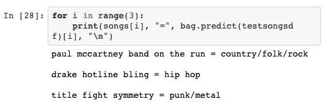

# 我如何使用 Python 和 Spotify Web API 构建基于音频的音乐流派预测器

> 原文：<https://towardsdatascience.com/how-i-built-an-audio-based-music-genre-predictor-using-python-and-the-spotify-web-api-a957e427a515?source=collection_archive---------12----------------------->

## 音乐信息检索(MIR)导论——一个涉及音乐数据分析和分类的跨学科领域

由[阿格巴洛斯](https://unsplash.com/@agebarros?utm_source=medium&utm_medium=referral)在 [Unsplash](https://unsplash.com?utm_source=medium&utm_medium=referral) 上拍摄的照片

你很可能订阅了某种流行音乐流媒体服务。无论是 Spotify 还是 Apple Music，你都可能接触过音乐信息检索的应用程序。想想这个——当使用 Spotify 建立播放列表时，该应用程序会根据您之前添加的歌曲或播放列表标题为您提供歌曲建议。在 Apple Music 中，您会看到根据您之前的收听历史为您量身定制的混音。这里的幕后没有任何魔法。(嗯，也许你，苹果——我们不知道苹果公园的魔法王国里发生了什么)这些例子是由音乐信息检索驱动的流行应用程序。

**音乐信息检索是分析和分类音乐数据的科学**。**MIR 的一些应用与数据科学领域密切相关，同时还结合了心理声学、信号处理、机器学习和计算智能等多个领域。**

在本文中，我将给出 MIR 的一个应用的高级演示:**体裁预测**。这个项目由 Python 构建，包含两个分类器模型，可以预测歌曲的风格。这两个模型都暴露于从一堆歌曲中收集的各种数据点。第一个模型根据歌词预测歌曲的风格。第二个模型根据歌曲的音频属性或声音来预测歌曲的风格。**我们将专注于第二个基于音频的模型**，但是可以随时在 [GitHub](https://github.com/christianlomboy/MIR-Genre-Predictor) 上查看整个项目！让我们开始吧。

我对音乐的热爱和我接触过的 MIR 的许多应用极大地激发了我在这里的工作。我一直在寻找新的音乐，由于 Spotify 和 Apple Music 的推荐，我已经发现了大量的艺术家。

# 1.收集数据

为了开始构建一个分类器，**我们需要数据**——以及大量的数据。对于分类者来说，不仅仅是*更好的*教他们如何钓鱼；这是*要求的*。我们需要向他们提供大量的数据，以便他们做出准确的类别标签分配。

我们的分类器将根据歌曲的声音进行预测。幸运的是，Spotify 有一个特别有用的 [web API](https://developer.spotify.com/documentation/web-api/) ，我们可以利用它来获取我们需要的数据。在这个项目中，我们将使用 [Spotipy Python 库](https://spotipy.readthedocs.io/en/latest/)访问 Spotify 的歌曲数据。这个轻量级 Python 库支持 Spotify 的 Web API 的所有特性。通过使用 Spotipy，我们可以检索任何给定歌曲的各种数据点，如下所示。

给定曲目、艺术家和流派，使用 Spotipy 收集数据

在预测一首歌曲的风格时，我们可以考虑相当多的数据点。**只要看看上面提供的例子，我们就可以知道 Empire Cast 的嘻哈歌曲比它上面的两首朋克/金属歌曲具有更高的可跳舞度。语音的清晰度也更高，这并不奇怪。朋克/金属歌曲的歌词经常在嘈杂的乐器上尖叫或呼喊，使它们更难理解，而嘻哈歌曲包含的歌词与节奏乐器一起演唱或说唱，几乎不会碍事。**

为了获得足够数量的歌曲数据，我首先从 Kaggle 和 Ranker 导入了两个数据集。两个数据集都包含成千上万首歌曲，以及它们相关的流派。为了获得这些歌曲的音频属性，我创建了一个函数，该函数贯穿这两个数据集，在每首歌曲处停下来搜索歌曲的音频属性。感谢 Spotipy，我能够获得大量数据来训练这些模型。

# 2.探索性数据分析

如上面的例子所示，我们能够对收集到的一些歌曲有一个小小的了解。**然而，上面显示的歌曲甚至连整个数据集中歌曲数量的百分之一都不到，所以我们还不能做任何假设。**为了对每种风格的音频属性得出结论，**我们必须进行探索性数据分析，或 EDA。**

EDAs 允许我们总结一个数据集的主要特征。**这是一个允许数据科学家熟悉他们的数据的过程，收集关于正在实验的数据的本质的关键理解。**它也用于检查数据的质量；我们的实验是否会产生任何有意义的结果。

从我的 EDA 开始，我首先将歌曲按流派分组，然后找到每个音频属性的数字平均值。接下来，我对数据集的属性进行了规范化，以便更好地理解每种风格的音频特征之间的差异。我使用了一个差异阈值函数来找出每种风格的音频属性之间的差异，然后将差异列在一行中，显示在数据帧的底部。添加之后，我按照方差对列进行了降序排序。我最终得到了一个数据框架，它显示了每种风格的平均音频属性，以及不同风格之间哪些属性有最多的相似性和差异性。

各列按差异(底行)排序，或者按各种类型之间每个属性的差异程度排序

根据上面显示的数据框架判断，我们现在可以对数据集做出一些关键假设。**乐器、声音和语速在每种风格之间的差异最大，而拍号、基调和速度的差异最小**。直观地说，这是有意义的，尤其是当我们考虑本文第一节中的例子时。朋克/金属具有非常高的乐器性，因为通常存在尖叫的吉他、重低音、误解的歌词和雷鸣般的鼓声。由于通常存在电子节拍和合成低音，嘻哈音乐的乐器性很低。乡村/民间/摇滚介于两者之间。

***还有哪些方法可以将你的音乐直觉运用到上面显示的结果中？***

# 3.构建分类器

一个**决策树**，机器学习领域的流行工具，利用其树状结构来做决策。

照片由 [Stephen Milborrow 在维基百科上](https://en.wikipedia.org/wiki/File:CART_tree_titanic_survivors.png) — *“一棵树显示了* [*泰坦尼克号*](https://en.wikipedia.org/wiki/Titanic) *上乘客的存活数(“sibsp”是船上配偶或兄弟姐妹的数量)。叶子下面的数字显示了存活的概率和叶子中观察到的百分比。总结:如果你是(1)女性或(2)小于 9.5 岁且兄弟姐妹少于 2.5 个的男性，你存活的机会很大。*

上图是在[决策树学习维基百科文章](https://en.wikipedia.org/wiki/Decision_tree_learning)上找到的图片。这个树参考了电影《泰坦尼克号》,给我们一个直观的例子来说明决策树是如何工作的。

**基于音频的分类器将通过做出由每片树叶确定的预测来利用决策树。**例如，一片树叶可能会有这样的陈述**“声音度>是 0.5 吗？”**然后它将决定所讨论的歌曲是被预测为嘻哈歌曲还是朋克/金属歌曲。现在，我们数据集中的歌曲肯定比泰坦尼克号上的人有更多的属性，所以我们的树看起来会比上面列出的树复杂得多。上面，我们看到决策树只考虑了三个属性。我们的歌有 12 个属性。**这些属性是决策树进行预测的基础，**因此，这棵树变得更大是有道理的——更不用说我们将向它输入大量的歌曲。

我选择使用 [scikit-learn](https://scikit-learn.org/stable/index.html) 的 Python 工具——特别是[训练-测试-分割函数](https://scikit-learn.org/stable/modules/generated/sklearn.model_selection.train_test_split.html)和[决策树分类器](https://scikit-learn.org/stable/modules/generated/sklearn.tree.DecisionTreeClassifier.html)。构建分类器时，我们必须采取的第一步叫做**拟合分类器**。我们可以认为拟合是将分类器暴露给数据，并告诉它属于哪个分类。

这和学习的想法很相似。当你为考试而学习时，你会接触到很多信息，到了考试的时候你必须记住这些信息。**这里的关键** *(这一点很重要)* **是在考试上，你会看到你必须解决的问题，而这些问题是你从未见过的——但这些问题与你考试前所学的问题有相似之处。利用你所知道的你所研究的问题，你尽你所能解决这些测试问题，希望你最终能取得一个好的考试成绩。**

当适合决策树分类器时，其决策树叶子由它所暴露的数据生成。拟合后，我们可以通过将分类器暴露于它从未见过的数据来测试它，希望它能做出准确的预测。

我通过将整个数据集分成 **70%的训练数据**和 **30%的测试数据**来构建决策树分类器。我还决定不考虑两个音频属性，因为流派之间的差异太小了。在研究了[如何避免过度拟合](https://elitedatascience.com/overfitting-in-machine-learning#how-to-prevent)之后，我做出了这些决定。

在拟合之前，我使用了一种叫做 [**打包**](https://scikit-learn.org/stable/modules/ensemble.html#bagging) 的方法来进一步优化分类器。Bagging 本质上是获取你的初始分类器，创建一堆它的副本，然后在原始数据集的随机子集上训练它们。在训练之后取它们的所有平均值，产生一个单一的平均分类器。 **Bagging 在分类器的构造中引入了随机化，使其成为改进单个复杂树分类器的一种很好的方式。**

最终的决策树

# 4.结果

现在来最后拟合和测试分类器。我们运行一个简单的评分函数，看看分类器在面对以前从未见过的数据时表现如何。

分类器得分约为 79%

不错——分数略低于 80%。让我们喂它一些歌曲，看看它的行动；保罗麦卡特尼，德雷克和冠军争夺战的歌曲。

预测是正确的！

三个预测都是正确的！*科学，宝贝*。

# 结论

数据科学是一个巨大的领域。这也是我如此热爱它的原因之一。它让我能够将我的计算机科学技能与我对音乐的热情结合起来，MIR field 为我提供了一个完美的游乐场，让我在获得音乐洞察力的同时进一步发展我的技能。

[GitHub 项目链接](https://github.com/christianlomboy/MIR-Genre-Predictor)