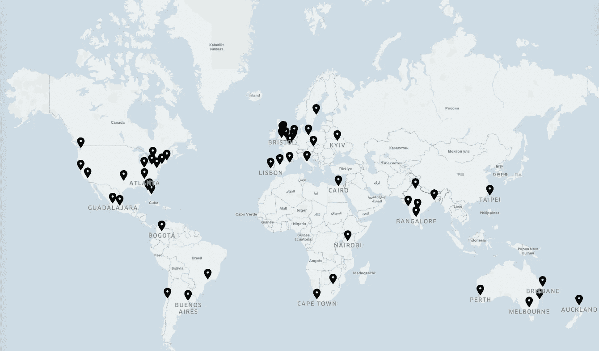
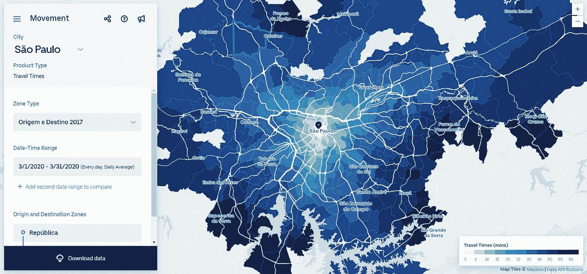
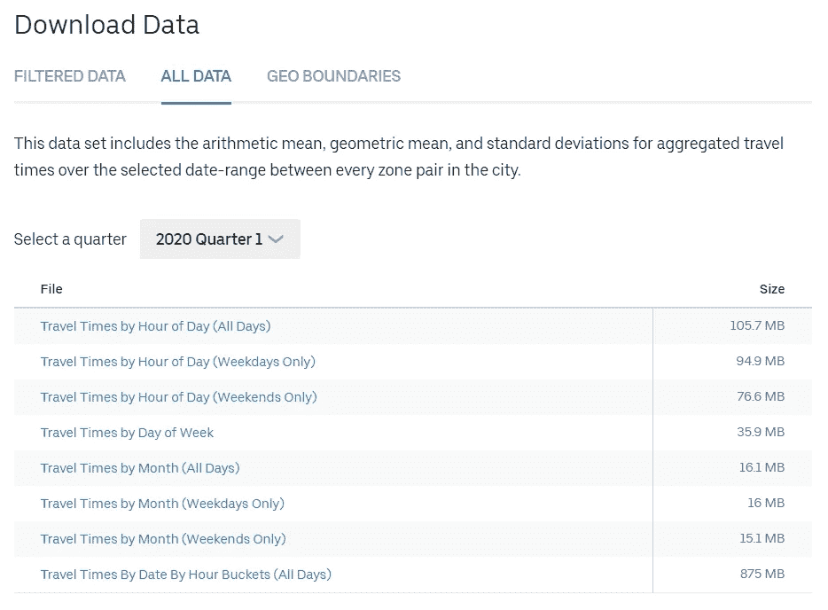
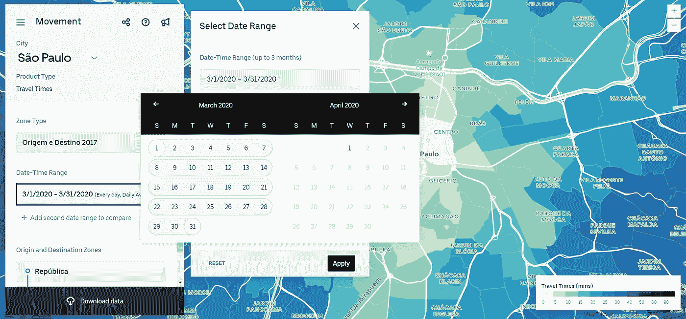
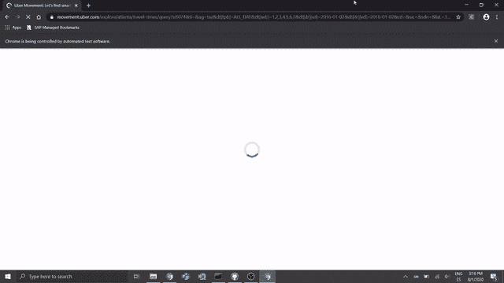

# 我如何从优步旅行时间数据中构建时间序列数据

> 原文：<https://towardsdatascience.com/how-i-built-time-series-data-out-of-cross-sectional-uber-travel-times-data-e0de5013ace2?source=collection_archive---------44----------------------->



我知道我在写学士论文的过程中想做两件事:提高我的编程技能和从事时间序列数据预测工作。

然而，我不知道的是我想学的东西。然而，它必须是我真正喜欢的东西，不一定与我的专业相关。

由于我喜欢地图和……移动的东西，我决定以某种方式使用我最近偶然发现并爱上的一个网站的数据(可能是在我十几岁时玩了几个小时的模拟城市之后)——优步运动网站。

它允许您可视化从某个点(或区域)到同一城市中任何其他点的平均行驶时间的匿名数据。



我的家乡圣保罗的旅行时间示例。

“太好了！”，我想。“让我下载旅行时间并绘制一些数字，这样我就可以继续进行探索性数据分析(EDA)。”

事实证明，我想要的数据不是那么容易提取的。

# 问题是

为了有一个更精确的统计结果，我需要我能得到的所有数据。我拥有的数据行越多，我的模型的预测能力就越强(潜在的)。时间增量越小越好。因此，我需要得到*日报*的旅行时间。

优步运动网站允许你从城市的任何一个区域下载数据到其他区域。然而，有一个问题。无论您想获取哪个日期范围的旅行时间，都不是由每天的数据组成的。

也就是说，如果您选择下载 2020 年 1 月至 2020 年 3 月的值，您将不会收到 90 个值，这大致是该范围内的天数。相反，它会生成一个 csv 文件，其中的*是每对区域的三个月平均旅行时间的单个值*。



您可以为每个给定的区域对下载不同格式的行驶时间数据。

这意味着我必须在整个时间内的数据点数量上做出妥协，以获得单个时间点的大量值。

> TL；博士:优步运动不提供时间序列数据，但单电子/横截面数据。

当然，还有其他限制因素，例如，我只能获得我称之为“径向”的数据，而不能获得每个可能的区域对之间的行驶时间，只能获得从最中心点到其他点的行驶时间。从统计学的角度来说，我不确定这是否能为我提供一个给定城市的平均出行时间的合理准确的测量值。

以下是您可以下载的两种地理空间数据的(非常难看的)描述:


“径向”数据与每对区域。

尽管如此，还是有希望的。

# 我解决这个问题的天真尝试

可以选择的最大可能日期范围是 3 个月。另一方面，最短的时间是一天，这正是我所需要的。



优步运动日历，您可以在其中选择所需的日期范围。

所以我想:“为什么不点击每一天并下载相应的数据集呢？”。

嗯…我试过了。

我知道自动化这个过程会容易得多，但是我没有编码技能，也不知道我需要用什么包来完成这个任务。

我花了大约 6 分 30 秒下载一个月的数据。在可用的城市中，数据天数最多的是 3.25 年(2016 年 1 月至 2020 年 3 月)或 39 个月。我总共要花 253 分钟，或者连续点击 4 个多小时，才能下载一个城市的所有数据集。总之，我想从 31 个城市提取数据，所以 4 小时乘以 31 个城市大约等于手动下载 5 天。

那就是不吃不睡。

是时候解决房间里的大象了。因为我不想花几乎整整一周的时间点击下载按钮，所以我*让*自动完成这项工作。

# 解决方案

我实际上使用了两个 Python 包来自动下载每日数据集:Selenium，用于自动执行操作(比如单击和等待页面响应); datetime，使用精确的数据类型来读取日期和时间，而不仅仅是使用字符串。

代码的很大一部分是由 XPaths 和 CSS 选择器对变量的简单赋值以及对这些变量执行的点击操作组成的。对我来说，这本身就是一次学习练习，因为我从未使用过谷歌 Chrome 开发者工具。

酷，我刚学会自动点击。然后，我有了点击日历上每一天的想法。很简单。

然而，我现在面临着一个巨大的障碍。

为了遍历日期，我必须从下载按钮所在的页面返回到带有日历的窗口(这样我就可以点击下一个日期)。为此，我必须刷新页面。当您刷新页面时，DOM(文档对象模型)也会更新。

也就是说，引用特定 web 元素的任何代码都不能在刷新后的页面上工作，因为 web 元素已经过时了。

例如，Selenium 会给我以下错误消息:

```
selenium.common.exceptions.StaleElementReferenceException: Message: <element_name>'stale element reference: element is not attached to the page document
```

这是一场噩梦，也是一个我无法克服的挑战，不管我读了多少 StackOverflow 的帖子。绝望随之而来。

因此，我联系了一位我认识的有 CSS 和 Java 经验的前同事，看他是否能帮助我。虽然我的希望很低，但他提出了一个简单而优雅的想法:“为什么不点击日期并刷新页面，而是更新 URL 本身以包含您想要的日期？”

这是我的项目的一个转折点。(瓦雷乌·爱德华多！).

如果你仔细查看某个城市的优步运动网址，你会注意到它包含了你想要登陆的页面所需的所有信息。

我只需创建一个初始 URL，其中包含城市名称、所需的区域类型和区域原始代码等信息，然后找出一种算法来遍历日期并相应地更新 URL。

URL 创建函数如下:

```
*# Create URLs for the desired date range* **def** getURL():
    *""""*
 *Function that creates one URL per date between the specified    date range*
 *"""*
    date = datetime(2016,2,2)
    **while** date <= datetime(2020,3,31):
        **yield** ('https://movement.uber.com/explore/' + city + '/travel-times/query?si' + origin_code + '&ti=&ag=' + zone_type + '&dt[tpb]=ALL_DAY&dt[wd;]=1,2,3,4,5,6,7&dt[dr][sd]=' +
               date.strftime('%Y-%m-**%d**') + '&dt[dr][ed]=' + date.strftime('%Y-%m-**%d**') + '&cd=&sa;=&sdn=' + coordinates + '&lang=en-US')
        date += timedelta(days=1)
```

最后，我们只需要创建一个迭代机制来执行 getURL 函数中的下一个 URL。

```
*# Perform iteration through URLs downloading the datasets for each URL*
iterated_URLs = []
i = 0
print('Number of generated URLs: ' + str(len(list(getURL()))))
**for** url **in** getURL():
    i += 1
    driver.execute_script("window.open('"+url+"', '_self')")
    iterated_URLs.append(url)
```

这是运行中的机器人:



数据集下载机器人在行动。

就是这样！

接下来的步骤是将每个 csv 文件连接成一个文件，并执行清理和格式化以启动 EDA 这对熊猫来说很容易做到。

有了这个，任何人都可以充分利用优步免费提供给我们的惊人数据。由于网站上提供的数据结构的性质，时间序列分析是不可能的，现在我们可以扩大对优步旅行时间和地理空间数据的研究范围。

当然，这两段代码并不是故事的全部，所以你可以在 [GitHub](https://github.com/DaScheuer/UberMovementDataDownloadBot) 上查看我的这个和其他项目。