# 我如何将 S3 桶连接到 Databricks 笔记本进行分析。

> 原文：<https://towardsdatascience.com/how-i-connect-an-s3-bucket-to-a-databricks-notebook-to-do-analytics-a7b5258619b8?source=collection_archive---------19----------------------->

## 连接亚马逊 S3 和 databricks 笔记本的基本用例。

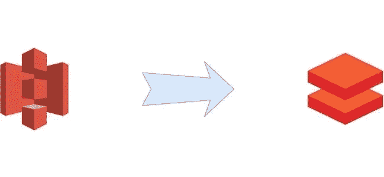

在一个项目中，我必须对来自 Kinesis 流并由消防软管排序的数据流进行一些分析，这项技术允许我们简单地将来自流的数据存储在 S3 中。

要做这些分析，你首先必须从 kinesis 笔记本连接到 S3 桶，然后使用 SPARK 对其进行查询以分发计算。

在这个用例中，我们将使用 databricks 的社区版，它的优点是完全免费。

# 添加新的 AWS 用户

为了能够从我们的 S3 存储桶中读取数据，我们必须提供从 AWS 的访问权限，为此我们需要添加一个新的 AWS 用户:

我们首先转到 AWS IAM 服务->用户->添加用户

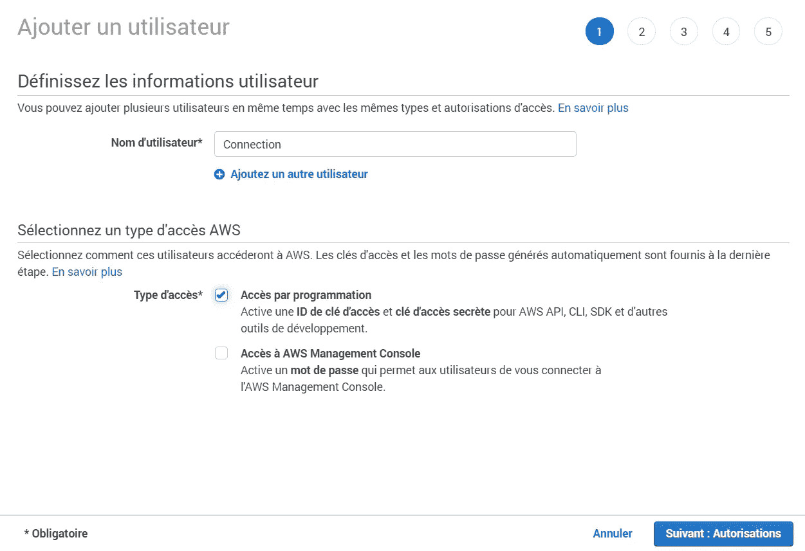

我们输入用户名和访问类型。然后，我们授予该用户访问 S3 的权限。

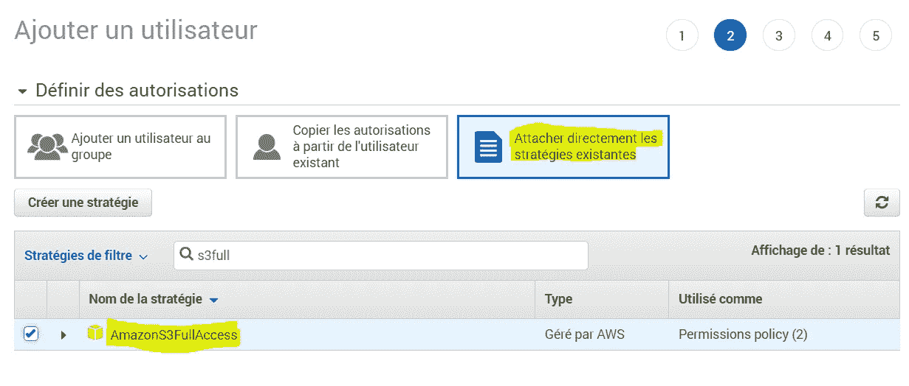

您可以跳过接下来的步骤，直接进入用户验证。

我们点击“查看”并保存这些密钥以备后用。
现在已经创建了用户，我们可以从 Databricks 转到连接。

# 配置您的数据块笔记本

现在我们的用户已经可以访问 S3，我们可以在 databricks 中启动这个连接。
如果你的账户刚刚创建，你就必须创建一个新的集群来运行你的笔记本。转到集群选项卡- >创建集群

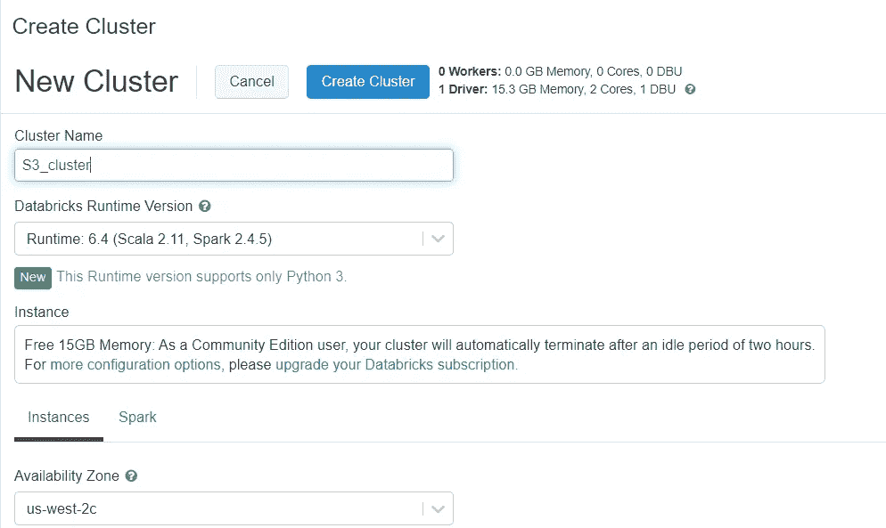

给它一个你想要的名字和一个最新的稳定运行版本。对于本教程，我将使用 Scala 来处理数据。然后点击“创建集群”

现在，您必须创建一个笔记本来运行您的代码。为此，进入工作区->“用户名”->“创建”

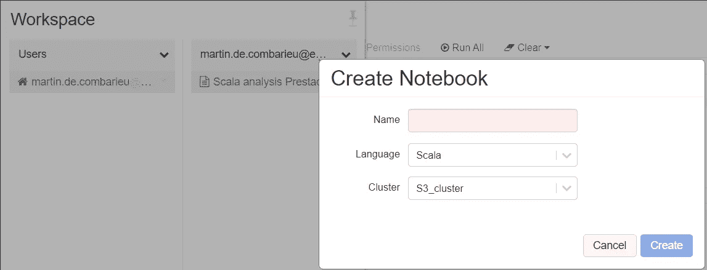

同样，给它起你想要的名字，选择 Scala 作为语言，然后选择你刚刚创建的集群。你准备好做云编码了吗，这很简单，不是吗？

# 从数据块中连接和检索 S3 数据

## 关系

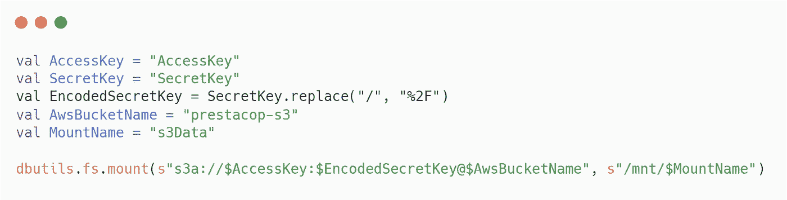

要将您刚刚创建的笔记本连接到您的 AWS S3 桶，您只需将您的访问和密钥替换为您之前创建用户时保存的密钥，记得吗？
您还必须将“AwsBucketName”属性替换为您的 S3 时段名称。
挂载名称正好对应于包含 S3 数据的变量的本地名称。你可以选择你想要的名字。

## 检索数据

要从 S3 存储桶中检索数据，请使用以下代码。

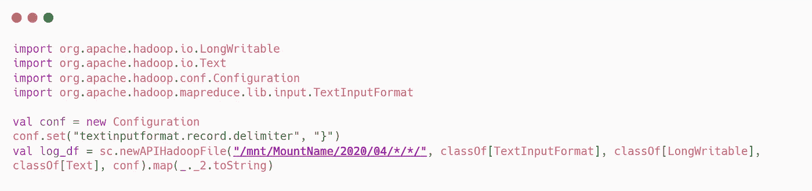

这里只是要注意路径。注意 S3 的存储结构，以便只检索您感兴趣的数据。

现在只需使用这行代码将您的数据转换成一个漂亮的数据集。

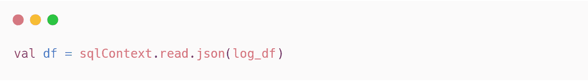

现在，我们准备好发出请求并可视化我们的数据集。准备好了吗？

# 使用 SPARK 实现数据帧的可视化

为了可视化你的数据框架，你只需要在上面提出请求。

这是一个如何使用 SPARK 在数据帧上进行请求的例子

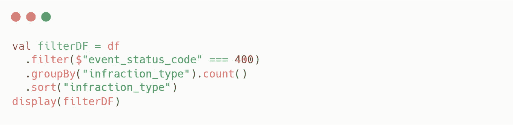

*   **filter** 方法用于选择您感兴趣的数据集部分。
*   **groupBy** 用于根据数据框中的分类列对您刚刚选择的数据进行分组。你必须在它之后使用一个聚合函数，比如**计数**
*   最后一种方法，**过滤器**，顾名思义，允许您根据数据帧中的一列对数据进行排序。

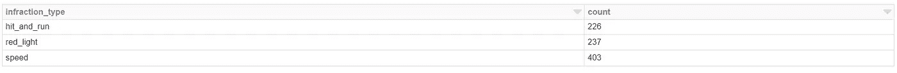

您将获得一个包含已处理数据的表，作为该请求的输出。

为了形象化，你只需点击底部的绘图按钮，选择你想要的绘图类型。

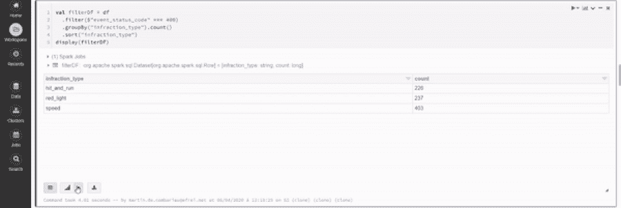

你可以从 databricks 中找到一些关于[数据帧用法](https://docs.databricks.com/spark/latest/dataframes-datasets/introduction-to-dataframes-scala.html)和关于[可视化](https://docs.databricks.com/notebooks/visualizations/index.html)的有趣文档。

一旦你有了一组精彩的情节，你就可以用它来创建一个仪表板。
只需点击 View - > new Dashboard，选择您想要的图表……瞧，您就拥有了一个出色的 Databricks 仪表板。

这看起来可能是这样的:

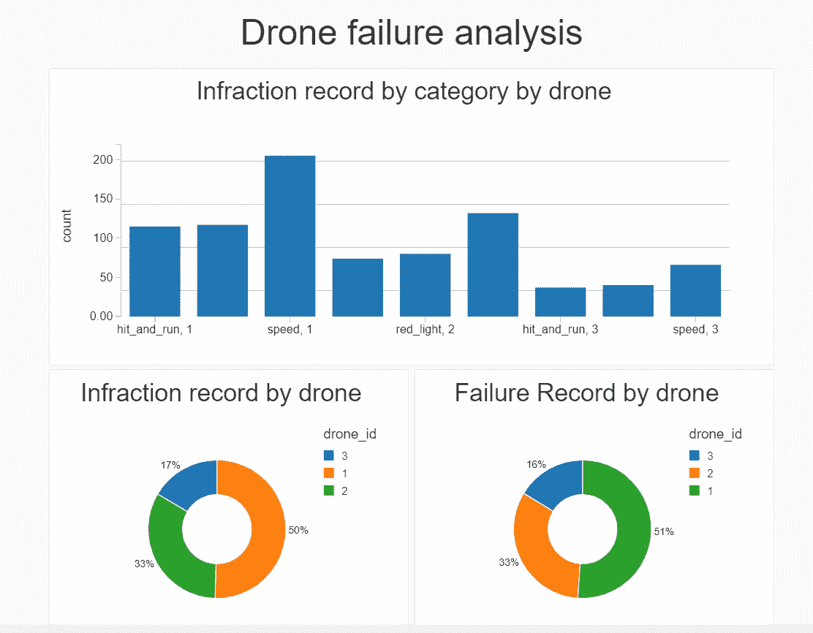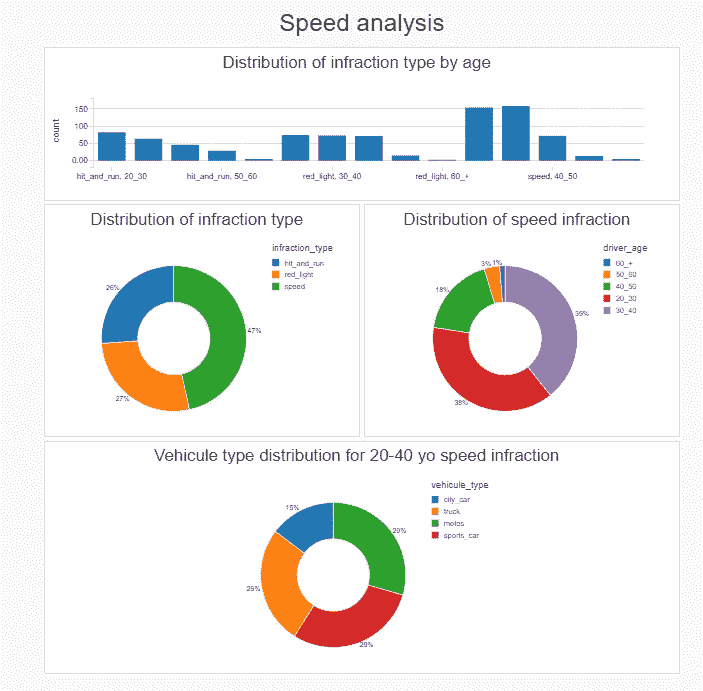

有时很难找到使用这些新的大数据工具的方法。
在本文中，我们一起看了一个详细的用例，如何连接到 S3 桶，并在数据块上创建强大的可视化。
我希望这篇文章能够启发您，并激发您在大数据项目中的创造力。