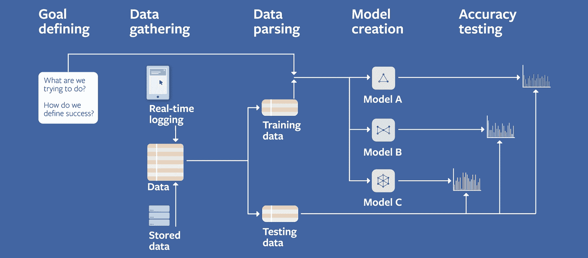

# 我是如何在脸书大学通过 MLE 面试的

> 原文：<https://towardsdatascience.com/how-i-cracked-my-mle-interview-at-facebook-fe55726f0096?source=collection_archive---------0----------------------->

蒂姆·班尼特在 [Unsplash](https://unsplash.com?utm_source=medium&utm_medium=referral) 上拍摄的照片

## [办公时间](https://towardsdatascience.com/tagged/office-hours)

## 我成为 MLE 的旅程

那是去年八月，我正在接受采访。到那个时候，我已经分别面试了谷歌印度和亚马逊印度的机器学习和数据科学职位。然后我的学长建议我申请脸书伦敦的一个角色。

于是我照做了。我在 LinkedIn 上联系了一位招聘人员，他给我介绍了另一位，几天后我就开始了机器学习工程师的招聘过程。

现在，在雇佣机器学习工程师方面，脸书有一个非常不同的流程。他们通过编码、系统设计和机器学习设计面试来选择未来的员工。就我作为数据科学家的经历而言，我对机器学习设计面试相当满意，但其他面试仍然让我感到害怕。我最近没有通过谷歌机器学习软件工程师的第一轮面试，仅仅是因为我没有准备好数据结构的问题。

后来，当我为 FB 编码面试学习时，我意识到我把它看得有点轻，我根本没有为编码面试做准备。

在这篇文章中，我将概述我对所有这些不同面试的方法，以及对于那些对 FB 这样的大机构的 MLE 职位感兴趣的人来说，整个过程是如何进行的。

所以，一旦我和招聘人员联系上了，下一步就是电话面试。

# 1.电话采访:

这是一次非常基本的数据结构面试，也是一次基本的健康检查。我猜 FB 只是想给你更多的时间来准备接下来的几轮，并看看是否值得打电话给你进行现场查房。对我来说，这次视频电话采访持续了 45 分钟。面试官一开始告诉我他在脸书的简介，然后在开始的 10 分钟左右问我的简介。

然后，我有两个非常基本的数组和基于字典的问题要解决。采访者分享了一个 [coderpad](http://coderpad.io) 链接，在这个链接上，我必须在没有任何代码格式选项的情况下，用我选择的任何语言(不是伪代码)无错误地解决这些问题。我也被问及这些问题的基于时间和基于空间的限制。面试的进展是我得出了一个像 O(n)这样糟糕的运行时间，面试官问我是否可以做得更好，并在需要的时候给出提示。

由于我不允许分享确切的问题，我只会分享一些难度相当但不相同的公共 Leetcode 问题给你，以便你可以了解难度水平并相应地练习。

a) [单调数组](https://leetcode.com/problems/monotonic-array/):一个数组是*单调的*，如果它或者是单调递增的，或者是单调递减的。当且仅当给定数组`A`单调时，返回`true`。

b) [有效回文](https://leetcode.com/problems/valid-palindrome/):给定一个字符串，判断它是否是回文，只考虑字母数字字符，忽略大小写。

## ***我这次面试的行动计划？***

这只是我参加的第二次数据结构面试，在第一次表现不佳后，我想做一点准备。因此，我开始使用 Gayle Laakmann McDowell 的《破解编码访谈》一书来理解数据结构的基础知识。这本书也包含了很多准备技巧，你应该谨慎地去阅读它们。我最喜欢这本书的一点是，它非常简洁，不像[托马斯·科尔曼的《算法导论》](https://amzn.to/3mktF5r)，它只是给出了编码采访的适量背景。每一个数据结构都用 2-3 页的篇幅进行了非常简明的解释，一些问题是围绕特定主题解决的，然后给出了一些练习题。这本书还限制了自己，只提供最常被问到的数据结构。例如，AVL 树和红黑树被放在高级部分，而不是在树和图表章节，因为它们在有时间限制的面试环境中不常被问到。

我首先列出了我需要准备的主题清单。你可以准备更多的话题，但这些是面试的最低要求。

**数据结构:**数组、集合、栈/队列、Hashmap/字典、树/二叉树、堆、图。

**算法:**分治、DP/记忆化、递归、二分搜索法、BFS/DFS、树遍历。

然后我继续用《破解编码访谈录》阅读他们，并为他们解决了许多 Leetcode 上的简单问题和一些中级问题。也有其他平台可以在线练习，但我喜欢 Leetcode，因为它没有广告的良好设计和基于类的解决方案编程结构。它还提供了一个很好的方法来搜索各种主题和难度的问题。我还在 Leetcode 上做了很多模拟采访，只是为了练习。我这样做了大约一两个星期，每天花大约 3-4 个小时。

在这段时间里，我还开始审核 UCSanDiego 在 Coursera 上的 [**算法专业，这让我对本科大学教授什么内容来应对编码面试有了一些想法。**](https://coursera.pxf.io/15MOo6)

我也围绕我所学到的东西写了一些博文，试图简单的解释一下。你可以在我的博客上免费查看。

*   [面向数据科学家的链表简单介绍](https://mlwhiz.com/blog/2020/01/28/ll/)
*   [数据科学家的 3 个编程概念](https://mlwhiz.com/blog/2019/12/09/pc/) —递归/记忆化、DP 和二分搜索法
*   [面向数据科学家的动态编程](https://mlwhiz.com/blog/2020/01/28/dp/)
*   [在数据科学算法面试中处理树](https://mlwhiz.com/blog/2020/01/29/altr/)

***TLDR；*** *只要把你要准备的题目记下来，每个题目练很多容易的题就行了。也许还有一些中等的。*

有一次，我完成了电话面试，招聘人员在短短的一天内回来了，并打电话解释了现场面试的过程。 ***现场参观将在伦敦进行，我真的很期待去伦敦旅行。免费旅行。大约还有 5 个回合，这是我接下来要说的。我两个月后就要去面试了，这样我就有时间准备了。不管怎样，签证和整个过程花费的时间比这多一点。***

一到伦敦，我就在 D 日 9 点左右从他们提供的酒店到达了脸书办事处。比预定时间提前了整整一个小时，因为我很紧张，我通常会尽量准时/提前到达面试地点(当我给他们面试机会时更是如此)。我事先知道当天的整个行程，因为我的招聘人员告诉了我。我也知道哪个采访将在什么时间进行，谁将接受采访。事实上，这是我经历过的最有条理的面试。

# 2.现场编码第 1 轮

图片由 [StartupStockPhotos](https://pixabay.com/users/startupstockphotos-690514/?utm_source=link-attribution&utm_medium=referral&utm_campaign=image&utm_content=593370) 来自 [Pixabay](https://pixabay.com/?utm_source=link-attribution&utm_medium=referral&utm_campaign=image&utm_content=593370)

我从事数据科学已经很久了，所以我把 DS 作为数据科学而不是数据结构来读。这次采访对我来说是一个痛点。这是我在两个月内学到的东西，而不是我的全部经历。在这里，我是基于这一点而不是我所有的经验和数据科学背景进行评估的。但正如招聘人员告诉我的那样，他们有非常固定的流程，我不得不通过这些轮次来获得 MLE 职位。所以我就配合了。

至于面试，它准时开始，像以前一样，面试官在进入我的个人资料之前做了自我介绍，然后直接进入面试问题。**有人问我一个中等水平的字符串问题，我能很快解决，还有一个中等水平的二分搜索法问题，花了我大部分时间，但最终我还是解决了。Leetcode 中的一些类似问题(不是相同的问题):**

a) [复数乘法](https://leetcode.com/problems/complex-number-multiplication/):给定代表两个复数的两个字符串。您需要返回一个表示它们相乘的字符串

b) [排序矩阵](https://leetcode.com/problems/kth-smallest-element-in-a-sorted-matrix/)中的第 k 个最小元素:给定一个 *n* x *n* 矩阵，其中每一行和每一列都按升序排序，找出矩阵中的第 k 个最小元素。

面试官还给了我一个在自己的笔记本电脑上编码的选项，因为招聘人员已经告诉了我在白板/笔记本电脑上编码的选项，所以我特意带着笔记本电脑。但是记住他们不允许使用任何代码格式和 ide。我只有一个基本的编辑器来写代码。

## 我的编码面试行动计划？

和电话一样的计划，但是更广泛的远程编码。我记得我连续 30 天都在做 Leetcode，每天大约 3-4 个小时。我过去常常尽可能多地解决中等水平的问题，而很少花时间解决高水平的问题。

# **3。第二轮现场编码:**

直到这个时候，我还处于数据结构的最佳状态，并准备好应对面试官抛给我的任何问题。我的心态是——*“最坏的情况会是什么？”*。所以我只是继续。脸书的人真的很好，他们在每次采访前后都要求提供茶点，并注意不要延长采访时间。很多人认为，每次面试都在需要的时间准时开始，两次面试之间有 15 分钟的冷静期。

同样，一些类似的(不是相同的)问题很难练习，并附有 Leetcode 的简要描述:

a) [基于 API 的问题基于时间的键值存储](https://leetcode.com/problems/time-based-key-value-store/):创建一个键值存储类，支持两个操作——set 和 get。

b) [合并 k 排序列表](https://leetcode.com/problems/merge-k-sorted-lists/):给你一个`k`链表`lists`的数组，每个链表按升序排序。将所有链表合并成一个排序后的链表并返回。

我在这次编码面试中的目标是能够在 40 分钟内解决面试官提出的两个问题。但是，这是一个困难的面试，我花了大部分时间在第二个问题上，这是一个困难的水平。尽管面试官给了我一些提示，引导我找到正确的数据结构和算法。最后，我完全解决了问题 1 和问题 2 的大部分问题。

给受访者的一个建议是，说出你所有的解决方案以及所涉及的时间复杂性，只有当你们双方都同意一个好的解决方案时，才开始编写代码。

此外，通过这两次面试，我发现在工作中与面试官交谈并解释你的方法真的很有帮助。他们有时会提供提示，有时会阻止你走向错误的切线。甚至告诉你的面试官你陷入了什么困境也会对你有所帮助，因为这会给面试官一个信号，告诉他你在往哪个方向思考。这也使得整个面试更具协作性，我认为这是面试官在一个人身上寻找的品质之一。

FB 的食物棒极了。尽管如此，我还是不能享受太多，因为我有点焦虑。照片由[丹金](https://unsplash.com/@danielcgold?utm_source=medium&utm_medium=referral)在 [Unsplash](https://unsplash.com?utm_source=medium&utm_medium=referral) 上拍摄

到目前为止，我对所有的白板编码和一般的面试压力感到有些疲惫，因为快到午饭时间了，我和一个指定的同事/朋友去了脸书自助餐厅。这是你可以询问公司情况的部分，这段时间不在面试之列，所以你可以开诚布公地问一些关于脸书人寿的问题。在脸书自助餐厅，你可以品尝到各种各样的食物。

# 4.系统设计

照片由[杰斯温·托马斯](https://unsplash.com/@jeswinthomas?utm_source=medium&utm_medium=referral)在 [Unsplash](https://unsplash.com?utm_source=medium&utm_medium=referral) 上拍摄

这又是一次我害怕的面试。正如你所看到的，我害怕大部分的面试，因为这对我来说是非常不自然的面试形式。在系统设计面试中，您需要在白板上创建一个端到端的服务。供您练习的一些示例问题如下:

*   你会如何设计网飞？
*   你会如何设计 Youtube？
*   你会如何设计推特/脸书？

虽然这看起来令人生畏，但当你为此做准备时，它实际上是开放的。因为没有错误的答案。

我喜欢这样的面试方式是:

1.  **设计一个非常基本的系统**，类似于平台，具有面试官要求的基本功能。对于大多数平台来说，它包括在白板上绘制服务器、客户机和数据库的方框。
2.  **创建我希望系统具备的功能列表**。例如，在社交网络中关注，或在优步上预订出租车，或在 Whatsapp 上阅读消息时双击，或 Twitter 上的转发功能，或 FB newsfeed 等。谈到功能，天空是无限的，因为我们都已经看到了这些平台提供的功能，所以列出一个功能列表应该不难。
3.  **在整个面试过程中增加特色**，在非常基础的设计上扩展/改变。这可能涉及添加功能，以及讨论缩放、处理边缘情况、讨论涉及的数据结构和数据库、使用缓存等。
4.  **继续添加功能**并通过询问面试官他们希望根据我提供的功能列表添加什么功能来进化系统，直到最后。

## 我的系统设计面试行动计划？

网上有很多很好的资源可以为这次采访做准备，但我想提两个我觉得非常有用的资源:

*   多恩·马丁的《系统设计初级读本》:这是任何准备系统设计的人都应该至少看一遍但老实说要看很多遍的资料。这里要学习的最重要的主题是性能、可扩展性、延迟、吞吐量、可用性、一致性、cdn、数据库、缓存、负载平衡等。
*   Youtube 上关于最受欢迎的服务的各种系统设计的视频:我说的是大的——网飞/Youtube/WhatsApp/脸书/Gmail/亚马逊等。你可以在 youtube 上找到很多关于所有这些服务的系统设计的视频。我绝对想喊出来的一个 YouTuber 是 [Techdummies](https://www.youtube.com/c/TechDummiesNarendraL) ，我在所有这些大平台上都看过他们的视频。至少对我来说，他用最简单的方式解释了概念。

我花了一周的时间来来回回地从观看视频跳到阅读多恩·马丁的知识库，为这次采访做准备，我认为这是正确的方式。此外，理解许多工程师使用的术语也很有趣，所以这也是一次很好的学习经历。

最后，在这次面试中最重要的是，你需要用面试官最少的投入来推动讨论。 有时面试官可能会要求你提供一个特定的功能，你应该实现它，但最终，这是你的系统，你需要以最符合逻辑的方式创建和添加你想要的功能，才能在这一轮中取得成功。

# 5.行为的

这次面试试图考察你是如何处理困难局面的。而且，你可以通过吸收和组织你过去所有的工作经验，你所面临的问题和你设计的解决方案来准备这次面试。你需要收集所有你解决了一个不可能的情况或者没能解决的例子。

米歇尔·邦克斯基在 [Unsplash](https://unsplash.com?utm_source=medium&utm_medium=referral) 上的照片

综上所述，掌控面试的最佳方式就是**做你自己！**

对我来说，这次面试就像是和面试官的一次讨论。他首先介绍了自己和他在 FB 所做的工作。然后他问了我正在做的项目，我们就项目的 ML 部分进行了一个小讨论。然后是一个非常正常的讨论，关于我会如何解决/处理类似“你在职业生涯中犯过什么不值得骄傲的错误？”(这不是我被问到的确切问题)。如果你在准备这次面试的时候能回忆起所有好的和不好的经历，并构思一些小故事，这将会很有帮助。但是最重要的一点还是要诚实，并且是对诸如“你和你的同事有过分歧吗？”这样的问题的一个完全正常的回答如果你没有异议，那就没有。对你的回答要非常诚实，因为这些行为轮的面试官很容易看穿一个说谎的人。

我认为，对我来说，这次面试进行得很顺利。

# 6.ML 系统设计

来源:[脸书 ML 视频系列](https://research.fb.com/the-facebook-field-guide-to-machine-learning-video-series/)

这是一次发挥了我优势的面试，老实说，我并没有为此做太多准备。在这次面试中，我被期望创建一个系统来端到端地解决一个 ML 问题。

在这次面试中，面试官只是在评估你将商业问题转化为机器学习系统的能力。因此，你可能会得到一个问题陈述，比如开发一个系统来使用机器学习创建新闻提要，或者创建一个系统来过滤有害的评论，或者诚实地说，任何机器学习系统。

然后，您需要设计一个端到端的系统，同时讨论数据和数据收集的各个方面、EDA、功能工程、模型评估、模型测试、将模型投入生产以及最后的维护和反馈。

准备这次面试的一个很好的资源来自脸书本身:[介绍机器学习视频系列](https://research.fb.com/the-facebook-field-guide-to-machine-learning-video-series/)脸书现场指南，这是我为这次面试做的唯一准备。

# 那是一天！

这是多么美好的一天。采访结束后，我去了伦敦和特拉法尔加广场，看人们表演各种各样的把戏和滑稽动作。然后步行回我的酒店。

总之，这是一次很好的面试经历，我没想到会对我有好处。数据结构是我从未申请大公司 ML 职位的主要原因，但当我读到它们时，我发现它们非常可行，而且如果你能花些时间，你可以学到一些东西。

因此，一年后，我加入了脸书伦敦公司，担任软件工程师(MLE ),由于 COVID 相关原因，我的加入期延长了。希望这次经历顺利。

## 继续学习

如果你想以更结构化的方式阅读更多关于算法和数据结构的内容，这里有一个由 UCSanDiego 在 Coursera 上提供的 [**算法专门化。**](https://coursera.pxf.io/15MOo6) 我在准备的时候旁听了这门课。

谢谢你的阅读。将来我也会写更多初学者友好的帖子。关注我在 [**媒体**](https://medium.com/@rahul_agarwal?source=post_page---------------------------) 或订阅我的 [**博客**](https://mlwhiz.ck.page/a9b8bda70c) 了解他们**。**

此外，一个小小的免责声明——这篇文章中可能会有一些相关资源的附属链接，因为分享知识从来都不是一个坏主意。

 [## 通过我的推荐链接加入 Medium-Rahul Agarwal

### 作为一个媒体会员，你的会员费的一部分给了你所阅读的作家，你可以在…上看到所有的故事

mlwhiz.medium.com](https://mlwhiz.medium.com/membership)