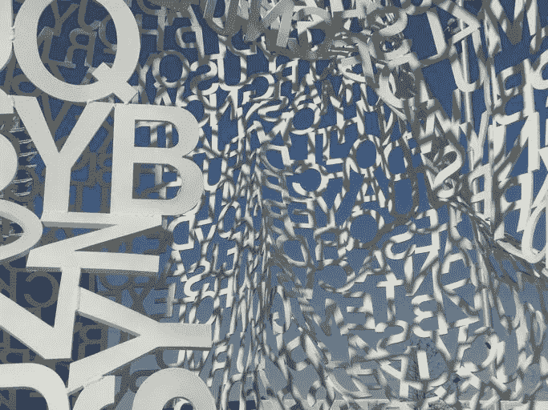

# 我如何创建一个歌词生成器

> 原文：<https://towardsdatascience.com/how-i-created-a-lyrics-generator-b62bde13badb?source=collection_archive---------13----------------------->

## 用人工智能创作热门歌曲



图片: [IB306660](https://pixabay.com/users/ib306660-546673/) ，经由[pixabay.com](https://pixabay.com/photos/lyrics-art-sculpture-thinking-1099741/)(CC0)

网上有很多歌词生成器，虽然玩起来很有趣，但他们创作的歌曲没有多大意义。作为一个真正的人类歌曲作者(我已经写了 100 多首歌)，我想一定有更好的方法来做到这一点，所以我决定利用机器学习的最新进展来建立自己的方法。没有好的方法来教人工智能“歌曲”的概念，但是可以使用 NLP 来训练它模仿你给它看的任何文本。我给它大量的歌曲来学习，最终，它能够输出听起来连贯的歌词。总的来说，该项目涉及了大约 50 个小时的编程，但最终结果是值得的:【https://boredhumans.com/lyrics_generator.php.

以下是我做这件事的细节:

我从微调 GPT-2 开始，这是一个开源语言模型，在超过 800 万个网页上训练，预测文本中的下一个单词。为此，我使用了 [GPT-2 Simple](https://github.com/minimaxir/gpt-2-simple) (它有一个链接，任何人都可以通过谷歌 Colab 在免费的 GPU 上运行它)和一个包含 [13，000 首诗歌的数据库](https://www.kaggle.com/tgdivy/poetry-foundation-poems)。我原本打算在我下载的 400，000 首歌词的数据库上训练它，但其中许多都有脏话，性内容，毒品参考和其他不适合孩子的东西，我不想让我的模型学习所有这些。另外，我希望我的版本听起来比其他网站更“聪明”，所以使用诗歌似乎是一个更好的计划。

一旦我让它很好地用于创作诗歌，我就对我认为有诗意的艺术家(如鲍勃·迪伦、U2、泰勒·斯威夫特和几十个其他艺术家)的 7000 首歌词进行了更多的微调。但结果仍然是诗歌，所以我添加了一堆非 ML 的后期处理步骤，使它看起来更像宋立科的歌词。在 GPT-2 产生原始内容后，我使用前 6 行，称之为“第 1 节”，然后接下来的 4 行是“合唱”，然后接下来的 6 行是“第 2 节”，然后为了让合唱听起来像合唱，我再次重复第一个合唱。我还做了其他各种各样的小调整，比如过滤掉 r 级内容，删除原始歌词的最后一行，因为大部分时间它都没有完成(被剪掉)，如果歌曲在所有删除后变得太短，则获得一套全新的歌词。有时它有像[重复合唱]或(乐器间歇)这样的短语，这是不好的，所以我也自动删除了这些台词。所有这些任务都是通过简单的 PHP 编程完成的，比如使用 str_replace 去掉我不想显示的各种字符:

```
$title = str_replace("/", "", $title);
```

这是为了删除重复太多的行:

```
// find repeated lines
  for ($i = 0; $i < count($words); $i++) {
    if (str_word_count($words[$i])) {
      if ($counts[$words[$i]] > 5) array_push($repeated_lines, $i);
    }
  }
  // remove repeated lines
  for ($i = 0; $i < count($repeated_lines); $i++) {
    if ($i > 3) {
      unset($words[$repeated_lines[$i]]);
    }
```

找出给每首歌起一个标题的最佳方式比我预想的要困难得多。有时人类词曲作者很难做到这一点，我不确定 ML 模型可以训练得很好，所以相反，我选择创建一些硬编码的规则来选择标题。我主要使用重复最多的行，但有限制，不能太短或太长。

这一切变得复杂的一个原因是，它是一个网站，而不仅仅是一个普通的 Python 程序。简单地找出将 Python ML 模型部署到 web 的最佳方式是一场磨难，因为它对于 Google Cloud Run 或 AWS Lambda 来说有点太大了，而在常规 AWS 服务器上运行它又太昂贵了。我最终使用了 AWS LightSail，它就像一个普通的 web 主机(如 DigitalOcean)，但仍然具有普通 AWS 的许多优点。

此外，一旦部署了模型，还需要做更多的工作，使用 PHP 和 JavaScript/Ajax 使它真正发挥网站的功能。让我的 PHP 页面与 ML 模型(使用 Starlette/uvicon[类似于 Flask])的 REST API feed 一起工作时，我遇到了无尽的 CORS 跨域问题。它涉及到一些修复，比如向 Python API 部分添加如下代码行:

```
middleware = [Middleware(CORSMiddleware, allow_origins=['*'])]# Needed to avoid cross-domain issues
response_header = {'Access-Control-Allow-Origin': '*'}
```

并引用我的服务器的 SSL 证书，如:

```
if __name__ == '__main__':
    uvicorn.run(
        app,
        host='0.0.0.0',
        port=int(os.environ.get('PORT', 6006)),
        ssl_version=ssl.PROTOCOL_SSLv23,
        ssl_cert_reqs=ssl.CERT_OPTIONAL,
        ssl_keyfile="./ssl/server.key",
        ssl_certfile="./ssl/server.crt"
    )
```

我的计划是最终将人工智能生成的音乐和人工智能生成的人声添加到歌词中。我已经试验过最先进的音频程序，比如谷歌的 [Magenta](https://magenta.tensorflow.org) ，虽然它确实输出好听的音乐，但远远达不到创作一首真正的歌曲所需的水平。加入人声更是难上加难，因为除了努力让它听起来像歌手而不仅仅是普通的电脑声音，歌词还必须与旋律/音乐同步。理想情况下，所有这些都可以自动生成，以配合人工智能歌词，然后我将有一首完整的歌曲从开始到结束，所以这是我接下来要做的。