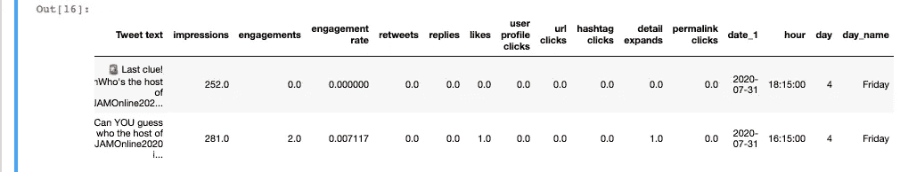
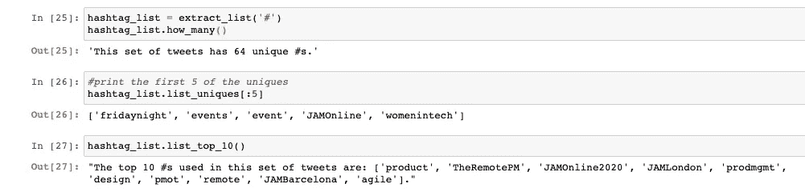
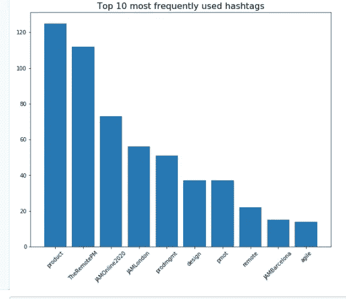
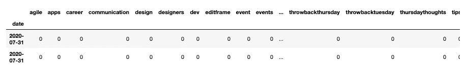
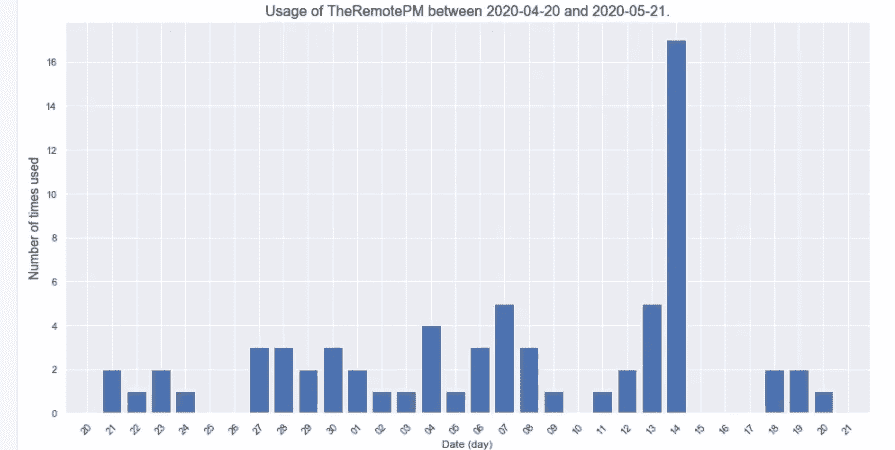
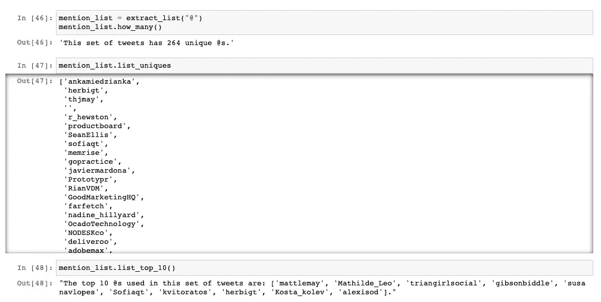
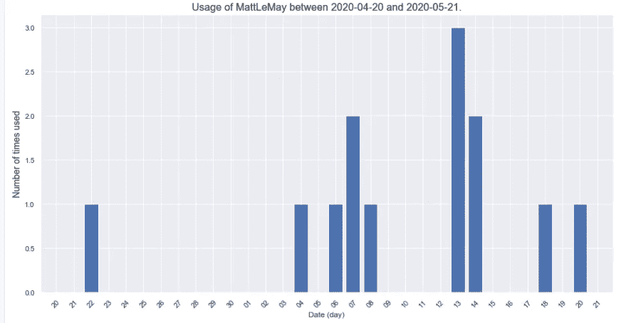

# 统治他们的标签👉分析公司推文

> 原文：<https://towardsdatascience.com/how-i-created-a-monster-function-to-discover-our-brands-twitter-best-friend-556f2c90dbb4?source=collection_archive---------42----------------------->

## **Twitter 标签和提及的数据分析(带酷炫功能&剧情！)**


扬·巴布拉克在 Unsplash 上拍摄的照片

我们匆匆忙忙，很少停下来闻闻花香。斯多葛派告诉我们要思考我们生活的更大图景，我决定停下来分析我们品牌的 Twitter 账户的更大图景。

我们可以将这种数据分析诗意地命名为💐*碎花的味道*。

# 目标

可以用 Twitter 数据做很多事情，相信我，我几乎用尽了所有方法来折磨它(见[笔记本的当前版本](https://github.com/Laodamia/Data-Portfolio/blob/master/Twitter-data/JAM-Tweets.ipynb))。但是，在这篇文章中，我们将关注标签和提及的频率和使用。很快会有其他关于这些*美味* *话题*的帖子，比如相关性、表情符号和一周中最悲伤的日子。

# 👉让我们开始吧:数据集

该数据集已从 Twitter Analytics 下载，涵盖时间为 2020 年 4 月至 9 月。尽管我很想拥有更多，但 Twitter 并不存储更早的数据，或者即使存储了，也不会向账户所有者公开。

该数据集包括账户@ [makingjam](https://twitter.com/makingjam) 在此期间发送的所有推文。我的大部分推文都是我写的，因此任何后续的文本分析都将是对我营销头脑和幽默感的洞察——做好准备。

# 😩第一步:一团糟

一开始非常顺利，我们用这个简洁的脚本将所有单独的 csv 文件读入一个数据帧。

我们得到的结果是**一个 529 行 40 列的杂乱数据帧**。我会帮你省去所有的清洁工作，你可以在笔记本上看到。重要的是我们掉了一个没用栏目的调子。

让我们来玩玩**我们“最喜欢”的数据类型**、*日期时间*。

我们要做的是:

*   创建格式正确的日期和小时列，这在以后会很重要。
*   为一周中的每一天添加两列:一列用数字表示，另一列用友好的字符串表示。

现在，数据框的前几行如下所示。



在我们继续之前，我们还将添加两列来保存每条 tweet 中的标签数和被提及次数的值。

# 🐲第二步:进入怪物功能

我们想从数据框中的文本中提取很多内容。对于标签和提及，我们分别需要:

*   一张**所有人的名单**
*   独特标签或提及的**数量**
*   一个**集**的独特之处
*   具有使用频率的数据帧*
*   十大最常见的

**可能是字典。请随意重写我的 monster 函数，以包含一个字典和一个元组来完成返回数据类型的列表。👌*

> 为了检索整个 this^，我写了一个函数的怪物。对我来说，那是个怪物。

**我的额外收获**是实例化一个类和对象。如果我所做的方式或者它在函数中的事实对于那些更精通 Python 的人来说是很糟糕的事情，请告诉我。老实说，这是我第一次在辅导课之外做这件事。

现在我们可以得到关于标签的所有统计数据。多么快乐！



分享一个截图，而不是一系列的短片。我希望你原谅我。

**🍬剧情！**

请记住，我们还有一个完整的数据框架，其中包含了标签的频率。*什么意思？对 pyplot 和 seaborn 粉丝的款待——我们可以策划他们！*

输出:



> 猜猜做果酱的牌子是关于什么的！

没错，我们使用的热门标签反映了真相:[**制作果酱**](https://www.makingjam.io/events) **是关于产品管理**(和事件)**。**此外，我们在推特上发布的数据框涵盖的事件包括 JAM London、Remote PM 和 JAM Barcelona。

# 🔎第三步:放大标签

> 如果我们希望看到的是绘制一个特定标签在特定时间段内的使用情况呢？

请便！

首先，我们必须创建一个列来保存每条 tweet 中使用的所有标签。为此，我们创建了一个函数，它的名字就像是西尔维斯特·史泰龙的一部电影的标题。💪

为了规划所选标签的使用，**我们需要对文本**进行矢量化——创建一个稀疏矩阵，反映哪个标签出现在哪个推文中。要做到这一点，我们只需要带有标签的文本列，但我们需要日期来绘制结果。

输出:



是的，数据帧大部分是零。**看起来很无聊，但它非常有用，**因为现在我们可以绘制一段时间内所选标签的使用频率。🎉

你可能已经注意到，我编写这些函数的方式可以在以后重用，以获得相同的提及统计。🤔向前思考🤔

让我们用标签来描述发生在 2020 年 5 月的远程总理事件。

```
plot_usage(hahstags_vectorized, ‘TheRemotePM’, date1=’2020–04–20', date2=’2020–05–21')
```

🙋‍♀️给 5 岁孩子的问题:*你能猜出远程预防性维护发生在哪天吗？*

输出:



**🎖最常用的标签**

我们可能还想知道特定时间段内使用最多的标签。

```
most_used_h_or_m(hahstags_vectorized, '2020-06-01', '2020-06-30')
```

输出:

```
('product', 14)
```

也是整个集合中使用最多的 hashtag。

变量‘earliest _ tweet’和‘latest _ tweet’是在笔记本的开头定义的。

输出:*整个数据集使用最多的 hashtag 是:product，有 127 次提及。*

**💁‍♀️结论:**这些推文大部分都是关于产品的，*omnia product 的 product um*，套用一句著名的悲观名言。

# 💙第三步:我们推特上最好的朋友

这一部分会更短，因为我们已经有了所有的函数，我们可以重复使用来处理提及。如果你读到这里，我敢肯定你已经迫不及待地想要了解这个数据集中提到的所有数据。

让我们在@上部署怪物功能。



分享一个截图，这样你就可以同时看到代码和输出，否则会有太多的小片段。

这里有一些很酷的人和团体！向[马特·勒梅](https://medium.com/u/7d4a06b66d0a?source=post_page-----556f2c90dbb4--------------------------------)，[玛蒂尔德·利奥](https://medium.com/u/2aa9fa907007?source=post_page-----556f2c90dbb4--------------------------------)，[三角女孩](https://medium.com/u/4b9603ea82b?source=post_page-----556f2c90dbb4--------------------------------)，[吉布森·比德尔](https://medium.com/u/370100ca0fe1?source=post_page-----556f2c90dbb4--------------------------------)，[苏珊娜·维黛拉·洛佩斯](https://medium.com/u/1e122aa70a10?source=post_page-----556f2c90dbb4--------------------------------)，[索菲亚·金特罗](https://medium.com/u/4807d9f6f139?source=post_page-----556f2c90dbb4--------------------------------)，[蒂姆·赫比格](https://medium.com/u/224ba94371b0?source=post_page-----556f2c90dbb4--------------------------------)，[科斯塔·科列夫](https://medium.com/u/1fbe126d2f44?source=post_page-----556f2c90dbb4--------------------------------)，[亚历克西斯·奥德修斯](https://medium.com/u/4a0af8fede58?source=post_page-----556f2c90dbb4--------------------------------)。

接下来,“西尔维斯特·史泰龙函数”再次进入，创建一个包含提及列表的列，作为向量化的准备步骤。

矢量化！

输出:



这个图和同一时期的标签图有明显的相似之处。🤔

> 马特·勒梅和远程首相有什么关系？

💁‍♀ ️He 是东道主！

最后一步:

输出:*整个数据集中使用最多的提及是 mattlemay，有 37 次提及。*

我承认这里的措辞有点客观化，抱歉马特。但是，我们也认为你是我们 Twitter 上最好的朋友！至少在数据集覆盖的时间段内是如此。

# 👀下一步是什么？

我将每月从 Twitter analytics 下载一个新的 csv 来扩充数据集。我很确定那里有自动化的空间。而且，也许一旦我掌握了画面——看这个空间！—可能会出现相应的操控板。

这是一系列帖子中的一篇，灵感来自我们品牌的 Twitter 数据集。您可以在此了解更多信息:

*   [🙋‍♀️Does 表情符号的使用与推特互动相关吗？](https://medium.com/swlh/%EF%B8%8Fdoes-emoji-use-correlate-with-twitter-engagement-388775467be)
*   [😭Twitter 上最悲伤的一天:情绪分析&公司推文中的参与趋势](/the-saddest-day-on-twitter-sentiment-analysis-engagement-trends-in-companys-tweets-1b2f4f2789e1)
*   [😅你有多重复？使用 Python 揭示推文中的单词模式](https://medium.com/@krzem_m/how-repetitive-are-you-using-python-to-reveal-word-patterns-in-tweets-7c6107bb72b)。