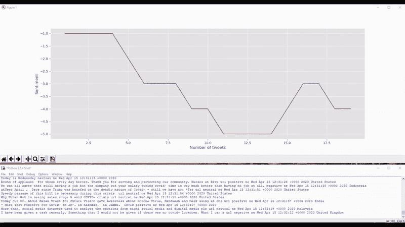
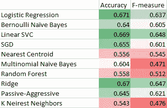

# 我如何为 COVID 创建一个实时的 Twitter 情绪分析工具

> 原文：<https://towardsdatascience.com/how-i-created-a-real-time-twitter-sentiment-analysis-tool-for-covid-292ff6a6323b?source=collection_archive---------26----------------------->

## 利用机器学习和 Python，我开发了一个模型，将关于 COVID 的推文分为正面、负面或中性。

Twitter 是最成功的微博服务，每天有 1.5 亿用户。每秒钟写 6000 条推文。人们在推特上发布任何想到的东西，并使用标签将推文与主题联系起来。

我们可以建立一个机器学习分类器，根据他们的情绪对推文进行评级。一条推文可以表达积极、消极或中性的情绪。

我将创建一个简单的模型来实时分类此类推文，并为 COVID 的整体情绪创建一个图表。人们对这种病毒有什么看法？

# 1.资料组

首先，我需要一个已经分类到三个类别之一的推特数据集来训练我的模型。Sem-eval 提供了一个相对较大的数据集，包含 65.854 条已标记的推文。因为没有特定于 COVID 的 twitter 数据集，所以我将使用一个通用的 twitter 数据集。

# 2.文本预处理

接下来，我将使用 [16 种预处理技术](https://github.com/Deffro/text-preprocessing-techniques)的组合来预处理推文。tweet 的初始形式不适合自然语言处理(NLP)。推文不干净，包含 URL、用户提及、俚语、缩写、数字、重复的标点符号、拉长的单词等。
因而有这样一段文字:

> 呆在家里！！注意安全！！保持快乐！！活下去。我们可以和 https://t.co/SEpa9yxg87 一起战斗

会变成:

> 呆在家里多感叹保持安全多感叹保持快乐多感叹保持活力。我们可以用 COVID-stayhomestaysafe stay health 网址战斗

# 3.机器学习

我在预处理过的数据集上训练了 10 个机器学习模型。我选择不使用深度学习模型(如 BERT ),因为我不是专家。因此，我使用了逻辑回归、朴素贝叶斯、K 近邻、随机森林和支持向量机等模型。后者在性能(f-measure)上胜过其余的，我选择了它。

执行了列车测试分割(20%测试)。TF-IDF 矢量器将文本标记转换为数字，未删除停用词，分类的性能指标如下所示。

ML 模型的性能。

我选择了线性 SVC，并对整个数据重新训练了模型。我记得在过去，支持向量机是 NLP 的最新技术！被训练的模型被保存在困境中。

# 4.实时预测

为了实时获取推文，我需要一个账户和一个 api 密匙。接下来，我可以选择关键词，只有包含这些关键词的推文才会被返回。我选择了“covid”作为关键字。

当从推文流中获取一条新推文时，经过训练的模型会预测其情绪，并将该推文保存在文本文件中。

与此同时，一个脚本正在运行，随着更多的数据添加到文本文件中，该脚本会实时绘制文本文件的内容。它使用 matplotlib 的动画功能来刷新情节。如果推文是正面的，y 轴得到+1，如果是负面的-1，中立的+0。

这是:

实时推特情感分析。

可以看出，在 1000 条关于 COVID 的推文之后，整体情绪是-80。

可以为任何关键词生成相同的实时图，脚本可以全天候运行以收集和标记推文。

感谢阅读！