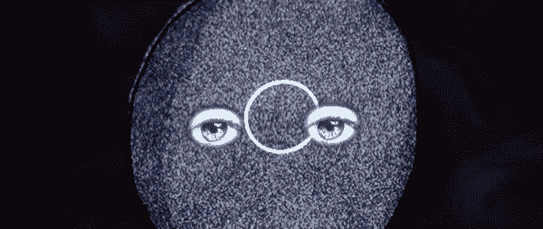
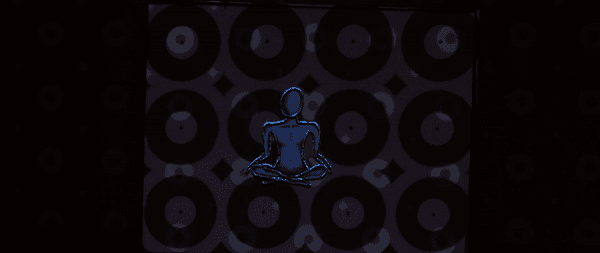

# 我如何用投影贴图制作短片

> 原文：<https://towardsdatascience.com/how-i-created-a-short-film-with-projection-mapping-8a950462509b?source=collection_archive---------35----------------------->

## 我使用 Lightform 对我的画进行投影映射，以创建一个短片，并对神奇的结果感到完全敬畏。

图片来源:基拉·布尔斯基(作者)

在隔离期间，我花了很多时间进行艺术实验和创作。3 月 27 日的周末，我参加了虚拟的[被困在家里的 48 小时电影项目](https://48hourfilm.com/at-home)。我有整整 48 小时来制作一部完整的短片。这将是我的第十五个 48 小时电影项目…你可以说我有点痴迷。为了迎接挑战，我决定把这个项目作为一个机会，更深入地研究投影制图。

*如果我创作了一部完全投影映射的电影，会发生什么？*

视频鸣谢:基拉·布尔斯基(作者)

## 什么是投影映射？

**投影映射**，也被称为空间增强现实，是一种投影视觉互动并适合非平面三维表面的技术。你可以投影地图日常物体，建筑物，花卉，人-任何你能想象的，你可以投影地图！点击，通过投影映射中心[了解更多信息。](http://projection-mapping.org/what-is-projection-mapping/)

## 什么是光形态？

[Lightform](https://lightform.com/) 简化了美国创意人员的投影映射流程。他们设计了一个应用程序，就像 Photoshop 在真实的非数字世界中处理光线一样！太令人兴奋了。我完全爱上了这家公司。

“新思想/无思想”制作过程中的光形式应用——图片来源:基拉·布尔斯基(作者)

> Lightform 简化了美国创意人员的投影映射流程。他们设计了一个应用程序，就像 Photoshop 在真实的非数字世界中处理光线一样！太令人兴奋了。

> “Lightform 是一种新的设计工具，允许任何人创建投影增强现实体验。投影增强现实使用投影仪为现实生活添加数字信息和神奇效果。与目前的 AR 和 VR 形式不同，投影的 AR 可以用肉眼看到，不需要耳机或手机。
> 
> 我们希望设计一个未来，在那里数字艺术和信息可以无缝地融入现实生活，不受矩形屏幕的限制。"
> 
> -轻型

视频鸣谢:基拉·布尔斯基(作者)

## Lightform 工作原理的简化版本:

*   投影仪发出一系列结构光，摄像机扫描场景。
*   Lightform 软件从这个过程中收集深度数据。
*   有了这些数据，您使用 Lightform 设计的投影可以无缝地交互并集成到您的真实环境中。纯魔法！

# 电影概念

在“新思想/无思想”中，一幅画意识到她生活在一张纸上，并经历了意识的转变。

视频鸣谢:基拉·布尔斯基(作者)

我受到启发，讲述了我心理健康之旅的故事。通过冥想，我经历了对现实感知的转变。我已经超越了我曾经认为的现实范围。用语言描述这种经历是相当困难的，但它是美丽的，给人以生命。这部电影是我描绘那段经历的尝试。

物理图纸上的增强现实投影感觉像是一种非常合适的媒体，可以用来描绘一个人对现实感知的扩展。

视频鸣谢:基拉·布尔斯基(作者)

> 物理图纸上的增强现实投影感觉像是一种非常合适的媒体，可以用来描绘一个人对现实感知的扩展。

视频鸣谢:基拉·布尔斯基(作者)

# 过程

在构思出概念和故事板之后，我能够将视觉效果缩小到五幅关键的图画。这些画是我的主要镜头，我将在上面投影贴图。

图片来源:基拉·布尔斯基(作者)

我把图纸留得很简单，让自己在投影设计上更灵活。我可以给线条画添加生命和运动。

视频鸣谢:基拉·布尔斯基(作者)

接下来，我利用 Lightform 扫描我的图纸并设计投影。我利用了 Lighform 的一些内置效果和纹理，并获得了额外的免版税动画和剪辑(如窗口中的日落延时剪辑)。

视频鸣谢:基拉·布尔斯基(作者)

我还为其中一个场景绘制了投影图！说到混合现实…被投影映射是相当令人神往的。

视频鸣谢:基拉·布尔斯基(作者)

我拍摄了整张纸的“宽”镜头以及脸部特写和其他投影细节，以便在 Adobe Premiere 中进行编辑。

# 最终的电影

这是最后一部电影“新思想/没有思想”，全部在 48 小时内完成！

# 结论

在相机上捕捉投影贴图是一回事，但亲自体验它会让它达到一个全新的水平。投影映射有许多令人兴奋的可能用途:交互式装置、电影制作、现场表演等等。

我有一系列即将到来的项目，在这些项目中，我将进一步试验这项技术。说我很兴奋是一种保守的说法。请随意伸出手来，跟随我的冒险之旅。我把神奇的创意传递给你。

视频鸣谢:基拉·布尔斯基(作者)

[基拉·伯斯基](http://www.allaroundartsy.com/)是一名电影制作人、多学科艺术家和魔法探索者。她的电影在 YouTube 上有超过 1800 万的浏览量，并在全球放映。