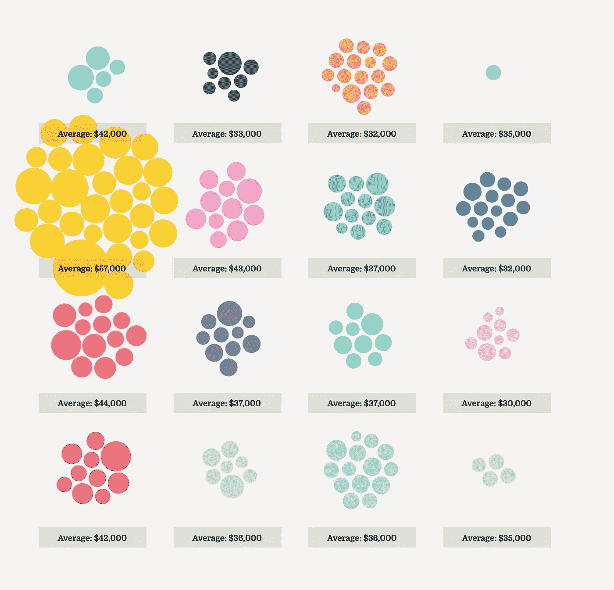
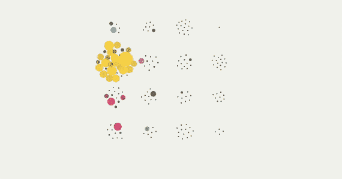
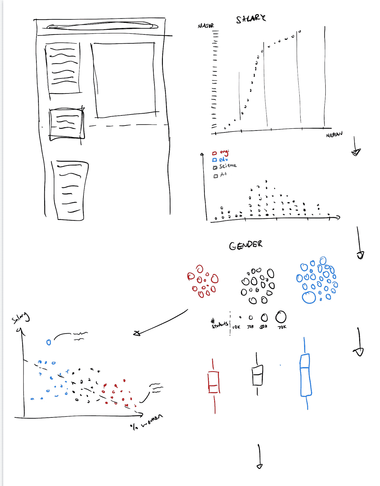
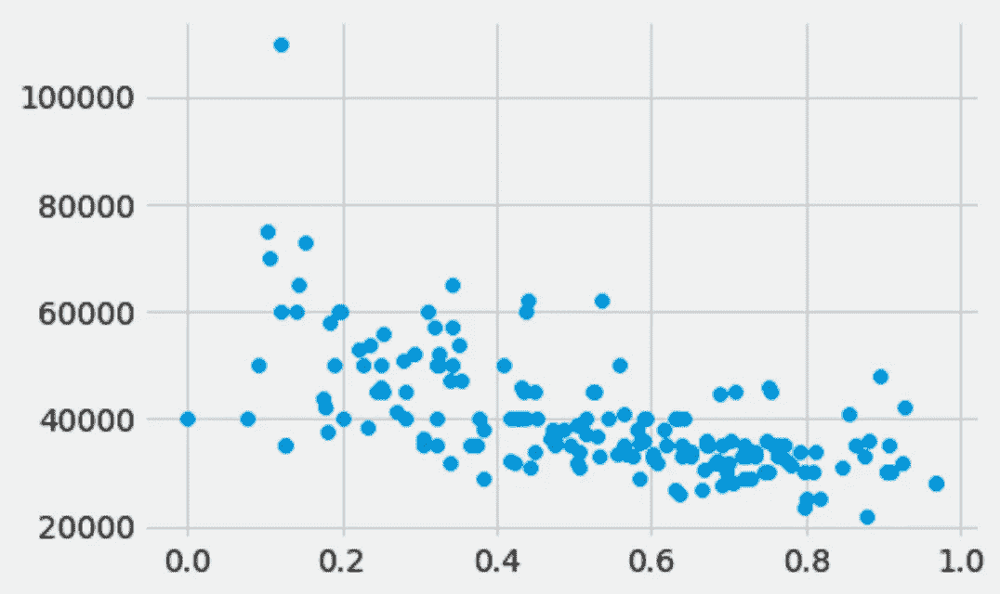
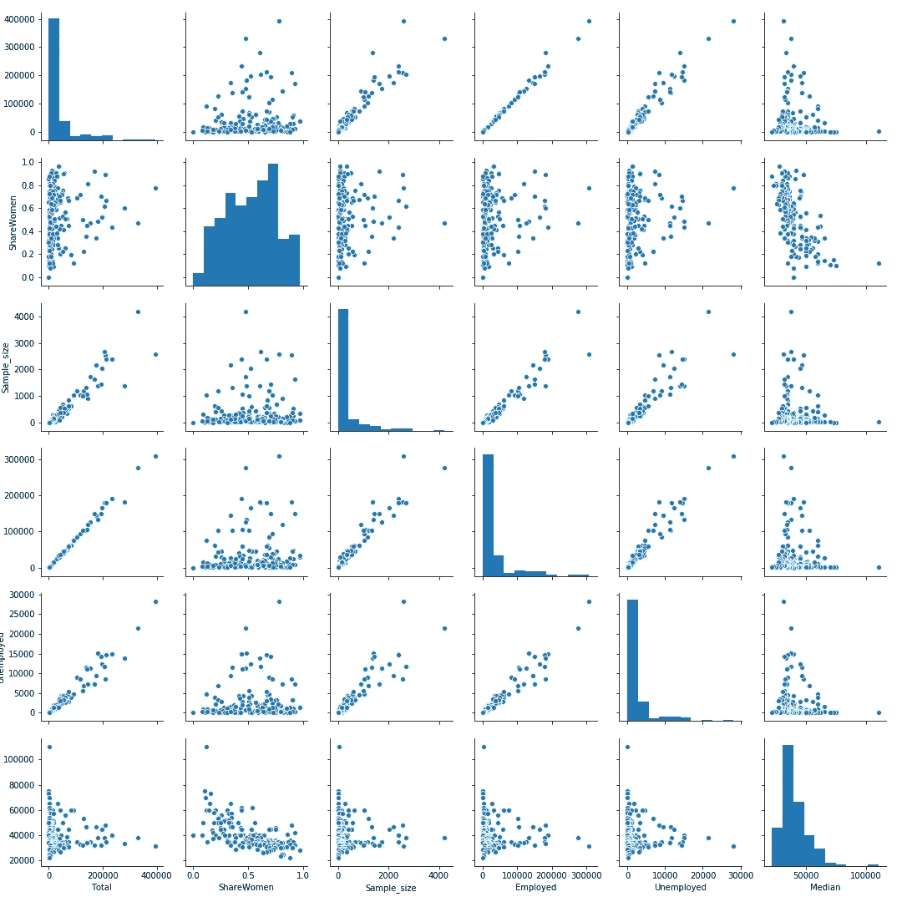

# 我如何用 D3.js 创建了一个交互式的滚动可视化，你也可以

> 原文：<https://towardsdatascience.com/how-i-created-an-interactive-scrolling-visualisation-with-d3-js-and-how-you-can-too-e116372e2c73?source=collection_archive---------2----------------------->

## 通过交互式和可滚动的可视化，让您的故事栩栩如生，这通过出色的 D3.js 库成为可能



按类别划分的大学专业



动画版

 [## 最佳大学专业

### 大多数人想要一个能让他们毕业后赚大钱的学位。这里是(几乎)所有的…

cuthchow.github.io](https://cuthchow.github.io/college-majors-visualisation/) 

*   [可视化](https://cuthchow.github.io/college-majors-visualisation/)
*   [代码(Github Repo)](https://github.com/cuthchow/college-majors-visualisation)

# 动机

网络上充斥着滚动和交互式可视化的惊人例子，通常是用 D3 构建的。如果你读过《彭博》或《纽约时报》的这类专题文章，我肯定你知道我在说什么。我最喜欢的这种形式的例子有:

*   Shirley Wu 的[对汉密尔顿](https://pudding.cool/2017/03/hamilton/index.html)中非常线的示范性可视化，用 D3 和 React 构建。事实上，她所有的工作都很出色。
*   《纽约时报》关于经济如何被衰退重塑的文章，用 255 个不同的图表讲述。
*   这个[绝对令人难以置信的作品，可视化了机器学习](http://www.r2d3.us/visual-intro-to-machine-learning-part-1/)的内部机制，由 R2D3 的人创造。
*   这种古怪的形象化，分解了我们每天消耗的水量
*   《纽约时报》的另一篇文章，描述了[背信弃义地爬上埃尔卡皮坦的黎明之墙](https://www.nytimes.com/interactive/2015/01/09/sports/the-dawn-wall-el-capitan.html)
*   还有[这么多更](https://vallandingham.me/scroll_talk/examples/)。
*   说真的，这些项目中的每一个都值得检查和学习。他们太棒了。

每一次滚动事件后，视觉元素的行为方式令人满意，完全受你的控制。很多时候，当我上下滚动页面，看着所有的形状和颜色飞来飞去，我的脸上挂着灿烂的笑容。这种感觉让人想起自己发现了数据中的秘密，我相信这是这些演示如此令人信服的原因。它还提供了一个更具命令性的叙事流程，这在其他静态作品中是缺乏的。浏览这些文章，你可能会发现自己制作这样的视觉效果会非常复杂，你可能会认为它们最好留给顶级出版物的编辑和作者。但我在这里帮助消除这种观念:任何人都可以做一个，包括你！

在通读了一堆在线资源之后(我会在文章末尾列出这些资源)，我决定尝试自己创建一个。正如我之前提到的，学习一项新工具、技术、技能或能力的最好方式是在你知道自己是否有能力做这件事之前，就把它投入使用。这就是我在一周内所做的。

(本文假设您对 D3.js 及其工作原理有一些基本的了解)

# 项目描述

在浏览了一系列数据集后，我找到了一个托管在 Kaggle 上的数据集，它最初来自分析博客 Fivethirtyeight(如果你正在寻找很酷的数据集，请查看[谷歌的数据集搜索工具](https://datasetsearch.research.google.com/))。这是一个(有点过时的)关于美国大学专业的数据集。它有每个大学专业的注册人数的信息，以及这些学生的中位数，第 75 个百分点和第 25 个百分点的工资。有趣的是，它还提供了每个专业的男性/女性代表的信息，我认为这将是这篇文章的一个重点。

决定数据集后，我开始在 Jupyter 笔记本上使用 Python 和 Pandas 探索数据，寻找任何有趣的趋势或我想在可视化中强调的点。我还对我想在最终产品中展示的图表做了粗略的近似。



我匆忙拼凑的几张草图，只是为了大致勾勒出我希望达到的叙事流程

我对观想的总体概念是，每个大学专业都用一个泡泡来代表。然后，气泡会根据我试图强调的数据类型(如性别差异、工资中位数、类别分组等)改变形状和颜色。).当气泡被特定的属性分组时，我想通过一个 D3 力模拟来实现，这样气泡看起来会被一个看不见的力吸引。



我用 matplotlib 制作的性别分布与工资中位数图表的预览。我在研究这些数据，看看是否有有趣的趋势需要强调，这是其中之一

经过一番探索，我知道我想关注的是专业内的性别分布对毕业生平均工资的影响。我强烈建议你在开始任何可视化过程之前深入研究你的数据，因为在真正坐下来编码最终产品之前，你想要有一些你脑海中的交互的表象。

如果您想要一种真正快速的方法来观察变量之间的关系，python 可视化包 seaborn 有一个“pairplot()”方法来帮助您做到这一点，它会在传递给它的数据帧中的所有变量之间创建一个散点图矩阵。

```
**#Plotting a scatter matrix**import seaborn as snsfactors = df[['Total', 'Major_category', 'ShareWomen', 'Sample_size', 'Employed', 'Unemployed', 'Median']]sns.pairplot(factors)
```



根据数据子集创建的配对图示例

现在我们对想要包含的东西有了一个坚实的想法，我们准备开始创建。

# 处理滚动事件

这(显然)是你构建的每个滚动条中最重要的部分。但方便的是，它也是最可重用的部分，这意味着一旦构建完成，就可以开始使用了。

事实上，我已经创建了一个滚动条功能的模板版本，你可以在这里找到它。(再次感谢吉姆·瓦兰丁汉姆，因为使用的大部分代码来自他的原创文章[。事实上，他写了一篇关于创建滚动器的类似文章，重点是滚动机制，所以你应该先读一下。在这篇文章中，我将把重点放在我发现令人困惑的元素上，并把重点放在实际创造观想的部分上。](https://vallandingham.me/scroller.html)

## HTML 和 CSS 大纲

整个可视化应该包含在一个 HTML 页面中。在页面中，有一个包含所有元素的 div，在这个 div 中，有两个单独的 div 用于文本和可视化。

在“sections”div 中有一组 section 元素，每个元素都有一个类“step”。这些部分中的每一个都应该包含一个不同的文本部分，并且对应于观想的一个阶段或部分。当用户在部分之间移动时，可视化将被更新，

```
<div id="graphic"> <div id="sections"> <section class="step"></section>
         <section class="step"></section> </div>
    <div id="vis"> </div>
</div>
```

您可以随意调整这些元素的大小和位置，只要您将#vis 元素固定在页面上(使用 display: fixed)，这样它就不会随着用户的滚动而移动。您也可以调整每个的高度。step 元素基于您希望每个部分包含多少文本。

## 滚动事件

下面是处理滚动事件的代码。我添加了一些注释来澄清某些部分。

```
function scroller(){ let container = d3.select('body')
  let dispatch = d3.dispatch('active', 'progress');
  let sections = d3.selectAll('.step')
  let sectionPositions
  let currentIndex = -1
  let containerStart = 0;**// Binds the position function to the scroll event, and the resize function to the resize event. What these functions do are detailed below.**   function scroll(){ d3.select(window)
      .on('scroll.scroller', position)
      .on('resize.scroller', resize) resize(); let timer = d3.timer(function() {
      position();
      timer.stop();
    });
  }**//The resize function determines where each of the .step elements are on the page, relative to the top of the first element. It saves all of the co-ordinates of these elements in an array called sectionPositions** function resize(){
    sectionPositions = [];
    let startPos; sections.each(function(d, i) {
      let top = this.getBoundingClientRect().top;
      if (i === 0 ){
        startPos = top;
      }
      sectionPositions.push(top - startPos)
    });
  }**//The position function determines where the user is on the page (using window.pageYOffset), and uses that to determine which section of text should currently be in view. It then uses D3’s dispatching tools to signal the 'progress' event, which will be used in the main script, passing along the current section index so that the script knows which stage of the animation/visualisation should be showing.**   function position() {
    let pos = window.pageYOffset - 300 - containerStart;
    let sectionIndex = d3.bisect(sectionPositions, pos);
    sectionIndex = Math.min(sections.size()-1, sectionIndex); if (currentIndex !== sectionIndex){
      dispatch.call('active', this, sectionIndex);
      currentIndex = sectionIndex;
    } let prevIndex = Math.max(sectionIndex - 1, 0);
    let prevTop = sectionPositions[prevIndex]
    let progress = (pos - prevTop) / (sectionPositions[sectionIndex]   - prevTop);
    dispatch.call('progress', this, currentIndex, progress)
  }//**The code here adds an event listener to the dispatcher.** scroll.container = function(value) {
    if (arguments.legth === 0){
      return container
    }
    container = value
    return scroll
  } scroll.on = function(action, callback){
    dispatch.on(action, callback)
  };
  return scroll;}
```

上述所有代码都保存在一个单独的脚本文件中。然后我们创建一个主脚本文件，它负责在每次查看器改变部分时更新可视化。

```
let scroll = scroller().container(d3.select('#graphic'))scroll()let lastIndex, activeIndex = 0**//This is where most of the magic happens. Every time the user scrolls, we receive a new index. First, we find all the irrelevant sections, and reduce their opacity.** scroll.on('active', function(index){
  d3.selectAll('.step')
    .transition().duration(500)
    .style('opacity', function (d, i) {return i === index ? 1 : 0.1;});**//Next, we selection from a range of activationFunctions (which we create), based on the index of the current section.**   activeIndex = index
  let sign = (activeIndex - lastIndex) < 0 ? -1 : 1;
  let scrolledSections = d3.range(lastIndex + sign, activeIndex + sign, sign);
  scrolledSections.forEach(i => {
    activationFunctions[i]();
  })
  lastIndex = activeIndex;})**//I placed all the functions in an array. Each function corresponds to a different change in the visualisation. One may change the graph into a scatter plot, and another may initiate a force simulation.**let activationFunctions = [
  draw1,
  draw2,
  draw3,
  draw4,
  draw5,
  draw6,
  draw7,
  draw8
]
```

# 构建滚动条的一般建议

有了滚动条的一般组件，你从这里开始所做的将会根据你希望构建的观想类型而有很大的不同。尽管如此，我还是希望能提供一些有用的建议，我希望我能在这个过程中早点意识到。

## 在起点画出所有的元素

基本思想是，当页面加载时，应该创建可视化所需的所有元素。我创建了一个名为 drawInitial()的函数，并在数据加载后调用它。这包括创建所有的比例，轴，形状，用于模拟和其他你在观想中需要的元素。

一旦它们都创建好了，你可以简单地把它们的不透明度属性设置为 0，以确保它们直到可视化需要时才显示出来。确保每组特征(即特定图表的一组轴或详细标注)都有相关的类名或 ID 名，以便在需要时可以引用这些特定的特征。

我发现创建一个清理函数很有用，它会在每一步被调用。我将传入我试图创建的图表类型，该函数将移除(或者隐藏)与该图表无关的所有元素，从而使我不必编写大量重复的代码。这是函数的一部分:

```
function clean(chartType){
    let svg = d3.select('#vis').select('svg') if (chartType !== "isScatter") {
      svg.select('.scatter-x').transition().attr('opacity', 0)
      svg.select('.scatter-y').transition().attr('opacity', 0)
    } if (chartType !== "isMultiples"){
      svg.selectAll('.lab-text').transition().attr('opacity', 0)
      svg.selectAll('.cat-rect').transition().attr('opacity', 0)...
```

## 与原力打交道

正如我提到的，我将使用力模拟来分组几个阶段中的圆形元素。要记住的关键是，每次重新使用时，要“重新加热”力模拟。D3 的力模拟有一个 alpha 值，这是一个冷却参数，随着时间的推移逐渐减少，减少了力对节点的影响。你应该在每次重启原力时将 alpha 重置回某个值，以确保它有足够的“能量”达到期望的状态。您还可以调整 alpha 衰减率，以影响模拟稳定到平衡状态的速度。

## 总是使用过渡

这一部分很关键:当改变观想的状态时，总是使用过渡，即使这种改变是你想要立即发生的。通过利用 D3 的转换特性(即使持续时间为 0)，您允许更改被中断。这意味着，如果用户快速滚动各个部分，一个过渡可以被下一个覆盖，从而避免出现尴尬、无效的状态。

## 你鼓舞了我

SVG 元素是根据它们被附加到父元素的时间来排序的。把它想象成把颜料泼在画布上:最后一层颜料是在顶部可见的。您可以通过将元素从它们的父元素中移除，然后再将它们追加到最末尾来对元素进行重新排序。或者，您可以利用 D3 的. raise()和。lower()方法，当给定一组元素时，这些方法可以方便地完成这个过程。

## 构建一致的调色板

颜色是良好数据可视化不可或缺的组成部分。在我的项目中，我试图用颜色对 16 种不同类别的大学专业进行编码。这导致了一个精心挑选颜色的过程，因为我想避免任何两种颜色太相似，因此很容易混淆。

我强烈推荐使用[颜色搜索](https://colorhunt.co/)来构建你的调色板。这是一个网站，其他创意人员已经建立并分享了他们自己的调色板，它允许你轻松地复制你想要的颜色的十六进制代码，并保存你自己的调色板以供将来使用。

希望这至少揭开了滚动可视化过程的一部分。老实说，这比看起来容易得多，所以一定要去找一个有趣的数据集，亲自尝试一下！

# 参考的资源

*   吉姆·瓦兰丁汉姆:[关于小偷的文章](https://vallandingham.me/scroller.html)，[博客](https://vallandingham.me)
*   吴雪莉的[作品](https://sxywu.com)，还有她的 [YouTube 频道](https://www.youtube.com/watch?v=A4vNRIgvyH0&t=6s)和 [Twitch streams](https://www.youtube.com/redirect?redir_token=dBTsb_HDyTWCsMwuJWv8gpTFwrN8MTU4Mjg5NDEzNUAxNTgyODA3NzM1&event=video_description&v=A4vNRIgvyH0&q=https%3A%2F%2Fwww.twitch.tv%2Fsxywu)
*   迈克·博斯托克，[积木](https://bl.ocks.org/mbostock)，关于[如何滚动的文章](https://bost.ocks.org/mike/scroll/)