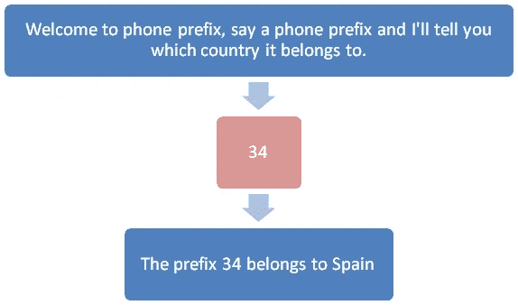
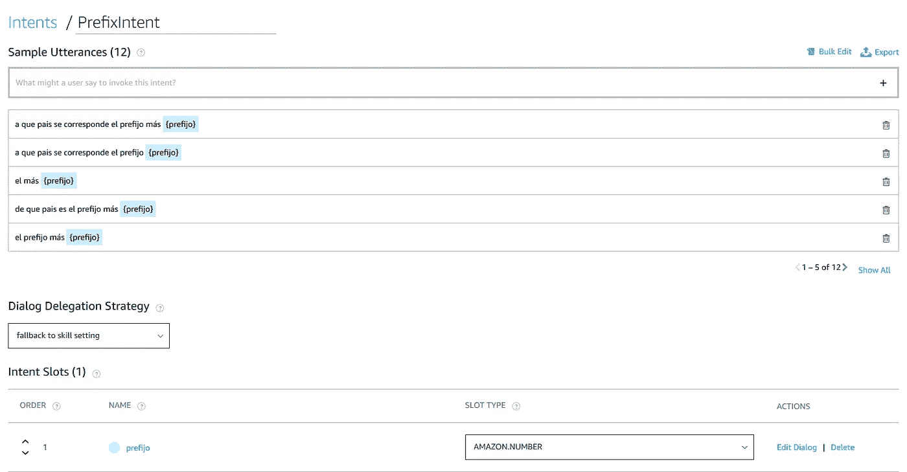
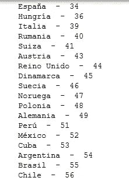
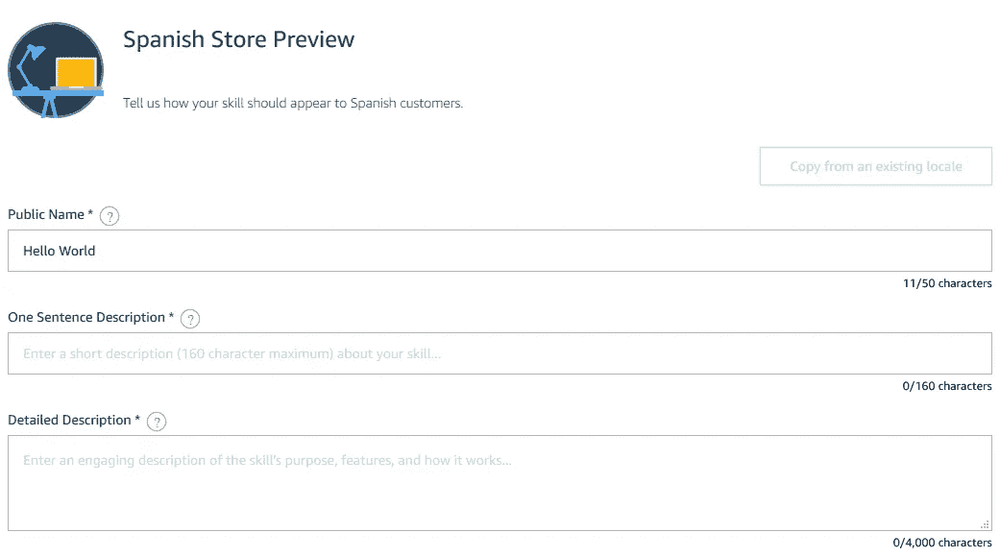

# 我如何创造我的第一个 Alexa 技能

> 原文：<https://towardsdatascience.com/how-i-created-my-first-alexa-skill-2bf36b921629?source=collection_archive---------40----------------------->

## 我向你展示了我如何创建我的第一个 Alexa 技能，一个简单的电话前缀信息工具

丹尼尔·方特内尔在 [Unsplash](https://unsplash.com/s/photos/earphones?utm_source=unsplash&utm_medium=referral&utm_content=creditCopyText) 上拍摄的照片

我相信在未来，我们会用语音助手取代我们用手机做的大多数事情，我们会像现在携带智能手机一样携带小型入耳式耳机。

在这篇文章中，我将向你展示我如何为亚马逊的语音助手 Alexa 创建我的第一个技能。我按照亚马逊的这个叫做“蛋糕行走”的[教程系列](https://developer.amazon.com/en-US/alexa/alexa-skills-kit/resources/training-resources/cake-walk)，应用这些步骤来创造我自己的技能。

# 语音体验设计

教程开始解释技能设计，在编写任何代码之前，从一个好的声音设计开始是非常重要的。首先画一个流程图，说明你的用户将如何使用技能，用户会说什么，Alexa 会回答什么，以及对话可以遵循的不同路径。

我技能的通量图

另一件要记住的事情是我们的技能说话的方式。它必须遵循一些声音设计的准则。这方面的一些例子是告诉用户有哪些选择，等待用户的回复，询问封闭式问题而不是开放式问题。使用自然口语也很重要，我们写的和说的不一样，你写的代码会被 Alexa 读取，所以要确保它听起来像自然口语。

我的想法是创建一个电话前缀信息工具。每个国家都有一个定义好的国际电话前缀，通过查看来电电话的前几个号码，你可以知道它来自哪个国家。例如，像 **+34** 123456789 这样的手机属于西班牙。回到我的 Alexa 技能，目标是创造一个技能，告诉你你问的前缀属于哪个国家。

# 让我们开始编码吧

首先，你需要一个亚马逊开发者账户来访问 Alexa 开发者控制台，在那里你可以创造自己的技能。一些示例 *Hello World* 代码是在开始时创建的，作为您技能的补充。你可以改变一些文本，看看每一段代码是如何影响你的技能行为的。

由于我的技能，我不得不改变文本，使它们谈论电话前缀，然后修改代码以等待对欢迎消息的回答(唯一有效的回答将是一个号码)。收集用户的答案在 Alexa 的术语中称为*意图*。我们需要为我们期望从用户那里得到的每个答案定义一个*意图*。

对于我的简单技能，我只需要一个*意图*，用户给我一个电话前缀。对于每个*意图*，我们必须定义用户可以说出信息的所有不同方式，称为*话语*。话语可以包括后端代码可访问的变量，称为*意图槽*，它们也必须被定义。

用户可以说的一些示例话语

我的技能是用西班牙语制作的，所以*话语*也是用那种语言。*话语*的目标是尽可能多地捕捉用户可以说出的短语。

例如，用户可以说“前缀{号码}”或“前缀{号码}”。两者都应该被 Alexa 接受。对于我们的技能，我们必须定义尽可能多的*话语*，这样用户才能自然地说话并被理解。

我们必须考虑许多不同类型的用户和他们说话的不同方式。

# 最难的部分

最难的部分是创建程序逻辑，即搜索国家代码并指出它属于哪个国家的代码。我唯一能找到的是一个数据库，里面有电话前缀和国家名称的成对关键字。它是英文的，所以我必须把所有的东西都翻译成西班牙语，为此我使用了 [DeepL](https://www.deepl.com/translator) ，这是一个人工智能翻译器，效果惊人，几乎所有的东西都在第一次尝试中被完美地翻译了。

国家-电话前缀数据库

然后只需将用户的*话语*与数据库连接，并将国家返回给用户。

# 最终步骤和发布

在发表之前，你必须填写一个表格，里面有关于你技能的相关数据。这是用户在 Alexa 应用程序上浏览技能商店时看到的内容。

然后在亚马逊的服务器上运行一些测试，检查所有需要的信息，并找出常见的错误。如果这些测试都通过了，我们可以进入下一步，发布技能！

亚马逊完成了一个验证过程，就我而言，在我的技能发表之前花了大约一周时间。

如果你用西班牙语配置了 Alexa，你可以通过说*“Alexa，abre prefijos telefónicos”*找到我的技能