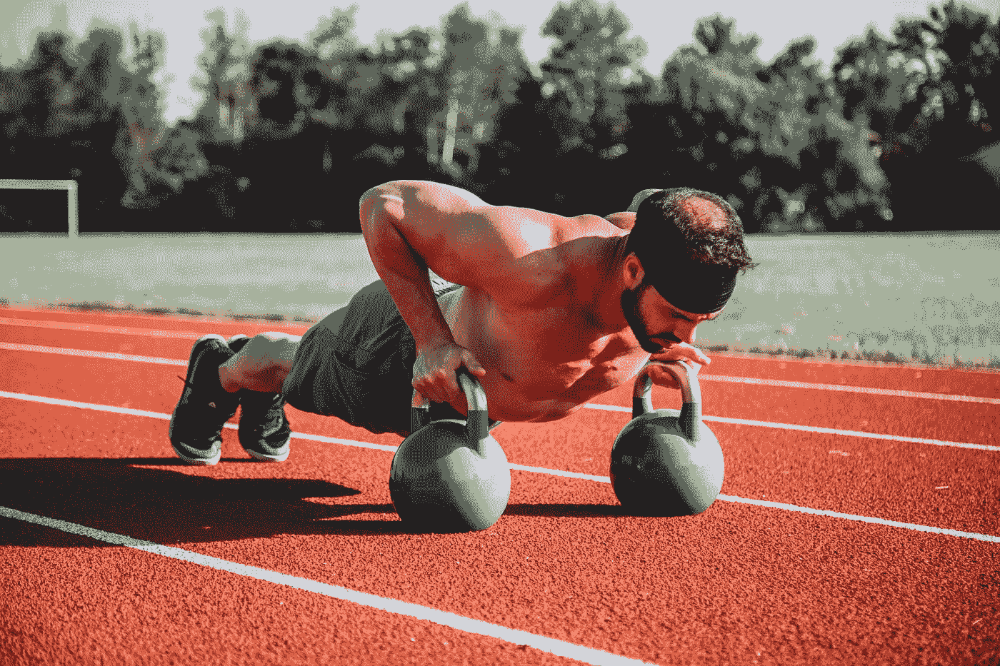
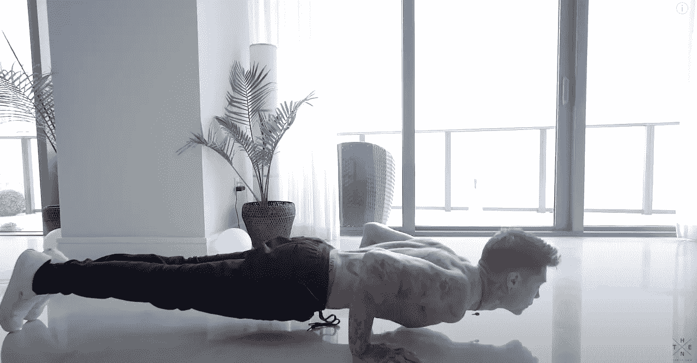
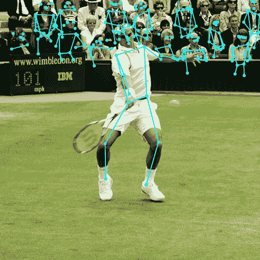
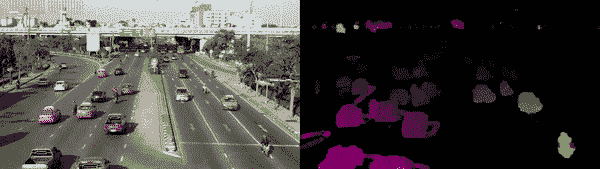
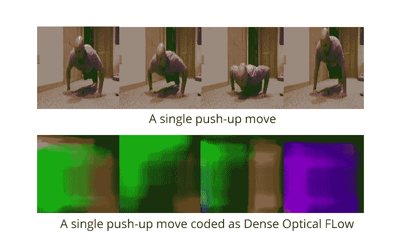
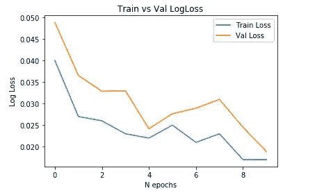
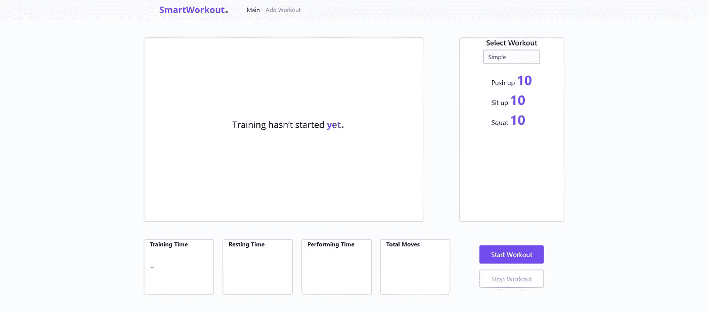
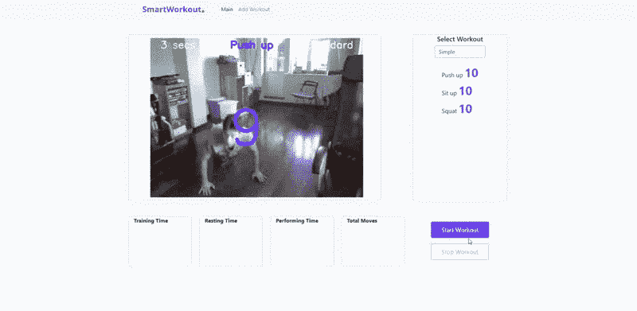

# 我如何使用深度学习和光流算法创建锻炼运动计数应用程序

> 原文：<https://towardsdatascience.com/how-i-created-the-workout-movement-counting-app-using-deep-learning-and-optical-flow-89f9d2e087ac?source=collection_archive---------14----------------------->

## 不要自己跟踪动作，让人工智能替你做！

来源[阿洛拉·格里菲斯](https://unsplash.com/@aloragriffiths)，经由 [unsplash](https://unsplash.com/photos/ymBZhfHwEPM) (CC0)

我喜欢进行锻炼和不同类型的训练，如 crossfit，但当训练强度太大或时间太长时，我注意到我经常在计算每次锻炼的运动次数时出错，这可能是因为在训练期间没有专注于运动计数任务，或者下意识地高估了完成的运动次数。作为一名计算机科学理学士三年级的学生，我决定在我的课程工作中解决这个问题，并创建了一个 Web 应用程序来计算锻炼过程中进行的移动次数。在这篇文章中，我想分享我解决这个问题的方法。你可以在 [github 库](https://github.com/artkulak/workout-movement-counting)中找到该应用的完整代码。

**算法**

为了执行运动计数，您必须知道身体在每一帧上是向上还是向下运动。通常，为了完成这样的任务，我需要使用一些 RNN 架构，因为，很明显，你不能只使用一帧来检测运动的方向。他在这张照片上是向上还是向下移动？

[https://www.youtube.com/watch?v=7wblGkVQx3U](https://www.youtube.com/watch?v=7wblGkVQx3U)

但我没有足够的训练数据来建立一个稳健的 RNN 模型，因为我必须自己准备和标注数据。我试着朝 PoseNet 模型的方向看，以获得每一帧上每个身体部位的坐标。

[https://medium . com/tensor flow/real-time-human-pose-estimation-in-the-tensor flow-js-7 DD 0 BC 881 cd5](https://medium.com/tensorflow/real-time-human-pose-estimation-in-the-browser-with-tensorflow-js-7dd0bc881cd5)

这种方法也没有好处，原因有几个:

1.  如果我在它被训练的相同环境(相同的房间，相同的视频角度，相同的人)中尝试，该模型表现良好，但是要为一个练习制作一个健壮的模型，我仍然需要大量的训练数据。
2.  没有使用 GPU 卡的 PoseNet 的 FPS 真的很低。
3.  在某些帧上，检测到的身体部位的质量很低。

总而言之，我玩了很多不同的模型，它们都在某种程度上给出了一个糟糕的结果。直到有一天我了解了光流算法，尤其是密集光流实现(下图的右边部分)。简而言之，这种算法跟踪像素沿着一定数量的连续帧的运动。

[https://nanonets.com/blog/optical-flow/](https://nanonets.com/blog/optical-flow/)

可以使用一些数学模型(例如，在 OpenCV 库中实现)来估计光流，或者可以使用深度学习来直接预测光流，这在复杂的视频场景中给出更好的结果。在我的实现中，我决定坚持使用密集光流算法，它是在 python-opencv 包中实现的。

这就是如何用密集光流对一个俯卧撑进行颜色编码。

【https://www.youtube.com/watch?v=xoCKHx8Yyj4 号

如你所见，密集光流将向下运动编码为绿色，将向上运动编码为紫色。因此，知道了每个帧的颜色编码表示，我可以很容易地构建一个简单的 CNN 网络来执行帧的多类分类。我只是在 PyTorch 中堆叠了一些 Conv +池层，这导致了下面的简单架构。

为了训练这个模型，我加载并按帧标记了几个 YouTube 视频，我自己也准备了一些俯卧撑视频。最后，我有一个彩色编码图像的训练集，包括 252 个向下移动的帧，202 个非上推帧和 206 个向上移动的帧。我还准备了一个由 140 个不同动作的帧组成的小验证集。在运行了 10 个时期的训练循环后，我得到了一个非常令人印象深刻的模型对数损失图。

训练与验证集的对数损失

显然，对于模型来说，预测这三个类别并不太难，因为只需用眼睛观察彩色编码的图像就可以很容易地做到。

更重要的是，经过训练的模型能够对框架进行分类，不仅是俯卧撑，还包括俯卧撑、深蹲和引体向上。一般来说，我想这个精确的模型可以很容易地对所有高振幅的运动进行分类，包括上下运动。

不过，要对一些练习进行分类，如仰卧起坐或一些低幅度的哑铃运动，最好收集一套新的训练集，并重新训练当前的模型。

**App**

为了在现实生活中应用我的模型，我使用 Django 创建了一个小的 Web 应用程序，在那里我可以创建一个新的锻炼，并在“战斗”环境中尝试我的模型。这是它的样子。

web 应用程序的主屏幕

总的来说，在训练的时候，我注意到俯卧撑、深蹲、引体向上的误差在 **2.5%** 左右。对于 burpee 来说，误差大约在 **5%** 左右，这是因为练习涉及到不止一个上下运动。以下是模型在锻炼过程中计算俯卧撑的方法。

**结论**

总之，这项工作对我来说是一次很好的经历，因为我必须做大量的研究，并测试锻炼过程中运动计数问题的不同假设。我的时间跟踪器显示，现在我已经在这个应用程序开发上花了大约 75 个小时，但谁知道呢，如果我决定继续这个项目，让它变得更大，我可能会花更多的时间。谢谢你的阅读！

你可以在我的 [**网站**](http://artkulakov.com) 上查看其他帖子