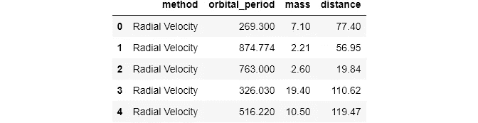
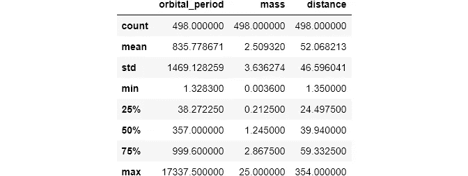
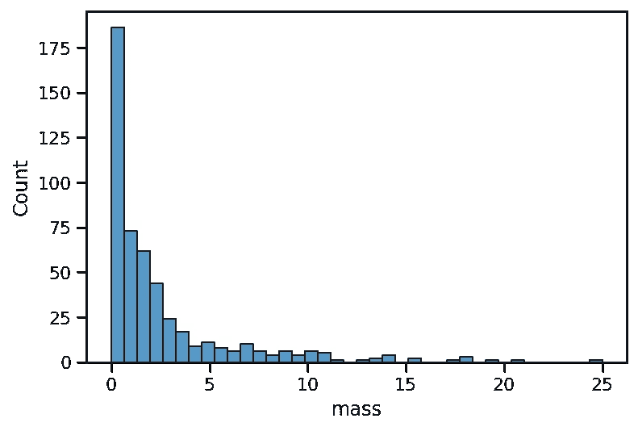
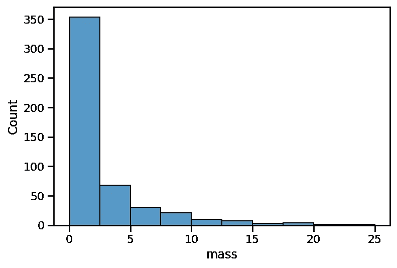
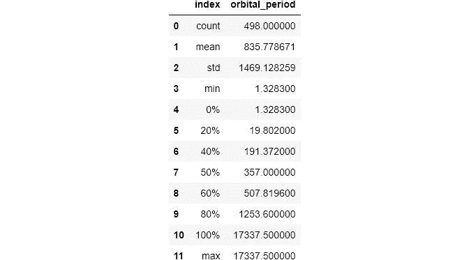
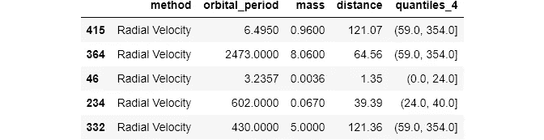
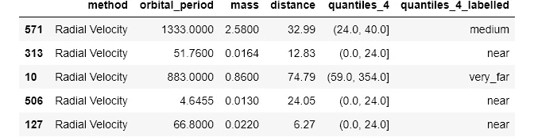
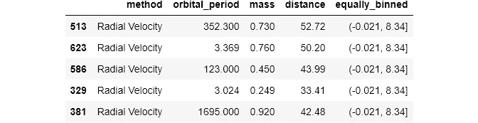
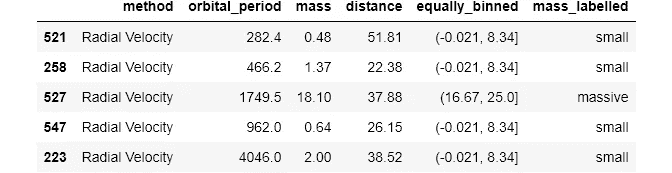

# 我习惯如何将数据与熊猫绑定

> 原文：<https://towardsdatascience.com/how-i-customarily-bin-data-with-pandas-9303c9e4d946?source=collection_archive---------9----------------------->

## 熊猫“咔”和“咔”

## 您可能只使用了默认值


照片由[斯蒂夫·约翰森](https://unsplash.com/@steve_j?utm_source=medium&utm_medium=referral)在 [Unsplash](https://unsplash.com?utm_source=medium&utm_medium=referral) 上拍摄

## 动机

> “这是什么鬼？”

这是初学者在查看一些硬函数的输出时经常得到的反应。很多教程和课程用一句话就介绍了这些功能，然后转到其他话题，这总是让我感到困惑。即使你从头到尾阅读他们的文档，我保证也要超过一分钟。

作为一个初学者，当我遇到这种情况时，我总是很沮丧。有一次，当我在 Udacity 攻读纳米学位时，我正在学习 Matplotlib 的热图。如果你知道，Matplotlib 不能像 Seaborn 一样自动为热图创建注释，所以你必须手工创建它们。为此，你可以使用`qcut`或`cut`(这是本文的主题)将你的数据分类，我对这些函数完全陌生。

讲师用一句话简单地“解释”了这些功能，屏幕上出现了文档链接🤦‍♂️.他甚至快进了他输入语法的部分。

最近，我一直在写一个小编，解释`pandas`最难的功能，希望其他人不会面临同样的困难。这是第四部分，是关于使用`qcut`和`cut`的宁滨数字数据。

[](https://ibexorigin.medium.com/membership) [## 通过我的推荐链接加入 Medium-BEXGBoost

### 获得独家访问我的所有⚡premium⚡内容和所有媒体没有限制。支持我的工作，给我买一个…

ibexorigin.medium.com](https://ibexorigin.medium.com/membership) 

获得由强大的 AI-Alpha 信号选择和总结的最佳和最新的 ML 和 AI 论文:

[](https://alphasignal.ai/?referrer=Bex) [## 阿尔法信号|机器学习的极品。艾总结的。

### 留在循环中，不用花无数时间浏览下一个突破；我们的算法识别…

alphasignal.ai](https://alphasignal.ai/?referrer=Bex) 

## 可点击的目录

∘ [动机](#6d9a)
∘ [设置与基础探索](#005a)
∘ [音程记谱复习](#f2fb)
∘ [熊猫 qcut()](#3a1b)
∘ [熊猫 q cut()](#03d2)

> 文中用到的笔记本可以从[这个](https://github.com/BexTuychiev/medium_stories/tree/master/qcut_cut) GitHub repo 下载。

## 设置和基本探索

对于样本数据，我将使用内置的`seaborn`数据集`planets`:



```
>>> planets.describe()
```



`planets`数据集是从美国宇航局的[系外行星目录](https://exoplanets.nasa.gov/exoplanet-catalog)下载的，包含了太阳系外行星的数据。感兴趣的三列是`orbital_period`、`mass`和`distance`:

1.  `mass` -这颗行星比木星重多少倍
2.  `distance` -这颗行星距离地球多少光年
3.  `orbital_period` -地球绕其恒星一周需要多少个地球日

## 区间记数复习器

为了从这篇文章中获得最大的收获，并理解我将使用的一些语言，这里有一个关于区间符号的温和复习:

*   **(1，10)** :两边不闭合。不要在区间中包含 1 和 10
*   **【1，10】**:左闭区间。包括 1 但不包括 10
*   **(1，10)**:右闭区间。包括 10 个，但不包括 1 个
*   **【1，10】**:两边闭合。包括 1 和 10

## 熊猫`qcut()`

为了理解`qcut()`是如何工作的，让我们从直方图开始:

```
sns.histplot(planets['mass'])
```



直方图自动将一个数组或一个数字列表分成几个箱，每个箱包含不同数量的观察值。在`seaborn`中，可以控制箱子的数量:

```
sns.histplot(planets['mass'], bins=10)
```



直方图是你可能见过的第一个宁滨数据的例子。下面是使用`pandas`的`describe()`功能的另一个例子:

默认情况下，`describe()`将数字列划分为 4 个桶(箱)-(最小，25 日)，(25 日，中值)，(中值，75 日)，(75 日，最大)，并显示箱边缘。您还可以为函数传递自定义百分点:



这些都是宁滨数据的例子。但是如果你注意到了，在上面所有的例子中，我们不能真正地控制箱子。我们只是选择箱子的数量，仅此而已。此外，你不能真的把这些箱子从它们的特定功能中分离出来。

现在，这里有一个问题:如何将每个观察值所属的 bin 存储在一个新列中，或者为以后执行一些操作？这就是`qcut()`和`cut()`的用武之地。

首先，让我们探索一下`qcut()`功能。它作用于任何类似数字数组的对象，如列表、`numpy.array`或`pandas.Series`(数据帧列)，并将它们分成多个箱(桶)。[文档](https://pandas.pydata.org/pandas-docs/stable/reference/api/pandas.qcut.html)称其正式名称为基于分位数的离散化函数。

让我们从一般语法开始:

如果您第一次看到这个输出，它可能会非常吓人。但是请耐心听我说，你很快就会掌握这个功能。

该函数的第一个参数是要装箱的列。下一个需要的参数是`q`，它代表*分位数*。`qcut()`将数据分成百分位箱，而不是用数字边缘构建每个箱。

让我们分别研究输出的不同部分。当我们将`q`设置为 4 时，我们告诉`pandas`创建 4 个区间或区间，并让它自己计算出放置值的位置。

最后一行给出了每个区间的边，分别是(1.349，24.498)，(24.498，39.94)，(39.94，59.332)，(59.332，354)。区间边缘对应于一个百分点值，取决于`q`的值(在这种情况下，最小值、第 25 个百分点、中值、第 75 个百分点、最大值)。我们可以用`describe()`函数验证这一点，因为它也将数据分成 4 个分位数:

如您所见，`min`、`max`、`median`、25、75 个百分点的值都是相同的。

现在，主要的部分:如果你看实际的结果，每一行或索引被放入四个容器中的一个。默认情况下，`pandas`为每个观察值提供文字数字箱名称。为了更好地了解情况，让我们将输出存储到一个新列中:



存储后，我们可以更好地鸟瞰数据帧。您可以验证每个`distance`值是否放在正确的区间内。我还引入了一个新的参数`precision`，它让我们指定要保留的小数点位数。

然而，新专栏仍未达到最佳状态。理想的情况是，如果可以为每个区间指定特定的标签。这将提高我们数据的可读性。

为了实现这一点，我们需要创建一个标签列表，并将其传递给`qcut()`的`labels`参数:



好多了！但是，我们仍然没有谈到`qcut()`的定义点。让我们在最新的列上调用`value_counts()`函数，看看会发生什么:

如果分布中没有太多极值，那么每个箱中的值的数量将会超级接近。如果你熟悉统计学，这是有意义的，因为我已经说过`qcut()`定义了箱边缘为分布的百分位数。

注意，这并不意味着容器的大小是相同的。如果你从右边减去箱子的左边，你会得到不同的结果。例如，让我们将质量分成 5 个箱，并获得每个箱的宽度:

将`retbins`(代表返回箱)设置为`True`会返回一个额外的`numpy.ndarray`，包含我们切割的箱边缘。我用一个循环来显示每个箱子的宽度来验证我的观点。

为了下一节简单起见，我将删除新列:

## 熊猫`cut()`

在讨论了`qcut()`之后，你现在能够理解`cut()`之间的差异。

`qcut()`对我们的数据进行划分，使每个条柱中的值数量大致相同，但条柱范围不同。第一部分中的许多概念在这里也适用。

主要区别在于`cut()`使用实际的数字箱边缘，默认情况下，它将分布划分为大小相等的箱。与`qcut()`正好相反。我们先来看一个例子:

我们将`mass`列分为三个不同的类别。和以前一样，我将把结果存储回数据框，并对其调用`value_counts()`:



此外，让我们看看每个箱的范围:

如您所见，这一次箱的宽度大致相同，我们在每个箱中有不同数量的观测值。

当我们想要为箱子定义自定义范围时，`cut`的真正威力就发挥出来了。通常，对于真实数据，您不想让`pandas`自动为您定义边缘。例如，如果您在一家电话公司工作，您可能希望根据服务的总体持续时间对客户进行分类。您可能会优先考虑合作时间较长的客户，并相应地对其他客户进行排序。

让我们来看一个为`mass`定制宁滨的例子。我们将创建 4 个间隔，并给它们定制标签:



这个例子清楚地显示了`cut`提供的灵活性。`bins`参数可以接受 3 种选择:

*   *一个整数*:我们已经看到例子了。如果传递一个整数，该函数将创建范围相等的存储桶。
*   *一系列数字或标量*:当传递一系列数字时，该函数将它们视为自定义 bin 边缘。箱的数量将总是比箱边缘的总数少 1。
*   `*pandas.IntervalIndex*` *对象*:也可以使用`pandas.interval_range`函数传递自定义范围(稍后将详细介绍)。

通常，在一个列表中定义自定义的 bin 范围是很棘手的。所以最好使用`numpy.arange`或`numpy.linspace`功能。两者都创建了一个等间距的数字序列，可以作为`cut`的 bin 范围传递。你可以在这篇有用的文章中了解更多关于这些功能的信息。

在上面代码片段的第一行，我们创建了一个包含 5 个元素的`numpy.ndarray`。因此，`cut`将为`distance`减少一个间隔数。

一般的经验法则是对较少的箱使用简单的列表，但对许多区间使用`numpy`函数。

使用`pandas.interval_range`基本可以得到相同的音程。该函数，而不是列表，返回可以进一步定制的`IntervalIndex`对象:

是的，基本上是一样的，但是有一个额外的参数使这个函数非常有用:

`closed`参数接受 4 个字符串来控制间隔边缘:

*   *左侧*:左侧**关闭**
*   ***右侧*:右侧**(**)关闭(默认)**
*   ***两边*:**两边关闭****
*   *****:**()**两边都不闭合*****

*****一个带有`cut`的例子:*****

*****使用`interval_range`的缺点是在`cut`中不能使用标签。*****

*****关于参数也有一些细微差别，所以一定要查看[文档](https://pandas.pydata.org/pandas-docs/stable/reference/api/pandas.cut.html)以了解本质细节。另外，这里有一篇类似的[文章](https://pbpython.com/pandas-qcut-cut.html)，比较了来自实用商业 Python 的`cut`和`qcut`。*****

# *****如果你喜欢这篇文章，请分享并留下反馈。作为一名作家，你的支持对我来说意味着一切！*****

*****阅读更多与主题相关的文章:*****

*****[](/meet-the-hardest-functions-of-pandas-part-i-7d1f74597e92) [## 认识熊猫最难的功能，第一部分

### 掌握 pivot_table()、stack()、unstack()的时机和方式

towardsdatascience.com](/meet-the-hardest-functions-of-pandas-part-i-7d1f74597e92) [](/meet-the-hardest-functions-of-pandas-part-ii-f8029a2b0c9b) [## 认识熊猫最难的功能，第二部分

### 掌握交叉表的时间和方式()

towardsdatascience.com](/meet-the-hardest-functions-of-pandas-part-ii-f8029a2b0c9b) [](/shape-tables-like-jelly-with-pandas-melt-and-pivot-f2e13e666d6) [## 认识熊猫最难的功能，第三部分

### 形状像果冻的桌子有熊猫旋转()和融化()

towardsdatascience.com](/shape-tables-like-jelly-with-pandas-melt-and-pivot-f2e13e666d6) [](/from-kagglers-best-project-setup-for-ds-and-ml-ffb253485f98) [## 来自 Kagglers:DS 和 ML 的最佳项目设置

### 来自顶级 Kagglers 的项目成功最佳实践的集合

towardsdatascience.com](/from-kagglers-best-project-setup-for-ds-and-ml-ffb253485f98) [](/ever-wanted-progress-bars-in-jupyter-bdb3988d9cfc) [## 想要 Jupyter 的进度条吗？

### 对你的长时间循环进行健全性检查(和一点视觉风格)

towardsdatascience.com](/ever-wanted-progress-bars-in-jupyter-bdb3988d9cfc)*****