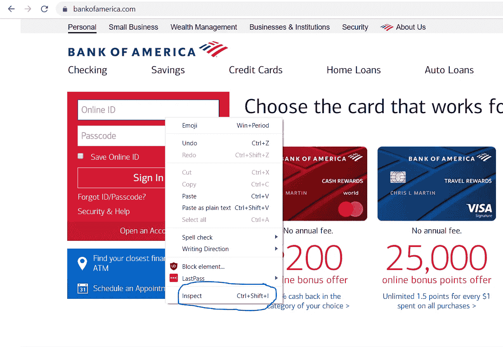
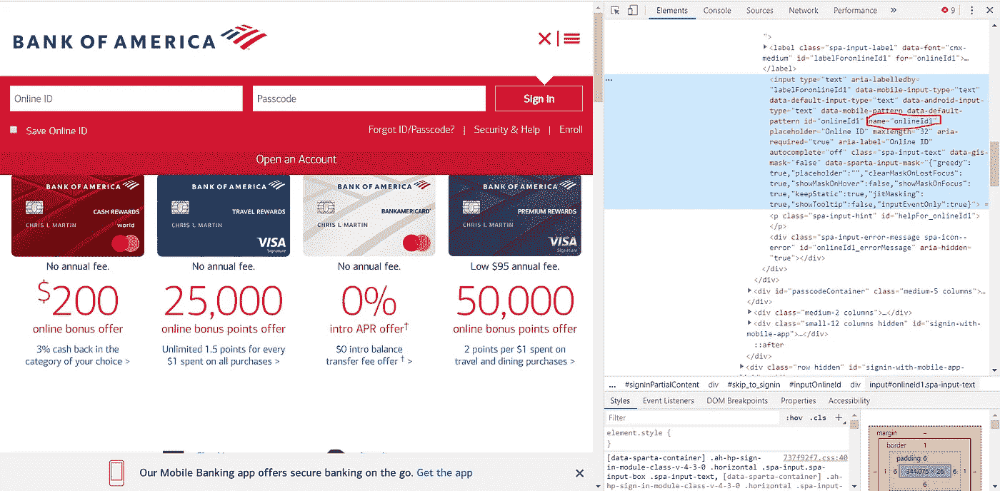
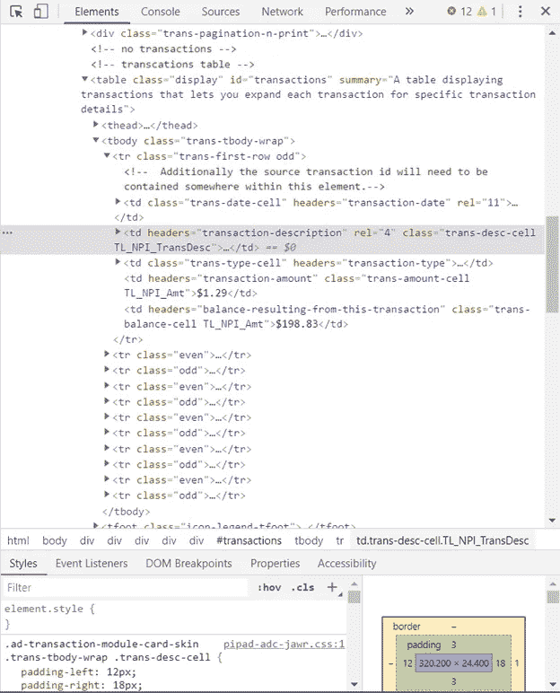
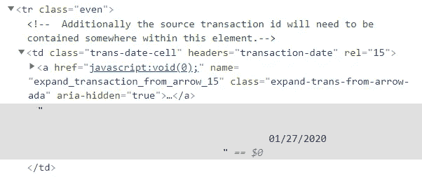

# 我如何 DIY 我的预算使用 Python 制作硒和美丽的汤

> 原文：<https://towardsdatascience.com/how-i-diyd-my-budget-using-python-for-selenium-and-beautiful-soup-4d2edc5c519?source=collection_archive---------5----------------------->

## 使用 Python 提取数据以满足您的个人预算需求


安妮·斯普拉特在 [Unsplash](https://unsplash.com/s/photos/finance-unicorn?utm_source=unsplash&utm_medium=referral&utm_content=creditCopyText) 上的照片

我是个性测试的狂热粉丝。我喜欢通读我的预包装类型描述，我发誓这是我独有的，只有我。我喜欢他们给我的感觉，好像两个心理学家用我自己提供的答案偷瞄了一下我的灵魂。但是我知道不是每个人都同意。对于反对者，不管他们是说主流选项太老套，还是因为它在很大程度上是自我报告而对结果打折扣，我提出:预算类型指数。

对于那些现在希望收到你的个人资料的 pdf 文件的人，我希望当我告诉你这是你必须自己制作的东西时，你不会太失望。好吧，好吧，这不是传统意义上的性格测试，但我确实认为一份精心制作的预算可以告诉你很多关于你自己的事情，如果不是更多的话，就像那些诱人的在线测验一样。

当我开始做这个项目时，我想知道我的钱去了哪里，进而了解我优先考虑的是什么。我以前一直手动汇总我的多个银行账户的所有支出，包括非银行但经常使用的服务，如 Venmo。我一直在寻找一种服务，这种服务不仅可以自动完成这个过程，向我展示我的历史数据，而且不需要每月付费。没有完全符合所有这些标准的东西，所以我用 Python 创建了自己的。

对于其他想衡量和管理自己支出的人来说，收集数据是第一步，也是最重要的一步。我根据我使用的两个工具分解了本文的其余部分:

1.  硒
2.  美味的汤

如果你想建立自己的预算工具，我很乐意帮助你——尽管我们不认识，但请随时联系 jenniferrkim7@gmail.com！

# 使用 Selenium 从您的在线银行帐户中删除交易

[Selenium](https://selenium-python.readthedocs.io/index.html) 自动化浏览器。最初创建它是为了测试 web 应用程序，现在它也广泛用于 web 抓取。在分解我如何使用这个工具之前，我在下面包含了我的全部代码。

## **进行设置**

你首先需要安装两个软件包。

*   硒包装

通过在命令提示符下键入以下命令进行安装:

```
pip install selenium
```

*   您正在使用的浏览器的 web 驱动程序

Chrome 驱动程序(这是我正在使用的)可以在[这里](https://sites.google.com/a/chromium.org/chromedriver/downloads)找到。不同版本的 Chrome 有不同的驱动程序。要了解您使用的版本，请点按浏览器右上角的三个垂直点。这将带您到设置。然后，打开菜单，点击“关于 Chrome”——这将显示你的 Chrome 版本。下载适用的驱动程序，并确保它在您的 Python 路径中。

更全面的安装说明，包括其他浏览器驱动的链接，可以在[这里](https://selenium-python.readthedocs.io/installation.html)的文档中找到。

## **尺寸很重要**

现在您已经有了必要的包，您可以开始指定驱动程序应该选择的 web 元素。影响这些元素位置的一个因素是窗口的大小。为了获得最大的一致性，我喜欢在启动任何进程之前全屏显示我的窗口。

```
# from line 8
browser.maximize_window()
```

## **定位元件**

为了检索交易，我们首先希望 Selenium 登录银行的网站。我们可以通过检查网站的 HTML 页面来确定需要选择哪些元素。要打开页面，请访问网站，并识别登录框。右键单击在线 ID 字段。选择“检查”。



您将弹出此元素定位器，并在您选择的字段(在本例中为在线 ID)上高亮显示。



Chrome 的 HTML 元素定位器

有八种不同的方法来定位硒元素。这些是由:

*   名字

```
elem = driver.find_element_by_name("INSERT-NAME")
```

这是我决定使用的一个，正如上面截图中画得不好的红圈所示。

*   身份证明

```
elem = driver.find_element_by_id("INSERT-ID")
```

这被认为是最准确的方法，因为每个元素的 ID 都是唯一的。

*   链接文本


```
elem = driver.find_element_by_link_text("INSERT-NAME-OF-LINK-ON-PAGE")# example if I wanted to select link circled above
elem = driver.find_element_by_link_text("Vote Is Likely to Fall Largely Along Party Lines")
```

*   部分链接文本

```
elem = driver.find_element_by_partial_link_text("DONT-NEED-FULL-LINK")# example if I still wanted to select above NYT link
elem = driver.find_element_by_link_text("Vote Is Likely to Fa")
```

*   CSS 选择器

```
elem = driver.find_element_by_css_selector("INSERT-CSS-SYNTAX")
```

关于 CSS 选择器的好例子可以在这里找到:[https://saucelabs . com/resources/articles/selenium-tips-CSS-selectors](https://saucelabs.com/resources/articles/selenium-tips-css-selectors)

*   标签名称

```
# referring to an HTML tag. first element with tag is returned.
elem = driver.find_element_by_tag_name("INSERT-TAG-NAME")
```

*   类别名

```
elem = driver.find_element_by_class_name("INSERT-CLASS-NAME")
```

*   XPath

```
elem = driver.find_element_by_xpath("INSERT-XPATH")
```

XPath 是一种用于在 XML 文档中定位节点的语言。当目标元素没有合适的 id 或 name 属性时，这很有用。基本格式如下:

```
xpath = //tagname[@attribute = "value"]
```

你可以在这里阅读更多关于 xpath 的内容。

请注意，所有这些方法只会选择它找到的第一个元素。要选择多个元素，请使用相同的方法，但是将单词“元素”替换为“元素”(例如 driver . find _**elements**_ by _ NAME(" INSERT-NAME "))

## 输入键

找到 login 元素后，下一步是输入您的凭证。这是通过函数`send_keys()`完成的。

```
username = browser.find_element_by_name("onlineId1").send_keys("YOUR-USERNAME")time.sleep(2)password = browser.find_element_by_name("passcode1")
password.send_keys(<YOUR PASSWORD>)
```

记住不要在任何地方提交密码，以保护自己。

我添加了一个等待，告诉 Selenium 在使用`time.sleep()`输入用户名和密码之间暂停两秒钟。我发现没有它，Selenium 移动太快，浏览器很难跟上。

我通常会在输入凭据后按“Enter”按钮，所以我想在 Selenium 中做同样的事情。幸运的是，Selenium 有一个标准键盘键列表[和](https://artoftesting.com/press-enter-tab-space-arrow-function-keys-in-selenium-webdriver-with-java)。在这种情况下，我使用了钥匙。返回:

```
password.send_keys(Keys.RETURN)
```

现在你进来了！

要查看是否找到了元素并正确输入了凭据，可以尝试运行代码。一个新的 Chrome 实例将会弹出，你可以看到浏览器自动运行。此实例与您经常使用的浏览器不同。它不包含任何 cookies，并在您完成后消失。因此，如果你确实需要 cookies，你可以在[这个网站](https://www.guru99.com/handling-cookies-selenium-webdriver.html)上查看如何添加它们。

当这个 Chrome 实例将我带到我的银行账户主页时，我可以看到我的代码运行正常。我看到两个链接:一个链接到我的支票账户，另一个链接到我的信用卡。要点击这些链接，我使用`find_element_by_link_text`并使用`click()`方法进行选择。

```
browser.find_element_by_link_text('Bank of America Travel Rewards Visa Platinum Plus - ****').click()
```

一旦您进入包含您想要的交易的页面，从 web 驱动程序中检索`page_source`并将其存储在一个变量中。这将用于稍后的解析。

```
boa_travel_html = browser.page_source
```

现在剩下唯一要做的就是用你的其他银行账户重复。

## **iFrames**

除了一个讨厌的 iFrame 之外，我在巴克莱的另一个账户也是如此。内嵌框架是一个 HTML 文档，嵌入在网站上的另一个 HTML 文档中。当我收到一个没有找到元素的错误时，我第一次怀疑这可能会妨碍我，尽管我通过它的名字清楚地找到了我想要的元素。幸运的是，Selenium 有一种使用`switch_to`方法导航到 iFrame 的简单方法。

```
browser.switch_to.frame(browser.find_element_by_tag_name("iframe"))
browser.find_element_by_name("uxLoginForm.username")
```

使用与美国银行示例中相同的方法继续检索页面源代码。

## 无头浏览器

一旦你知道你的代码工作了，你可以通过在下次运行你的程序时去掉弹出的浏览器来加速这个过程。

```
from selenium import webdriver from selenium.webdriver.chrome.options import Options
chrome_options = Options()

chrome_options.add_argument("--headless")driver = webdriver.Chrome(options = chrome_options)
```

现在，您已经拥有了所有必要的数据。它可能不是一种可读性很强的格式，但是让它变得可用是 Beautiful Soup 的目的。

# 美味的汤

[美汤](https://www.crummy.com/software/BeautifulSoup/bs4/doc/)是一个解析 HTML 文件的 Python 包。现在我们已经有了必要的 HTML 页面，我们可以使用 Beautiful Soup 来解析它以获得我们需要的信息。同样，在深入下面之前，我已经完整地包含了代码。

漂亮的汤函数解析 HTML 银行交易页面

## 解析交易信息

是时候检查您之前检索的 HTML 页面了。因为混乱的纯文本页面是如此的…混乱，我选择了通过源本身来导航 HTML，通过右击银行网站上的每个交易并选择“Inspect”这突出显示了 web 页面元素检查器中的事务(之前使用 Selenium 来标识登录框)。



Chrome 的网页元素检查器

我想要收集的数据包括日期、交易描述和金额。如上所述，这些信息被嵌套在父“tr”标签内的多个“td”标签中。我使用了`[find](https://www.crummy.com/software/BeautifulSoup/bs4/doc/#find)`和`[find_all](https://www.crummy.com/software/BeautifulSoup/bs4/doc/#find-all)`函数的组合来沿着树移动，直到到达包含我想要的文本的标签。下面的片段是我如何检索日期的。

```
# narrowed down to largest parent container 
containers = rows.find_all(‘tr’, class_ = [‘trans-first-row odd’, ‘trans-first-row even’, ‘even’, ‘odd’]) dateli = [] 
descli = [] 
amtli = [] 
pending_counter = 0 for container in containers: 
    date = container.find(‘td’, headers = ‘transaction-date’)            .          .get_text(strip=True)
```

由于如何使用 Beautiful Soup 是针对您正在查看的网页而言的(正如我为检索到的每个页面创建的独立函数所证明的那样)，因此我不想一行一行地运行我的代码，而是想指出我发现的不规则之处和有趣的花絮，以帮助您尽可能高效地完成整个过程。

## 类是类 _

所有漂亮的汤`find`函数都以 HTML 属性作为关键字参数。虽然这对于大多数属性来说非常简单，但是在 Python 中，由于`class`是一个保留关键字，所以您可以使用`class_`来表示它的 HTML 对应物。

```
containers = rows.find_all(‘tr’, **class_** = [‘trans-first-row odd’,    ‘trans-first-row even’, ‘even’, ‘odd’])
```

## soup.find()中的 Lambda 函数

`find`函数也可以将其他函数作为参数。要快速找到符合多个标准的特定标签，请尝试插入一个 lambda 函数。

```
*# Example 1*
rows = boa_travel_table.find(**lambda** tag: tag.name=='tbody')*# Example 2*
boa_checking_table = boa_checking_soup.find(**lambda** tag: tag.name == 'table' and tag.has_attr('summary') and tag['summary'] == 'Account Activity table, made up of Date, Description, Type, Status, Dollar Amount, and Available balance columns.')
```

示例 1 非常简单。我也可以不用 lambda 函数来找到相同的元素，使用如下代码:

```
rows = boa_travel_table.find('tbody', class_ = 'trans-tbody-wrap')
```

示例 2 是 lambda 函数真正大放异彩的地方。通过结合多种标准并使用 Python 的`has_attr` *，*我搜索我想要的东西的能力成倍增加。lambda 有用性的另一个好例子(以及对 lambda 的解释！)可以在这里[找到](https://www.tomordonez.com/python-lambda.html)，作者在这里取 Python `isinstance`函数进行美汤搜索。

## 美汤的文字 vs .字符串

在上面我漂亮的 Soup 代码的第 8-19 行中，我将标签(或者我喜欢称之为容器)缩小到最大的一个，它包含了我想要为每笔交易提取的所有三条信息(日期、描述、金额)。为了从这些深入的容器中提取数据，我使用了`soup.tag.get_text()` *。*

```
date = container.find('td', headers = 'transaction-date').**get_text(**strip=True**)**
```

如果你通读了漂亮的 Soup 文档，你可能已经看到过用`soup.tag.string`来代替提取文本。这是我第一次使用的功能，但我很快发现它在这种情况下不起作用。`soup.tag.string`只返回一个`NavigableString`类型的对象，该对象必须是标签中的唯一对象。

另一方面，`soup.tag.get_text()`可以访问它的所有子字符串(即使它不是直接子字符串)并返回一个 Unicode 对象。因此，如果您想要提取的文本数据存在于一个子标签中(您可以在下面的截图中看到`td`标签中的`a`标签)，您应该使用`soup.tag.get_text()`。



嵌套标签使得有必要使用`soup.tag.get_text()`

如果你喜欢稍微干净的代码，你也可以使用`soup.tag.text` *。*它调用`get_text()`，基本上做同样的事情，但是我更喜欢原来的`get_text()`，因为它支持关键字参数，比如分隔符、条带和类型。对于这个项目，我包含了`strip=True`作为关键字参数，从文本中去除任何空白。

# 结论

现在，您可以通过运行一个程序从数据源中检索所有财务数据。这是你开始创建自己的预算类型指数，并通过你的消费习惯找到更多关于你自己的信息。出发去收集你的数据点，成为你自己最好的金融版本！