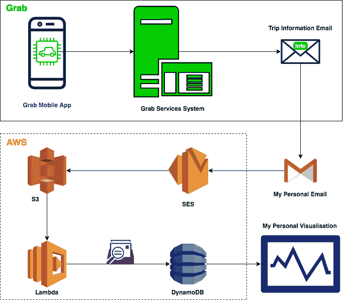
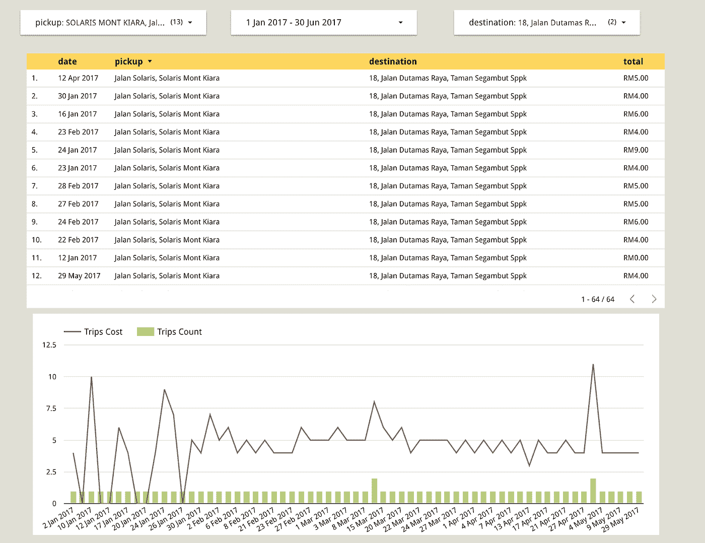
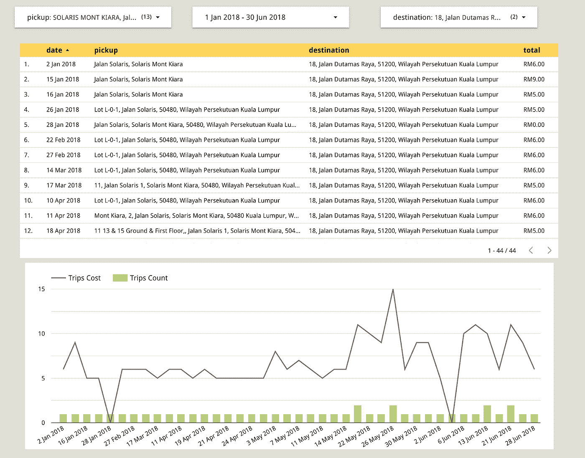
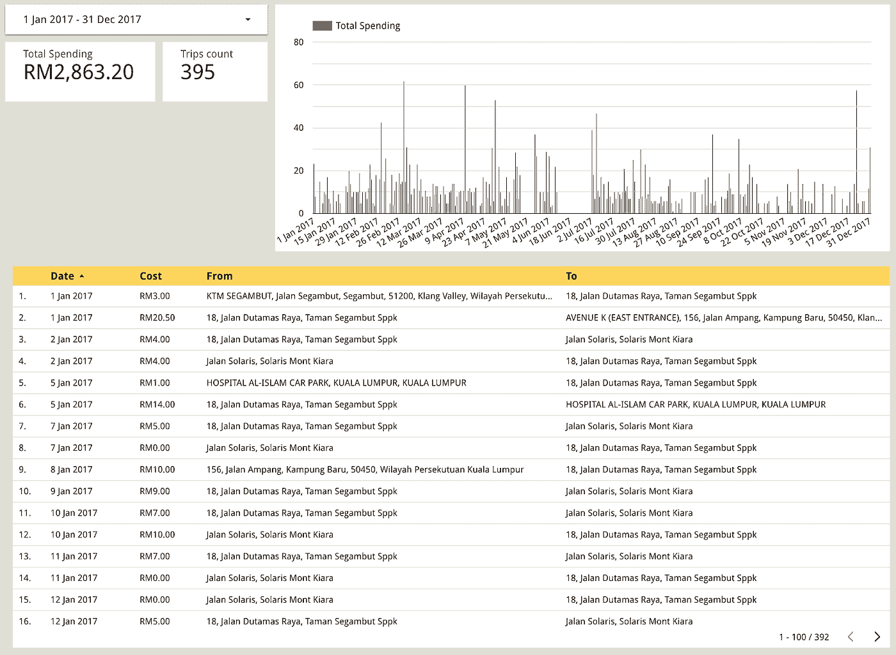
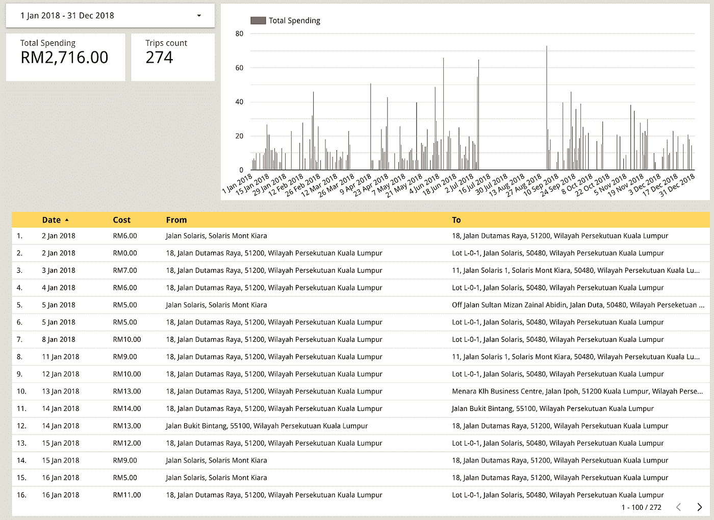
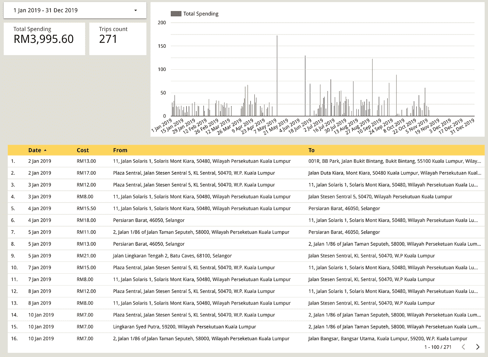
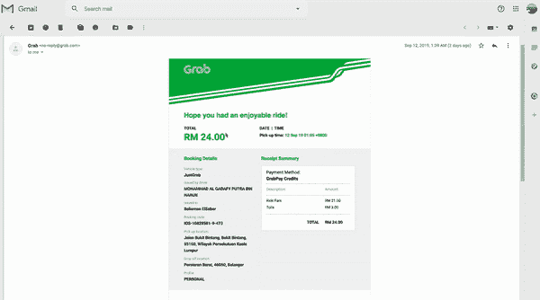
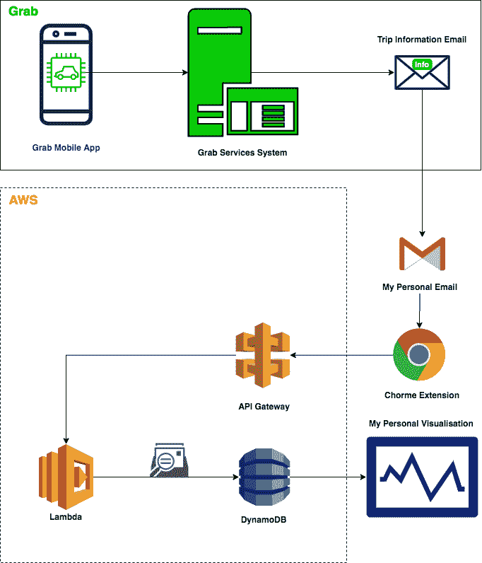

# 我如何设计我的抓取数据

> 原文：<https://towardsdatascience.com/how-i-engineered-my-grab-rides-data-f115b4257aea?source=collection_archive---------53----------------------->

## 快乐的数据工程师之旅

## 隐藏数据的 ETL(提取-转换-加载)

在 [Unsplash](https://unsplash.com?utm_source=medium&utm_medium=referral) 上由 [Carlos Muza](https://unsplash.com/@kmuza?utm_source=medium&utm_medium=referral) 拍摄的照片

# 世界上谁是谁？

作为一名在马来西亚的外国人，我需要利用现有的交通设施在全国各地旅行。马来西亚的公共交通设施确实非常好，只要你待在它们附近。默认情况下，这将是一个比更远的地区更昂贵的地方。

我的问题是从我工作的地方到经济适用房区的路线离公共交通有点远。所以，我需要坐出租车或者步行 30 分钟。在马来西亚散步挺好的，只要不下雨就行(吉隆坡总是下雨)。

作为一名技术人员，我直接决定使用现有的技术来解决我的问题，在这种情况下，没有什么比拼车服务更有帮助的了。

# 我的选择标准

我在 2016 年来到马来西亚，当时只有两家拼车服务提供商，**和 **Grab** 。**

**对我来说，两者都是新的…我考虑的几个因素是:**

1.  **司机离我的位置有多远？(我不想上班迟到)**
2.  **我应该为服务支付多少？(我还没那么有钱)**
3.  **是双赢吗？(这是一项共享服务)**

**所以，我在选择过程中的标准很简单，都是基于我作为一个新来的外国人在一家不提供弹性工作时间的小 IT 公司工作的情况。没错，我在早高峰时间去办公室，在晚高峰时间离开。(亲爱的 CEO 们，那让你们的员工压力很大！)**

# **为什么我选择抢优步？**

**有几个原因导致我在马来西亚逗留期间决定选择 **Grab** 而不是**优步**。这并不意味着优步不好或什么，但我的生活方式和我作为顾客的角色与 Grab 的关系比优步更密切。**

1.  **与优步相比，那里有更多的临时司机，这使得在高峰时间比优步更容易获得临时搭车服务……与花同样多的时间等待司机来接我相比，我绝对更愿意等待指定的司机来接我。**
2.  **在我开始旅行之前，我就知道我要付多少钱…这正是我喜欢的付款方式。与此同时，优步给你看了估计的总付款额，而这个比率会根据许多因素而变化。交通堵塞，下雨，司机慢，走错路，汽油价格也变了！使用 Grab，它从一开始就给了我应该支付的确切费用，没有什么取决于其他因素，这对于像我这样的中产阶级用户来说是完全可取的……这就像是“这是交易，接受它或离开它”由您决定。**
3.  ****Grab** 是(**是**)总是比优步便宜，当两个城市都在这个城市的时候…有时我想如果 Grab API 检查了优步 API 上的票价，那么它显示便宜 10%的票价…我 *t 只是一种感觉，没有任何证实！*为什么我要为同样距离和同样时长的同样服务支付更多费用？**

**我回答了我的主要选择标准，这也说明了当时我为什么更喜欢 Grab 而不是优步…直到 **Grab** 在 **Malaysia** 买了**优步的**牌照！在那之后，情况完全不同了…根本没有竞争或基准… Grab 控制一切…**

# **数据**

**现在，在马来西亚生活了四年，平均每天使用 Grab Ride 服务，我有足够的数据来了解我在交通上的支出。**

## **我是怎么得到数据的？**

**不幸的是，Grab 并没有以直接的方式提供关于您的旅行和费用的报告，它只是给你发了一张最近旅行的收据，但他们没有发送你的使用和支出的每周或每月摘要…所以，如果你想知道你在 Grab Rides 服务上总共花了多少钱，没有直接的方法。**

**过去有一种方法可以知道你在过去 179 天(过去 6 个月)的旅行细节，从[https://hub.grab.com/](https://hub.grab.com/rides)可以让你检查和下载你最近的旅行…所以，如果你知道那个网站，你可以很好地了解你的费用…在撰写本文时，Grab 不再提供这项服务。我试图在 2020 年使用相同的网站，但已经不可能了。它重定向我创建一个商业帐户(我已经有了)，并显示应用程序本身的摘要。**

> **但这不是我获取数据的方式…**

## **我是如何收集数据的**

**作为一名**数据工程师**，我工作的一部分就是找到一种聪明的方法来收集分析过程所需的数据。现实生活中的数据分散在各处，不容易被提取出来并以直接的格式使用。再加上我对解决方案架构的热情(我是一名认证的 [**AWS 解决方案架构师**](https://www.certmetrics.com/amazon/public/badge.aspx?t=c&d=2017-12-28&i=1&ci=AWS00296207)——这是我最初作为爱好学习的。从未在使用 AWS 服务的公司工作过，自学成才)**

**收集我的抓取行程数据的关键点是我的电子邮件。我将我的电子邮件帐户与我的 Grab 帐户连接起来，因此我收到了我使用 Grab 应用程序完成的大多数活动的电子邮件。**

**只要我在电子邮件中收到收据，我就可以处理所有电子邮件，以提取从第一次旅行到现在的交通数据。电子邮件通常包含:**

*   **出发点**
*   **下车点**
*   **票价**
*   **跳闸时间**

# **数据析取**

**有两种方法，批处理和流。**

## **定量**

*   **您可以存档和下载从 Grab 收到的所有电子邮件。**
*   **您将拥有一个 MBOX 文件，您可以使用适当的库来处理它。**
*   **我在 Apache Beam 的支持下使用 Python 来进行转换。**
*   **将提取的数据存储到 CSV 文件中**
*   **使用你的可视化工具可视化你的数据(我使用谷歌数据工作室)**

## **流动**

**流媒体是一个更加实时的过程，可以让你更深入地了解你正在跟踪的内容。对于数据工程师来说，拥有一个流管道总是比安排修补作业更高级。在我实现了修补技术之后，我决定使用 AWS 服务将它全部转换成一个无服务器的流过程。**

****这是我的架构****

****

**我的架构使用 AWS 服务**

**我将这封邮件重定向到 AWS **SES** (简单邮件服务)**

**邮件将被发送到 **S3** 下的存储桶中(简单存储服务)**

**当一个新的电子邮件文件被添加到桶中时，一个**λ**函数被触发来处理该文件**

****Lambda** (无服务器功能)将解析邮件文件，并提取所有数据。**

**它提取:**

*   **收件人的电子邮件地址**
*   **旅行的日期和时间。**
*   **提货点**
*   **目的地**
*   **旅行费用**

**然后 Lambda 函数将这些数据存储在 DynamoDB 表中(如果需要，也可以存储在任何 RDP 中)。**

**然后，可视化工具或报告工具从数据库表中获取这些数据，并在我的仪表板中将其可视化。**

# **可视化**

**图表总是给出你想知道的大画面。业务分析师总是提供图表来传递聚合信息。一张图胜过百万字。**

**以下是 2017 年上半年我从工作单位到公寓的行程。**

****

**以下是 2018 年上半年从我的工作场所到我的公寓的同一趟旅行的代表。**

****

**你可以注意到，与 2017 年相比，接送点服务得到了增强，变得更加准确，这一点很明显，因为我们在寻找司机时变得不那么费劲了。**

**这是我 2017 年在**一整年的消费总额。****

****

**这是我 2018 年在**一整年的消费总额。****

****

**还有我 2019 年**一整年的消费总额。****

****

**当你回顾和检查你的长期支出时，你可以很容易地做出很多决定:**

> **我应该买辆车吗？**
> 
> **我应该使用公共交通工具吗？**
> 
> **真的是双赢吗？**
> 
> **与去年同季度相比，我现在多付了多少钱？**
> 
> **票价随时间变化了多少？**

# **挑战**

## **源格式更改**

**在那段时间里， **Grab** 多次更改了他们的电子邮件格式。这要求我多次更新我的 Lambda 函数代码，并重新部署它来处理新旧格式。所有的数据工程师都有同感；当源模式改变时，您会发现一些不匹配和错误。**

## **出发点**

**当然，我是从**批处理**开始的。我下载了电子邮件，并在我的本地机器上进行处理。**

**然后我创建了一个 **Chrome 扩展**，直接从邮件中提取数据。然后，扩展向 **AWS APIGateway** 发送 API 请求，后者将数据重定向到 **Lambda** 函数。Lambda 随后将数据插入到 **DynamoDB** 中。**

**这不是动态的，因为我需要打开邮件并运行扩展来解析邮件并确认将数据发送到端点。**

********

**我的架构使用 Chrome 扩展作为数据源**

## **错误的选择**

**我启动了我的流进程，将数据存储到一个 **DynamoDB** 表中。这个决定是基于在 DynamoDB 上创建一个表并使用 boto 库向其中接收数据是多么简单。但是，在向表中添加数据几个月后，我后悔在这个应用程序中使用它，尤其是在检索数据时。我知道模式，我知道我想要存储什么，并且我对它有完全的控制权，这都意味着一个 rational 数据库应该更好。我觉得**极光无服务器**应该是更好的选择。**

# **最后一句话**

**数据提取过程并不容易。我们周围的数据通常不是为了提取而是为了呈现。当数据工程师开始工作时，有些问题需要回答:**

*   **我需要提取哪些数据？**
*   **如何提取数据？**
*   **我需要对这些数据进行什么样的转换？**
*   **我将在哪里存储数据？**

**回答这些问题将引出下一层次的问题，这些问题集中在他/她的解决方案的体系结构上:**

*   **提取的最有效方法是什么？**
*   **用什么来做转化？**
*   **如何以最有效的方式存储数据以备将来使用？**

**总有更多的问题会出现在你的路上，让你的旅途更有乐趣。享受数据之旅。**