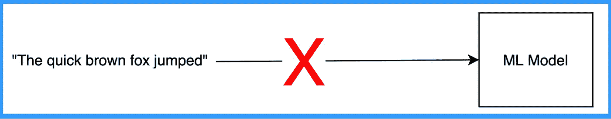
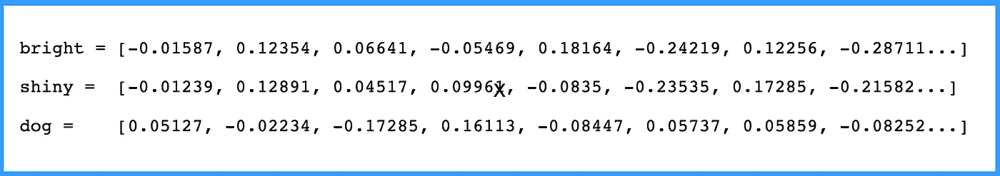
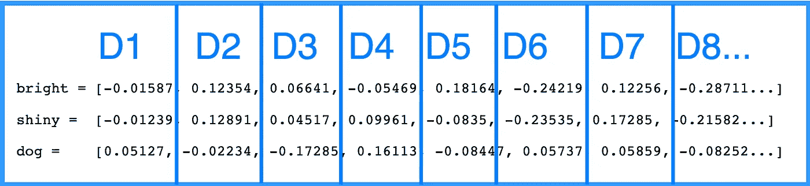
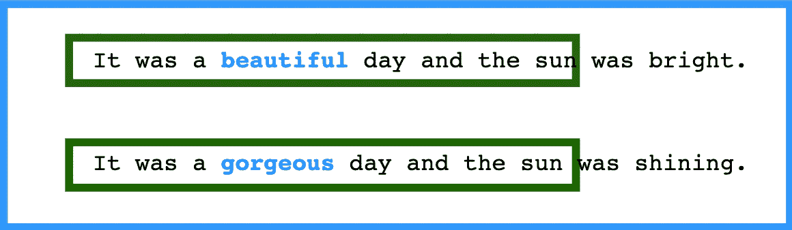

# 我如何向我的非技术同事解释单词嵌入

> 原文：<https://towardsdatascience.com/how-i-explained-word-embeddings-to-my-non-technical-colleagues-52ced76cf3bb?source=collection_archive---------40----------------------->

## 数据科学

## 没有代码。没有行话。只是你需要知道的高级事实

在 [Unsplash](https://unsplash.com/s/photos/robot-japan?utm_source=unsplash&utm_medium=referral&utm_content=creditCopyText) 上由 [Franck V.](https://unsplash.com/@franckinjapan?utm_source=unsplash&utm_medium=referral&utm_content=creditCopyText) 拍摄的照片

单词嵌入。

它们是什么？他们长什么样？它们是如何制造的？…

我将不用代码或行话来分解它。

这是基于我向非技术同事解释机器学习术语的经验。

# 理解:机器学习模型只理解数字

您不能向 ML 模型输入文本。

因为，简单来说，数学对文本不起作用。

不工作

你必须先把单词/句子/等等转换成一系列数字。

但是这个有用

**单词嵌入**是一种将文本转换成机器可读格式的方法。

有几种方法，包括[单词袋](https://medium.com/swlh/bag-of-words-in-machine-learning-13c1de579d2d)，但我们不会在这里深入探讨。

# 单词嵌入将单词转换成数字序列

下面是几个词，“亮”“闪亮”“狗”，用流行的嵌词库 Word2Vec 翻译成数字。

注意“明亮的”和“闪亮的”比“狗”更相似。

当使用像 [Word2Vec](https://en.wikipedia.org/wiki/Word2vec) 这样的预训练嵌入时，每个单词的数字表示都包括在内。

你只需将你的单词转换成每个给定的数字序列，然后将它们插入到你的模型中。

# 单词嵌入中的值是什么意思？

孤立来说，什么都没有！

但是相对于彼此，它们包含了大量的信息。

在前面的 Word2Vec 示例中，我们可以看到，在每个索引处，“bright”和“shiny”彼此更相似，而不是“dog”。

我们称每个索引为一个“维度”

如果我们把 D1 和 D2 标绘在一个 2x2 的网格上，我们会看到“明亮的”和“闪亮的”离得很近，“狗”离得更远。

在单词嵌入方法中，具有相似含义的单词“应该”具有相似的数值。

# 为什么相似的词有相似的数值？

好问题。

因为一个词就是它的上下文。

用于构建单词嵌入的训练文本中的“上下文”=“单词周围使用的单词”。

因此，当推导“美丽”和“华丽”的数值时，我们可能会在它们周围找到相似的词，它们会得到相似的数值。

在给定上下文的情况下，单词的数值是正确猜测单词时神经网络中权重的函数(CBOW 方法)。

神经网络不断调整其权重，直到它可以获取单词的上下文，并猜测单词本身。

此时，当前重量(想想机器上的旋钮和刻度盘)变成了数值。

相似的上下文经常出现在意思相似的词周围。

所以相似的神经网络权重会预测相似的词。

# 结论

*免责声明:我已经做了一些概括，并跳过了一些小步骤，以帮助使这个更容易解释*

就是这样。

单词嵌入是将文本转换成数字以便计算机处理的一种方法(几种方法之一)。

与其他方法相比，实践经验(成功和失败)是你何时应该真正使用它们的最佳指南。虽然很受欢迎，但它们的表现往往不如更传统的方法(根据我的轶事经验)。

这就是为什么我总是建议深入了解[一些代码](https://radimrehurek.com/gensim/models/word2vec.html)。

记住，在机器学习中，没有免费的午餐。我们真的不知道什么有效，直到我们尝试它！