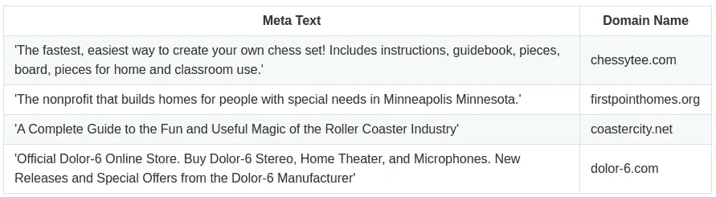
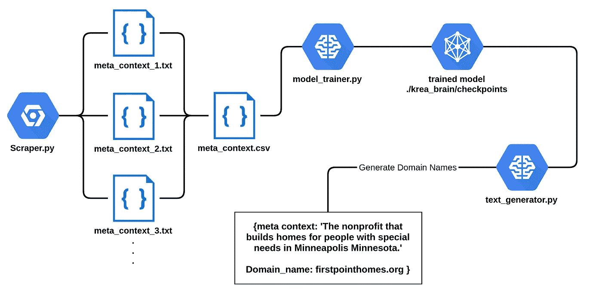

# 我如何微调人工智能来创造有创意的域名

> 原文：<https://towardsdatascience.com/how-i-fine-tuned-gpt-2-to-generate-creative-domain-names-a56d59d55aca?source=collection_archive---------28----------------------->


在 [Unsplash](https://unsplash.com?utm_source=medium&utm_medium=referral) 上[科学高清](https://unsplash.com/@scienceinhd?utm_source=medium&utm_medium=referral)拍摄的照片

我心中有一个目标，要创造一个对人有帮助，同时又超级简单的人工智能服务。在摆弄了 GPT-2 之后，我意识到它有巨大的创造潜力，可以证明在创造性的文本生成中是有用的。

因此我创建了 NameKrea，这是一个[人工智能域名生成器](https://namekrea.com/)。域名生成器业务已经上线很长时间了，但是还没有看到这么多高质量的内容。(如果你想了解更多关于项目构思阶段和生产力技巧[，这里是文章](https://becominghuman.ai/how-i-launched-an-ai-service-in-60-days-while-working-full-time-part-1-d42be50c42c2)的第一部分)

让我向你介绍一下我是如何构建一个生成域名和商业创意的人工智能服务的！

# 介绍

在从 Majestic Millions top 100 万域名列表中抓取了大约 10 万个网站后，我微调了 355M 参数模型。结果非常准确，同时也很有创意。看看结果:



[Namekrea AI 生成的域名和元文本](https://namekrea.com)

如果有足够的训练数据，GPT-2 能够理解上下文。为了能够训练它，我们需要大量的数据。这可以很容易地通过抓取网站的元描述来完成。幸运的是，互联网上并不缺少网站:)

通过使用 CSV 文件读取每一行，可以对 GPT-2 进行微调。在开始抓取之前，我们需要定义算法可以理解的数据结构。为此，我采用了一种相当简单的方法，即给 GPT-2 提供每个域一行的文本和元描述。我们的训练数据中的单个条目将如下所示:

```
Create an account or log into Facebook. Connect with friends, family and other people you know. Share photos and videos, send messages and get updates. **= @ =** facebook.com
```

如您所见，我们首先输入给定上下文的元上下文，然后使用一个普通文本中不存在的分隔符。您可以选择自然文本中通常不存在任何内容。我选择了这个分隔符:-> **= @ =**

# 第一步:刮擦

正如您可能会想到的，手动复制和粘贴域的元上下文将会花费大量的时间。我们需要想出一个刮算法，能够为我们生成干净的训练数据。

数据的整洁很重要，因为大多数机器学习模型都依赖于质量。你的机器学习模型可以和你的训练数据一样好。因此:

> 当训练一个机器学习模型的时候，永远记住:垃圾进，垃圾出！


垃圾进，垃圾出！

那么，我所说的干净数据是什么意思呢？首先，GPT-2 主要是在互联网上搜集的英语数据上进行训练的。因此，我们需要确保我们收集的是英语的元上下文数据。其次，有很多网站都有使用表情符号和不同字符的元描述。我们不希望这些出现在我们最终收集的数据中。

如果我们设计一个抓取算法，它应该能够按照以下逻辑过滤和提取数据:

1.  ***仅英文***
2.  **没有表情符号和表情符号之类的。只是光秃秃的英文文本。**
3.  ***只收集一系列 TLD 的数据(如。com，。网，。（同 organic）有机..)***
4.  ***要快！我们需要同时从多个域获取数据的多重处理，否则将需要很长时间来收集数据。***

既然我们决定了我们的主要需求，让我们继续构建我们的铲运机！

Python 有很多很棒的抓取包，比如 [BeautifulSoup](https://pypi.org/project/beautifulsoup4/) 。它有许多功能，使它有可能在瞬间开始抓取网站。我们将使用这个库来获取域，然后将它们写入 csv 文件。

在 [github repo 的 namekrea](https://github.com/cderinbogaz/namekrea) 处完成刮刀

出于某种原因，Github Gist 嵌入不能正常工作。在域名生成器 namekrea 的 [github repo 看一下源代码中的 *scraper.py*](https://github.com/cderinbogaz/namekrea)

首先 scraper.py 从 [majestic 的前 100 万域名列表](https://blog.majestic.com/development/majestic-million-csv-daily/)中读取域名，然后开始抓取数据的过程。

> 注意:在运行 scraper.py 之后，你将从 5 个不同的线程中获得 5 个不同的文件。因此，您需要将这些文件合并成 1 个文件，并将其转换为 csv 文件，否则无法进行微调。

。scraper.py 的 txt 输出如下所示:

```
Create an account or log into Facebook. Connect with friends, family and other people you know. Share photos and videos, send messages and get updates. = @ = facebook.com Search the world's information, including webpages, images, videos and more. Google has many special features to help you find exactly what you're looking for. = @ = google.com Enjoy the videos and music you love, upload original content, and share it all with friends, family, and the world on YouTube. = @ = youtube.com
```

当您完成数据收集后，我们将继续下一步。

## 第二步:微调它！

GPT 二号是巨大的！中等规模的预训练模型有 3.55 亿个参数！这种架构的微调，用你普通的笔记本电脑 CPU 肯定是做不到的。在我的设置中，我使用了 2x1070Ti GPU，大约花了 2 个小时才达到高质量的输出。

让我们看看项目的总体架构，以了解如何训练该模型:



为[生成域名](https://namekrea.com)微调新 GPT 协议工作流程的基本架构

因此，首先，我们将数据和文本文件组合成一个 csv 文件，使其可以被 **model_trainer.py** 脚本使用。

训练完成后，我们将把检查点加载到 text_generator.py，随机生成域名。

## 第三步 [AI 生成域名:](https://namekrea.com)

随机生成的域名很酷，但是如果我们不能给 GPT-2 系统提示的话，它就没什么用了。幸运的是，这可以通过**前缀**变量实现:

```
gpt2.generate(sess, model_name=model_name,
              #run_name=run_name, checkpoint_dir=checkpoint_dir,
              temperature=0.8, include_prefix=True, **prefix='The best e-cigarette',**
              truncate='<|endoftext|>', nsamples=10, batch_size=2, length=128
              )
```

当我看到结果时，我忍不住笑了:

> 尼古丁含量超过 99%的最好的电子烟。电子烟不仅仅是一种 vape。是一款通讯 APP。把它当作便携式汽化器。或者放在口袋里，用智能手机控制你的 vape。Vaporsca 是最好的电子烟对比网站。

一个 vape 也是一个通讯 APP？？我可以肯定地说，这个东西是非常有创意的:D

我希望你喜欢这个教程。GPT-2 当然是一个惊人的神经网络架构，我不能给简单的 GPT-2 包足够的信任。如果没有这个包，这个项目可能需要更多的时间。如果你错过了该项目的 github 链接，这里是:[https://github.com/cderinbogaz/namekrea](https://github.com/cderinbogaz/namekrea)

我还建立了一个网站，你已经可以使用 NameKrea 的创作能力！请查看 Namekrea [人工智能域名生成器](https://namekrea.com/)

感谢您的阅读，请在评论中告诉我您的想法！

作为一个旁注，我写了另一篇关于我如何在全职工作的时候获得 NameKrea 的文章。如果你需要一些生产力和如何找到适合市场的产品，那么这篇文章就是给你的:

[*https://becoming human . ai/how-I-launch-an-ai-service-in-60-days-while-work-full-time-part-1-d 42 be 50 c 42 c 2*](https://becominghuman.ai/how-i-launched-an-ai-service-in-60-days-while-working-full-time-part-1-d42be50c42c2)