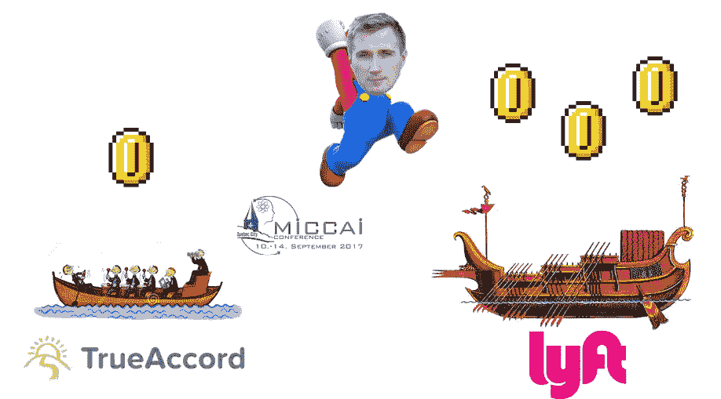
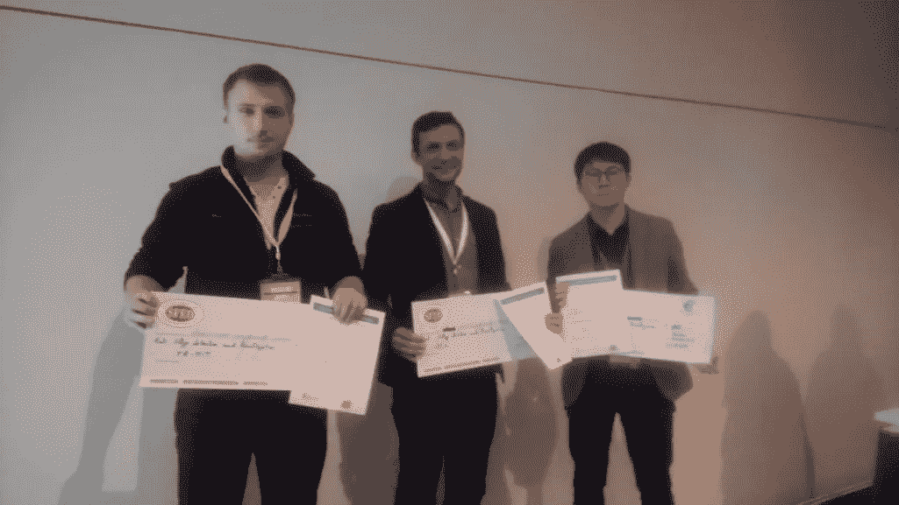
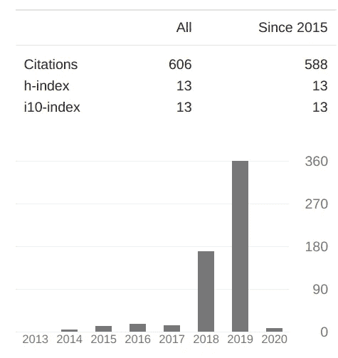

# 将职业转向自动驾驶汽车

> 原文：<https://towardsdatascience.com/how-i-found-my-current-job-3fb22e511a1f?source=collection_archive---------3----------------------->

## **我如何从讨债转向自动驾驶汽车**

新年是反思过去和规划未来的时候。本着这种精神，我想借此机会讲述一下我作为深度学习(DL) /计算机视觉(CV)工程师在这个行业中的经历。

2017 年 1 月，我在旧金山一家名为 [TrueAccord](https://www.trueaccord.com/) 的公司工作。我使用时间序列和表格数据构建传统的推荐系统。那时，互联网上开始充斥着描述这些新的尖端深度学习模型的博客帖子和论文，这些模型甚至能够超越人类。我的热情很快转移到这个令人兴奋的新领域。

虽然我确实有一些深度学习的知识，但我的实践经验相当有限。研究生院让我几乎没有机会应用机器学习模型，但幸运的是，我发现了 Kaggle，这让我可以培养我的深度学习专业知识。最终，我获得了 [Kaggle 大师](https://www.kaggle.com/progression#master)的称号，在[超声波神经分割挑战赛](https://www.kaggle.com/c/ultrasound-nerve-segmentation)中获得了一枚金牌。这是深度学习架构 UNet 被 Kaggle 社区广泛使用的第一个挑战。这也是第一个挑战，其中软骰子被用作分割任务的损失函数。

在 2017 年之前，Kaggle 主要专注于举办表格数据竞赛。获胜的解决方案通常涉及 xgboost 和其他经典 ML 算法的堆叠。很少有深度学习算法能够取代这样的技术。

2017 年一切都变了。DL 变得更加成熟，从学术界走向工业界。Kaggle 竞赛紧跟潮流，与成像相关的挑战变得更加普遍。

我喜欢我在 TrueAccord 的工作，但我想跳槽到一个可以从事深度学习相关任务的职位。

问题是我的技能不一定有助于这样的改变:

1.  我的专业是物理，不是计算机科学。
2.  我只有一年的行业经验。
3.  我的简历中没有任何机器学习相关的论文。
4.  我在工作中没有做过任何计算机视觉项目。
5.  我的深度学习知识有限。

基本上，我和其他试图改变工作方向的人处于同样的情况。

因此，我不得不像任何处在我位置上的人一样处理我的困境。方法很简单:你去面试，如果有效，你就完了，如果无效，你就研究你不知道的，然后重复。希望在有限的迭代次数内获得成功，你会幸运地得到想要的位置。

在此期间，我继续完善我的深度学习技能；看论文，看博文，当然还有参加深度学习比赛。

2017 年 3 月，当我和我的朋友 Sergey Mushinsky 在 [Dstl 卫星图像特征探测挑战赛](https://www.kaggle.com/c/dstl-satellite-imagery-feature-detection)中获得 493 名第三名，并分享了 2 万美元的奖金时，我的工作开始得到回报。在那次挑战之后，我开始对二进制图像分割和多光谱图像感到舒适，这通常会在卫星图像中找到。([描述解决方案的博文](https://medium.com/kaggle-blog/dstl-satellite-imagery-competition-3rd-place-winners-interview-vladimir-sergey-6f6ca776fdea)、[预印本](https://arxiv.org/abs/1706.06169)、[代码](https://github.com/ternaus/kaggle_dstl_submission))

我用奖金买了第二个 GPU，这反过来让我意识到 Keras 在多 GPU 设置下工作不太好。我转向 PyTorch，它仍然是我选择的 DL 框架。然而，各行各业的成功来之不易。在同一时期，我没有通过笛卡尔实验室的现场面试和一些技术筛选。我知道我需要继续努力提高我的技能。

大约在那个时候，我被邀请参加英伟达的现场面试，但我也没有通过。我遇到的一个问题是我对 2D 物体探测器的工作原理了解有限。幸运的是，DSTL 启动了[安全通道:在航空影像挑战赛中对车辆进行检测和分类](https://www.datasciencechallenge.org/challenges/1/safe-passage)，该挑战赛专注于 2D 检测。他们决定不在 Kaggle 托管，而是使用自己的平台。

那次比赛有一个重要的规则:“每个人都可以参加，但你需要有护照，并居住在一些有限的国家，才能领取奖金。”我住在旧金山，在美国纳税，但由于我的俄罗斯公民身份，我没有资格获得该奖项。我知道这个不幸的事实，但比赛仍然提供了使用物体探测器的宝贵实践，所以在努力工作后，我能够在比赛中获得第二名。

数据科学的进步在很大程度上基于广泛的国际社会的合作。我在脸书和 Twitter 上表达了我的观点，即我认为 DSTL 的规则与这些理想背道而驰，但随着尘埃落定，我将这些从脑海中清除，继续前进。不知何故，这个故事跟着我，被俄罗斯新闻选中了。很快，我发现我的脸出现在俄罗斯主要新闻媒体和电视频道的头版。

一个英国国防实验室为 MI-6 开发工具，人工智能算法，一个俄罗斯公民因为国籍而被拒绝获奖。这是一个很好的故事，俄罗斯媒体很快就发现了这一点。有一段时间，我对在镜头前接受采访感到不自在，所以我拒绝与记者交谈。这并没有阻止他们。他们把我的个人资料照片放在背景中，并邀请该主题的“专家”给出他们的专业意见。

记者们甚至找到了我的父母，他们对机器学习、竞赛和所有的事情都一无所知。我母亲告诉他们，父母是至关重要的，但低估学校老师的影响力是不明智的。这种偏离奏效了，记者们带着他们的问题来到了我的高中。

俄罗斯顶级科技公司之一的 Mail Ru Group 决定利用这个机会进行一些积极的公关。他们提出给我 15000 美元，相当于挑战的第二名奖金。我喜欢这个主意，但我觉得它不公平。我明知故犯地同意了规定我没有资格获奖的规则。此外，我并不兴奋地在简历中加入我曾为英国军情六处开发人工智能算法而获得报酬。我想到了一个更好的解决办法。我热爱理论物理，我知道要获得足够的资金总是有困难的。因此[我要求把钱转给支持基础科学的俄罗斯基金](https://www.youtube.com/watch?v=e-YM4Pcolos)。

最终，一切顺利。邮件 Ru 组和我得到了一些积极的公关。俄罗斯基础科学得到了 1.5 万美元。DSTL 有动力重新考虑他们的大联盟比赛规则。

这个故事引起了俄罗斯观众几天的注意，之后就销声匿迹了。在英语媒体中，只有[一篇博客文章](https://www.theregister.co.uk/2017/06/05/russian_denied_dstl_data_sci_challenge_prize/)谈及此事。也许这样最好:)

很快三月变成了六月，我仍然没有找到一份计算机视觉的工作。

我名单上的下一家公司是特斯拉。招聘人员联系我是因为我的 Kaggle 成就，这并不经常发生。我通过了课后测试、技术筛选和现场面试。接下来是背景调查和埃隆·马斯克对我申请的批准。我没有通过。招聘人员告诉我，我违反了保密协议(NDA)，并在一个论坛上谈论了面试过程。这是真的。我确实提到了我正在 slack 频道 [ods.ai](https://ods.ai/) 进行采访。我没有分享任何面试问题，但从技术上讲，他们是对的。我记得，特斯拉的 NDA 相当严格，禁止讨论你的面试过程，即使是在高层次上。

这个拒绝让我很难过。与安德烈·卡帕西一起工作会很令人兴奋。即使是现在，几年后，我仍然为自己造成了那种不健康的状况而感到内疚。希望在某个时候，我有机会为我的行为道歉。

接下来是在卡格尔举行的[星球:从太空了解亚马逊](https://www.kaggle.com/c/planet-understanding-the-amazon-from-space)竞赛。这个问题太简单了，不能花太多时间。小数据集上的多标签分类。结果我和另外六个人的团队合并了。一个星期的时间，我们训练了 480 个分类网络，并进行堆叠。938 人中的第 7 名。

组织这次竞赛的公司叫做[星球实验室](https://www.planet.com/)。他们有一个开放的 DL 工程师职位，我问了一下，并被邀请到现场面试。我又失败了。反馈—没有深入的 DL 知识。

那是八月中旬。经过七个月的求职，我开始失去典型的积极态度和对自己的信心。我刚刚开始与 Lyft 的面试过程，但我认为它会像之前的所有事情一样结束。

我坐在窗前，用一杯白兰地来麻痹我的悲伤。

我又被拒绝了。

> 一位谷歌员工最近推荐你担任谷歌大脑(美国)的研究科学家。我们仔细审查了你的背景和经历，决定目前不继续处理你的申请。

我开始受不了了。

但是我有个主意。在每一个糟糕的情况下，都有一些深奥的举措可能奏效。大多数拒绝是在简历筛选阶段收到的。因此，我没有机会展示我的技能。为了先发制人，我决定需要在简历中添加深度学习出版物。

我联系了麻省理工学院的博士后 Alexey Shvets，并提出了一个建议:

1.  找到下一个有比赛赛道的 DL 会议。
2.  训练一个模型，创建一个提交，获得最后一名。(我假设，如果人们花费数年时间研究某个问题，那么对他们来说，这将很难成为合法的竞争)
3.  写一份关于学术数据集的预印本或论文，描述我们的解决方案。

他同意了，我们寻找一个适合我们的会议。我们遇到了三周内发生的 MICCAI。它有一个名为[内窥镜视觉挑战赛](https://endovis.grand-challenge.org/)的工作室，还有一些计算机视觉比赛。最后期限是八天后。

我们选择了第一个挑战，[吉安娜](https://endovissub2017-giana.grand-challenge.org/)。这个问题有三个次级挑战。在剩下的八个晚上，我修改了我在 Kaggle 比赛中使用的管道，重构了代码，并训练了新的模型。阿列克谢写了描述我们方法的报告。我们相信我们会在排行榜的末尾。因此，我真的没有在这些问题上花时间。我们向组织者提交了我们的申请和报告，我想这将是我们小小冒险的结束。事实并非如此，Alexey 发现该研讨会还有另一项名为[机器人器械分割](https://endovissub2017-roboticinstrumentsegmentation.grand-challenge.org/)的竞赛，其中有三项分挑战，截止日期延长，四天后即将到来。他问我是否愿意尝试这些次级挑战。我同意了，把自己关了四个晚上，为组织者粗制滥造代码、模型和生成预测。

挑战伴随着一个警告:团队的一名成员需要来 MICCAI 并展示结果。最终地位只能在会议上宣布。

我从来没有去过魁北克市和加拿大，所以我很高兴去，并同意了。

工作坊的日子到了。我走进工作室，发现一大群热情的医学影像专家似乎彼此都认识。我不认识任何人，我也不能开始对话，因为我在深度学习和计算机视觉方面感觉很舒服。尽管如此，医学成像的所有细节对我来说还是有点陌生。

第一项挑战开始了。来自不同大学的团队展示了他们的解决方案。很难判断他们有多好，但很明显他们投入了大量的工作。轮到我了。我来到讲台，告诉观众我不是这个领域的专家，我们做这个挑战只是作为一个深度学习练习，为浪费他们的时间道歉，并展示了我们的两张幻灯片。

组织者展示了结果。

1.第一项子挑战—我们是第一名。

2.第二次挑战—我们是第三名。

3.第三项子挑战—我们是第一名。

首先总体来说。([官方新闻稿](http://www.cvc.uab.es/outreach/?p=618))

是第二次挑战的时候了，这次挑战的截止日期推迟了四天。不同的团队提出了他们的解决方案。我再次为浪费观众的时间道歉，并展示了我们的两张幻灯片。

第一，第二，第一。首先总体来说。

我至今记得那一刻。我站在现场。组织者正在准备一张支票和一些礼物。阿列克谢和我取得了胜利，但我不禁对这种明显的荒谬感到沮丧。这是怎么发生的，一些随机的没有医学成像领域知识的家伙在两个挑战中都获得了第一名？然而，那些以医学成像工作为生的人使用的是更弱的模型？

我问观众:“你们知道我在哪里工作吗？”没有人知道，除了一个查看我 LinkedIn 个人资料的组织者。我告诉他们，我在讨债机构 TrueAccord 工作，我没有在工作中训练深度学习模型。我感叹自己没能脱离这种模式，因为 Google Brain 和 Deepmind 里的 HR 甚至都不看我的简历。

在那次充满激情的演讲后，听众中 Deepmind 健康团队的成员在休息时抓住我，问我是否有兴趣面试他们团队的一个研究工程师职位。

我相信这是历史上第一次，一个讨债机构赢得了医学成像的比赛。:)

不久后，我接受了 Lyft 的一份工作邀请，目前我在那里工作。在 TrueAccord 和 Lyft 之间，我还参加了在 Kaggle 举行的 [Carvana 图像屏蔽挑战赛](https://www.kaggle.com/c/carvana-image-masking-challenge)。GIANA 的做法让我进入了排行榜的后 20%。新的想法不断涌现，由 Vladimir Iglovikov、Alexander Buslaev 和 Artem Sanakoyeu 组成的团队在 735 名选手中获得第一名。([博文](https://medium.com/kaggle-blog/carvana-image-masking-challenge-1st-place-winners-interview-78fcc5c887a8)，[代号](https://github.com/asanakoy/kaggle_carvana_segmentation))

该竞赛是社区开始在 UNet 类型架构中使用预训练编码器的第一个大挑战。这是现在的标准，并且有[伟大的库允许你用各种不同的预训练编码器](https://github.com/qubvel/segmentation_models.pytorch)得到各种不同的分段网络。但是在那个时候，这个想法还是比较新的。这个挑战导致了名为 [TernausNet](https://github.com/ternaus/TernausNet) 的预印本，这是我和阿列克谢写的，只是为了好玩，令人惊讶的是，这是我被引用最多的作品。

# 结论

在八个月的时间里，我在自己感兴趣的领域找到了一份[的优秀工作](https://medium.com/lyftlevel5/employee-spotlight-vladimir-iglovikov-11b71ed02bc)。那段时间充满了痛苦。当你在尝试新事物时，你会犯错误。每次失败的时候，你可能都会觉得自己很蠢。有时，你可能会开始对自己失去信心。但是记住你正在学习新的东西。你迈出的每一步都会让你更接近你想要的目标。

在过去的几年里，我在我的[谷歌学术档案](https://scholar.google.com/citations?user=vkjh9X0AAAAJ&hl=en):)中添加了一些深度学习论文

校对: [Erik Gaasedelen](https://www.linkedin.com/in/erikgaas/) 。

[俄文版正文](https://habr.com/ru/company/ods/blog/345992/)。