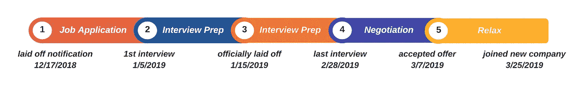

# 我是如何获得 4 份数据科学工作邀请，并在被解雇后两个月内收入翻倍的

> 原文：<https://towardsdatascience.com/how-i-got-4-data-science-offers-and-doubled-my-income-2-months-after-being-laid-off-b3b6d2de6938?source=collection_archive---------0----------------------->

## [数据科学面试](https://towardsdatascience.com/tagged/data-science-interview)

[马丁·比约克](https://unsplash.com/@martenbjork?utm_source=medium&utm_medium=referral)在 [Unsplash](https://unsplash.com?utm_source=medium&utm_medium=referral) 上的照片

在这个前所未有的疫情时期，许多人发现他们的职业生涯受到了影响。这包括一些我曾经共事过的最有才华的数据科学家。在与一些密友分享了我的个人经历以帮助他们在下岗后找到新工作后，我认为这值得公开分享。毕竟这触动的不仅仅是我和我的朋友。任何因疫情而被解雇的数据科学家或正在积极寻找数据科学职位的人都可以在这里找到一些相关的东西，我希望这些东西最终会给你的求职带来希望。

所以，如果你曾经陷入困境——在面试中，在面试准备中，在谈判中，任何事情——我都曾在那里，我想帮助你。如果你认为我能以任何方式让你的旅程变得更容易，你可以在这里联系我。这是我的故事。我希望你能从中找到一些有用的提示和鼓励。

# 目录

1.  [被解雇](#507b)
2.  [准备搜索](#64a7)
3.  [求职开始](#42a9)
4.  [面试:概述](#cfa8)
5.  [面试前](#2e25)
6.  [特定科目准备](#6f86)
7.  [获得 100%现场报价率的秘诀](#c733)
8.  [谈判](#e46e)
9.  [外卖](#10e9)
10.  [概述](#102c)
11.  [更新(2020 年 10 月 1 日)](#c547)

# 被解雇了

2018 年 12 月，我的经理通知我，我将于 2019 年 1 月被解雇。三个月前，我当时创业公司的工程副总裁给我们的人力资源主管写了一封信。这封信解释了为什么我是公司里表现最好的人之一，并主张增加我的工资。这帮助我获得了 33%的加薪。我很自然地感到有动力，渴望在一个重要的项目上突破下一个里程碑。公司和我自己的未来看起来一片光明。正是在这个成功的时刻，我被告知我受到了公司削减成本计划的影响。1 月 15 日我被解雇了。

至少可以说，被迫开始寻找新工作是令人畏惧的。在浏览了市场上的数据科学职位空缺后，我很快意识到了自己的知识差距。我在 B2B 初创公司所做的事情(入门级数据工程和机器学习的结合)与那里的许多工作要求完全无关，比如产品感觉、SQL、统计等等。我知道基础知识，但不确定如何填补更高级技能的空白。然而，与更紧迫的问题相比，即使是这个问题似乎也是次要的，例如**我怎么才能得到面试机会**？我只有一年半的创业工作经验，而且没有任何统计学或计算机科学相关的学位。更多的问题接踵而至。如果我在失去签证身份前找不到工作怎么办？如果在我找到新工作之前经济衰退了怎么办？尽管我很害怕，但几乎没有选择。**我不得不找一份新工作**。

# 为搜索做准备

面对如此艰巨的任务，我需要一些信息来决定接下来的步骤。在做了一些研究后，我意识到市场上超过一半的数据科学职位是**产品驱动型职位**(‘产品分析’)，其余的要么是建模，要么是面向数据工程的职位。我还注意到，产品分析以外的职位往往要求更高。例如，大多数模特职位需要博士学位，工程职位需要计算机科学背景。很明显，不同赛道的要求差异很大，因此每条赛道的准备工作也会有所不同。

有了这些知识，我做了一个重要的决定:为所有的赛道做准备将是势不可挡的，而且很可能是低效的。我需要**专注于一个**。我选择产品分析，因为根据我的背景和经验，我有更大的机会在这个领域获得面试机会。当然，并不是每个数据科学领域的人都有我的背景和经验，所以下面我总结了大公司三类数据科学职位的一般要求。理解这个基本的问题为我节省了很多时间，我相信它会对其他寻找数据科学工作的人有用。然而，我要补充的是，对于小型创业公司来说，面试可能不那么结构化，需要更多的这三者的混合。

**产品分析(约 70%的市场份额)**

*   要求:有推出产品的实践经验；商业敏锐度强；高级 SQL 技能
*   例子:数据科学家，Airbnb 的分析；Lyft 的数据科学家；脸书大学的数据科学家；谷歌的产品分析师

**建模(市场上约 20%)**

*   要求:机器学习的知识(不仅要知道如何使用还要知道底层的数学和理论)；强大的编码能力
*   例子:Lyft 的数据科学家、算法；数据科学家，Airbnb 的算法；亚马逊的应用科学家；脸书大学的研究科学家

**数据工程(市场上约 10%)**

*   要求:具有数据工程技能的端到端数据科学家；分布式系统的知识；MapReduce 和 Spark 有使用 Spark 的实践经验；强大的编码能力
*   例如:Airbnb 基金会数据科学家；一些创业公司的数据科学家

根据我自己的经验，这篇文章的其余部分是为那些准备进入**产品分析**岗位的人量身定做的。稍后回来查看我关于准备数据工程职位的帖子。

# 求职开始了

当我知道自己将被解雇时，我做的第一件事就是积极主动地申请其他工作。我用了所有我知道的求职板，包括 [GlassDoor](https://www.glassdoor.com/index.htm) 、[early](https://www.indeed.com/)和 [LinkedIn](https://www.linkedin.com/) 。我也问了所有认识的人推荐。但由于已经快年底了，直到 2019 年 1 月，我都没有收到任何回复。

事实证明，寻求推荐比我自己申请有效得多。在大约 50 份原始申请中，我只获得了 3 次面试机会，但在 18 份推荐中，我获得了 7 次面试机会。总的来说，越来越明显的是，在这个市场上，我不被认为是一个强有力的候选人。

# 面试:概述

虽然每个公司的面试结构都不一样，但大多数公司都遵循一个总体框架:

*   招聘人员最初的电话
*   1 或 2 轮技术电话筛选(TPS)或带回家的作业
*   4 ~ 5 小时的现场面试，通常包括 3 ~ 4 轮技术面试和招聘经理的行为面试

我采访过的公司中，大约有一半(4/10)在 TPS 之前或之外有带回家的任务。带回家的作业消耗了很多能量。通常，8 小时的带回家作业导致我在提交后至少需要半天时间休息。正因为如此，我尽了最大努力相应地安排了面试。我课后作业的第二天早上没有面试。仅仅意识到基本结构就能让你感觉更轻松，并能应对找新工作的过程。

# 面试前

进入我的面试，**每一个机会对我来说都是至关重要的****。虽然我知道有些人通过面试来学习，在多次面试后变得更好，通常会获得他们面试的最后几家公司的录用通知，但我觉得我不能采取这种方法。2017 年毕业的时候，500 份原始申请，我只收到了 4 份面试。我不指望在 2019 年得到更多。因此，我的计划是为每次面试做好充分准备。我会让**没有机会去浪费**。**

**被解雇的一个好处是我可以为面试而全职学习。每天我都把我所学的东西组织起来，每天集中在两三件事情上。不会了。从以前的面试中，我了解到深刻的理解可以让你在面试中给出更透彻的回答。当你比平时更加紧张和焦虑的时候，在面试中有一个深度的知识会特别有帮助。这不是你想假装的时候。**

**当我描述自己的经历时，我不禁想起了我经常听到的一个常见的误解:没有真实的经历，就不可能获得关于产品/实验的知识。我坚决不同意。我之前没有任何产品或 A/B 测试的经验，但是我相信这些技能可以通过阅读、倾听、思考和总结获得。毕竟，这和我们在学校被教导的方式是一样的。事实上，随着我越来越了解更多的资深数据科学家，我不断了解到这种方法很普遍，甚至对于有多年经验的人来说也是如此。你将要面试的内容可能与你正在做的事情完全无关，但是你可以通过工作经验之外的方式获得你需要的知识。**

**以下是你可以预期的基本情况。通常，产品和 SQL 问题是在 TPS 期间提出的。现场采访包括几轮问题，包括产品意识、SQL、统计、建模、行为，可能还有演示。接下来的几个小节总结了我在准备面试时使用的最有用的资源(都是免费的)。总的来说， [GlassDoor](https://www.glassdoor.com/index.htm) 是了解公司具体问题的好来源。一旦我看到这些问题，我就明白了公司需要什么，以及在满足这些需求方面我的差距在哪里。然后我就可以制定一个计划来填补这些空白。**

# **特定科目的准备**

****

**[安德鲁·尼尔](https://unsplash.com/@andrewtneel?utm_source=medium&utm_medium=referral)在 [Unsplash](https://unsplash.com?utm_source=medium&utm_medium=referral) 上拍照**

**以下六个小节是我如何准备产品分析专题采访中出现的具体内容的。在解释我自己的准备时，我希望为我的后来者铺平道路。**

# **产品感**

**在一家创业公司做数据科学家，主要负责开发和部署机器学习模型，编写 spark 作业。因此，我几乎没有获得任何产品知识。当我在 [GlassDoor](https://www.glassdoor.com/index.htm) 上看到一些真实的面试问题，比如“如何衡量成功？”或者“如何通过当前用户的行为来验证新功能？”，我完全不知道如何处理这样的问题。当时，它们似乎过于抽象和开放。**

**为了学习产品意识，我求助于基本的**阅读和总结**策略，使用下面列出的资源。所有这些阅读帮助我积累了产品知识。因此，我想出了一个结构化的方法(我自己的“**框架**”)来回答任何类型的产品问题。然后，我将我的知识和框架用于测试，这对于学习任何技能都是必不可少的:**练习**。我写下了涉及产品感觉的问题的答案。我大声说出我的答案(甚至用手机给自己录音)，并用录音来微调我的答案。很快，我不仅可以在面试时假装，我还真的知道自己的东西。**

**资源:**

*   **[*恒星同行*](https://stellarpeers.com/blog/)**
*   **Gayle Laakmann McDowell 和 Jackie Bavaro 的访谈**
*   **[*解码与征服*](https://www.amazon.com/Decode-Conquer-Answers-Management-Interviews/dp/0615930417/ref=sr_1_1?s=books&ie=UTF8&qid=1530848101&sr=1-1&keywords=decode+and+conquer) 刘易斯·c·林著**
*   **[*案件采访秘闻*](https://www.amazon.com/Case-Interview-Secrets-Interviewer-Consulting/dp/0984183523) 作者郑胜利**

# **结构化查询语言**

**我第一次参加 SQL TPS 考试失败了，那是在一家我非常感兴趣的公司。显然，有些事情需要改变。我需要再次练习，所以我花时间研究 SQL 问题。最终，我能够在一天内完成之前要花一整个星期的问题。熟能生巧！**

**资源:**

*   **[Leetcode 数据库问题](https://leetcode.com/problemset/database/)**
*   **[HackRank SQL 问题](https://www.hackerrank.com/domains/sql?filters%5Bstatus%5D%5B%5D=unsolved&badge_type=sql)**

# **统计和概率**

**为了准备这类问题，我复习了基础统计和概率，并做了一些编码练习。虽然这看起来很难回答(这两个主题都有很多内容)，但是对于产品数据科学家来说，面试问题从来都不难。下面的资源是复习的好方法。**

**资源:**

*   **汗学院有一门介绍性的[统计和概率](https://www.khanacademy.org/math/statistics-probability)课程，涵盖了这两方面的基础知识。**
*   **这本[在线统计书](http://onlinestatbook.com/2/index.html)涵盖了所有基本的统计推断。**
*   **哈佛有一门[统计 110:概率](https://www.youtube.com/playlist?list=PL2SOU6wwxB0uwwH80KTQ6ht66KWxbzTIo)课程，这是一门关于带有实际问题的概率的入门课程。如果你更喜欢阅读而不是听，宾夕法尼亚州立大学有一门[介绍概率论](https://online.stat.psu.edu/stat414/lesson/introduction-stat-414)的课程，里面有很多例子。**
*   **我还在 HackRank 上通过 [10 天的统计](https://www.hackerrank.com/domains/tutorials/10-days-of-statistics)进行编码，来巩固我的理解。**
*   **有时，A/B 测试问题会在统计面试中被问到。Udacity 有一个很棒的[课程](https://www.udacity.com/course/ab-testing--ud257)涵盖 A/B 测试的基础知识，Exp Platform 有一个关于这个主题的更简洁的[教程](https://exp-platform.com/2017abtestingtutorial/)。**

# **机器学习**

**没有 CS 学位，我带着有限的机器知识去找工作。我在之前的工作中上过一些课程，我复习了这些课程的笔记来准备面试。然而，即使现在建模问题变得越来越频繁，产品数据科学家的面试问题主要是如何应用这些模型，而不是基础的数学和理论。这里仍然有一些有用的资源，可以在面试前提升你的机器学习技能。**

**资源:**

*   **首先，我推荐安德烈亚斯·穆勒的免费[应用机器学习课程](https://www.youtube.com/watch?v=d79mzijMAw0&list=PL_pVmAaAnxIRnSw6wiCpSvshFyCREZmlM&index=1https://www.youtube.com/watch?v=d79mzijMAw0&list=PL_pVmAaAnxIRnSw6wiCpSvshFyCREZmlM&index=1)**
*   **Coursera - [机器学习](https://www.coursera.org/learn/machine-learning?utm_source=gg&utm_medium=sem&utm_content=07-StanfordML-US&campaignid=685340575&adgroupid=32639001781&device=c&keyword=machine%20learning%20programming%20tutorial&matchtype=b&network=g&devicemodel=&adpostion=&creativeid=243289762754&hide_mobile_promo&gclid=EAIaIQobChMIhY7m1Pfa6wIVtR6tBh0UCQAJEAAYASAAEgJcV_D_BwEhttps://www.coursera.org/learn/machine-learning?utm_source=gg&utm_medium=sem&utm_content=07-StanfordML-US&campaignid=685340575&adgroupid=32639001781&device=c&keyword=machine%20learning%20programming%20tutorial&matchtype=b&network=g&devicemodel=&adpostion=&creativeid=243289762754&hide_mobile_promo&gclid=EAIaIQobChMIhY7m1Pfa6wIVtR6tBh0UCQAJEAAYASAAEgJcV_D_BwE)吴恩达**
*   **Udacity - [机器学习工程纳米学位](https://www.udacity.com/course/machine-learning-engineer-nanodegree--nd009t)**

# **介绍会；展示会**

**一些公司要求候选人要么展示带回家的作业，要么展示一个他们最引以为豪的项目。尽管如此，其他公司还是在行为访谈中询问了最有影响力的项目。然而，不管是什么形式，关键是要让你的演讲有趣和有挑战性。**

**听起来不错，但是你怎么做呢？我的主要建议是**考虑所有的细节**，比如高层目标和成功指标，ETL，建模实现细节，部署，监控和改进。这些小事情加在一起，而不是一个大想法，就能形成一个伟大的演示文稿。这里有几个问题值得重新思考，以帮助你达到理想的演示效果:**

*   **项目的目标和成功标准是什么？**
*   **你如何决定启动这个项目？**
*   **你如何知道客户是否从这个项目中受益？差多少？**
*   **你如何测试它？如何设计你的 A/B 测试？**
*   **最大的挑战是什么？**

**演示项目时，您希望吸引观众。为了让我的演讲有趣，我经常分享这个项目中有趣的发现和最大的挑战。但是确保你投入的最好方法是练习。练习，大声练习。我练习向我的家人展示，以确保我对材料的掌握和沟通的便利。如果你能让你认识的人参与进来，一个被要求倾听的面试官就没有机会了。**

# **行为问题**

**虽然很容易陷入准备技术面试问题，但不要忘记行为问题同样重要。我面试过的所有公司在现场部分都至少有一轮行为面试。这些问题通常分为以下三类:**

*   **为什么是我们？/一份工作中你最看重的是什么？**
*   **介绍一下你自己/你为什么要离开现在的工作？**
*   **职业生涯中最大的成功/失败/挑战。其他版本:告诉我你解决冲突的一次经历，或者你不得不说服你的经理或项目经理的一次经历。**

**行为问题对于数据科学家来说非常重要。所以要做好准备！了解一家公司的使命和核心价值观有助于回答第一组的问题。像问题 2 和 3 可以通过讲故事来回答——3 个故事足以回答所有的行为问题。当你去面试的时候，确保你手头有几个好故事。类似于产品问题，我练习了很多，大声说出来，录音，听，然后调整我的答案。听一个故事是确保它有效的最好方法。**

# **获得 100%现场报价率的秘诀**

****

**[活动发起人](https://unsplash.com/@campaign_creators?utm_source=medium&utm_medium=referral)在 [Unsplash](https://unsplash.com?utm_source=medium&utm_medium=referral) 上的照片**

**现场面试的前一天晚上通常是一个紧张、忙碌的夜晚。我总是试图塞进更多的技术知识，同时回顾我的统计笔记，思考我的框架来回答产品问题。当然，正如我们在学校学到的，这些都不是非常有用的。结果在很大程度上取决于没有一晚临时抱佛脚之前的准备量。所以准备是重要的，但是有一些规则你可以遵循，以确保你的面试成功。**

1.  ****总是在回答问题之前澄清问题。**用自己的话复述问题，确保你理解了对方的提问。如果你回答问题却不澄清，这是一个危险信号。**
2.  ****整理所有问题的答案。用要点写下你的思考过程。这向面试官展示了你处理问题的系统方法，并有助于面试官稍后为你写一篇评论。****
3.  ****不知道答案的时候不要慌**。如果你不熟悉这个领域也没关系。在这种情况下，你可以先做一些假设，但一定要告诉对方你在做假设，并询问这些假设是否合理。有时候要求更多的时间完全没问题。如果你想不出任何答案，大脑一片空白怎么办？谈谈你的一次与问题相关的经历。**
4.  **态度很重要。公司正在寻找一个愿意倾听并能接受不同意见的人。你想表现出你是一个容易共事的人。要谦虚，要尊重。听并澄清。把你的正能量带到房间里，尽你所能进行一次愉快的谈话。**
5.  ****研究公司。**熟悉其产品。问问你自己如何改进产品，什么样的标准可以用来衡量这些产品的成功。阅读数据科学家的博客也有助于了解他们在每家公司的工作。做这种研究能让面试中的对话更深入，最终更好。**

**利用这些规则，这是我从现场采访中得到的反馈:**

*   **非常有条理地回答产品问题**
*   **演示非常有条理，经过深思熟虑**
*   **对我们的产品表现出浓厚的兴趣，并提出了宝贵的改进意见**

# **谈判**

**在收到口头提议后，下一步是与招聘人员合作，最终确定人数。这里只有一条我坚持的规则——**永远谈判**。但是怎么做呢？**

**Haseeb Qureshi 有一个关于[谈判工作机会](https://haseebq.com/my-ten-rules-for-negotiating-a-job-offer/)的非常有用的指南(带脚本！)在我的报价谈判阶段，我严格遵循了这一原则。每一条规则都是如此真实。我和所有给我报价的公司都进行了谈判。报价的平均增幅为 **15%** ，最高报价的总价值增幅为 **25%** 。谈判行得通，所以不要害怕尝试！**

# **外卖食品**

1.  **大量的练习是关键。**
2.  **失败是生活的一部分，也是求职的一部分。不要太认真。**
3.  **找到一种对你有效的减压方式。**

# **概观**

**在减掉了 11 磅，经历了大量的哭泣和尖叫(找工作压力很大，承认这一点没关系)之后，我终于在被解雇的 2 个月内获得了 4 份工作。其中 3 份来自我从未想过要加入的公司: **Twitter、Lyft** 和 **Airbnb** (我最终加入了这家公司)，另一份来自一家医疗保健初创公司。在疯狂的两个月结束时，我总共收到了 10 次面试、4 次现场面试和 4 份工作邀请，给了我 **40%的 TPS 到现场率**和 **100%的现场到工作邀请率**。**

****

**图片由[艾玛丁](https://medium.com/@emmading) |从被解雇到加入我梦想中的公司的时间线**

**我很幸运，在被解雇后，我从家人和朋友那里得到了很多支持和帮助，这对于在我梦想的公司找到一份工作至关重要。这很难。具有讽刺意味的是找工作也是一大堆工作，但一切都是值得的。**

**我写这篇博客是因为我知道我有多不知所措。面试要准备的东西太多了。我希望这篇文章能让其他需要工作的数据专家明白一些事情，如果你想要更多的建议，请随时联系我[这里](https://www.datainterviewpro.com/contact-us)。我很高兴现在能从事一份很棒的工作，我也很乐意帮助你实现这一目标！**

# ****更新(2020 年 10 月 1 日)****

**自从我三周前发表这篇文章以来，我收到了数百个关于数据科学面试的问题。所以我决定制作一系列视频来帮助你获得梦想中的数据科学工作。有兴趣可以去我的 YouTube 频道看看！**

# **感谢阅读！**

**如果你喜欢这个帖子，想支持我…**

*   ***订阅我的* [*YouTube 频道*](https://www.youtube.com/channel/UCAWsBMQY4KSuOuGODki-l7A) *！***
*   ***跟我上* [*中*](https://medium.com/@emmading) *！***
*   ***连接上*[*Linkedin*](https://www.linkedin.com/in/emmading001/)*！***
*   **前往[emmading.com/resources](https://www.emmading.com/resources)获取更多关于数据科学面试技巧和策略的免费资源！**