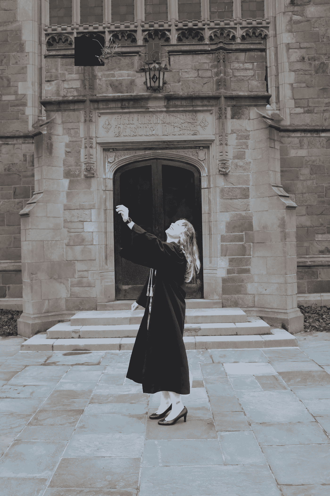
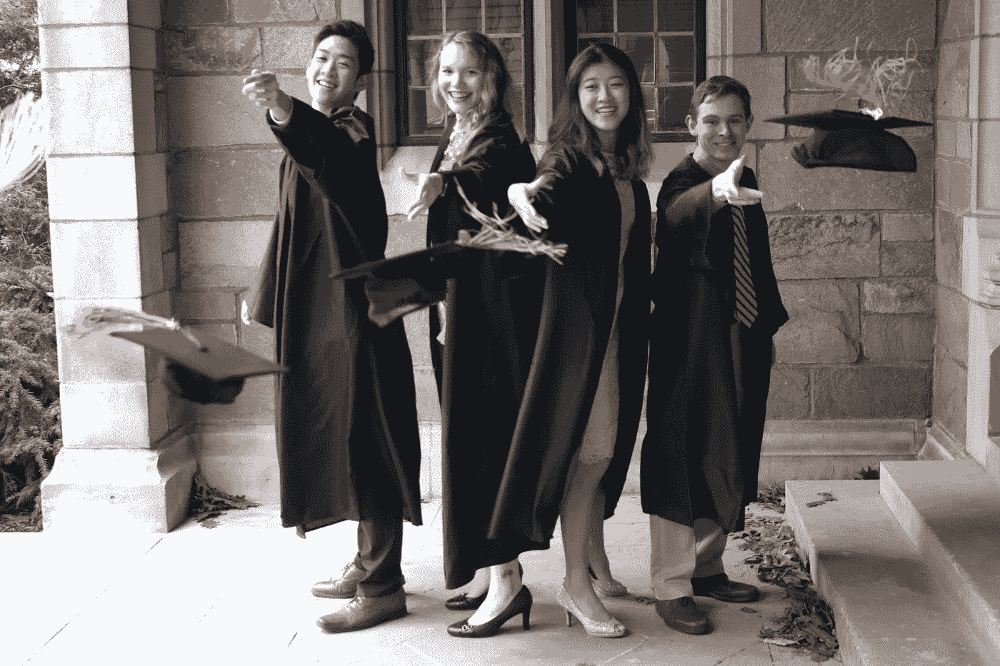

# 我是如何进入 12 个数据科学硕士项目的

> 原文：<https://towardsdatascience.com/how-i-got-into-12-data-science-masters-1eeddae21ba7?source=collection_archive---------4----------------------->

## 我自己的统计数据，目的声明与个人声明，所有的一切。

PC @我:)狼獾加油！

## ***您好，世界！*🌎**

我认为这是一个合适的开始，因为当我开始收集申请研究生院的材料时，这就是我所知道的一切。我当时是经济学专业的学生，只是在游戏的后期才意识到我想从经济学博士转向数据科学家——但我做到了，这意味着你也可以。

## **我的指标(申请本科大四):**

*   平均绩点: 3.4
*   GRE:Quant 162，Verbal 163，写作 4.5
*   **学校:**密歇根大学——安阿伯分校
*   **学过:**经济学(主修)数学(副修)，语文和法语
*   **缺点**:我第一次大学数学课(Calc 1)得了个 C-。我不知道如何编码。*喜欢，一点都不喜欢。什么是投资组合？*
*   优点:我学了 Calc 4 和线性代数(因为我很喜欢惩罚)。随着时间的推移，我的成绩越来越好。热情第一。

## **数据科学/分析项目硕士:**

*   **适用:** 12
*   接受:12
*   **学校:**杜克、塔夫茨(2 所)、南加州大学(2 所)、乔治敦、乌米奇(2 所)、弗吉尼亚大学、内奇加戈(2 所)、北卡州立
*   先是拒绝了我，后来又接受了我
*   提供奖学金的项目
*   **提供的奖学金:**UChicago 每年 25000 美元，弗吉尼亚大学每年 12000 美元，杜克大学学费减免 25%，乔治敦大学每年 14500 美元

哦，我有没有提到我的母校密歇根大学拒绝了我？是的，那一个击中了要害。

## **高三的秋天**🍁

正如你可能知道的那样，我在某种程度上患有编码缺陷(因为我*不知道如何编码，或者 Github 是什么，或者提到的 Python 不是有毒的生物)，所以我在这里做了两件事:我参加了我大学的 CS 入门班，我找到了一个人雇我为他们做数据可视化。我还参加了一个教授 R 的课程，这是我个人最喜欢的(出于某种原因，我无缘无故地强烈保护 R。跟我打，兄弟)。*

坦率地说，这份工作相当幸运；我表达了我对学习如何编码的热情，并表示我会尽可能地收拾残局。我还在面试后发了一封非常体贴的感谢信(就像一个小时的撕掉你的头发，不管是说“真诚的”还是“恭敬地”)，并在回复邮件后立即被录用了。谢谢你们已经走了很长的路了，伙计们。

在 CS 入门课程结束时，我已经学会了用 Python 创建基本的机器学习算法。我的最后一个项目是从老玛丽亚·凯莉、麦可·布雷和宾·克罗斯比创作新的圣诞音乐，我还成功地实现了一个 web scraper 程序来完成它。尽管我主要学的是 C++，但我很快发现这些技能是可以转移的，并且能够为最终项目学习很多 Python。

如果你现在是本科生，我强烈推荐你参加计算机科学课程。否则，有很多 MOOCs 会教授基本相同的东西。例如，麻省理工学院使用 Python 类免费在线提供其[计算机科学和编程入门(它看起来超级难和有用)。](https://www.edx.org/course/introduction-to-computer-science-and-programming-7)

## **Christmas_Break == "SOP 写作时间"**

我的祖父住在佛罗里达州一个僻静的公寓里，所以我和我的母亲去那里休息(哦，冠状病毒之前的日子！).一天中的大部分时间，我都蹲在这个地方的一个角落里，只是为了出去续杯咖啡或者让我妈妈看我最新的草稿。晚上，我和我的 S.O .面对面交流，让他对我粗暴一点——为了让我的 sop 可行，我流了不止一滴眼泪(还有与冒名顶替综合症相关的崩溃)。

尽管如此，我知道我在其他地方薄弱的地方，我可以通过一封写得很好的信脱颖而出。

在佛罗里达写作给了我一个阳光明媚的好地方，让我感觉超级有灵感和新鲜。如果可以的话，从一个让你开心的地方开始写作——无论是咖啡馆、有着高高的彩色玻璃窗的图书馆，还是散发着薄荷和蛾球味道的公寓(像我一样！).

## **研究、冲洗、重复**🚿

这也意味着我学习了所有的程序，通常大约一个小时。我记下了教员、他们的专业领域以及他们教的课。在我的标准作业程序中，我写了我的兴趣以及那些教员是如何结盟的。大学不会接受他们认为不会去的人(这会降低他们在《美国新闻与世界报道》上的排名)，所以尽可能具体是非常重要的。

我申请了 12 所学校，完成了一篇荣誉论文，修了两门高等数学课和一门经济学课，找到了一份工作，在最后一个学期每周教一次跆拳道。我时间紧迫，所以我会按照申请截止日期的顺序完成申请——我只是不能去想那一份申请之前或之后的申请，这确实帮助我专注于每一份申请本身。

要点:如果你时间紧迫，不要在每个申请上花费 10 个小时以上也是可以的。专注于确定 2-3 名你可以谈论的教员，一些让你兴奋的课程，以及你对这所大学的另一件事，这表明你做了功课。

## 研究生院的应用程序是…命运

首先，他们会问你还申请了哪些学校；这一部分要么是中性的，要么是消极的，取决于你如何管理它。我试图让每所学校看起来像我列出的那些学校中的“范围”,同时也只列出邻近和项目类型相近的学校(这是一种真正令人讨厌和不完美的艺术)。

通常，学校会要求一篇“大”的论文，然后可能会附带一些小论文。他们也可能会留下一些空间来解释你的赤字，如果你有赤字，你应该使用它(像我一样，在 Calc 1 中得了 C)。

最后，目标陈述和个人陈述**可以**相似。事实上，我*基本上*为我申请的每所学校交了同样的论文。

例如，这是我对塔夫茨工程学院的个人陈述:

 [## 1 PS.pdf 塔夫茨分析公司

### 测量系统分析(Measurement System Analysis)

drive.google.com](https://drive.google.com/file/d/1y3riMDRtaZDG52bj6qkoQefv6wZXZXgt/view?usp=sharing) 

这是我为密歇根大学写的*目标声明*:

 [## 2um SOP.pdf

### 报文交换数据服务

drive.google.com](https://drive.google.com/file/d/1vpx1x1hNmyw8f1-bVxpII9b3ObwSXwjG/view?usp=sharing) 

专注于一个好的，高质量的作品，然后重新加工，以适应每所大学。不要，我重复一遍，不要仅仅因为你认为你需要而写一百万篇不同的文章；首先，我没有。

“大”文章是最重要的，所以我总是确保我至少有一双(或三双)眼睛关注它。在你的时间表中，把大文章放在优先位置，把剩余的时间放在小文章上。

## 离别的思绪

希望这篇文章对担心申请研究生的人有所帮助。如果你对课程或者我如何帮助你进入硕士有任何问题，请在下面评论。您也可以通过[我的个人网站](http://amawest.github.io/#About)或 [Twitter 联系我。](https://twitter.com/amawest_)感谢阅读！

**附言**如果你想知道*，*我决定去 UVA。🧡💜

(再次 PC @我)

**附加作品:**

 [## 选择梦想数据科学项目的 10 个技巧

### 提示 3:关注中位数，而不是平均数

towardsdatascience.com](/read-this-before-going-to-grad-school-for-data-science-890fd05d4127)  [## 研究生论文的艺术

### 让我进入 12 个数据科学硕士项目的 5 个简单技巧

towardsdatascience.com](/art-of-the-graduate-school-essay-f59b14c79649)  [## 加入我的介绍链接媒体-阿曼达西

### 加入我的推荐链接，我将免费查看您自己的 DS SOP！

lramawest.medium.com](https://amawest.medium.com/membership)