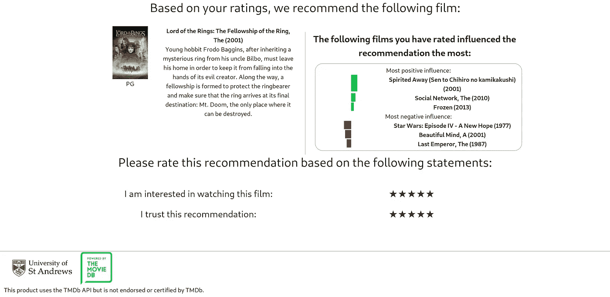
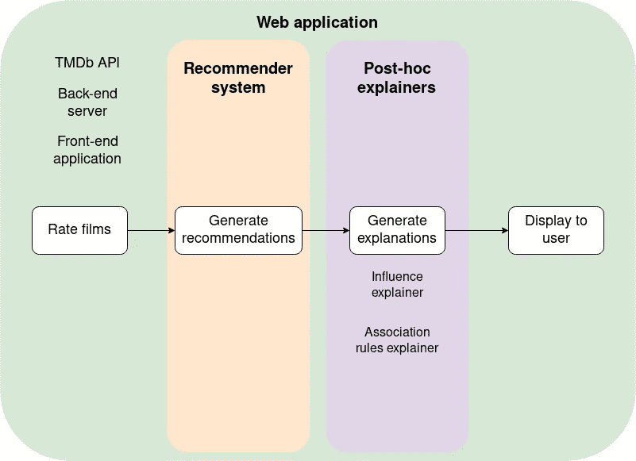
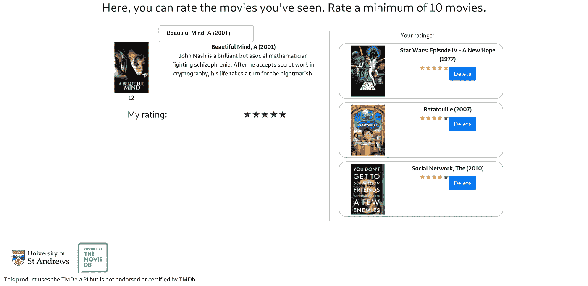
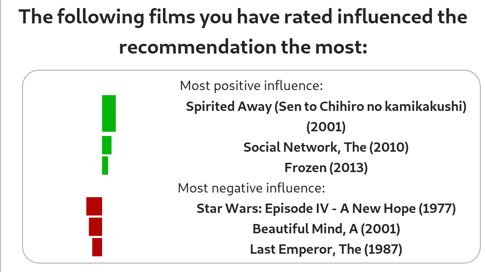
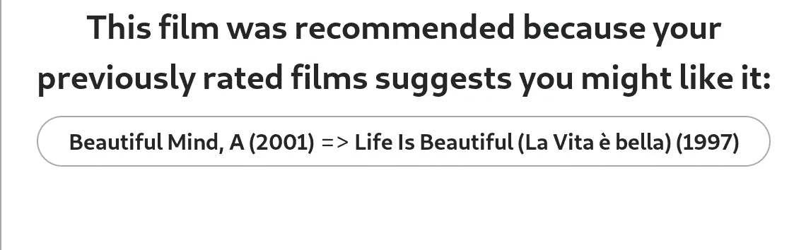
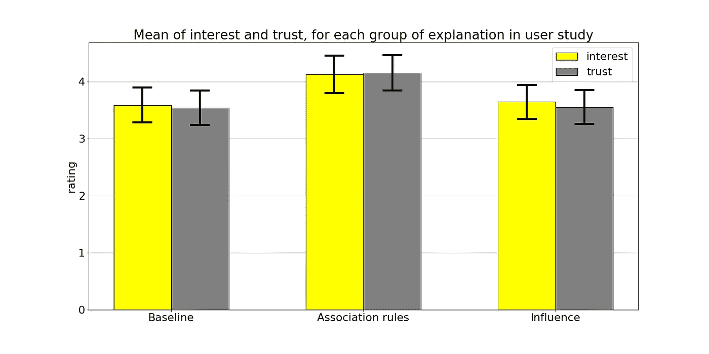

# 我如何使用 Python 实现可解释的电影推荐

> 原文：<https://towardsdatascience.com/how-i-implemented-explainable-movie-recommendations-using-python-7aa42a0af023?source=collection_archive---------46----------------------->

## 我还测试了用户是否真的喜欢它们。这是结果。

如何在应用程序中向用户显示建议及其解释。图片作者:Ville Kuosmanen

*这篇文章是我关于可解释建议系列文章的第二部分，基于我的* [*BSc 论文*](https://github.com/villekuosmanen/SHProject/raw/master/dissertation.pdf) *。* [*第一部分*](/explainable-recommendations-why-opening-black-boxes-matters-bd5754af63a2) *介绍了可解释建议的概念，而* [*第三部分*](/what-is-the-radical-content-problem-and-does-your-recommender-system-suffer-from-it-7fe017f9a8b1) *讨论了事后可解释性在数据科学中的应用。*

本系列的前一篇文章讨论了为什么提高推荐系统的可解释性很重要。这不是一个教程，而是我在实现一个带有可解释推荐的电影推荐服务时所采用的方法的概述。如果你想进一步探索，你可以阅读[全文](https://github.com/villekuosmanen/SHProject/raw/master/dissertation.pdf)或者深入[前端](https://github.com/villekuosmanen/WebAppSHProject)或者[后端](https://github.com/villekuosmanen/SHProject/raw/master/dissertation.pdf)代码库(它们是开源的！).我选择首先使用矩阵分解算法 SVD 实现一个黑盒推荐系统，然后实现两个事后解释器来生成对推荐的解释。然后通过一个模拟电影推荐服务的 web 应用程序来测试添加解释的效果。

描述用户研究中操作顺序的流程图。使用 web 应用程序，用户首先对电影进行评级。推荐系统然后为他们生成推荐，解释器为推荐生成解释，然后显示给用户。图片作者:Ville Kuosmanen

## 设计和实施

推荐系统是使用[惊喜库](http://surpriselib.com/)用 Python 实现的。用于该问题的数据集是公开可用的 MovieLens 数据集，由真实用户的电影评级组成[1]。该数据集广泛用于推荐系统研究，由于 CF 不是特定领域的，因此模型和算法通常会推广到电影评级之外的其他领域。当开发推荐系统时，使用包含 100，000 个评级的开发数据集来减少训练时间；2000 万评级基准集用于评估和使用研究。在训练潜在因素模型之前，使用随机的 75%-25%等级训练-测试分割，将数据分割成训练和测试数据。

在训练之后，推荐系统可以用于预测训练集中的项目和用户的评级。这对于静态评估来说已经足够了:然而，使用系统进行的用户研究需要动态的推荐。为只有几个评分的新用户生成个性化推荐是不可能的:模型首先需要学习用户的潜在因素。这可以通过完全重新训练模型来完成，但是，这种方法在实时系统中是不可行的，因为针对数百万个评级训练模型在计算上是昂贵的，并且需要在每个新的评级时进行。因为现有的模型“几乎是正确的”,并且可以作为添加用户的良好起点，所以可以根据 SVD 算法的底层实现以多种方式优化该方法。例如，一些基于梯度下降的系统可以用原始模型的权重(这里是潜在因子)进行初始化，这将允许算法更快地收敛。然而，Surprise 的 SVD 在运行其梯度下降时使用固定数量的历元，并且直到所有历元都完成时才停止。因此，为 SVD 模型设计了一个新的操作，它向模型添加了一个新用户。这个操作只训练新用户的潜在因子，对于物品和其他用户的因子不变。

我选择添加的解释是基于关联规则和影响，并用 Python 实现的。关联规则解释器的实现遵循了之前提出的方法[2]，旨在通过显示数据集中的规则来解释推荐，该规则描述了之前观看的电影是什么导致了它被推荐。影响解释旨在显示哪些先前观看的电影对推荐影响最大。使用的影响方法是新颖的，但它产生了与先前提出的快速影响分析相同的解释[3]。它通过比较在训练集中有和没有每个先前观看的电影的情况下推荐电影的预测评级来工作。这是通过在没有这些单独数据点的情况下反复重新训练模型来实现的。通常情况下，这将是不可能的昂贵，但由于为增加新用户而开发的优化方法，它可以有效地完成。

## 估价

进行了一项用户研究，以测试解释类型对推荐的测量可信度和说服力的影响，定义见[4]。为此，构建了一个模拟电影推荐服务的 web 应用程序。前端使用 [React](https://reactjs.org/) 构建，后端 REST API 使用 [Flask](https://palletsprojects.com/p/flask/) 构建。除了提供对推荐系统和解释器的访问，API 还通过[电影 DP API](https://www.themoviedb.org/documentation/api?language=en-US) 加载关于真实电影的数据(例如标题、海报和年龄分级)。然后，web 服务被部署到我的大学 web 服务器上。

web 应用程序的电影分级屏幕的屏幕截图，其中有几部电影已经分级(屏幕右侧)。图片作者:Ville Kuosmanen

影响解释如何在 web 界面中呈现给用户。条形的色调显示电影的影响是积极的还是消极的，其宽度显示效果的强度。图片作者:Ville Kuosmanen

关联规则解释如何在 web 界面中呈现给用户。先行项显示在规则的左侧，而结果项显示在右侧。图片作者:Ville Kuosmanen

除了这两个解释者，用户研究还包含了一个基线解释“推荐这部电影是因为你和喜欢它的用户相似”。这项研究首先要求用户对他们过去看过的十部电影进行评级，然后向他们展示每一类的推荐和解释。41 名用户参与了这项研究，在有利于关联规则解释者的解释类型之间，在说服力(p=0.008)和信任度(p=0.001)方面观察到了统计学上的显著差异。

针对每种类型的解释，在用户研究中测量的用户评价的兴趣(黄色)和信任(灰色)的均值条形图。还显示了误差条(即 95%置信区间)。图片作者:Ville Kuosmanen

解释生成器也在各种离线实验中进行了测试。最重要的是，关联规则解释器被发现受到低模型保真度的困扰，模型保真度是衡量可以被解释的建议的份额的指标[2]。低模型保真度导致用户研究中的解释有轻微的选择偏差:关联规则解释被添加到最受欢迎的电影的推荐中(因为它们在挖掘的关联规则中最常见)。令人惊讶的是，这将导致效果的增加——一般来说，用户应该更喜欢对他们更有针对性的推荐。研究平台的“虚假”性质可能会影响这一点——受欢迎但针对性不强的内容可能代表用户事先知道的电影，可以很容易地看出他们想看，但不会在真实系统中观看。在其他实验中，用于为单个用户重新训练推荐系统的算法被示出与完全重新训练一样准确，并且由于重新训练中的随机变化，影响计算被示出遭受适度高的方差(即，相同电影的影响的多次计算会产生非常不同的结果)。

用户喜欢关联规则解释，因此它是添加到实际系统中的一个很好的候选解释。我在生成解释时使用了全局关联规则:它们的优点是挖掘规则的过程只需进行一次。关联规则挖掘中使用的 apriori 算法[5]计算量很大，尤其是对于大型数据集，这可能会在扩大基于局部或聚类的方法[2]中造成重大问题。

为了将关联规则解释应用到实际系统中，需要提高其模型的保真度。如果解释器本身被视为机器学习模型，那么支持度和置信度的阈值(以及用于过滤关联规则集的其他参数)可以被视为其超参数。虽然阈值是根据研究人员的最佳猜测手工设置的，但也可以通过超参数优化来确定。这超出了本项目的范围，但可能是一种有趣的方式，使关联规则步骤更加科学，并允许该方法更容易地应用于更多样化的数据集。

虽然用户研究没有发现添加基于影响的解释对用户评价的信任和说服力有统计学上的显著影响，但它们仍然值得进一步研究。最重要的是，可以进一步优化向用户呈现解释的方法。即使影响解释没有提高模型的可信度和说服力，但它们确实提高了透明度。它们还可以用于实现特殊的用户界面组件:例如，UI 元素可以显示受特定项目影响最大的推荐。这对于实现经典的*“这个项目类似于下面的项目……”*推荐系统的更个性化版本可能是有用的，推荐系统通常是基于项目的邻居模型或基于内容的模型。

这篇文章展示了我用可解释的推荐来实现和评估电影推荐服务的方法。本系列的最后一部分将描述推荐系统中的激进内容问题，并建议如何使用关联规则解释来帮助数据科学家确定他们的推荐系统是否受到它的影响。

[1]:哈珀，F. M .，&康斯坦，J. A. (2015)。电影镜头数据集:历史和背景。*美国计算机学会交互式智能系统汇刊(tiis)* ， *5* (4)，1–19。

[2]:皮克，g .，&王，J. (2018 年 7 月)。推荐系统潜在因素模型的事后可解释性。《第 24 届 ACM SIGKDD 知识发现和数据挖掘国际会议论文集》(第 2060–2069 页)。ACM。

[3]:程，魏，沈，杨，黄，李，朱，(2019 年 7 月)。通过快速影响分析将可解释性纳入潜在因素模型。在*第 25 届 ACM SIGKDD 知识发现国际会议论文集&数据挖掘*(第 885–893 页)。ACM。

[4]:廷塔列夫，n .，&马斯托夫，J. (2011)。设计和评估推荐系统的解释。在*推荐系统手册*(第 479–510 页)中。马萨诸塞州波士顿斯普林格。

[5]阿格拉瓦尔和斯里坎特(1994 年 9 月)。挖掘关联规则的快速算法。在 *Proc 中。第 20 国际。糖膏剂超大型数据库，VLDB* (第 1215 卷，第 487–499 页)。