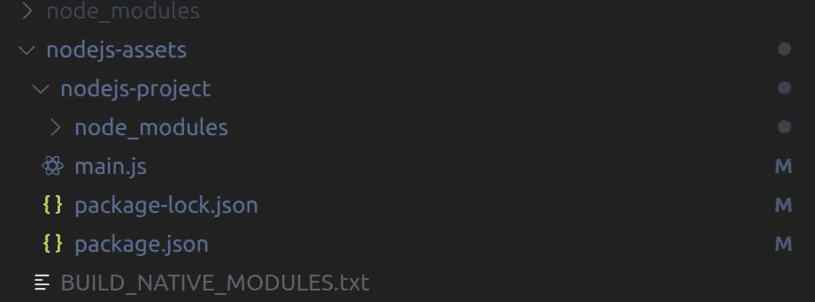

# 我如何在 React Native 中集成 Instagram 私有 API

> 原文：<https://towardsdatascience.com/how-i-integrated-the-instagram-api-in-react-native-e2bd04dd3119?source=collection_archive---------20----------------------->


在 [Unsplash](https://unsplash.com/s/photos/instagram?utm_source=unsplash&utm_medium=referral&utm_content=creditCopyText) 上 [NeONBRAND](https://unsplash.com/@neonbrand?utm_source=unsplash&utm_medium=referral&utm_content=creditCopyText) 拍摄的照片

作为一名开发人员，我总是尽可能地尝试自动化任务。Instagram 就是这样一个自动化似乎很有趣的地方。我在 Github 上偶然发现了这个回购:【https://github.com/dilame/instagram-private-api[。它提供了一个 NodeJS Instagram 私有 API 客户端。我用这个库在本地创建了一个新的 npm 项目，运行它，并在我的手机上打开应用程序，看看它是否会自动喜欢帖子。果然是这样！](https://github.com/dilame/instagram-private-api)

私有 API 客户端可以让你喜欢，关注，上传，基本上你可以在原生 Instagram 应用中做的一切。我在本地成功地使用了我的脚本，我想知道是否可以在 React Native 中使用客户端。

# 最初的挑战

我最初的想法是尝试在 React Native 中直接导入库。这并不成功，因为该库有一些依赖项需要使用本机模块，通常称为 C++插件。

然后，我开始研究如何在 React Native 中运行 Node.js。我看到了这篇[帖子](http://www.janeasystems.com/blog/support-native-modules-node-js-mobile-apps/)，它更详细地介绍了 Node.js 移动原生模块面临的挑战。那篇文章的作者致力于创建一个修改版的 [node-gyp](https://www.npmjs.com/package/nodejs-mobile-gyp) “它能够针对正确的操作系统和 CPU 架构，并包括来自 Node.js for Mobile Apps 版本的 Node.js 头。”

使用 [Node.js 库](https://code.janeasystems.com/nodejs-mobile/getting-started-react-native)和 React Native，我成功地构建了一个应用程序，允许用户自动完成通常必须手动完成的功能。

另一种选择是将它安装在服务器上，让用户从应用程序中拨打电话。这种方法的缺点是，所有对 Instagram 的 API 调用都来自与服务器相同的 IP，这将导致服务被阻止。让电话直接来自每个用户的设备，将导致 Instagram 看到这些请求来自用户的常用 IP 地址，该服务将可以安全使用。

# 积分时间

我首先使用命令创建了一个新的 react-native 项目:

```
npx react-native init reactNativeInsta
```

我选择使用 [React Native CLI](https://reactnative.dev/docs/environment-setup) 而不是 [Expo](https://expo.io/) ，因为正确运行客户端库需要本机代码。

在我的项目文件夹中，我为 React Native 安装了 [Node.js 库](https://code.janeasystems.com/nodejs-mobile/getting-started-react-native)。

```
npm install nodejs-mobile-react-native
```

你可能想看一下[入门指南](https://code.janeasystems.com/nodejs-mobile/getting-started-react-native)了解更多关于 Android & iOS 的细节。

Node.js 库包括一个 React 本机桥模块，它有助于 Node.js 代码和 React 本机代码之间的通信。该库将生成一个名为 nodejs-assets 的顶级文件夹。这个文件夹中有一个名为 nodejs-project 的子文件夹。这是安装任何节点库和编写节点代码的地方。下面是它在 [VSCode](https://code.visualstudio.com/) 中的样子。



BUILD_NATIVE_MODULES.txt 存在，所以我可以绕过对本机模块的自动检测。这完全是可选的。

在控制台中，您可能希望导航到 nodejs-project 文件夹并安装 [Instagram 私有 API](https://github.com/dilame/instagram-private-api) 库。

```
npm install instagram-private-api
```

我安装了另外两个库，[sleep-promise](https://www.npmjs.com/package/sleep-promise)&[blue bird](https://www.npmjs.com/package/bluebird)。sleep-promise 用于将脚本暂停一段时间；这很重要，这样你就不会一次发出多个请求，冒着被 Instagram 屏蔽的风险。使用蓝鸟是因为它改进了。catch()函数的工作方式更像 Java 或 C#中的 catch 子句。

# 节点代码

对于节点代码，我要求这些库在顶部。

```
const sleep = require("sleep-promise");
const { IgApiClient, IgCheckpointError } = require("instagram-private-api");
const Bluebird = require("bluebird");
const rn_bridge = require("rn-bridge");
const { promises: fs } = require("fs");
let ig = new IgApiClient();
```

*   IgApiClient —用于与 API 交互的类。
*   IgCheckpointError —检查点异常类(处理检查点流)。
*   rn_bridge —与 React Native 通信的桥。
*   fs —访问文件系统以保存用户的状态。

为了允许用户与客户端库(节点代码)交互，我们需要添加一个函数来处理这些消息。下面的代码流通过检查来查看用户是否通过了身份验证，数据对象包括他们通过身份验证流的凭证。通过桥发送的每条消息都被序列化为 JSON。我在函数调用时解析每条消息。

* insta gram creds 的快速说明。我选择将用户/密码存储在本地存储而不是后端服务器上，以保护用户的信息。每次调用节点代码时，我都会从 localStorage 中提取凭证，并与数据对象一起发送。

要执行任何操作，我们需要添加功能来允许用户通过 Instagram 进行身份验证。我创建了一个名为 loginFlow 的函数来检查会话是否存在。我将在下面介绍如何保存和加载这个会话。

如果会话存在，我调用 loadSession 函数。这个函数从手机的文件系统中检索会话 json 文件，并恢复用户的会话。我返回用户的 id，因为我调用的一些函数需要 id 和 API 调用一起发送。

如果会话不存在，我将调用 newLogin 函数，该函数使用用户的凭证处理用户登录，并将会话存储到手机的文件系统中。

这是一个 saveSession 函数，我用它来写文件系统。

```
const savePath = rn_bridge.app.datadir();const saveSession = async (data) => {
*await* fs.writeFile(savePath + "/igSessionStore.json", JSON.stringify(data), "utf-8");
};
```

我将 datadir()存储到一个常量变量中，因为这在 iOS 和 Android 之间可能有所不同。关于这一点的更多信息可以在 [Github repo](https://github.com/janeasystems/nodejs-mobile-react-native) 找到。

一旦用户登录，我就调用用户请求的函数。这是一个示例函数，允许用户通过标签喜欢帖子。

我保留了一个计数器来跟踪用户已经喜欢了多少帖子，并在应用内通知 toast 中将其发送给用户。mediaArray 变量调用 getMediaFromTags，它接受用户输入的要被喜欢的以逗号分隔的标签数组，并推送要被喜欢的帖子的主键。

因为数组有时由数组中的数组组成，所以我调用一个实用函数来展平数组。由于 javascript 版本会因平台而异，所以我没有使用 array.flat()。

```
const flatten = (arr) => {
*for* (let i = 0; i < arr.length; (Array.isArray(arr[i]) && arr.splice(i, 1, ...arr[i])) || i++) {}
*return* arr;
};
```

一旦我有了一个喜欢的帖子的数组，我就把这个数组发送给一个叫做 likeMedia 的函数，它为用户喜欢这个帖子。我在这里随机化了睡眠功能，以免被 Instagram 屏蔽。

在返回之前的调用是调用一个后端服务器函数，该函数跟踪用户的喜好。该应用程序保存了统计数据，并在登录后的第一个屏幕上显示出来。

# React 本机代码

在 React Native 的 index.js 文件中，我从“nodejs-mobile-react-native”导入 nodejs。这允许我使用 Node.js 启动 main.js 脚本。我还添加了一个事件侦听器，它将处理从 Node.js 发送的消息。

当消息返回时，该消息是通知或错误通知；我向用户显示消息。

下面的代码展示了一个允许用户基于标签来喜欢文章的功能。每次我想向节点端发送消息时，我都从“nodejs-mobile-react-native”导入 nodejs。

因为用户输入的是逗号分隔的列表或单个值，所以我选择在将空白列表发送到节点端之前，对其进行修整并删除任何重复的内容。如果 userHashTags 为空，我会提醒用户输入一个或多个 HashTags。当用户在这个特定的屏幕上点击 submit 时，这个函数被调用。当节点代码调用 Instagram 的 API 时，我将 setLoading 设置为 true，以向用户显示一个旋转的加载指示器，并防止用户在初始调用完成之前多次调用 API。一旦节点端的 like 函数完成，它就向 React 本机端发送一条消息，事件侦听器将 loading 设置为 false，并重置一些本地状态值。

```
DeviceEventEmitter.addListener("changeLoading", (event) => {
  setLoading(false);
  setUserHashTags();
  setUserLimitPost("0");
});
```

# 结论

几年前，我在谷歌的 Play Store 上推出了这款应用，并使用 [NW.js](https://nwjs.io/) 发布了桌面版。时间限制使我无法跟上与 Instagram 保持一致所需的更新，用户体验也受到了影响。希望这篇文章能帮助那些想做类似事情的人。

为了简洁起见，此处显示的一些代码示例已被修改，并且删除了一些功能，如对后端的调用。

如果你有任何问题或意见，请在下面留下！