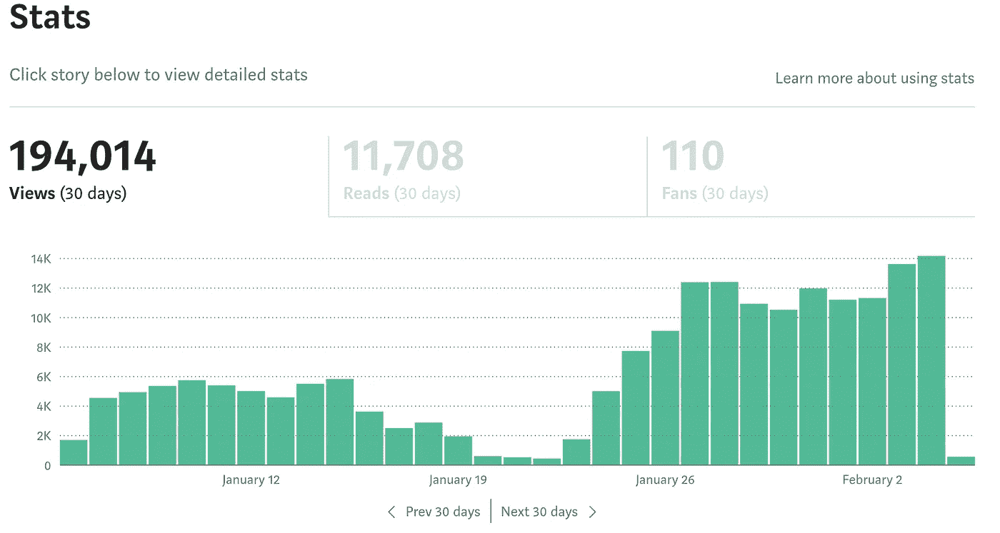
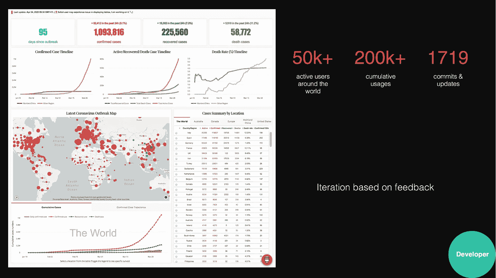

# 我如何在数据科学领域找到第一份工作

> 原文：<https://towardsdatascience.com/how-i-land-my-first-job-in-data-science-e3c2d3fd3fd2?source=collection_archive---------5----------------------->

乌鲁鲁的登山者| Jun 拍摄

## 从微生物学博士后到数据分析师的转变

不尝试，永远不知道。

经过近 6 个月的准备和努力，它最终获得了两个数据科学领域的工作机会。回顾过去的半年(2019 年 11 月-2020 年 5 月)，这是我一生中最不确定的时期之一，为了一份 3 年的博士后合同，从布里斯班搬到悉尼，决定改变职业生涯，并被 COVID 停工期所困扰。

我总共申请了 41 份工作，要么是数据分析师，要么是初级数据科学家，每个人都有一份量身定制的简历/求职信。在这些申请中，有 21 份没有回应，18 份被拒绝，2 份面试邀请最终在 4 月下旬发出。如你所见，这不是一次令人鼓舞的旅程。但是，我从黑暗隧道的另一边出来了。

在这篇文章中，我想和你分享我是如何完成从博士后研究员到数据分析师的转变的，以及我在这一路上学到的经验教训。虽然过程可能因个人情况而异，但我希望我的经历为那些早期职业研究人员(ECR)提供了一条可能的途径，尤其是那些科学领域的研究人员，他们正在寻求转变，但仍不确定如何开始。

## 我为什么离开学术界

不要误解我。我喜欢做研究，或者我应该说是“解决问题”。在整个研究训练中，我系统地学会了如何阅读文献、剖析问题、设计实验、检验假设、分析数据和写文章。然而，经过 3 年的博士后研究和 4 年的博士学位，我发现自己逐渐进入了一个非常特定的研究领域，这不是我所期望的。相反，我渴望为我的未来探索更多的可能性，我想利用在学术界获得的所有这些技能来解决更多的实际问题。这是驱使我离开学术界的第一个原因。

此外，学术界已经有不少关于 ECR 的讨论。在所有这些不利因素中(例如，工作不稳定、不正常的工作时间(特别是对生命科学领域的湿实验室研究人员来说)、职位空缺、[发表或灭亡的困境](https://www.nature.com/collections/ijfdfjhjef))，定期合同是一直让我紧张的一个因素。

我确实理解学术聘用制度的重要性。它旨在通过不同实验室的多轮博士后奖学金培养下一代研究人员，直到他们能够独立负责一个研究主题/领域。换句话说，ECR 不太可能在她/他的整个学术生涯中都呆在一个实验室里。然而，从现实的角度来看，在短期研究合同的情况下，包括我在内的大多数博士后甚至无法承诺抵押贷款，因为我们不知道在一份合同之后我们是否会有工作，也不知道下一份工作在哪里。当涉及到我们的伴侣或家庭时，这个问题会变得更加复杂。例如，我们可能需要与他们分开，因为他们待在位于另一个城市或国家的“著名实验室”。

这里我的目的绝不是要抹黑学术界。我想表达的观点是保持选择的开放性。在我职业生涯的这个阶段，我需要一份与我的目标最匹配的工作，并且值得放弃我在学术界多年建立的东西。

## 为什么选择数据科学

进入数据科学是基于两个方面的慎重考虑，技能和热情。

作为一名生物科学博士后，我一直在使用多元分析、回归、网络分析和显著性检验来分析数据。所有这些知识都可以很容易地转移到数据科学。此外，由于我通常处理的数据量很大([高通量 DNA 测序](https://www.ebi.ac.uk/training/online/course/ebi-next-generation-sequencing-practical-course/what-you-will-learn/what-next-generation-dna-))，我熟悉了 Python、R、bash 脚本和 SQL，它们也非常符合数据科学所需的工具。

除了必要的技能和科学的心态，我认为在设定职业目标时，激情是不可或缺的一部分。我们不想走出死胡同，进入另一个死胡同。因此，确定我们的激情是很重要的，这并不难。我的建议是，当我们仅仅被好奇心和做某事的兴奋感所驱使时，那就是我们的激情所在。

对我来说，我的激情是应用数据洞察来讲述故事和解决问题。我热衷于利用现代统计学和数据可视化的方法从错综复杂的数据集中提取模式。

有了上述基础，我清楚地知道数据科学将是我下一个职业目标的最佳选择。话虽如此，当时我对就业市场还没有完全准备好。我需要将我所知道的转化为更有市场价值的技能，这就导致了下面的部分。

## 在线学习

虽然我非常熟悉数据科学中需要的一些技能，但他们并没有连贯地学习。在分析数据时，我仍然需要谷歌搜索的帮助。这对于日常工作来说完全没问题，然而，我不想在面试时被简单的问题(例如贝叶斯定理、中心极限定理、t-test、pandas 中的`groupby`、SQL 中的`JOIN`等等)卡住。因此，有必要系统地复习这些知识。

在这里，我列出了我用于统计学、python 和 SQL 的在线课程和材料:

*   [**《统计与概率》(可汗学院，免费)**](https://www.khanacademy.org/math/statistics-probability) :本课程对所有的基础统计提供了极其详细(有意重复)的讲解和练习。
*   [**用 Python 和 R**](https://escholarship.org/uc/item/03w0n5g3) 进行基本统计:本书以直接简洁的方式涵盖了统计学的基本思想。更重要的是，它们为统计分析提供了 Python 和 R 语言的代码。
*   [**【IBM 数据科学专业证书**](https://www.coursera.org/professional-certificates/ibm-data-science) :该项目由 9 门课程组成，为您提供就业准备技能和技术，涵盖广泛的数据科学主题，包括 Jupyter notebook、Github、Python、SQL、数据可视化和机器学习。在最后一门课程中，你将被要求完成一个数据分析项目，形成你自己的报告并在某个地方发表(*这里是我的:* [*探索悉尼郊区开一家新餐馆*](/exploring-sydney-suburbs-for-opening-a-new-restaurant-e1e43a6c32c7?source=your_stories_page---------------------------) )。所有这些完成后，您将获得一份证书，可以添加到您的 Linkedin 个人资料和简历中。
*   [**完整的 SQL Bootcamp 2020:从零到英雄**](https://www.udemy.com/course/the-complete-sql-bootcamp/) :有很多免费的详细的 SQL 教程。我买这个课程主要是因为 1)它提供了许多数据库，我可以用它来练习 pgAdmin。2) Udemy 提供超低折扣价(~ 20 澳元)。结果证明它完全值这个价。

## 建筑组合

如今，简历不应该是我们展示技能和经验的唯一方式。很有可能招聘人员或将要面试我们的人想要仔细阅读我们的 Linkedin、Github、个人博客和项目网站。我认为，由于数据科学的性质，这一点对于数据科学角色来说尤其如此。我们网站上展示的所有内容都可以作为我们简历中“漂亮数字”的证据。

此外，作为一名没有任何行业/商业经验的学术界候选人，通过在线学习经历、个人项目和博客来丰富我们的投资组合是最具成本效益的方式，因此可以帮助我们在其他申请人中脱颖而出。我们的投资组合应该传递至少两个信息:1)我们对数据科学充满热情，2)我们在数据科学领域所做的事情是积极的、持久的和专业的。

以下是我丰富投资组合的步骤:

*   [**建立自己的博客**](/get-your-own-website-online-in-four-steps-adef65abe8bd) :这是人们了解我、我的文章和项目的主要途径。在建立和维护自己博客的过程中，我也学到了基本的网站知识，比如 HTML，CSS 和 DNS。有了个人博客，我的个人资料就可以主动提供给每一个潜在的雇主或客户，而不是被动地将简历提交给工作岗位。例如，在推出我的博客并发表了几篇技术博客后，一位来自美国的数字制作人联系我进行一个数据可视化项目(*真诚感谢他的信任*)。
*   **撰写技术文章**:作为一名潜在的数据分析师/数据科学家，清晰有效的数据沟通技巧是必须的。写技术文章是我练习这种技能的最好方法。除此之外，我写作还有另外三个原因。1)写作帮助我以清晰和有条理的方式学习。2)写作使我能够贡献我在该领域的经验、技能和知识，并获得反馈。3)写作建立自己的受众群，拓展自己的职业人脉。

一月我的媒介故事统计

*   **:为了让我的博客有更多的读者，我选择在媒体上发表文章，因为它有巨大的用户群。此外，Medium 为我提供了关于我的文章的详细统计数据，这些数据可以包含在我的简历中。作为一个附带的好处，加入媒体合作伙伴计划，我可以从我的每篇媒体文章中获得收入，这可以支持我在线学习的成本。**

****

**新冠肺炎全球病例监测统计**

*   **[**开发自己的项目**](/build-a-dashboard-to-track-the-spread-of-coronavirus-using-dash-90364f016764) :作为来自学术界的考生，我们可能缺乏真实数据科学项目的实践经验，这些项目往往比我们所学的课程更重要。所以，还是从零开始开发自己的项目比较好。这样，我们将面临一系列的技术挑战，迫使我们出于需要而不仅仅是好奇心去阅读和学习更多的东西。这就是为什么我开始开发自己的项目，并在 2020 年 2 月启动了[新冠肺炎全球病例监测](https://dash-coronavirus-2020.herokuapp.com/)。通过这个项目，我的数据科学技能显著提高，我比以前更有信心(*这对面试真的很重要*)。例如，我学会了如何从动态加载的网站上抓取网页。我使用`NumPy`和`Pandas`的数据辩论技能显著提高。我现在很擅长在 Python 中使用[破折号](https://plotly.com/dash/)构建仪表板。**
*   **[**整理 Linkedin 简介**](https://www.linkedin.com/in/jun-ye-0798/) : Linkedin 是一个专业的社交网络平台，我们在寻找新工作和维护个人品牌时必须使用。这是除了个人博客之外的第二个展示门户。我用来组织 Linkedin 个人资料的一个原则是保持 Linkedin 个人资料和简历的一致性。具体来说，个人资料摘要部分是精心设计的，以反映我的激情、个性和技能。个人项目和博客已被放在主页上。在线学习证书在许可证&认证部分进行了更新。**

## **建立工作关系网**

**毫无疑问，人际关系网在寻找新工作中非常重要。有意识的人际交往可以产生信息、建议和机会。作为博士后，我们可能一直呆在实验室里，只有有限的时间与研究课题之外的人交往。然而，如果我们真的想要改变，我们需要走出我们的舒适区，接触新的联系。但我们应该记住，建立关系网是一项互惠的长期投资。**

**以下是我的一些建议:**

*   ****参加合适的活动**:在由[数据科学悉尼](https://www.meetup.com/en-AU/Data-Science-Sydney/)主办的活动上，我遇到了 [Hieu Tran](https://www.linkedin.com/in/hieumtran/) ，他是一名数据分析师。我们聊得很愉快。在我们第二次叙旧时，他为我修改简历提供了很好的建议。我后来也帮他做过 Python 题。**
*   **向在你目标公司工作的人伸出援手:只要你把你的目的说得简明扼要，大多数人都愿意提供帮助。这就是我如何在 Linkedin 上与人联系，并认识了黄楚欣，他为我提供了关于面试的宝贵建议。**
*   ****联系来找我**:在启动[新冠肺炎全球病例监测](https://dash-coronavirus-2020.herokuapp.com/)后，我在 Linkedin 上收到了许多联系请求和电子邮件。他们要么想为开发提供帮助(非常感谢 [Johannes Pistorius](https://medium.com/u/daf2812f7a2c?source=post_page-----e3c2d3fd3fd2--------------------------------) 在设计仪表板方面的贡献)，要么只是想表达他们对这个仪表板的喜欢。我还收到了尼克·伯恩发来的信息，他友好地在仪表板上覆盖了赫罗库的费用。在知道我在找工作后，尼克·伯恩甚至把我介绍给了他网络中的人。非常感谢他为帮助我所做的努力。**
*   ****朋友推荐**:如果你有在目标领域工作的朋友，他们应该是给你推荐的最佳人选。他们不仅比任何新关系更了解你的个性，还了解你的技能。也可以向他们寻求专业建议，没有任何社会压力。**

## **结束语**

**正如你所看到的，以上所有的组成部分都是相互依赖的，这需要我们有一个全面的计划并坚持下去(*就像在实验室里实施一个实验*)。会有艰难和沮丧。但我们只需要不断尝试，接受失败，并做出改进，转折点终将到来。**

**这是所有的乡亲。和往常一样，我欢迎反馈、建设性的批评以及倾听您的数据科学项目/故事。可以通过 [Linkedin](https://www.linkedin.com/in/jun-ye-29aaa769/) 和[我的网站](https://junye0798.com/)找到我。**