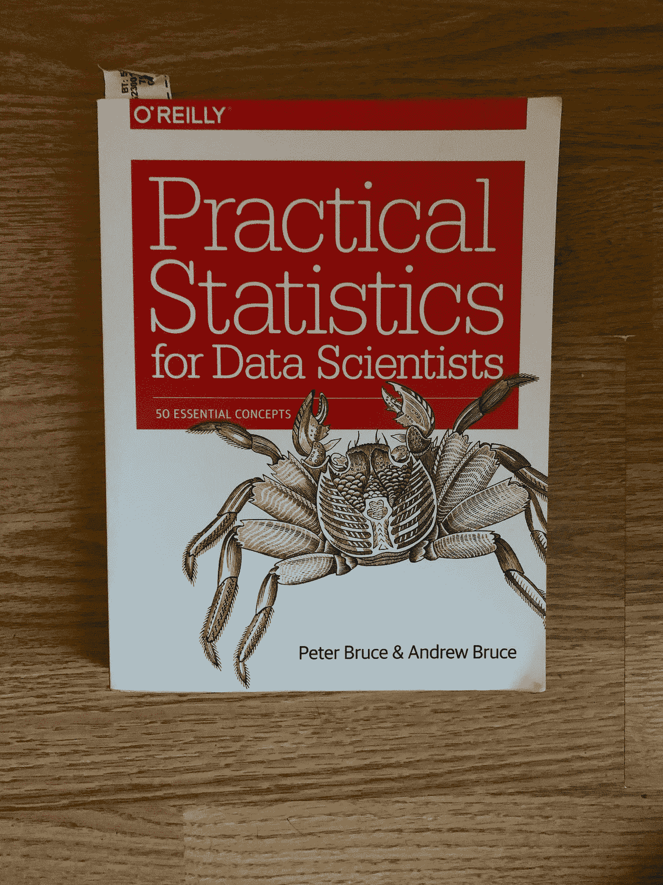
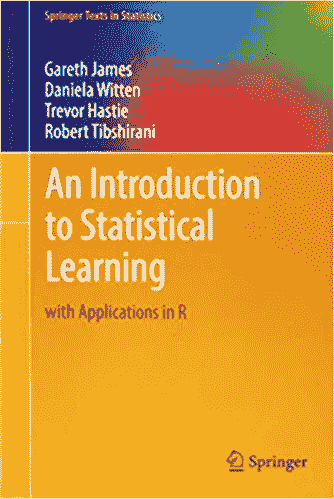
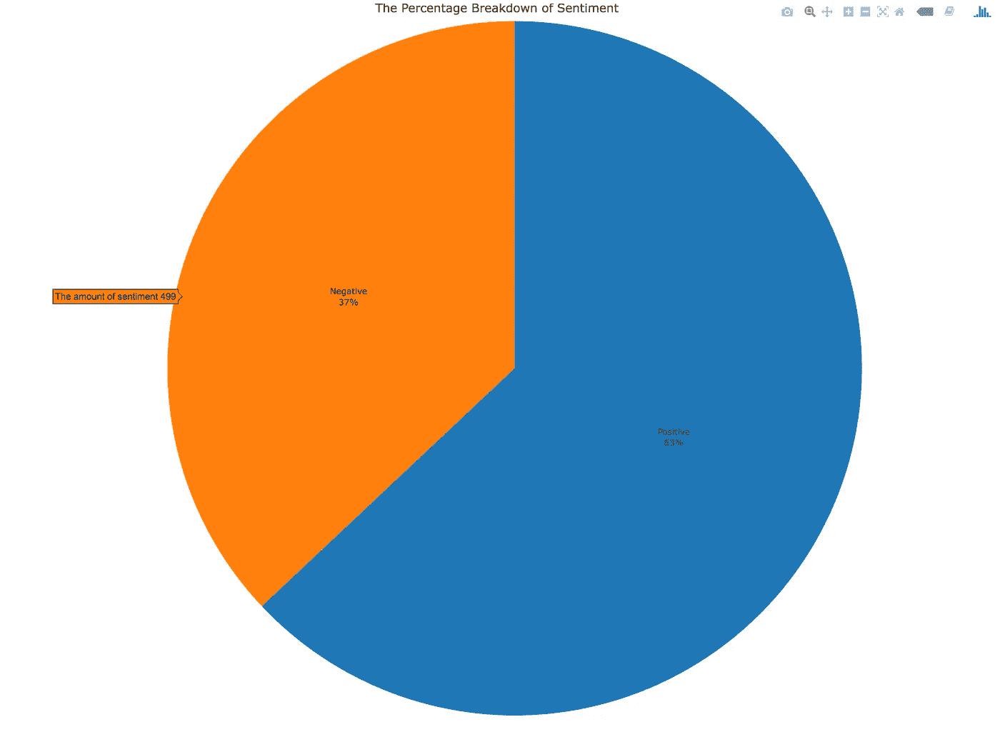

# 我是如何得到一份 6 位数的数据科学家工作的

> 原文：<https://towardsdatascience.com/how-i-landed-a-high-6-figure-data-scientist-job-57486a9ca504?source=collection_archive---------42----------------------->

## 数据科学职业指南

## 学习这些步骤，这样你也可以！

来源:[Unsplash.com](https://unsplash.com/)(由[卢克·切瑟](https://unsplash.com/@lukechesser)拍摄)

# **你为什么要读这篇文章？**

如果您对从事数据科学职业感兴趣，并且想知道如何才能找到工作。

如果你想知道一个人如何在没有太多经验的情况下获得数据科学的工作。

如果你想知道一个人如何得到一份 6 位数的数据科学工作。

这些只是你会对这篇文章感兴趣的几个原因，但不管出于什么原因，下面的内容会让你对如何获得一份 6 位数的数据科学工作有一个很好的了解。

# **我的背景**

我目前是一名营销数据科学家。我的数据科学之旅并不典型，因为我直到大学毕业才了解这个领域。我主修数学和数量经济学，渴望以分析师的身份加入金融界，并有可能在人生的某个时刻成为一名定量分析师。我一点也不知道华尔街定量分析师的竞争有多激烈。在对股票市场进行一些预测分析研究时，我偶然发现了数据科学的想法。我在大学时学过一些统计分析课程(侧重于计量经济学/统计学)，所以我一直对预测未来的能力很感兴趣。实际上，我曾经问过我的数学教授，是否有一种方法可以 100%预测一只股票的未来回报，我得到了一个有趣的回答:“那将是圣杯方程式。就像抛硬币，知道它会落在哪边一样。”我有点希望能够尽可能地预测硬币会落在哪一边，所以我继续把预测作为我的小爱好。这最终让我发现了数据科学和机器学习的世界。我花了无数个小时自学编码，做 Kaggle/DS 相关的项目(偶尔还有 NBA 黑客马拉松比赛)。几份工作之后，我得到了梦寐以求的数据科学职位，从此一往无前。

# **如何找到数据科学工作？**

现在你对我有了一点了解，我想告诉你我是如何适应脚本/编码、统计、机器学习等的。我不会说我是该领域的完全专家，但我确实认识到，我已经实现了许多人想要复制的目标。因此，让我们深入了解帮助我进入数据科学的步骤。

## **1。挑选你的爱语(Python vs R)**

在我们开始之前，第一步是决定你想学习哪种编程语言。在数据科学社区中，关于哪种语言更优越存在着巨大的争论，但是答案是它们都是用于特定任务的优秀语言。

## 稀有

如果你来自任何与社会科学相关的背景，那么在某个时候你会利用 R 进行一些分析，R 是统计学家的常用语言，因为有许多统计软件包(CRAN 软件包)。我要说的语法是为我们这些以前从未用编程语言编码的人设计的，然而，对于有其他语言经验的人来说，R 语法可能需要一点时间来适应。我从 R 开始，并且能够让自己以面向编程的思维方式思考，如果你可以称之为面向编程的思维方式的话。R 的优势在于它的灵活性和快速运行分析的能力，而不需要导入太多的包。当你进入 for 循环的时候，这种语言确实变得有点笨拙，但是对于一个初学者来说，这是很棒的！r 还有一个很棒的应用程序 RShiny，它允许部署你的代码，对于一个数据科学家来说，这是一个很好的知识。我用了下面这本数据科学的书[R](https://www.amazon.com/gp/product/1491910399/ref=as_li_tl?ie=UTF8&tag=lolitsjicja04-20&camp=1789&creative=9325&linkCode=as2&creativeASIN=1491910399&linkId=6deeca9a24327dd113bf14fd26f9f4c2)来学习。

[R for Data Science](https://amzn.to/2ZkabWH) 是一本学习如何拿起 R 并开始运行的好书

## **巨蟒**

Python 已经成为机器学习和数据科学非常青睐的语言。它有很多机器学习包(scikit-learn ),已经变得非常流行，并且易于使用。Python 是一种多用途语言，其中 R 用于分析，Python 可用于创建 API、Web 应用程序、数据科学模型等。如果发现整个后端数据存储都是用 Python 创建的，然后再用 Python 部署，这并不疯狂。很多人发现学习 Python 要容易得多。我知道一旦我从 R 过渡到 Python，我就能相当容易地学会这门语言。如果您已经有了使用 Python 的经验，那么学习用于分析的包将会相当容易。一本让你入门的好书是 [Python for Data Analysis](https://amzn.to/2y5fz4y) 。

[Python for Data Analysis](https://amzn.to/2AoQWR5) 是一本学习 Python 中用于数据的包的好书。(来源:谷歌图片/亚马逊网站)

决定先学哪种语言，归根结底是你觉得学哪种语言最舒服。真的没有错答案。然而，你应该在职业生涯的某个时候努力成为双语者。

## 2.研究数据科学/机器学习算法

一旦你对编程语言感到满意，你就可以投入时间学习数据科学了。这个领域一直在变化，实时有新的发现发生，所以成为专家需要你做大量的独立研究。你不需要完全了解深度学习算法的整个后端，但你应该能够回答一些关于最流行的数据科学算法的顶级问题。一些真正帮助我学习这些概念的书籍:[用 Scikit 动手机器学习——学习& TensorFlow](https://amzn.to/2WzmAE1) 、[数据科学家实用统计学](https://amzn.to/2LwZQOS)、[统计学习入门](https://amzn.to/2X2p7FM)、[统计学习的要素](https://amzn.to/2Z3Rsyp)。

[动手机器学习](https://amzn.to/2WzmAE1)是一本开始学习机器学习模型的好书。给出了模型的详细信息以及帮助您练习的示例。(来源:我的书)

[实用统计学](https://amzn.to/2LwZQOS)是一本学习任何数据科学家都应该知道的所有重要统计概念的好书。用 R & Python 提供了详细的解释和示例代码。(来源:我的书)

[统计学习简介](https://amzn.to/2Z9Mgc3)是一本深入研究 r 中统计概念应用的好书。这是一本更注重教科书的书，用于研究生课程，因此将更侧重于理论和应用(来源:Google Images/Amazon.com)

[统计学习的要素](https://amzn.to/2Z3Rsyp)是一本概念/理论厚重的书，深入到数据科学中使用的许多统计/机器学习算法背后的实际数学。如果你真的想学习数学，这是一本很棒的书。请注意，这是非常沉重的概念，将需要一些阅读。(来源:我的书)

## 3.工程，工程，工程！

类似于软件工程，你应该建立一个项目组合，真正让你在求职中脱颖而出。一旦你完成了编码和建模，你就应该开始将你所学到的应用到数据中。找出你可能感兴趣的东西，思考你能解决的问题。在给定一组属性的情况下，您可能想要预测房子的价格，或者您可能想要根据人口统计和城市大小来预测节目的收视率。可能性是无限的！如果你想不出一个项目，你总是可以通过访问[kaggle.com](https://www.kaggle.com/competitions)找到难以置信的数据集和问题来解决。这是一个学习和应用数据科学和其他统计模型的好网站。如果你足够优秀，你甚至可以因为帮助公司而获得奖金。

我做的第一个项目是利用 Twitter 的 API 创建一个情感模型。利用词袋法，我能够根据 Twitter 帖子对我感兴趣的任何关键词进行分类。这不是一个完美的项目，还有更复杂的方法可以应用，但这是我的第一个数据科学项目，它真正让我保持了动力。

这是推特情感项目的一个成果。使用 Plotly 创建的图形，我相信这里被分类的是“德雷克”。(来源:我的图)

## 4.迈出你的第一步

一旦以上所有的都感觉舒适，下一步，我觉得是最艰难的，是得到你的第一份数据科学工作。我可以承认，在一年的时间里，我发出了 500 多份求职申请。然而，现场面试的次数我可以用两只手来数。确保你在简历中突出了你所有的项目成就。如果你缺乏数据科学方面的经验，就把它们作为简历的重点。如果你能表现出对解决项目问题的兴趣和奉献精神，招聘经理有时会忽略你的经历。一旦你进行面试，这些也是很好的话题。这个领域竞争非常激烈，似乎每个人都想从事数据科学方面的职业。不要让那些暂时的失败阻碍你实现目标。我发现，真正让自己进入大公司的最佳方式是接受一个小公司的数据科学职位。这可能不那么有魅力，薪水也不那么有竞争力，但是一旦你迈出了第一步，你真的可以利用自己获得一个极具竞争力的职位，以及随之而来的所有福利。这是我采取的方法。我从一家小媒体代理处开始，靠杠杆作用成为一个 6 位数的角色。但是，如果你有机会直接进入大公司，权力会更大。如果有兴趣的话，我会努力整理一份数据科学的面试指南。

# 专攻您的数据科学

一旦你进入了这个行业，你应该开始考虑你想把数据科学工作的重点放在哪里。数据科学有许多不同的领域，有时将你的工作专门化可以在未来产生巨大的杠杆作用。不同类型划分的一些示例如下:

**数据科学、产品分析** —专注于解决与产品约定和性能相关的问题。(例如脸书新闻源、Facebook Messenger 等)

**营销数据科学(Marketing Science)** —我目前在做什么！专注于解决营销方面的问题。生命时间价值、客户生命价值、营销组合建模和多点接触归因。

**数据科学，分析**——更关注事物的分析方面。度量测量。

**机器学习工程师**——专注于应用深度机器学习实践解决问题。

数据科学有很多不同的领域，所以开始缩小你的兴趣范围会非常有益。将在另一篇文章中解释数据科学的不同应用。

# 最后的话

我希望本指南能够帮助您了解如何在数据科学领域找到一份有竞争力的工作。有很多方法可以采用，但这就是我所做的，而且很成功。有时也有运气因素，在正确的时间出现在正确的地方，但这不是我们能真正量化的。如果您想了解更多，甚至想进行一对一的咨询，您可以拨打**联系我。**

**感谢阅读:)**

*   **此帖子包含亚马逊的附属链接。**
*   **不是赞助内容。**