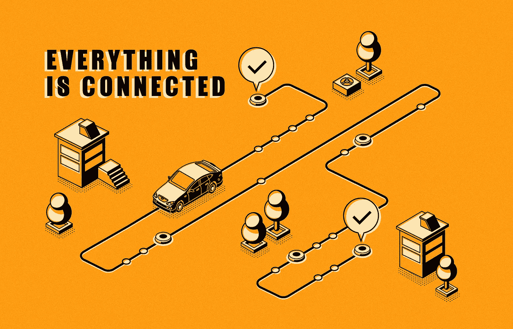
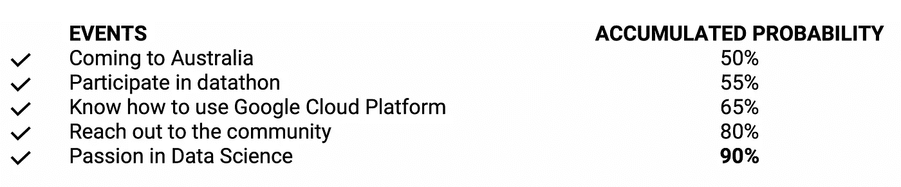
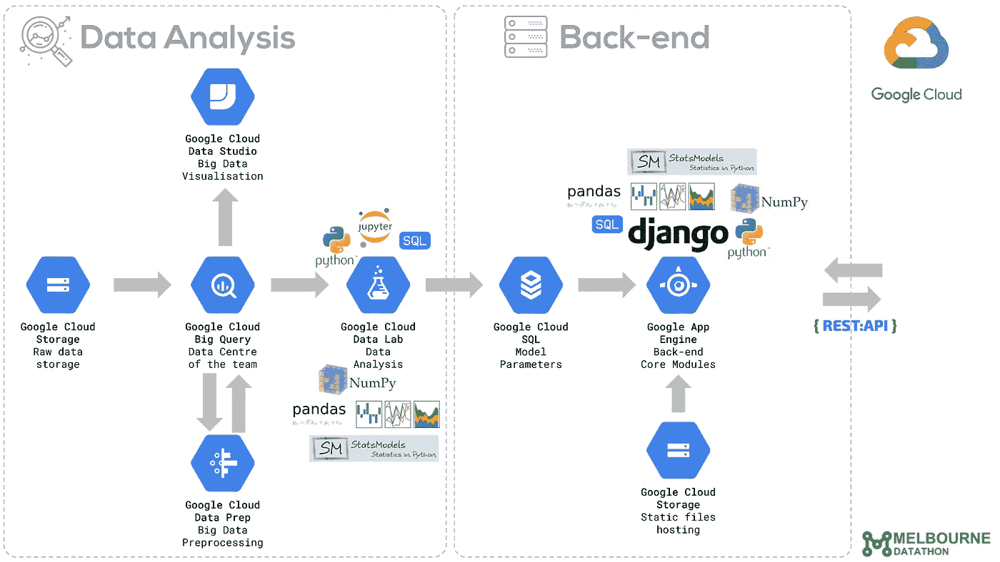

# 我如何在澳大利亚四大银行之一找到我的第一份数据科学工作

> 原文：<https://towardsdatascience.com/how-i-landed-my-first-data-science-job-in-one-of-australias-big-four-banks-ede61e602c2a?source=collection_archive---------13----------------------->

## 我在澳大利亚刚下飞机后的旅程

[vector pouch/free pik 原创作品](https://www.freepik.com/vectorpouch)

你也可以在这里听故事

> 澳大利亚的第一天

在我祖国的国际机场含泪告别后，飞往墨尔本的飞机起飞了，不久之后，透过飞机的窗户，一切看起来都变小了。最后一次俯视我的城市，我知道我即将在另一个国家开始一段新的旅程，对未来和归期都没有把握。我告诉自己，至少，我知道目的地，那时我最珍贵的财产是希望和梦想。

第二天到达墨尔本，我不得不离开过去，朋友和家人，像许多其他来澳大利亚参加 2018 年 2 月入学的学生一样开始新的生活。华丽、宁静、阳光是我第一天对墨尔本的感受。被瘦骨嶙峋的摩天大楼包围的古老建筑，反射着夕阳的上坡道路，电车的锣声和人行横道按钮的声音让我从想家的情绪中分心，让我对探索这座历史名城和它在中央商业区的秘密小巷感到兴奋。

> 努力找工作

在探索墨尔本的第一个星期后，我在城里我的大学旁边的一个学生宿舍安顿下来，并开始跟踪我银行账户中的数字，以计划未来几个月的租金支付。即使我有足够的钱在接下来的 12 个月里不用工作也能在墨尔本生存，看着余额每天下降也是一种真正的压力，就像倒计时直到我破产的时刻…是的，我必须找份工作。

我是一名经验丰富的自动化工程师，有 7 年多的工作经验，曾经在我的祖国为一家德国科技巨头工作。因此，我很有信心，以我的背景，我会很容易找到一份类似的工作，所以我在某些澳大利亚求职网站上创建了我的个人资料，并申请了一些相关的职位。令我震惊的是，在发出的 10 份申请中，只有 3 份得到了回复，尽管他们对我的简介印象深刻，但我对这 3 份申请的面试问题都是一样的。

> 问题是:“你的居留身份是什么？”
> 
> “我目前持有学生签证”，我说。

我就是这样被拒绝的。在澳大利亚，学生每周只能工作 20 个小时，这也是许多公司不愿意雇佣国际学生的原因之一。从我的角度来看，工作时间的限制并不是一件坏事，因为学生应该专注于他们的学习，从项目中受益。我几乎没见过哪个学生边工作边全职学习，还能听懂所有的课。毕竟我们来澳洲都是为了学习，提升自己，追逐梦想。如果你成功地把自己提升到了一个新的高度，金钱肯定会随之而来。

> 对咖啡因上瘾

然而，这一政策的不利之处在于，由于财政压力仍然存在，学生需要赚取收入来维持生活，因此他们往往会转向有现金在手的工作，这些工作有帐外工资支付和被剥削的高风险。我在大学时曾做过兼职，我想这是全世界典型的学生生活。

几周后，我在一个热门的澳大利亚兼职网站上跳转，开始搜索咖啡师的职位。在来澳大利亚之前，我完成了一个制作澳大利亚咖啡的短期课程，因为我认为万一我找不到工程方面的工作，这可能是有用的，事实也的确如此！

澳大利亚咖啡非常独特，深受澳大利亚历史和文化的影响。如果你有机会去澳大利亚旅行，当一位女士走进咖啡店说她想要一杯黑色的长咖啡时，你应该不会感到惊讶。这个“长黑”的东西绝对不是你现在所想的，相反，它是美式咖啡的澳大利亚版本(如果我这样解释，我的澳大利亚朋友会非常失望)。唯一不同的是倒咖啡和水的顺序。

回到这个故事，我很快在墨尔本西北部的郊区找到了一份咖啡师的工作，这是我在澳大利亚的第一份“工作”。这是一家繁忙的餐厅，供应披萨、咖啡和羊角面包，这是当地人的家常便饭。冲咖啡对我来说不是问题，但在一分钟内完成订单是一个真正的挑战，尤其是从上午 11 点到下午 1 点，有很多顾客走进来。与我还是大学生时相比，在办公室坐几年确实让我慢了下来。我承认我不擅长客户服务，我知道我表现不好。我每天下班后都感到压力很大，筋疲力尽，更不用说由于餐馆离市区很远，我还得长途通勤。此外，我没有时间独立学习或课前预习，这开始拉低我的分数。

我曾考虑辞职，但想到我银行账户上不断下降的数字和所有即将到来的账单，我没有足够的勇气这么做。然而，没过多久，我就收到了经理发来的消息，说“你下周不用来了”……我丢掉了第一份工作。

结束最后一天的工作回家后，我把自己锁在一个小房间里，停用所有社交媒体账户，停止与人交谈，并开始喝大量咖啡来为大学讲座补充能量。如果当时有人给我药，我早就吃了。总之，我对咖啡因上瘾了。咖啡师沉迷于咖啡并不是一件坏事，不是吗？

> 学期休息活动

我想，如果我这么没用，而且唯一没有人能阻止我做或者没有工作时间限制的事情是"**学习"**"，那么我就会专注于学习、研究并把它做得非常好。否则，我还能做什么，对吗？我对技术和数据科学的热情让我忙碌了一段时间，忘记了“失业”状态以及账户余额。终于在硕士第一学期 GPA 考了个 4.0 满分的 4.0。

时光飞逝，第一学期已经过去，我已经在澳大利亚呆了几个月了。在过去的一段时间里发生了太多的事情，唯一让我振奋的是老师的鼓励，妻子的支持和学校的一封表扬信。坐在经过市中心的火车上，我希望有一天我能在这些摩天大楼之一工作。

然后学期结束了，在下学期开学前我有三周的空闲时间。我试图利用这个空档时间开始一个兼职项目，否则，我会感到无聊并面对失业的现实。我开始研究谷歌云平台，并阅读了我的第一本关于云技术的书:[用 Python 编写谷歌应用引擎，作者是丹·桑德森](https://www.amazon.com/Programming-Google-Engine-Python-Infrastructure-ebook/dp/B010GNIV88)。书中的知识使我能够建立一个自动报纸，能够从我最喜欢的页面抓取新闻，并显示在应用程序的单个首页上。这样我就可以阅读所有我喜欢的新闻，而不用浏览不同的网站。

该应用程序托管在谷歌云平台上，由包括谷歌云数据存储、谷歌云 SQL、谷歌云存储和谷歌应用引擎在内的几个云服务提供支持。当时，人们在多个媒体渠道谈论数字云，认为它是最先进的颠覆性技术，因此我非常兴奋地看到我的第一个应用在研发的三周内就运行在云上。我第一学期的假期就是这样度过的。

> 寻找联系

一个月后，在我的第二学期开始后，我继续发送我的简历，并收到许多来自人力资源部门的拒绝邮件。直到现在，我都不记得我当时申请了多少份工作。

然后我开始以不同的方式思考，也许我应该停止担心工作，看看硬币的另一面。我有机会学习我热爱和热爱的东西。当我一天天地学习新的东西和探索知识海洋时，我感到兴奋。这就像玩电子游戏时打开地图的隐藏区域一样。最坏的情况当游戏结束时，我仍然可以回到我的祖国，带回留学的无价之宝“知识”。至少，我有一个家可以回去。

虽然这种积极的想法并没有改变我没有工作的事实，反而让我更加开放。然后，我试着去接触新的人，不羞于谈论我的失业状态，并且接受我是一个初学者并且还在学习的事实。从那以后，我扩大了与积极思考者的关系网，他们能够用自己的积极能量激励社区。

> 这项任务

在第二学期，其中一门课程要求我们建立一个团队，并参加墨尔本的数据科学竞赛，作为评估的一部分。我很快与一位才华横溢的软件工程师合作，他是我几个月前认识的。他是一个经验丰富的前端开发人员，而我在云平台和机器学习作为后端服务方面有一些知识。后来又有三名学生加入，我们和其他 200 支注册队伍一起参加了墨尔本数据马拉松比赛。

所有团队都收到了超过 25 GBs 的公共交通数据，其中包含有关墨尔本乘客的车票触摸和触摸信息。我们需要从这些数据中构建一个应用程序(web 应用程序或移动应用程序),这个想法没有任何限制。这就是他们所说的端到端数据科学。我们的目标是开发一个 web 应用程序，告诉乘客他们是否应该在工作日的特定时间从目的地到目的地乘坐公共交通工具或汽车。该应用程序的后端采用了多个时间序列模型来预测未来给定时间的公共交通等待时间、出行时间和道路交通。

团队结构看起来很完美，成员拥有不同的技能:前端、后端、云基础设施、模型构建、数据处理和数据分析。然而，有一个问题:我们都是一年级学生，我们知道的唯一模型是 K-neighbors、K-Means、DBSCAN 和决策树。深度学习甚至 XGBoost 肯定不在名单上。

> 让我们玩大的！

成功的机会不是很高，我们都参加了比赛，只是因为这是课程要求的一部分。因此，我们很快就失去了动力，想要放弃，因为这极具挑战性，而且我们中没有人有处理如此大量数据的经验。当时我甚至不知道如何使用 Hadoop 和 Spark(一个流行的大数据平台)。我们的目标是提交项目，完成作业并通过课程。

经过一个月在数据中徘徊，什么也没做，然后我说服团队尝试一些新的东西。我决定使用谷歌云平台(GCP)来存储、处理和分析数据，然后建立模型并将其作为一种服务。云平台让我们能够轻松协作，在同一个 GCP 项目上一起工作，而不用担心计算资源或跨团队共享数据(我在下面为感兴趣的人提供了应用程序架构)。由于工作流程已经改进，我们尽了最大努力，在两个月内完成了申请，并最终提交了申请。我感到非常高兴，因为我完成了一个端到端的数据科学项目，它结合了我在过去几个月中学到的所有知识和技术。

> 意想不到的结果

第二学期也在我学完课程的时候过去了。我仍然没有工作，但保持积极的态度，不断结识新朋友。我的激情又一次让我忙碌起来。在等待 datathon 的结果时，我学习了 Docker 的容器化机器学习模型，Kubernetes 的容器编排。在所有的事情发生后，我开始相信生活是一面镜子，我对它的看法会反射回来。夏天开始后的几个星期，我得到了最终的结果…我们获得了二等奖。

与此同时，赞助竞赛的银行正在启动一个名为数据科学 Gig 孵化器的特殊实习生项目。他们通过比赛寻找候选人，并选择前两个团队的成员加入该计划。当第三学期开始时，我成为了 Gig 孵化器，并开始在他们位于中央商业区的一栋高楼里的办公室里工作。

一年后，我完成了硕士学位，然后被提升为银行的数据科学家。

> 一切都是相连的

你可能认为我很幸运，事实上，我对此毫不怀疑。然而，从一个数据科学家的角度来看，我会用“概率”这个词，而不是“幸运”。

在某个时刻，我得到数据科学的工作似乎是一个随机事件，就像中了彩票一样。然而，如果你看看所有发生事件的整个时间表，有一些因素有助于增加获得工作的概率或机会。鉴于最后一个里程碑是成为澳大利亚的数据科学家，可以看出:

*   如果 **I** 没来澳洲，概率是 0%
*   如果**我**来澳洲后没有参加比赛，概率只有 50%
*   如果**我**在第一学期没有学习如何使用谷歌云平台，我赢得比赛的机会将会减少。
*   如果**我**没有积极思考并接触社区，我就不会认识我伟大的队友，我们赢得比赛的机会也会因此而减少。
*   如果**我**没有探索技术并将其应用到项目中的热情，面对阻碍时更加努力，我们就不会成为赢家。

或者以复选框的形式(这很像[奇异博士](https://www.marvel.com/characters/doctor-strange-stephen-strange/on-screen)对某些事件发生几率的计算):

这些数字不是量化的，它们是用来帮助你理解的

我使用第一人称主语“ **I** ”来表达这一想法，因为这些是我们可以主动采取的行动，增加了我们想要的结果的可能性，即使总会有一些我们无法控制的外部因素，如银行的赞助或我的签证申请失败。

这里的想法是，它采取了一个旅程，导致今天的结果。换句话说，你现在做的每件事都会把你带到未来的某个地方，当你回头看的时候，你会发现这一切都是因为某些原因而发生的。如果你在漫长的旅途中感到疲惫或失去动力，试着想象你将来想成为什么样的人，就像我希望我能在城市的摩天大楼里有一份工作一样。如果你在旅途中迷失了方向，请永远记住，你的激情将是一个准确的指南针。

# 附录

我在 2018 年墨尔本数据大会上搭建的平台架构