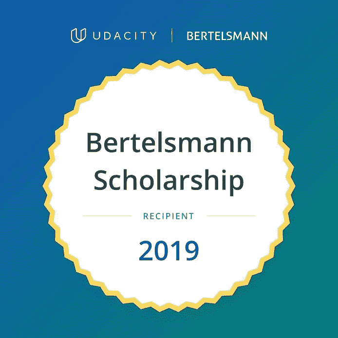
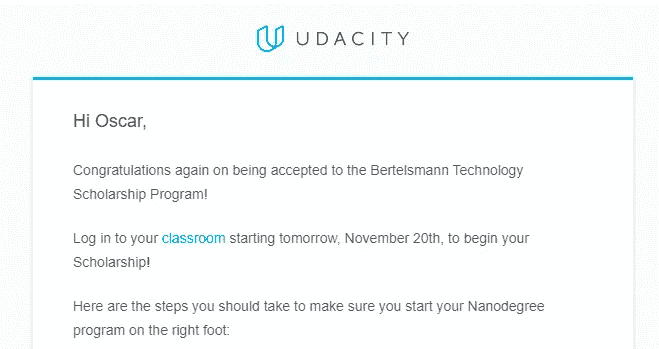
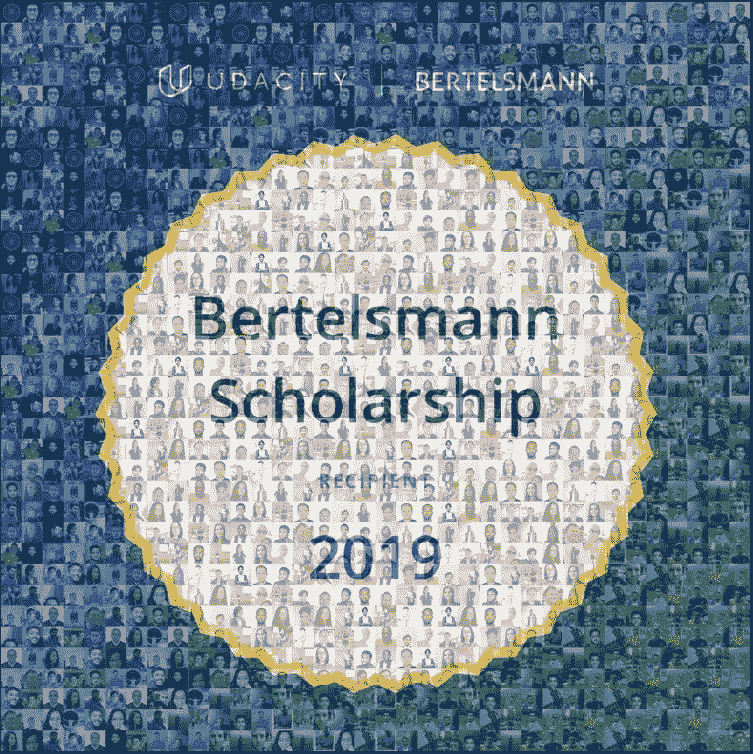
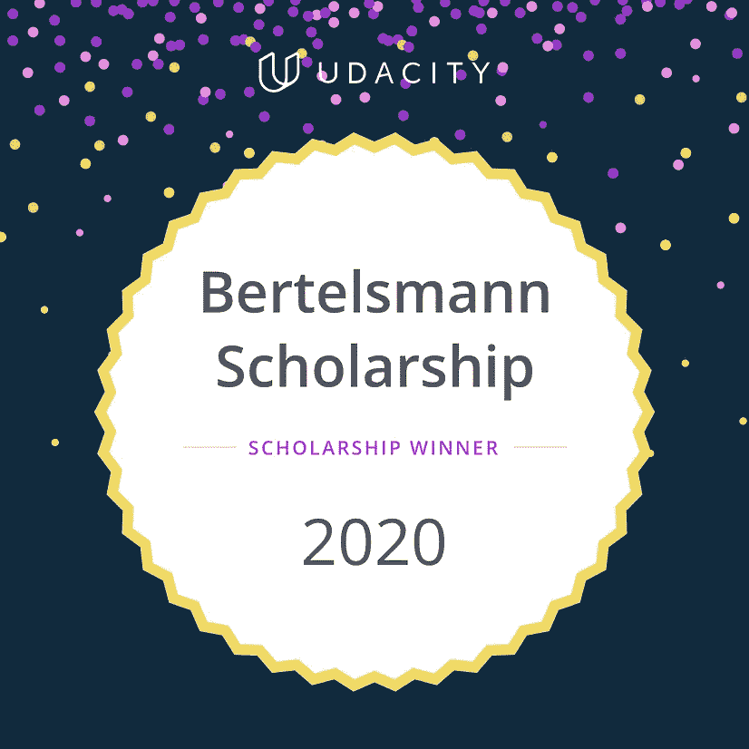
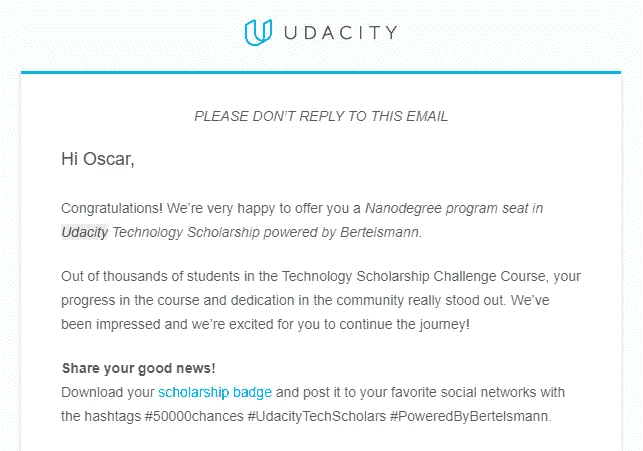
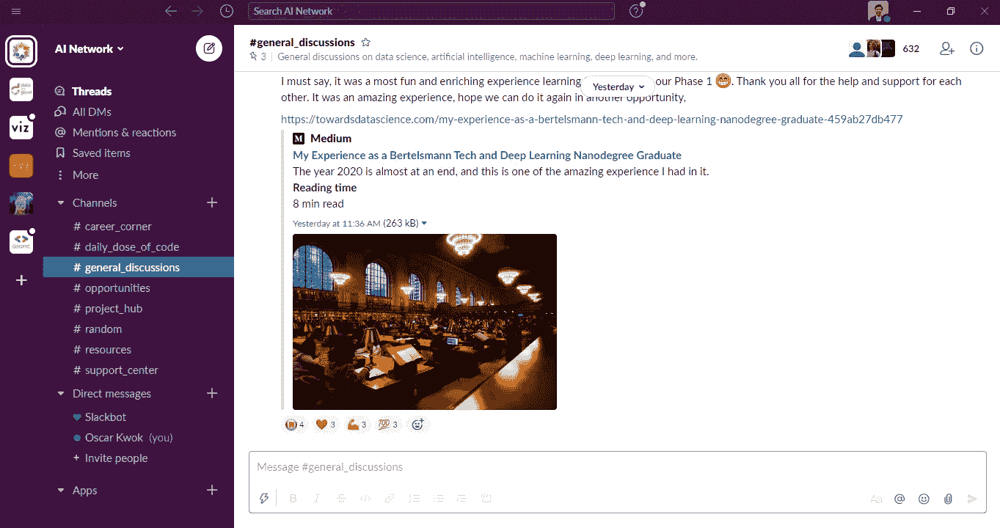

# 9 个月我是如何学会深度学习的

> 原文：<https://towardsdatascience.com/how-i-learned-deep-learning-in-9-months-f5ddaefd3e3b?source=collection_archive---------59----------------------->

## 我的人工智能之旅与免费的 Udacity 纳米学位

在 [Unsplash](https://unsplash.com/@hiteshchoudhary?utm_source=unsplash&utm_medium=referral&utm_content=creditCopyText) 上由 [Hitesh Choudhary](https://unsplash.com/@hiteshchoudhary?utm_source=unsplash&utm_medium=referral&utm_content=creditCopyText) 拍摄的照片

有这么多的资源可以教你深度学习，如果你正在阅读这篇文章，你可能会想知道你应该追求哪一个。

我写这篇文章是为了分享我参加的课程，它不仅帮助我在大约 9 个月的时间里很好地掌握了深度学习，还让我成为了一个相互帮助成长的支持社区的一部分。

我来分享一下我的故事。

# 学习之旅

我之前记录了我在*向数据科学*学习数据科学的旅程，我惊讶于它与他人的共鸣程度。很多人告诉我，他们发现我的文章很有帮助，很有启发，所以接下来，我想分享一下我在深度学习方面的旅程。有兴趣的可以看下面我之前的文章。

 [## 我如何学习数据科学以及改变一切的 1 门课程

### 如果你不知道从哪里开始

towardsdatascience.com](/how-i-learned-data-science-and-the-1-course-that-changed-everything-16912ccbab2b) 

通过学习数据科学，我接触到了机器学习，这使我对深度学习和人工智能感兴趣。然而，我不知道如何才能学会它，因为它看起来太复杂了。

大约是在去年的这个时候，我发现了 Udacity 与贝塔斯曼一起创建的奖学金，接受者可以获得免费完成深度学习、数据分析或云计算纳米学位的机会。

> *边注:今年的奖学金刚刚开放，可以在这里* *申请* [*。也可以在*](https://www.udacity.com/bertelsmann-tech-scholarships) [*Udacity 的奖学金页面*](https://www.udacity.com/scholarships) *查看其他可用的。*

我最终申请了奖学金，被录取了，并被授予深度学习纳米学位！

我来告诉你我是怎么做到的，它是如何帮助我学习深度学习的。

# 奖学金申请流程

第一步是申请奖学金。你要选择你想追求的赛道(AI，数据，还是云)，所以我选择了 AI 赛道。作为申请流程的一部分，您必须回答一些问题，例如:

*   背景信息(您的个人信息和期望的课程)。
*   必备知识(您的编码经验水平)。
*   你的目标(参加奖学金项目的目的以及你将如何利用新获得的技能)。
*   技术问题(取决于您选择的曲目)。

不同的奖学金申请过程可能会有所不同，但这些是我必须回答的问题。

然后 Udacity 挑选了 15000 人参加挑战课程，我是其中之一！

# 挑战课程

既然选择了 AI 赛道，我做的挑战课程就是 PyTorch 课程 [*深度学习入门*](https://www.udacity.com/course/deep-learning-pytorch--ud188) *。*本课程教你深度学习的基础知识，以及如何使用 PyTorch 构建自己的深度神经网络。教学大纲包括:

1.  深度学习简介
2.  PyTorch 简介
3.  使用 PyTorch 进行深度学习
4.  卷积神经网络
5.  风格转移
6.  递归神经网络
7.  自然语言分类
8.  使用 PyTorch 部署

我喜欢这门课程，因为它让我从基本的 Python/数据科学技能发展到能够实现自己的人工智能代码，可以对照片进行分类，生成文本和其他很酷的东西。他们还提供了训练/运行神经网络所需的所有笔记本，这使学习变得更容易。

# 萧条社区

获得纳米学位需要满足两个要求。

1.  完成挑战课程。
2.  松散的社区参与。

## **完成挑战课程**

第一个要求很简单。

如果你每周花几个小时学习挑战课程，你应该能够在 3.5 个月的时间内完成。更不用说什么都不评分，所以确保你已经完成课程真的是你自己的事。从技术上来说，你可以点击浏览所有的课程，而不用完成它，但是这将我们引向第二个要求。

## **松散社区参与**

Udacity 为奖学金计划的每个项目创建了一个宽松的工作空间，并希望学生参与其中。这一要求可能是为了确保人们不只是为了完成课程而点击课程，而是真正浏览材料。

那么参与是什么意思呢？

这意味着你必须帮助其他学生，无论是在技术上还是参与社区活动。

有许多方法可以做到这一点，包括:

*   回答学生关于课程的技术问题(例如，在空闲频道回答，撰写/分享媒体文章等)。
*   创建一个网上研讨会/演示，介绍你将如何解决课程问题。
*   启动资源回答常见问题。
*   为学生设计相互了解的计划(例如，开始一个问题线索并标记他人，分享故事并鼓励他人也这样做)。
*   制定计划来帮助学生理解课程材料(例如技术挑战、学习障碍和游戏)。
*   通过在渠道中发布激励信息来鼓励他人完成课程，并庆祝他人的成功。
*   发起一个关于你感兴趣的主题的学习小组(例如，基于位置的、医学的等等)，并鼓励人们开始他们的项目。
*   分享你在课程中做的笔记。
*   在 Airtable、Github 或 Google Docs 上建立一个有用资源的数据库。
*   只要能帮助别人就行！

参与并不意味着:

*   只是喜欢别人的帖子。
*   评论低质量的回答，如:“感谢分享”，或“伟大的照片”。
*   重复别人已经分享过的答案。
*   为贡献而贡献，却没有真正帮助他人。

Udacity 定期澄清该计划的参与方面，并表示如果你每天花大约 15 分钟浏览 Slack 并回答人们的问题，或发布高质量的内容，那么你应该有很好的机会获得 nanodegree。

# Udacity 如何衡量您的参与度？

Udacity 不共享这些信息。

许多人假设他们有一个 Slack 扩展，可以帮助他们可视化的尖子生，但这并没有得到证实，因为这些信息并没有提供给我们。他们衡量参与程度最可能的方式是通过他们的社区经理(CM ),他们也在 Slack 工作区。这些 CM 监控着频道的日常活动，并对那些不断为社区贡献高质量内容的学生有了很好的了解。

# 计划创新

你可以利用一些 Udacity 创建的计划来增加你的社区参与。

## **学生领袖**

在挑战课程开始后不久，你的 CM 将发出一个学生领袖(SL)的号召。由于 Slack 社区如此之大，CM 很难跟踪所有的事情，这就是 SL 的用武之地。每个松弛渠道将有几个 SL，他们将致力于确保渠道的意图得以实现。SL 也被期望为他们被分配到的渠道创建计划。

例如，如果你是一个技术渠道的领导者，你将帮助回答技术问题，并提出倡议来帮助学生更好地理解/学习概念。

对我来说，我被选为#Introductions 频道的 SL，所以我的团队创建了一个挑战，让学生们分享自己的个人信息，以帮助更好地了解彼此。我们还组织了一个表格来收集每个人的社交媒体页面，以便进一步联系。

你创造的计划很大程度上取决于你自己，所以要有创造性！例如，我们创建了一个所有学生的图片拼贴，这有助于灌输一种社区意识。

mosaically.com

要成为学生领袖，你必须申请并被选中。申请过程的一部分将是分享你有什么领导经验，为什么你会是一个好的领导者，并选择你的渠道偏好。

## **学习堵塞**

学习堵塞是一个一到两天的活动，SL 和其他学生志愿者花费大量时间帮助其他人完成课程材料。实际上，有一个 SL 专门负责组织学习聚会，他们的工作是计划活动，包括招募其他人来领导/组织网络研讨会、向我提问会议(ama)以及在当天的演示。活动前也需要做大量的工作来管理物流和营销，所以有很多方法可以参与进来。

这是一个非常好的获得一些参与积分的机会！

## **AMA 刘宇**

每周都会有一个 AMA 会议，CM 会分配一个小时的时间来回答学生的任何非技术性问题。通常这些都是在 CM 工作的营业时间内，所以可能会根据他们的时区限制谁可以参加。然而，这是一个非常简单的方法来提高你的参与度，因为通常问题都很容易回答。许多问题也是重复的，因此你可以通过创建漂亮的帖子/指南来回答这些常见问题，从而进一步提高你的社区参与度。

一些学生甚至创造了一个机器人，可以自动转录所有的问题和答案，这样错过会议的人就可以参考它。

## **uda city 的 60 天**

Udacity 鼓励学生每天学习，并在一个特殊的#60DaysOfUdacity 频道上记录他们的工作。

您可以记录您完成了课程的哪一部分或其他编码工作，甚至添加到您日常生活的各个方面。我看到许多学生分享激励性的故事/图片，这无疑增加了他们的参与，因为它激发了更多的对话。

## 关于社区参与乏力的思考

尽管不得不总是在空闲时间做贡献会变得乏味(我想我在空闲时间花的时间比挑战课程还多！)，它仍然是一次无价的经历。我不仅交到了现在仍保持联系的朋友，而且每个人都愿意互相帮助学习和成长，这才是真正让这段经历难忘的原因。

由于参与的要求，每个人可能都开始互相帮助，但最终，他们继续下去，因为他们真的希望看到彼此成功，达到新的高度。我认为这个社区灌输给我一种帮助他人的奉献精神。

# 摘要

总而言之，获得纳米学位的关键在于:

*   保持一致。
*   总是帮助别人。

就是这样！

# 深度学习纳米学位

在我获得[深度学习纳米学位](https://www.udacity.com/course/deep-learning-nanodegree--nd101)后，我有大约 6 个月的时间来完成它。

教学大纲包括:

1.  神经网络
2.  卷积神经网络
3.  递归神经网络
4.  生成对抗网络
5.  部署

你会注意到，nanodegree 有许多主题与【PyTorch 深度学习入门课程相同，所以当我登录时，许多课程实际上已经完成了。

## 挑战课程和纳米学位的区别

**项目**

除了纳米学位有新的课程，主要的不同是项目和 Udacity 评论者的评价。一旦你完成了一个项目，它会得到审查，你会得到反馈，以帮助你改善它。

项目包括:

1.  预测自行车共享模式
2.  犬种分类器
3.  生成电视脚本
4.  生成面
5.  部署情感分析模型

如果你从 [Udacity 的 Github 页面](https://github.com/udacity/deep-learning-v2-pytorch)下载了挑战课程的所有内容，你实际上就可以访问上述项目的材料。因此，即使你没有获得纳米学位，你仍然可以自己从事这个项目。

**学生社区**

你还可以访问 Udacity 平台上的学生社区，在那里你可以与其他攻读纳米学位的人交流并提出问题。它类似于 Slack 社区，但在我看来更缺乏组织性，所以我没有使用它。

**问题论坛**

最后，有一个论坛，在那里你可以发布问题，并让 Udacity 的导师回答这些问题，这非常有帮助。

# 走向

Slack 社区在挑战课程结束几周后关闭，每个人都对此感到沮丧，但其中一名学生创建了一个新的工作空间，以便我们可以在之后继续社区并保持联系。这个新的 Slack 社区直到今天仍然很强大！因此，这提供了另一个平台，我们可以在那里获得纳米级的帮助。

新 Slack 社区

不幸的是，我不能及时完成纳米学位，因为，生活发生了，但我能够保存一些内容，以便我可以按照自己的节奏更慢地工作。我期待着尽快与大家分享更多我从 nanodegree 中学到的[项目](https://github.com/oscarkwok)！我还打算申请即将到来的 [Udacity x Bertelsmann 奖学金](https://www.udacity.com/bertelsmann-tech-scholarships)，所以也许我们会在那里相遇？

# 包扎

这是一篇相当长的文章。如果你一路走到这一步。感谢您的阅读！

我一直想写这篇文章来分享如何获得 Udacity 奖学金/免费纳米学位。我希望通过分享我的经历和我采取的步骤，它将帮助你发现你自己的学习之路。

如果您有任何问题或意见，请在下面留下您的反馈。你也可以在 [Linkedin](https://www.linkedin.com/in/oscarkwok/) 上关注我，或者在这里与我[联系。](https://linktr.ee/oscarkwok)