# 我是如何教我的电脑玩 Spot it 的！使用 OpenCV 和深度学习

> 原文：<https://towardsdatascience.com/how-i-learned-my-computer-to-play-spot-it-using-opencv-and-deep-learning-ad1f017a3ec3?source=collection_archive---------25----------------------->

## 一些有趣的计算机视觉和 CNN 的小数据集。

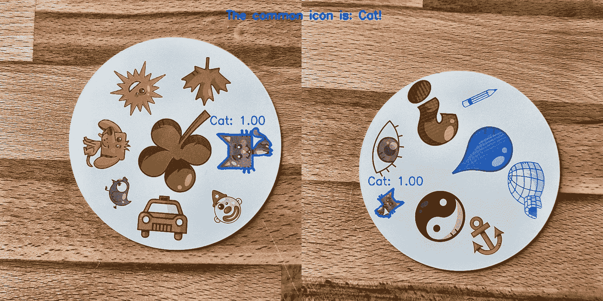

我的一个爱好是玩棋盘游戏，因为我对 CNN 有所了解，所以我决定开发一个可以在纸牌游戏中击败人类的应用程序。我想用我自己的数据集从头构建模型，看看用一个小数据集从头构建的模型性能如何。我选择从一个不太难的游戏开始， *Spot it！*(又名*多布尔*)。

在你不知道的情况下*点它！然而，下面是一个简短的游戏解释:*发现它！*是一个简单的模式识别游戏，玩家试图找到两张卡片上显示的图像。原*中的每一张卡都点它！*有八种不同的符号，每张牌上的符号大小不同。任何两张牌都有一个相同的符号。如果你是第一个找到那个符号的人，你就赢得这张卡。当 55 张牌用完时，谁收集的牌最多，谁就赢。*

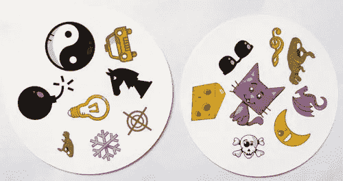

自己试试:上面显示的卡片上的共同符号是什么？

# **从哪里开始？**

任何数据科学问题的第一步都是收集数据。我用手机拍了几张，每张卡六张。总共有 330 张照片。其中四个如下所示。你可能会想:这足以构建一个完美的卷积神经网络吗？我会回来的！

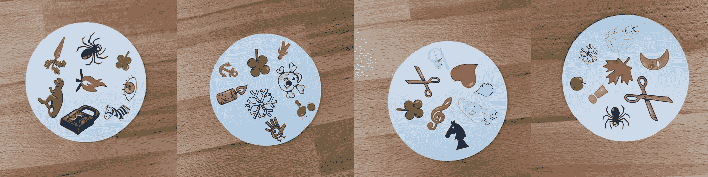

# 处理图像

好了，我们有数据了，下一步是什么？为了成功，这可能是最重要的部分:处理图像。我们需要提取每张卡片上显示的符号。这里有一些困难。你可以在上面的图片中看到，一些符号可能更难提取:雪人和鬼魂(第三张图片)和冰屋(第四张图片)的颜色很浅，污渍(第二张图片)和感叹号(第四张图片)存在于多个部分。为了处理浅色符号，我们给图像增加了对比度。之后，我们调整大小并保存图像。

## 添加对比度

我们使用 Lab 颜色空间来增加对比度。l 代表亮度，a 是范围从绿色到品红色的颜色分量，b 是范围从蓝色到黄色的颜色分量。我们可以用 [OpenCV](https://docs.opencv.org/master/) 轻松提取这些组件:

```
import cv2
import imutilsimgname = 'picture1'image = cv2.imread(f’{imgname}.jpg’)
lab = cv2.cvtColor(image, cv2.COLOR_BGR2LAB)
l, a, b = cv2.split(lab)
```

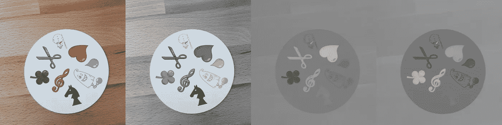

从左至右:原始图像、光分量、a 分量和 b 分量

现在，我们将对比添加到灯光部分，将这些部分合并在一起，并将图像转换回正常状态:

```
clahe = cv2.createCLAHE(clipLimit=3.0, tileGridSize=(8,8))
cl = clahe.apply(l)
limg = cv2.merge((cl,a,b))
final = cv2.cvtColor(limg, cv2.COLOR_LAB2BGR)
```

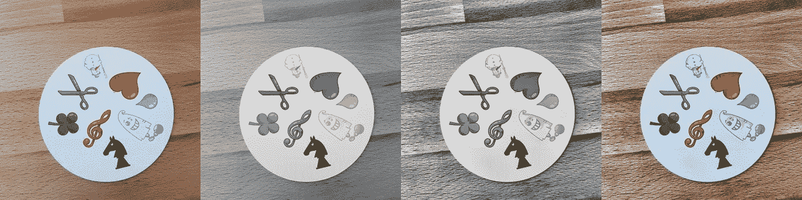

从左到右:原始图像，光组件，增加对比度，转换回 RGB

## 调整大小

然后我们调整大小并保存图像:

```
resized = cv2.resize(final, (800, 800))# save the image
cv2.imwrite(f'{imgname}processed.jpg', blurred)
```

搞定了。

# **检测卡片和符号**

现在图像被处理了，我们可以从检测图像上的卡片开始。使用 OpenCV 可以找到外部轮廓。然后我们需要将图像转换为灰度，选择一个阈值(本例中为 190)来创建一个黑白图像，并找到轮廓。在代码中:

```
image = cv2.imread(f’{imgname}processed.jpg’)
gray = cv2.cvtColor(image, cv2.COLOR_RGB2GRAY)
thresh = cv2.threshold(gray, 190, 255, cv2.THRESH_BINARY)[1]# find contours
cnts = cv2.findContours(thresh.copy(), cv2.RETR_EXTERNAL, cv2.CHAIN_APPROX_SIMPLE)
cnts = imutils.grab_contours(cnts)output = image.copy()# draw contours on image
for c in cnts:
    cv2.drawContours(output, [c], -1, (255, 0, 0), 3)
```

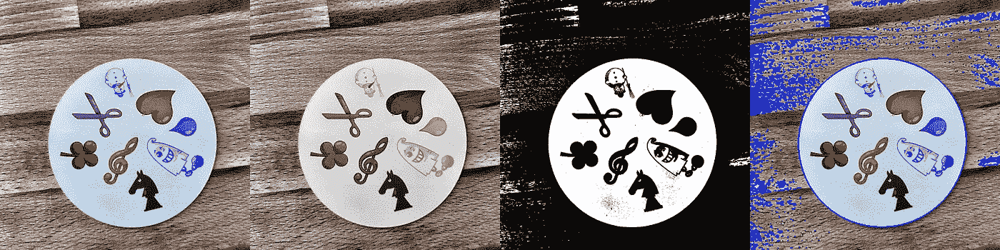

经过处理的图像，转换为灰度，设定阈值，并带有外部轮廓

如果我们把外轮廓按面积排序，可以找到面积最大的轮廓:这就是卡片。我们可以创建一个白色背景来提取符号。

```
# sort by area, grab the biggest one
cnts = sorted(cnts, key=cv2.contourArea, reverse=True)[0]# create mask with the biggest contour
mask = np.zeros(gray.shape,np.uint8)
mask = cv2.drawContours(mask, [cnts], -1, 255, cv2.FILLED)# card in foreground
fg_masked = cv2.bitwise_and(image, image, mask=mask)# white background (use inverted mask)
mask = cv2.bitwise_not(mask)
bk = np.full(image.shape, 255, dtype=np.uint8)
bk_masked = cv2.bitwise_and(bk, bk, mask=mask)# combine back- and foreground
final = cv2.bitwise_or(fg_masked, bk_masked)
```

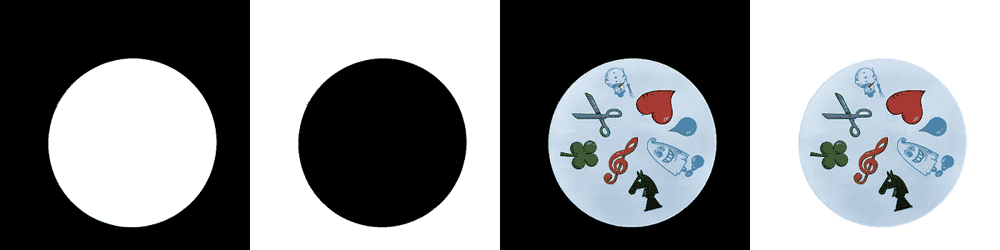

遮罩、背景、前景、组合

现在是符号检测时间！我们可以利用最后一幅图像再次检测外部轮廓，这些轮廓就是符号。如果我们在每个符号周围创建一个正方形，我们可以提取这个区域。代码有点长:

```
# just like before (with detecting the card)
gray = cv2.cvtColor(final, cv2.COLOR_RGB2GRAY)
thresh = cv2.threshold(gray, 195, 255, cv2.THRESH_BINARY)[1]
thresh = cv2.bitwise_not(thresh)cnts = cv2.findContours(thresh.copy(), cv2.RETR_EXTERNAL, cv2.CHAIN_APPROX_SIMPLE)
cnts = imutils.grab_contours(cnts)
cnts = sorted(cnts, key=cv2.contourArea, reverse=True)[:10]# handle each contour
i = 0
for c in cnts:
    if cv2.contourArea(c) > 1000:
        # draw mask, keep contour
        mask = np.zeros(gray.shape, np.uint8)
        mask = cv2.drawContours(mask, [c], -1, 255, cv2.FILLED) # white background
        fg_masked = cv2.bitwise_and(image, image, mask=mask)
        mask = cv2.bitwise_not(mask)
        bk = np.full(image.shape, 255, dtype=np.uint8)
        bk_masked = cv2.bitwise_and(bk, bk, mask=mask)
        finalcont = cv2.bitwise_or(fg_masked, bk_masked) # bounding rectangle around contour
        output = finalcont.copy()
        x,y,w,h = cv2.boundingRect(c)
        # squares io rectangles
        if w < h:
            x += int((w-h)/2)
            w = h
        else:
            y += int((h-w)/2)
            h = w # take out the square with the symbol
        roi = finalcont[y:y+h, x:x+w]
        roi = cv2.resize(roi, (400,400)) # save the symbol
        cv2.imwrite(f"{imgname}_icon{i}.jpg", roi)
        i += 1
```

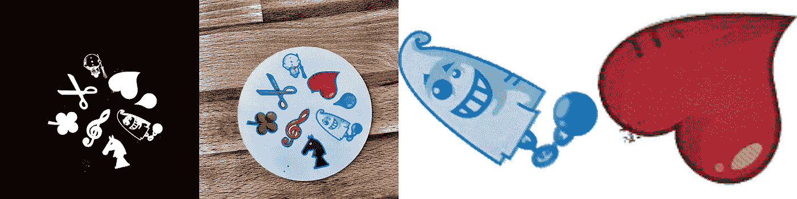

阈值图像、找到的轮廓、幽灵符号和心形符号(用遮罩提取的符号)

# 分类符号

现在到了无聊的部分！是时候对符号进行排序了。我们需要一个训练，测试和验证目录，每个目录包含 57 个目录(我们有 57 个不同的符号)。文件夹结构如下所示:

```
symbols
 ├── test
 │   ├── anchor
 │   ├── apple
 │   │   ...
 │   └── zebra
 ├── train
 │   ├── anchor
 │   ├── apple
 │   │   ...
 │   └── zebra
 └── validation
     ├── anchor
     ├── apple
     │   ...
     └── zebra
```

将提取的符号(超过 2500 个)放入正确的目录需要一些时间！我有创建子文件夹的代码，在 [GitHub](https://github.com/henniedeharder/spotit/tree/master/DeepLearningSpotIt) 上设置测试和验证。也许下次用聚类算法排序会更好…

# 训练卷积神经网络

无聊的部分之后是有趣的部分。让我们建立并训练一个 CNN。你可以在[这个帖子](https://medium.com/technologymadeeasy/the-best-explanation-of-convolutional-neural-networks-on-the-internet-fbb8b1ad5df8)中找到关于 CNN 的信息。

## 模型架构

这是一个多类、单标签的分类问题。我们希望每个符号都有一个标签。这就是为什么有必要选择具有 57 个节点和分类交叉熵损失函数的最后一层激活 softmax。

最终模型的架构如下所示:

```
# imports
from keras import layers
from keras import models
from keras import optimizers
from keras.preprocessing.image import ImageDataGenerator
import matplotlib.pyplot as plt# layers, activation layer with 57 nodes (one for every symbol)
model = models.Sequential()
model.add(layers.Conv2D(32, (3, 3), activation='relu', input_shape=(400, 400, 3)))
model.add(layers.MaxPooling2D((2, 2)))  
model.add(layers.Conv2D(64, (3, 3), activation='relu'))
model.add(layers.MaxPooling2D((2, 2)))
model.add(layers.Conv2D(128, (3, 3), activation='relu'))
model.add(layers.MaxPooling2D((2, 2)))
model.add(layers.Conv2D(256, (3, 3), activation='relu'))
model.add(layers.MaxPooling2D((2, 2)))
model.add(layers.Conv2D(256, (3, 3), activation='relu'))
model.add(layers.MaxPooling2D((2, 2)))
model.add(layers.Conv2D(128, (3, 3), activation='relu'))
model.add(layers.Flatten())
model.add(layers.Dropout(0.5)) 
model.add(layers.Dense(512, activation='relu'))
model.add(layers.Dense(57, activation='softmax'))model.compile(loss='categorical_crossentropy',       optimizer=optimizers.RMSprop(lr=1e-4), metrics=['acc'])
```

## 数据扩充

为了获得更好的性能，我使用了数据增强。数据扩充是增加输入数据的数量和多样性的过程。这可以通过旋转、移动、缩放、裁剪和翻转现有图像来实现。使用 Keras 很容易执行数据扩充:

```
# specify the directories
train_dir = 'symbols/train'
validation_dir = 'symbols/validation'
test_dir = 'symbols/test'# data augmentation with ImageDataGenerator from Keras (only train)
train_datagen = ImageDataGenerator(rescale=1./255, rotation_range=40, width_shift_range=0.1, height_shift_range=0.1, shear_range=0.1, zoom_range=0.1, horizontal_flip=True, vertical_flip=True)
test_datagen = ImageDataGenerator(rescale=1./255)train_generator = train_datagen.flow_from_directory(train_dir, target_size=(400,400), batch_size=20, class_mode='categorical')
validation_generator = test_datagen.flow_from_directory(validation_dir, target_size=(400,400), batch_size=20, class_mode='categorical')
```

如果你想知道，一个增强的幽灵看起来像这样:

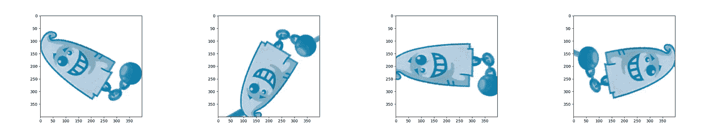

左侧为原始重影，其他图像上为增强重影

## 符合模型

让我们拟合模型，保存它以用于预测，并检查结果。

```
history = model.fit_generator(train_generator, steps_per_epoch=100, epochs=100, validation_data=validation_generator, validation_steps=50)# don't forget to save your model!
model.save('models/model.h5')
```

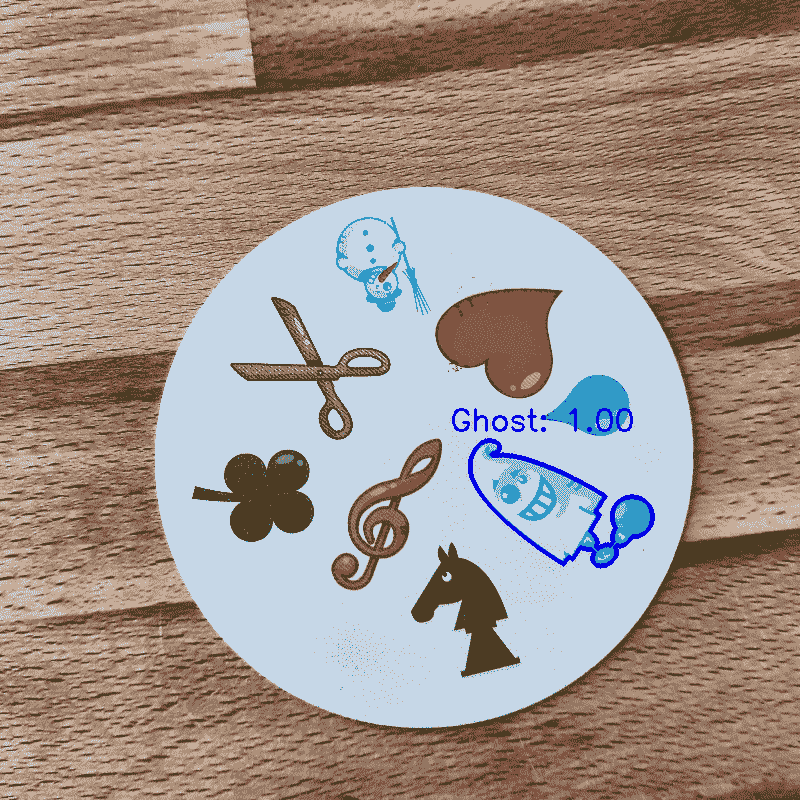

完美的预测！

## 结果

我训练的基线模型没有数据增加、丢失，并且层数较少。该模型给出了以下结果:

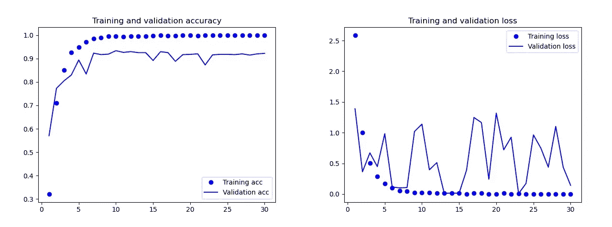

基线模型的结果

你可以清楚地看到这个模型是过度拟合。最终模型的结果(来自前面段落中的代码)要好得多。在下图中，您可以看到训练和验证集的准确性和损失。

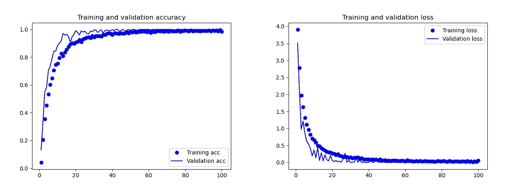

最终模型的结果

在测试中，这个模型只犯了一个错误:它预测了一颗炸弹的下落。我决定坚持使用这个模型，在测试集上的准确率是 0.995。

## 预测两张卡片的共同符号

现在有可能预测两张卡片上的共同符号。我们可以使用两幅图像，分别对每幅图像进行预测，并使用交集来查看两张卡都有什么符号。这给出了三种可能性:

*   预测时出错:找不到公共符号。
*   十字路口只有一个符号(可能是错的，也可能是对的)。
*   十字路口不止一个符号。在这种情况下，我选择了概率最高的符号(两个预测的平均值)。

代码在 [GitHub](https://github.com/henniedeharder/spotit/tree/master/DeepLearningSpotIt) 上，用于预测目录 main.py 文件中两个图像的所有组合。

一些结果:

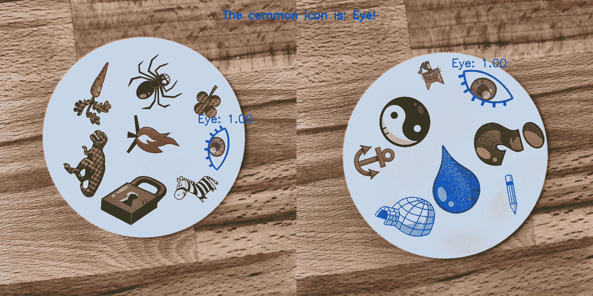

# 结论

这是一个完美的表演模式吗？可惜没有！当我给卡片拍新照片并让模型预测共同的符号时，它对雪人有一些问题。有时它预测一只眼睛或一只斑马是雪人！这给出了一些奇怪的结果:

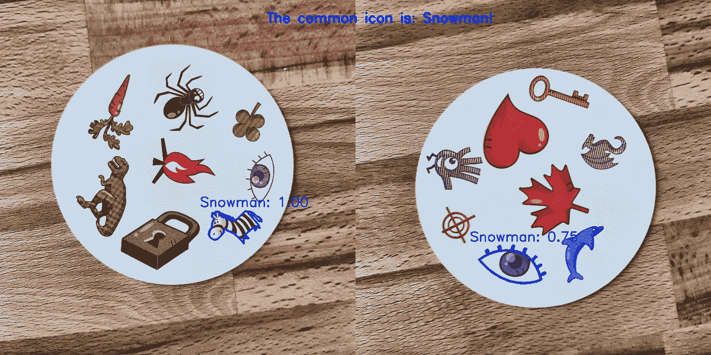

雪人？在哪里？

这个模型比人类好吗？看情况:人类可以做的很完美，但是模型更快！我给计算机计时:我给它 55 副牌，并询问两张牌的每种组合的共同符号。总共有 1485 种组合。这花费了计算机不到 140 秒的时间。计算机犯了一些错误，但就速度而言，它肯定会打败任何人类！

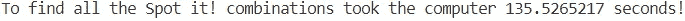

我不认为建立一个 100%的表演模型真的很难。例如，这可以通过使用迁移学习来完成。为了理解模型在做什么，我们可以将测试图像的层可视化。下次要尝试的东西！

我希望你喜欢阅读这篇文章！❤

## 有关系的

[](/solving-mtvs-are-you-the-one-is-it-possible-to-never-lose-992488277099) [## 解决 MTV 的《非诚勿扰》:有可能永远不输吗？

### 爱情游戏还是逻辑游戏？

towardsdatascience.com](/solving-mtvs-are-you-the-one-is-it-possible-to-never-lose-992488277099) [](/solving-nonograms-with-120-lines-of-code-a7c6e0f627e4) [## 用 120 行代码求解诺诺姆图

### 拼图，组合和解决方案 gif。

towardsdatascience.com](/solving-nonograms-with-120-lines-of-code-a7c6e0f627e4) [](/snake-played-by-a-deep-reinforcement-learning-agent-53f2c4331d36) [## 深度强化学习代理扮演的 Snake

### 犯了大错

towardsdatascience.com](/snake-played-by-a-deep-reinforcement-learning-agent-53f2c4331d36) 

*别忘了* [*订阅*](https://hennie-de-harder.medium.com/subscribe) *如果你想在我发表新文章时收到电子邮件。*