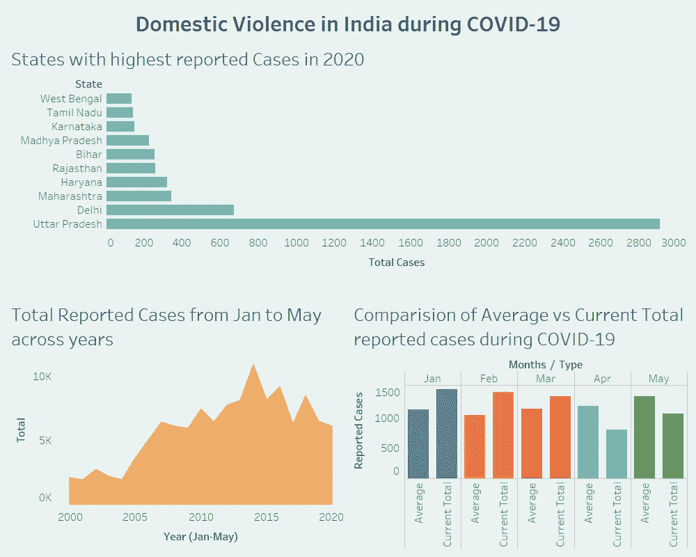

# 我是如何在一天内学会 Tableau 的

> 原文：<https://towardsdatascience.com/how-i-learned-tableau-in-1-day-8db80c167f9d?source=collection_archive---------9----------------------->

## 从安装软件到交付仪表板

卢克·切瑟在 [Unsplash](https://unsplash.com?utm_source=medium&utm_medium=referral) 上的照片

我是一名[机器学习工程师](https://medium.com/towards-artificial-intelligence/7-things-i-learned-during-my-2-years-in-an-ai-startup-4a638e2ceacd)，一直依赖 Matplotlib、Seaborn 和 Plotly 来实现我所有的可视化(*拜托，我们都是这样，对吧？).对我来说，冗长的 Python 代码真的很酷，但是拖放式的情节就不酷了。如果我们的任何产品需要一些经典的可视化效果，我们的 BI 团队会伸出援手。就这样两年过去了，我既没有学会 Tableau 也没有学会 PowerBI。*

然而，我最终学会了 Tableau，创建了一个不错的仪表板，上面有一些业务问题的调查结果，并与利益相关者分享。这一切都发生在一天之内。

# 为什么

有了这次经历，我明白了有一个强烈的“为什么”是至关重要的第一步，因为它帮助我们朝着实现目标前进，不管有什么障碍。

> 先搞清楚自己的“为什么”。是目的，是事业，是信念，驱动着我们每一个人。

给你一点背景，我志愿参加一个伦理项目，分析新冠肺炎时期印度的家庭暴力。这是由 [Omdena](https://omdena.com/) 主办的——这是一个我绝对喜欢的自下而上的合作人工智能平台，与 [RedDot 基金会合作。](https://reddotfoundation.org/)在这个项目中，我们有几个团队分析不同的渠道，如社交媒体、新闻文章和政府关于印度家庭暴力的数据。

当项目接近尾声时，我们必须统一我们的建模和发现，以交付给利益相关者。最后，我们决定继续使用 Tableau，因为它提供了世界一流的交互式可视化效果，而且大多数合作者对它都很满意。但我不是；我对 Tableau 一无所知。但我不能不将数周的辛勤工作转化为真正的价值。

“为什么”因人而异。你可能想把 Tableau 武器加到你的数据科学盔甲上。或者，您可能希望能够用最少的代码生成一流的可视化效果。你梦想中的公司甚至会在你面试的时候给你布置一个场景。首先理解你的“为什么”,然后继续。

# 怎么做

我没有浪费时间开始。我下载了 Tableau 桌面版(注册 14 天试用)并马上安装了它。在我的机器上安装该软件有助于我在学习时动手操作。

接下来，我探索了 Tableau 初学者教程的一些选项。在花了一些时间研究之后，我发现 Tableau 的官方教程[非常有用。整个入门教程有一步一步的文本形式的指导，很容易理解(是的，文本教程！) ***。*** 这样做的好处是，它让我们在几个小时内浏览完整的教程，理解完整的工作流程，并根据需要使用它。](https://help.tableau.com/current/guides/get-started-tutorial/en-us/get-started-tutorial-home.htm)

我跟着 [freeCodeCamp 的](https://www.freecodecamp.org/)速成班补充官方教程，大概 30 分钟。以 freeCodeCamp 的出色工作而闻名，它正如标题所声称的那样交付，并使我能够快速入门。

Tableau 速成班 [freeCodeCamp](https://www.freecodecamp.org/)

我知道我只是触及了 Tableau 所能做的表面，但是这些已经足够让我开始了。这里的关键是你要设计自己的行动计划，最适合你的，并坚持下去。看看上面我推荐的资源，但也可以随意探索其余的，选择最适合你需求的。

# 什么

那么我创造了什么？我的目标是了解这些年来以及印度 COVID19 封锁期间家庭暴力案件的模式。我创建了一个基本的交互式仪表板，可以快速传达这些汇总的统计数据，并让利益相关者了解印度的家庭暴力情况。

作者对交互式仪表板的快照

有一个你想要创造什么的想法是很重要的。创建出色的可视化效果，将其添加到您的数据科学产品组合中？或者你想创造一些基本的情节来传达你的发现？你(必须)决定你的“什么”

# 概述

能够用拖放创建经典的可视化效果*也很酷*。我们需要有开放的心态，并擅长根据形势需要使用最佳工具的艺术。如果你手头有几天时间，下面是我对 Tableau 的工作的回顾，分为几个步骤。

1.  下载 [Tableau 桌面](https://www.tableau.com/products/desktop)版本[(连免费公版都可以)](https://public.tableau.com/en-us/s/)
2.  你大概有自己的数据；如果没有，[浏览这些数据集](https://www.kaggle.com/datasets)并挑选一个感兴趣的。
3.  写下 3 个你想分析的商业/研究问题。
4.  记住这些目标，学习 Tableau
5.  创建一个仪表板来分析数据并回答这些问题
6.  与世界分享！(可选:在这里留下你的作品的链接，我很乐意看到并自豪地分享它。)

现在回想起来，我意识到我不仅学会了 Tableau，还学会了如何在有限的时间内完成一项任务。

> 提前理解“为什么”、“如何”和“是什么”，有助于你有目的地学习并创造价值。

当你读它的时候，它似乎是显而易见的，但是大多数时候，当我们试图解决现实世界的问题时，我们忘记了应用它。

谢谢你读到这里。我希望这篇文章为你增加一些价值，帮助你开始使用 Tableau。因为我在这方面是一个真正的初学者，我很乐意听到你对我可能犯的任何错误的反馈以及我如何改进。[期待与您的联系！](https://friends.arunnthevapalan.com/):)

如果你重视这样的文章，并想支持我成为一名作家，可以考虑[注册成为一名媒体会员](https://arunnthevapalan.medium.com/membership)。每月 5 美元，你可以无限制地阅读媒体上的故事。

 [## 通过我的推荐链接加入 Medium—Arunn the vapalan

### 作为一个媒体会员，你的会员费的一部分会给你阅读的作家，你可以完全接触到每一个故事…

arunnthevapalan.medium.com](https://arunnthevapalan.medium.com/membership)