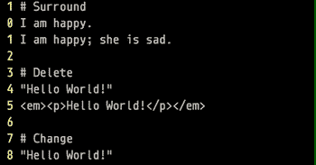

# 我是如何学会享受 Vim 的——刻意练习和环绕。精力

> 原文：<https://towardsdatascience.com/how-i-learned-to-enjoy-vim-e310e53e8d56?source=collection_archive---------10----------------------->

## 刻意的练习和环绕。vim 让我爱上了 Vim


[胡安·戈麦斯](https://unsplash.com/@nosoylasonia?utm_source=unsplash&utm_medium=referral&utm_content=creditCopyText)在 [Unsplash](https://unsplash.com/s/photos/keyboard?utm_source=unsplash&utm_medium=referral&utm_content=creditCopyText) 上拍照

我最近开始学习 Vim，这很难，尤其是在开始的几天——我的工作效率受到了很大的打击。我几乎不能用 Visual Studio 代码编写任何代码而不感到头痛。想了解更多关于我 15 天旅程的信息，请看这篇文章:

[](/what-ive-learned-after-using-vim-15-days-straight-ceda7e773a6d) [## 连续 15 天使用 Vim 后，我学到了什么

### 从 Vim noob 到业余爱好者的旅程

towardsdatascience.com](/what-ive-learned-after-using-vim-15-days-straight-ceda7e773a6d) 

现在，两个星期后，我觉得使用 Vim 很舒服，并爱上了它，这要归功于许多常规的[**刻意练习**](https://medium.com/@ausius/2-meta-learning-principles-to-help-you-learn-more-efficiently-44061c9951e1) 和 Tim Pope 的[**surround . Vim**](https://github.com/tpope/vim-surround)**插件。事实上，这篇文章是用 Vim 的 Markdown 写的，我已经开始使用一个非常强大的笔记应用程序(和[策略](https://medium.com/@ausius/how-to-take-notes-insights-from-ai-neuroscience-a-sociologist-and-a-free-app-34b4be63080a))来使用 Vim。**

**[](https://medium.com/@ausius/take-better-notes-with-this-free-note-taking-app-that-wants-to-be-your-second-brain-1a97909a677b) [## 使用这个免费的笔记应用程序做更好的笔记，它将成为你的第二大脑

### 黑曜石使连接想法变得容易，并帮助你更好地思考和写作

medium.com](https://medium.com/@ausius/take-better-notes-with-this-free-note-taking-app-that-wants-to-be-your-second-brain-1a97909a677b) 

这篇文章假设你已经了解了 Vim 的基础知识。我将介绍 [surround.vim](https://github.com/tpope/vim-surround) ，提供例子解释其工作原理，并向您展示如何有效地练习。如果你是 Vim 的新手，先看看一些为初学者写的文章(例如，这里的和这里的)。另外，看看我的帖子，告诉你如何成为一个更有生产力的程序员。

[](https://medium.com/better-programming/code-and-develop-more-productively-with-terminal-multiplexer-tmux-eeac8763d273) [## 使用终端多路复用器 tmux 提高编码和开发效率

### 简单的 tmux 命令来提高您的生产力

medium.com](https://medium.com/better-programming/code-and-develop-more-productively-with-terminal-multiplexer-tmux-eeac8763d273) [](https://medium.com/better-programming/4-keyboard-shortcuts-to-edit-text-efficiently-and-improve-productivity-66894c8d51b8) [## 4 个键盘快捷键，可高效编辑文本并提高工作效率

### 高效地在文本中导航和移动光标

medium.com](https://medium.com/better-programming/4-keyboard-shortcuts-to-edit-text-efficiently-and-improve-productivity-66894c8d51b8) [](/two-simple-ways-to-loop-more-effectively-in-python-886526008a70) [## 在 Python 中更有效地循环的两种简单方法

### 使用枚举和压缩编写更好的 Python 循环

towardsdatascience.com](/two-simple-ways-to-loop-more-effectively-in-python-886526008a70) 

# Surround.vim

[surround.vim](https://github.com/tpope/vim-surround) 插件让你处理围绕的*对事物，比如括号、HTML 标签和引号(文档[在这里](https://github.com/tpope/vim-surround/blob/master/doc/surround.txt))。无论你是编码还是写作，这个插件都能让你的生活变得更加轻松。*



vim 允许您添加、删除和更改成对的事物

要安装，请在终端中运行下面的四行代码。

```
mkdir -p ~/.vim/pack/tpope/start
cd ~/.vim/pack/tpope/start
git clone https://tpope.io/vim/surround.git
vim -u NONE -c "helptags surround/doc" -c q
```

# 学习和练习技巧

首先了解插件是如何工作的——学习如何**包围**(`ys`)**删除**(`ds`)**改变** ( `cs`)。然后，学习指导示例，如下所示。一旦你理解了基础，立即开始在你的日常写作/编码中使用插件。

要快速提高，使用 [**刻意练习**](https://medium.com/@ausius/2-meta-learning-principles-to-help-you-learn-more-efficiently-44061c9951e1) :每天，**找出自己的薄弱环节**(例如，添加引号多个单词)，**通过相关的引导示例**(参见下面的环绕多个单词部分)，自己生成更多的示例，**反复测试自己**，直到你可以执行正确的动作/按键，而不必想太多。

如果你进行几天这种有意识的练习——即使每天只有几分钟——你会很快变得擅长使用 surround.vim。

# 包围一个单词

```
I am happy.
I am "happy".
```

解决方法:`ysiw"` ( `ys`:添加周边环境；`iw`:整个单词，不管光标在哪里，只要在你想要包围的单词上；`"`:包围文本的字符)

# 环绕整条线

```
I am happy; she is sad.
(I am happy; she is sad.)
```

解决方法:`yss)` ( `ys`:添加周围环境；`s`:全线；`)`包围行的字符)

注意:如果您使用`yss(`而不是`yss)`，将在您的文本周围添加空格:`( I am happy; she is sad. )`

# 用标签包围整行或整段

```
Hello World! How are you?
<p>Hello World! How are you?</p>
```

解决方案:`yss<p>` ( `yss`:给整条线添加环绕；`<p>`用标记把线围住)

注意:结束标签`</p>`将自动完成。非常方便！

# 包围多个单词

```
I am very very happy.
I am *very very* happy.
```

解决方法:`ys2aw*` ( `ys`:添加周边环境；`2`:包围字数，从光标下的字开始；`aw`:绕词；`*`:包围文本的字符)

# 用标签包围多个单词

```
Hello World! How are you?
<em>Hello World</em>! How are you?
```

解决方法:`ys2aw<em>`(在 2 字周围加上周边环境；记得先把光标放在`Hello`下面！)

# 包围所选文本

```
The solution is x + y = z. You responded wrongly.
The solution is `x + y = z`. You responded wrongly.
```

解决方法:将光标放在`x`下，然后`veeeeS`` ( `v`:进入可视模式选择文本；`eeee`:按任意次数，选择想要选择的字数；`S``用```包围所选文本

# 删除周围环境

```
"Hello World!"
Hello World
```

解决方法:`ds"` ( `ds`:删除周边；`"`:要删除的字符；将光标放在文本区域内的任何位置)

# 删除周围的标签

```
<em><p>Hello World!</p></em>
Hello World!
```

解:`dstdst`(`dst`)；删除周围的标签)；如果安装了 [repeat.vim](https://github.com/tpope/vim-repeat) ，就可以用`.`来重复，所以`dst.`会和`dstdst`一样

# 改变环境

```
"Hello World!"
*Hello World!*
```

解决方法:`cs"*` ( `cs`:改变周边；`"`:现有周边；`*`:新周边)

# 更改周围的标签

```
<p>Hello World!</p>
<em>Hello World!</em>
```

解决方法:`cst<em>` ( `cst`:改变周围标签；`<em>`:新周边)

# 常见示例 1

求一组数字的平均值

```
3 + 2 + 5 + 7 / 4  
# wrong because brackets are missing# solution
3 + 2 + 5 + 7 / 4  # place cursor under 3, then veeeeS)
(3 + 2 + 5 + 7) / 4# surround text with functions/methods when coding
(3 + 2 + 5 + 7) / 4  # yss)iprint
print((3 + 2 + 5 + 7) / 4)
```

# 常见示例 2

强调文本，有和没有 [repeat.vim](https://github.com/tpope/vim-repeat)

```
Hello World.
Hello *World*. 
Hello **World**.
```

解决方案 1(无 [repeat.vim](https://github.com/tpope/vim-repeat) ): `ysiw*lysiw`移动光标到 W ( `ysiw*`)下后:用`*`将单词包围；`l`:再次移动光标到 W；`ysiw*`:用`*`包围单词

解决方案 2(带 [repeat.vim](https://github.com/tpope/vim-repeat) ): `ysiw*l.` ( `.`重复`ysiw*`)

# 结论

为了有助于有意识的练习，我已经合并了上面所有的例子，所以你可以很容易地用它们来定期测试自己。对于每个示例，第一行是原始/开始文本，第二行是目标或结束状态。玩得开心，也可以查看一下[文档](https://github.com/tpope/vim-surround/blob/master/doc/surround.txt)！

```
# surround.vim practice# Surround
I am happy.      # start
I am "happy".    # goalI am happy; she is sad.
(I am happy; she is sad.)Hello World! How are you?
<p>Hello World! How are you?</p>I am very very happy.
I am *very very* happy.Hello World! How are you?
<em>Hello World</em>! How are you?The solution is x + y = z. You responded wrongly.
The solution is `x + y = z`. You responded wrongly.# Delete"Hello World!"
Hello World<em><p>Hello World!</p></em>
Hello World!# Change"Hello World!"
*Hello World!*<p>Hello World!</p>
<em>Hello World!</em># Examples
3 + 2 + 5 + 7 / 4
print((3 + 2 + 5 + 7) / 4)Hello World.
Hello **World**.
```

*更多帖子，* [*订阅我的邮件列表*](https://hauselin.ck.page/587b46fb05) *。***